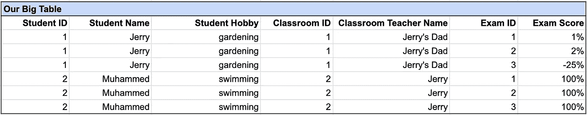
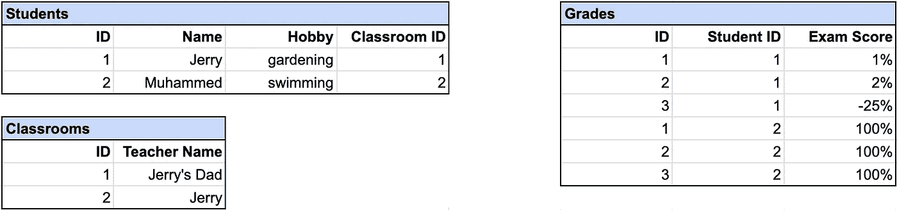
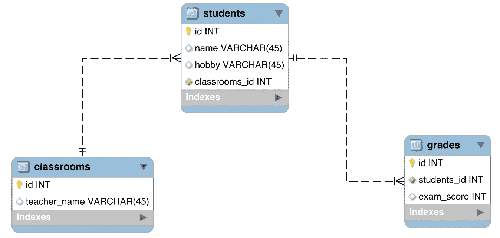
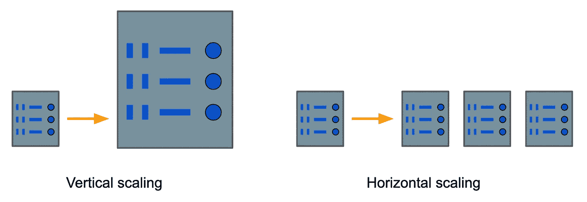
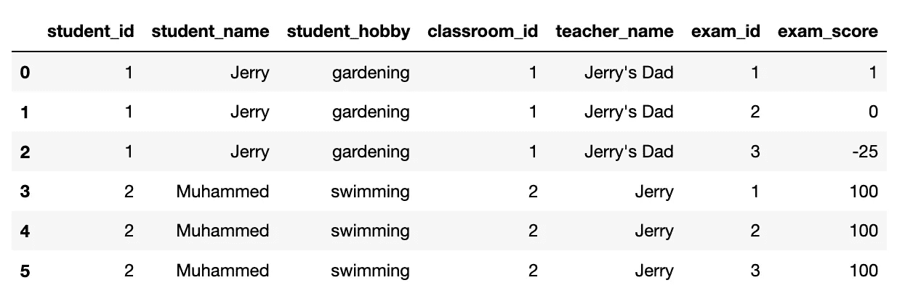

# Python 中 SQL 与 NoSQL 数据库的实践演示

> 原文：<https://towardsdatascience.com/a-hands-on-demo-of-sql-vs-nosql-databases-in-python-eeb955bba4aa?source=collection_archive---------6----------------------->

## [实践教程](https://towardsdatascience.com/tagged/hands-on-tutorials)

## 用 SQLAlchemy 和 PyMongo 打动你的朋友


艺术家对 MongoDB 数据库的解读。由[乔尔·菲利普](https://unsplash.com/@joelfilip?utm_source=medium&utm_medium=referral)在 [Unsplash](https://unsplash.com?utm_source=medium&utm_medium=referral) 上拍摄的照片

从古代的政府、图书馆和医疗记录到当今的视频和[物联网流](https://en.wikipedia.org/wiki/Internet_of_things)，我们一直需要高效存储和检索数据的方法。昨天的文件柜已经变成了今天的计算机 [**数据库**](https://www.oracle.com/database/what-is-database/) ，对于如何最好地组织数据有两种主要的范例:关系型*(SQL)与非关系型*(NoSQL)方法。**

**数据库对任何组织来说都是必不可少的，所以了解每种类型在哪里有用是很有用的。我们将从简单介绍 SQL 和 NoSQL 背后的历史和理论开始。但是记住抽象的事实只能让你到此为止——然后我们将实际上用 Python 创建每种类型的数据库，以建立它们如何工作的直觉。我们开始吧！**

# **数据库的时间序列**

## **SQL 数据库**

**在 20 世纪 50 年代企业开始采用计算机后不久，数据库就出现了，但是直到 1970 年**关系数据库才出现。关系数据库的主要思想是通过只存储一次数据来避免重复数据，数据的不同方面存储在具有正式关系的表中。然后可以从不同的表中提取相关的数据，过滤，并用 **SQL** 或[结构化查询语言](https://en.wikipedia.org/wiki/SQL)中的查询重新排列。****

**假设我们是一所学校，正在组织学生、成绩和教室的数据。我们*可以*有一张像这样的大桌子:**

****

**作者截图**

**然而，这是一种非常低效的数据存储方式。因为学生有多个考试分数，**将所有数据存储在一个表中需要复制信息，我们只需要列出一次，**如 Jerry 的爱好、教室 ID 和老师。如果你只有少数几个学生，这没什么大不了的。但是随着数据量的增长，所有这些重复的值最终会消耗存储空间，并使从表中提取实际需要的数据变得更加困难。**

**相反，将这些信息分解到单独的*表格*中，然后*将表格中的信息相互关联*会更有效率。这就是我们的桌子的样子:**

****

**作者截图**

**与主表中的 42 个单元相比，只有 30 个单元-**提高了 28.5%！**对于这组特定的字段和表格，当我们增加学生数量时，比如增加到 100、1000 或 1000000，改进实际上稳定在 **38%。仅仅通过重新排列数据，就节省了三分之一以上的存储空间！****

**但是仅仅将数据存储在单独的表中是不够的；我们仍然需要模拟他们的关系。我们可以用如下所示的[实体关系图](https://www.visual-paradigm.com/guide/data-modeling/what-is-entity-relationship-diagram/)来可视化我们的数据库[模式](https://en.wikipedia.org/wiki/Database_schema)。**

****

**作者截图**

**此图显示一个教室由多个学生组成，每个学生有多个年级。我们可以使用这个模式在一个[关系数据库管理系统(RDBMS)](https://www.codecademy.com/articles/what-is-rdbms-sql) 中创建一个关系数据库，比如 [MySQL](https://en.wikipedia.org/wiki/MySQL) 或 [PostgreSQL](https://en.wikipedia.org/wiki/PostgreSQL) ，然后开始我们愉快的、高效的存储方式。**

# **NoSQL 数据库**

**所以我们已经找到了解决所有数据存储问题的方法，对吗？不完全是。关系数据库非常适合于容易存储在表中的数据，比如字符串、数字、布尔值和日期。例如，在我们上面的数据库中，每个学生的爱好可以很容易地作为一个字符串存储在一个单元格中。**

**但是如果一个学生有不止一个爱好呢？或者，如果我们想跟踪业余爱好的子类别，比如锻炼、艺术或游戏，该怎么办？换句话说，如果我们想存储这样的值会怎么样:**

```
**hobby_list = ['gardening', 'reading']
hobby_dict = {'exercise': ['swimming', 'running'],
              'games': ['chess']}**
```

**为了允许兴趣爱好的列表，我们可以创建一个中介[多对多表](https://fmhelp.filemaker.com/help/18/fmp/en/index.html#page/FMP_Help/many-to-many-relationships.html)来允许学生拥有多个兴趣爱好(并且允许多个学生拥有相同的兴趣爱好)。但是对于爱好词典来说，它开始变得复杂了……我们可能需要[将我们的词典存储为一个 JSON 字符串](https://stackoverflow.com/questions/31796332/psycopg2-insert-python-dictionary-as-json)，这实际上并不是为关系数据库而构建的。[1]**

**随着互联网的普及，关系数据库的另一个问题出现在 90 年代:如何只用一台机器处理万亿字节和千兆字节的数据(通常是 JSON) [**。**](https://www.cockroachlabs.com/blog/history-of-databases-distributed-sql/) 关系数据库被设计成垂直扩展**:当需要时，为托管数据库的服务器配置更多的 RAM 或 CPU。****

****但是有一点，即使最昂贵的机器也不能处理数据库。更好的方法可能是横向扩展**:从**到*增加更多的机器*，而不是试图*让你的一台机器更强大*。这不仅更便宜——万一你的一台机器出了故障，它还能增强恢复能力。(事实上，使用廉价硬件的分布式计算是谷歌从一开始就使用的策略。)****

********

****谷歌幻灯片作者的杰作****

****NoSQL 数据库通过**允许嵌套或可变类型数据**并运行在**分布式机器集群上来满足这些需求。** [2]这种设计使他们能够轻松存储和查询大量非结构化数据(即非表格数据)，即使记录的形状完全不同。穆罕默德有一份 50 页的整洁有序的爱好和子爱好的 JSON，而杰里只喜欢园艺？没问题。****

****但是，当然，这种设计也有它的缺点，否则我们就都换了。缺少数据库模式意味着没有什么可以阻止用户写入垃圾(例如，意外地将“name”字符串写入“grade”字段)，并且很难在数据库的不同集合之间连接数据。使用分布式服务器还意味着查询可能会在更新同步之前返回过时的数据。[3]那么，在 SQL 和 NoSQL 数据库之间的正确选择取决于你愿意处理哪一个缺点。****

# ****游戏时间****

****够理论；让我们用 Python 实际创建每种类型的数据库。我们将使用`sqlalchemy`库创建一个简单的 [SQLite](https://en.wikipedia.org/wiki/SQLite) 数据库，并且我们将使用`pymongo`创建一个 [MongoDB](https://en.wikipedia.org/wiki/MongoDB) NoSQL 数据库。确保安装`sqlalchemy`和`pymongo`来运行下面的代码，以及[启动一个 MongoDB 服务器](https://docs.mongodb.com/manual/tutorial/manage-mongodb-processes/)。****

## ****结构化查询语言****

****在专业环境中，我们可能希望通过专用的 RDBMS 用实际的 SQL 代码创建一个数据库。但是对于我们这里简单的概念证明，我们将使用 [SQLAlchemy](https://www.sqlalchemy.org/) 。****

****SQLAlchemy 允许您通过一个 [**对象关系映射器**](https://www.fullstackpython.com/object-relational-mappers-orms.html) 来创建、修改 Python 中的关系数据库并与之交互。概括起来，主要思想是 **SQLAlchemy 使用 *Python 类*来表示*数据库表*。***Python 类*的实例可以被认为是表的*行。*****

****我们首先加载必要的`sqlalchemy`类。第 1 行中的导入用于建立到数据库的连接(`create_engine`)并定义我们的表的模式(`Column`、`String`、`Integer`、`ForeignKey`)。下一个导入，`Session`，让我们读写数据库。最后，我们使用`declarative_base`创建一个模板 Python 类，它的子类将被映射到 SQLAlchemy 表。****

****现在，我们将教室、学生和年级表创建为 Python 类`Classroom`、`Student`和`Grade`。注意，它们都继承自`Base` SQLALchemy 类。我们的类很简单:它们只定义相应的表名及其列。****

****现在我们创建数据库和表。`create_engine`启动一个 SQLite 数据库，[4]然后我们打开它。第 4 行开始我们的会话，第 7 行从我们的 Python 类创建数据库表。****

****我们现在生成我们的数据。`Classroom`、`Student`和`Grade`的实例作为每个表中的行。****

****现在，我们终于将数据写入数据库。与 Git 类似，我们使用`session.add`将每一行添加到暂存区，使用`session.commit`实际写入数据。****

****干得好！让我们通过重新创建本文中的第一个表来结束这一部分。****

********

## ****NoSQL****

****现在我们切换到 MongoDB。确保安装 MongoDB 并且[启动一个本地服务器](https://docs.mongodb.com/manual/tutorial/manage-mongodb-processes/)。下面，我们导入`pymongo`，连接到我们的本地服务器，然后创建一个名为`classDB`的数据库。****

****在关系数据库中，我们用 ***记录*** 创建 ***表*** 。在 NoSQL 数据库中，我们用 ***文档*** 创建 ***集合*** 。下面，我们创建一个名为`classroom`的集合，并插入包含每个学生信息的字典。****

****注意`hobbies`中的数据类型是如何不同的:对 Jerry 来说是一个字符串，对 Muhammed 来说是一个字典。(即使在`hobbies`字典中，值也是列表和字符串。)MongoDB 不在乎——没有模式来强制数据的数据类型或结构。****

****我们可以通过迭代从`db.classroom.find`返回的对象来查看我们的数据。我们使用`pprint`使读取输出更容易。注意 MongoDB 是如何给每个文档添加一个惟一的对象 ID 的。****

****我们可以很容易地添加带有新字段的文档。****

****最后，让我们执行两个查询来突出我们的 MongoDB 数据库与 SQLite 的不同之处。第一个查询通过查找包含一个`birthday`字段的所有文档来弥补数据库模式的不足。第二个查询搜索在`hobbies`的嵌套字段`exercise`中包含`running`的文档。****

# ****结论****

****这篇文章讲述了 SQL 数据库和 T2 NoSQL 数据库的历史以及它们的优缺点。然后，我们通过用 Python 和 [SQLAlchemy](https://www.sqlalchemy.org/) 和 [MongoDB](https://www.mongodb.com/) 创建每种类型的数据库，使事情变得更加具体。我强烈推荐您接触一些相当理论化的概念，如 SQL 与 NoSQL 之战——我从撰写本文的代码中学到了很多！请关注未来的一篇文章，其中有一些编码错误，我将探讨 SQLite 和 MongoDB 的一些限制。****

****最好，
马特****

# ****脚注****

## ****1.NoSQL 数据库****

****这个关于栈溢出的[精彩回答](https://stackoverflow.com/questions/15367696/storing-json-in-database-vs-having-a-new-column-for-each-key)解释了关系数据库与 JSON 的斗争有两个主要原因:****

1.  ******关系数据库假设其中的数据是规范化的。**与 JSON 键相比，查询规划器在查看列时得到了更好的优化。****
2.  ******不能在 JSON 键上创建表之间的外键。**要关联两个表，必须使用列中的值，这里是行中的整个 JSON，而不是 JSON 中的键。****

## ****2.NoSQL 数据库****

****我发现很难对 NoSQL 数据库如何存储数据有一个简短的描述，因为有多种 NoSQL 数据库类型。键值数据库对其数据几乎没有任何限制，文档数据库对其内容的格式有基本的假设(例如 XML 与 JSON)，而图形数据库对节点和边的存储方式可能有严格的要求。同时，面向列的数据库实际上由表组成，但是数据是按列而不是按行组织的。****

## ****3.NoSQL 数据库****

****因为 NoSQL 数据库分布在多台服务器上，所以在一台服务器上的数据库更改反映到所有其他服务器上之前，会有一点延迟。这通常不是问题，但是您可以想象一个场景，在所有服务器都知道第一次取款之前，有人能够从一个银行帐户中取款两次。****

## ****4.结构化查询语言****

****SQLAlchemy 的一个非常好的特性是它如何为您处理 SQL 语法的差异。在这篇文章中，我们使用了 SQLite 数据库，但是我们可以切换到 MySQL 或 Postgres，只需改变我们传递给`create_engine`的字符串。所有其他代码保持不变。编写使用 SQLAlchemy 的 Python 应用程序的一个很好的策略是在编写和调试时从 SQLite 开始，然后在部署时切换到生产就绪的东西，如 Postgres。****