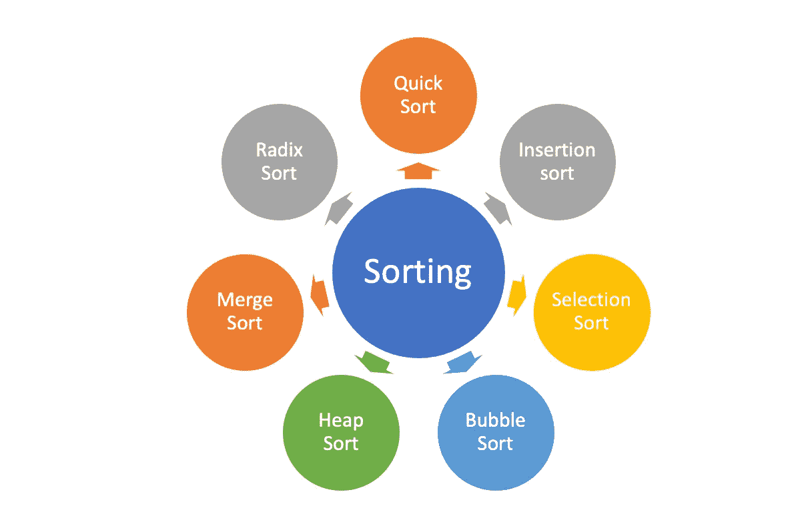

# 熊猫数据帧“分类”实践指南

> 原文：<https://towardsdatascience.com/a-hands-on-guide-to-sorting-dataframes-in-pandas-384996ca6bb8?source=collection_archive---------18----------------------->

## 熊猫中数据排序的十种方法


freepik 创作的健康照片

我与[熊猫的](https://pandas.pydata.org/)图书馆的幽会还在继续。最近，我一直试图更深入地研究这个库，并在字节大小的文章中巩固一些熊猫的特征。我写过关于在使用 pandas 时减少内存使用的文章，将 XML 文件转换成 pandas dataframe 的文章，以及开始使用 pandas 中的时间序列的文章等等。在本文中，我将触及数据分析的一个非常有用的方面，那就是排序。我们将从一个简短的介绍开始，然后快速跳转到一些在熊猫中有效执行排序的方法。

# 整理

如果您是 excel 用户，当您打开电子表格时，首先要做的事情之一就是根据一列(或多列)对它们进行升序或降序排序。从技术上讲，排序是一种根据元素的等级对元素进行排序的方式。有完整的文档专门用于编程领域的各种排序算法。下面是一些常用的排序算法。



不同的排序算法|按作者排序的图片

不同的排序算法具有不同的排序数据的基本原理。例如，在[冒泡排序](https://en.wikipedia.org/wiki/Bubble_sort)中，算法将一个元素与其相邻元素进行比较，并以期望的顺序交换它们。另一方面，[合并排序](https://en.wikipedia.org/wiki/Merge_sort)基于分治技术。在选择排序中，无序数组首先被分成相等的两半，然后以排序的方式组合。解释所有这些算法的复杂性超出了本文的范围，但是如果它引起了你的兴趣，这里有一篇很棒的文章用很好的可视化解释了这个概念。

# 熊猫的分类

现在让我们看看如何在 pandas 中执行排序。为此，我将使用一个非常有趣的数据集，其中包含一个排名前一百的 Github 库**。**公开[在 Kaggle](https://www.kaggle.com/parulpandey/most-starred-github-repositories) 上有售。数据集每天更新，由其他属性组成，如几个分支、项目描述、语言，甚至项目描述。让我们加载数据集，看看它的结构。

***注:您可以使用下面的笔记本跟随:***

<https://www.kaggle.com/parulpandey/a-quick-guide-to-sorting-in-pandas>  

```
df = pd.read_csv('Most starred Github Repositories.csv')
df.head()
```


作者图片

让我们快速浏览一下数据集的各个列:

*   **项目名称**:Github 中仓库的名称
*   **Stars:** 对知识库的一个书签或赞赏的展示。
*   **Forks:**fork 是您管理的存储库的副本。
*   **语言:**项目使用的主要编程语言
*   **未解决的问题:**问题是建议的改进、任务或者与存储库相关的问题。尚未解决的问题被标记为未决问题。
*   描述:详述项目目的的一段文字。
*   **最后一次提交:**提交，或“修订”，是对一个文件(或一组文件)的单独更改。此字段存储上次提交的日期和时间。

> 注:以上所有定义均取自 [Github 词汇表](https://docs.github.com/en/github/getting-started-with-github/github-glossary)。

当前数据集按照**恒星** ⭐️的数量排序，即恒星数量最多的项目排在最前面，依此类推。Pandas 支持三种排序:按索引标签排序、按列值排序以及两者的组合排序。现在，让我们通过一些示例来看看对此数据集进行排序的不同方式:

## 1.按单列排序

熊猫里面用来排序的函数叫做`[**DataFrame.sort_values(**](https://pandas.pydata.org/pandas-docs/stable/reference/api/pandas.DataFrame.sort_index.html#pandas.DataFrame.sort_index)**)**`。它用于根据列或行值对`DataFrame`进行排序。让我们按照**分叉**列对数据集进行排序。

```
 forks = df.sort_values(by='Forks',ascending=False)
forks.head(10)
```


按单列排序|按作者排序图像

函数`dataframe.sort_values`带有很多参数。在我们阅读这篇文章的过程中，我们将会谈到几个重要的问题。在上面的例子中，我们遇到了其中的两个:

*   **by** :可选的`by`参数用于指定用于确定排序顺序的列。
*   **升序**:指定数据帧是按升序还是降序排序。默认值是升序。要按降序排序，我们需要指定`ascending=False`。

## 2.按多列排序

Pandas 还可以在多个列上对数据集进行排序。简单地说，在`sort_values`函数中传递所需列名的列表，如下所示:

```
df.sort_values(by=['Open Issues','Stars']).head(10)
```


按多列排序|按作者排序图像

在上面的例子中，我们已经根据项目的`open issues`号和`stars`号对数据帧进行了排序。请注意，默认情况下，排序是按升序进行的。

## 3.按具有不同排序顺序的多列排序

当按多列排序时，也可以为不同的列传递不同的排序顺序。

```
df.sort_values(by=['Open Issues', 'Stars'],
        ascending=[False, True]).head(10)
```


按不同排序顺序的多列排序|按作者排序的图片

在上面的例子中，dataframe 将首先在`Open Issues`列按升序排序，然后在`Stars`列按降序排序。

## 4.按索引排序

对数据帧进行排序的另一种方式是通过索引。在第 1 节中，我们创建了一个名为 forks 的数据帧。这只是原始数据帧的另一个版本，已经在`Forks`列上进行了排序。数据帧如下所示:


按作者在“分叉”列|图像上排序的数据集

显而易见，索引是无序的。我们可以使用`dataframe.sort_index()`函数对其进行排序。

```
forks.sort_index()
```


按索引排序|按作者排序

或者，您可以通过将上面函数中的参数传入`ascending=False`来对索引进行降序排序。

## **5。排序时忽略索引**

在对数据帧进行排序时，也可以完全忽略索引列。这导致从 0 到 n-1 标记的索引，其中 n 指的是观察的数量。

```
df.sort_values(by='Forks',ascending=False, ignore_index=True).head()
```


按作者排序的索引|图像

相反，如果`ignore_index`未设置为真(或默认)，则得到的排序数据帧应该是:


未排序索引|按作者排序的图片

## 6.选择排序算法

我们在开始时触及了不同排序算法的主题。默认情况下，`sort_values`使用**快速排序**算法。但是，我们可以使用 kind 参数在 ***'* 快速排序、【mergesort】和【heap sort】**算法之间进行选择。请记住，该选项仅在对单个列或标签进行排序时适用。

```
df.sort_values(by='Forks', kind='mergesort')
```

## 7.按列名排序

此外，我们还可以使用 sort_index()函数使用列名而不是行对数据帧进行排序。为此，我们需要将轴参数设置为 1。

```
df.sort_index(axis=1).head(5)
```


按列名排序|按作者排序图像

以上各栏已按字母升序排列。通过设置`ascending=False`，也可以降序排序。

## 8.就地执行操作

通过将`inplace`参数设置为`True`，所有的分拣操作都在原位完成。这意味着现有的数据帧被修改。当`**inplace** = False`操作发生在数据帧的一个副本上时，该副本被返回。原始数据帧保持不变。

```
df.sort_values(by='Forks', inplace=True)
```

## 9.处理缺失值

数据通常包含空值。使用`na_position`作为开头或结尾，在`sort_values()`函数中，我们可以选择将 NaNs 放在开头或结尾。

```
df.sort_values(by='Forks', na_position='first') #NaN placed first
df.sort_values(by='Forks', na_position='last') #NaN placed in the end
```

## 10.排序前对值应用 key 函数

我们还可以在排序前对值应用一个键函数。该函数需要一个`Series`并返回一个与输入形状相同的序列。它将独立应用于每一列。在下面的例子中，我们首先将列`Project Name`转换成小写，然后对该列上的数据帧进行排序

```
df.sort_values(by='Project Name',key=lambda col: col.str.lower())[:5]
```


在按作者排序|图像之前，对值应用 key 函数

# 结论和额外资源

在本文中，我们研究了使用 pandas 库对数据帧进行排序的不同方法。我们研究了 sort_values()和 sort_index()函数及其参数的用法。如果你想更深入地了解细节，官方文档是一个很好的资源。