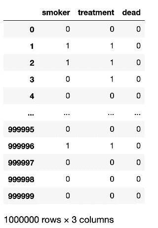
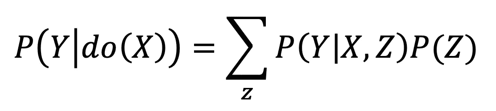
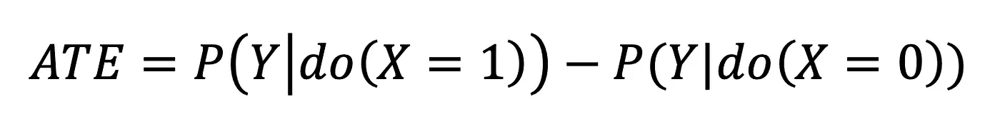
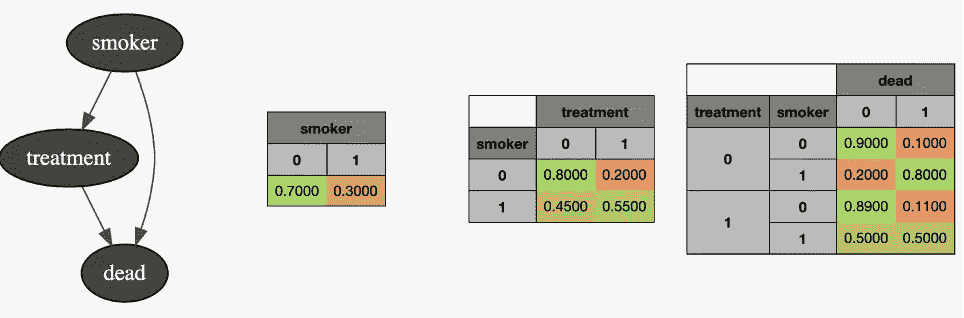
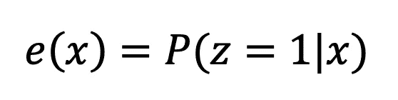
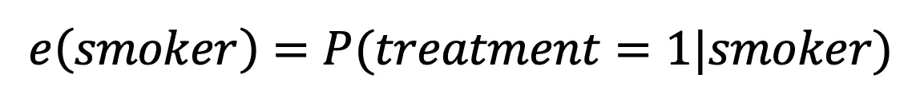
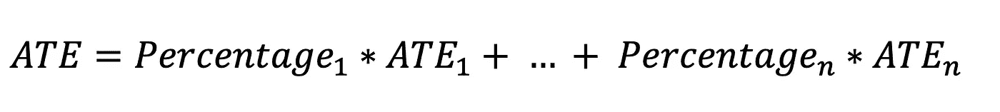

# 新手使用倾向评分的实践介绍

> 原文：<https://towardsdatascience.com/a-hands-on-introduction-to-propensity-score-use-for-beginners-856302b632ac?source=collection_archive---------2----------------------->

## [实践教程](https://towardsdatascience.com/tagged/hands-on-tutorials)

## 做中学

照片由[纳丁·马里奥](https://unsplash.com/@nadinmario?utm_source=unsplash&utm_medium=referral&utm_content=creditCopyText)在 [Unsplash](https://unsplash.com/s/photos/balance?utm_source=unsplash&utm_medium=referral&utm_content=creditCopyText) 上拍摄

这是与[阿莱克斯·鲁伊斯](https://aleixrvr.medium.com/)、[赫苏斯·塞奎德斯](https://medium.com/@cerquide)、[霍安·卡普德维拉](https://medium.com/@jcapde)和[博尔哈·维拉斯科](https://medium.com/@velasco.6655)在[因果 ALGO Bcn](https://medium.com/u/5637a0e9712?source=post_page-----97aa53f3b6ce--------------------------------) 内的联合作品。你可以在这里找到一篇解释相同主题[的理论文章。](/propensity-scores-and-inverse-probability-weighting-in-causal-inference-97aa53f3b6ce)

任何领域都需要解决一个常见的数据问题，这涉及到弄清楚治疗是否对某个结果有任何影响。乍一看，这似乎没有那么难。但是对于任何掉进研究因果关系的兔子洞的人来说，很明显事实并非如此。从随机对照试验(RCT)数据库计算这些效应与从观察数据集计算是不同的。因为低维或高维协变量研究的问题也不一样。

任何对因果推理有所了解的人都可能会对这个条目感兴趣，并希望通过一个代码示例来了解它的工作情况，在这个示例中，我们将回顾一些相对简单的方法来计算来自观察数据集的平均治疗效果(ATE)。

现在，让我们通过一个实际操作的 Python 代码示例来开始这段旅程。你可以在 Github 中找到 Jesús Cerquides 的原始笔记本和数据集[这里](https://github.com/cerquide/propensity_score_talk)。

我们从一家医院的历史记录中得到这个数据库:

有人问我们:

如果我们决定从现在开始治疗每一个人，与不治疗任何人相比，死亡人数会有多少变化？

我们的第一直觉是，利用给定的数据，简单地计算出接受治疗的人群相对于未接受治疗的人群的死亡百分比，然后简单地将两者相减。

这个计算让我们得出以下答案:如果我们决定治疗所有人，死亡率将增加 8.5%(将从 23.56%跃升至 32.08%)。

这个结果会告诉我们，我们不应该对待我们的人口，但是我们的常识可能会“刺痛”并使我们怀疑是否真的是这样。这是理所当然的，因为我们忽略了一个微小但非常重要的细节，那就是治疗在吸烟人群和非吸烟人群中的分布并不均匀。换句话说，治疗不是随机的，因此，这种计算 ATE 的方法是完全错误的。

定义这种现象的另一种方式是用“混杂”这个词。基本上，这个词的意思是有一个变量或一组变量(混杂因素)以某种方式影响接受治疗的概率，同时也影响结果。

理想情况下，如果我们想评估某种治疗对我们认为的结果的影响，我们应该避免任何类型的混淆效应。我们可以通过设计一个随机分配治疗的 RCT 来做到这一点，因此混杂因素对它的分布没有影响。但这里的问题是，这样做并不总是道德的。例如，如果我们想评估吸烟(“治疗”)对哮喘青少年肺部健康(结果)的影响。为了做一项 RCT 研究，我们应该找一些青少年，随机分配一半人强制吸烟。显然，这是不道德的，也是绝对不应该做的。然而，我们可以检索患有哮喘的青少年的数据，并记录他们是否吸烟，他们的肺部健康等级是什么，特别是任何可能影响任何青少年吸烟机会的变量。在这个例子中，一个明显的可能混杂因素是社会经济地位，因为低地位会增加不稳定的熟悉环境和更多暴露于不良习惯的机会(影响“治疗”)，并且它肯定会通过减少获得良好健康计划的机会来影响青少年的肺部健康(结果)。这就是我们所说的观察数据集，我们知道有一组混杂因素在起作用。在这个问题上的专家知识是尝试包括所有可能的混杂因素的关键，这样我们可以使用因果推断技术更好地估计治疗对结果的影响。

如开头所述，在本条目中，我们将首先使用 Pearl 的调整公式[1]介绍一些简单的方法；然后是倾向得分，应用 Rosenbaum 和 Rubin 在他们 1983 年的著名论文[2]中介绍的两种方法。

# 调整公式

如果你读过或细读了 Judea Pearl 的书《统计学中的因果推断:初级读本》,你肯定知道并且喜欢这个调整公式(如果你没有读过并且对这个领域感兴趣，现在就去读吧！).也许你是通过另一种方式知道的。以防你还不了解它，让我把它呈现给你:

其中 Y 是结果，X 是治疗，Z 是协变量或混杂变量。现在，我不打算进入这个公式是如何形成的或它的更正式的细节，因为这不是本文的目的。只要知道表达式 P(Y|do(X))指的是 Y(结果)的概率，如果我们对所有人群进行 X(治疗)就足够了。根据这个定义，我们可以用下面的方法计算 ate:

因此，澄清了这一点，让我们回到我们最初的例子。我们展示的这个数据集实际上是伪造的。使用贝叶斯网络，我们指定了我们的 3 个变量(吸烟者，治疗，死亡)之间的依赖关系，并生成了一个数据集。

由于我们确切地知道每个变量的所有真实概率及其所有可能的组合，我们可以应用该公式来计算如果我们治疗每个人死亡的确切概率，以及如果我们不治疗任何人死亡的概率。

现在，有了这两个结果，我们可以计算平均治疗效果(ate)。

这种治疗的真正效果是降低了 8.3%的死亡率，与我们第一次计算的结果正好相反。所以，真正的答案是，我们绝对要对待所有的患者。现在，有这样精确的百分比是非常罕见的。我们当然可以用一个好的观测数据集，应用相同的系统来近似 ate，但是当数据集有一个高维的协变量集时，这个方法的问题就出现了。想象一组数百个协变量。为所有协变量计算这个公式太麻烦了。这不是一个非常简单的例子，但在现实世界中，这是一个非常常见的情况。在这种情况下，我们应该怎么做？

# 作为平衡得分的治疗倾向

这就是 Rosenbaum 和 Rubin 在 1983 年试图解决的问题，他们建议我们使用倾向得分(或在给定一组协变量的情况下获得治疗的概率)作为平衡得分。他们的推理如下。平衡分数是一组协变量的任何函数，它捕获了依赖于治疗的一组协变量的所有信息。这样的平衡分数将允许我们以相对简单的方式模拟混杂因素和治疗之间的关系。平衡分数的最小表达式是倾向分数。

计算倾向得分相对简单，即使在高维的协变量集合中也是如此。在这种情况下，我们能做的是使用逻辑回归建模，将治疗作为目标变量。但是为了能够在我们接下来要讨论的方法中使用这个倾向分数，有一些限制。

在因果推理中，我们会发现一个共同的主题，那就是非发现条件。这意味着，从根本上说，为了能够使用观察数据库对 ATE 值进行合理的近似，我们必须考虑所有可能作为混杂因素的变量。

为了确保这一点，形式上需要满足 2 个假设:

稳定单位治疗值假设(SUTVA):样本中任何单位的任何结果都独立于其他单位的治疗分配。

在给定一组协变量的情况下，治疗分配应该是非常可忽略的:如果样本的每个单位都有机会(即使很小)接受每种治疗，并且如果治疗分配和结果在给定协变量的情况下是条件独立的。

如果满足这两个假设，我们就可以使用我们现在要复习的方法了。

事不宜迟，我们来看看它们。

# 倾向得分配对匹配

和以前一样，我们将回顾把它们应用到我们的具体例子中的方法。如前所述，我们能够计算准确的 ATE，因为我们知道每个变量组合的准确概率。这些方法假设我们不知道它们，因为对于高维协变量集，这几乎是不可能的。因此，我们将比较他们对 ATE 值的估计和已知的真实结果。

让我们从计算我们的倾向分值开始。其正式定义如下:

其中 *x* 是协变量集合的特定组合， *z = 1* 等同于接受治疗。

在我们的具体案例中，它被翻译为:

现在我们计算每个病人的倾向:

在这种情况下，只有 2 个可能的值，因为我们的混杂因素是二元的。一旦计算并添加到我们的数据帧中，我们可以用两种不同的方式配对。

## 配对版本 1

在这个版本的配对中，我们将每个接受治疗的患者与具有相同倾向评分的对照患者配对。在这个例子中，出于效率原因，我们减少了接受治疗的患者数量。

现在，每个接受治疗的患者都有一个随机抽样的未治疗患者，具有相同的倾向评分:

有了匹配对，我们可以连接两个数据框，并简单地计算治疗和未治疗结果之间的平均差异:

我们得到的结果是，死亡百分比被有效地估计为下降，这是好的，因为它与之前计算的实际影响一致。但是，我们知道真实的 ATE 是 0.083。这个结果明显有失偏颇。

让我们来看看配对的第二个版本。

## 配对版本 2

我们先来看看我们的倾向得分的分布:

很明显，我们有大多数倾向得分低的患者。

我们可以将患者分为两组，高倾向(> 0.5)和低倾向(< =0.5):

现在，我们建立了一个配对样本，但与之前不同的是，治疗和未治疗的人群都是从高或低倾向得分人群中随机抽样的。

在为这个新的配对数据集计算 ATE 的值之后，我们可以看到该值比第一个版本的配对匹配的偏差小得多。

我们能做得更好吗？

# 次级分类

这里，该方法与配对匹配的第二版本相关，因为它依赖于倾向得分的分布。它的历史是，我们可以细分我们的人口类别的范围分解倾向得分。将我们的总体分类到每个类别中(在本例中只有两个，因为协变量是二元的)，我们只需要计算每个子类的 ate，然后应用下一个公式:

这样做后，我们的结果非常非常接近 ATE 的已知真实值。

# 结论

在本文中，我们回顾了几种相对简单的计算平均治疗效果的方法。首先是经典的调整公式，非常适用于协变量为低维的设置，如我们的示例。然后使用最适合高维协变量集的倾向得分。

在本例中，校正公式为我们提供了 ATE 的精确结果，因为我们已经构建了数据集并知道所需的特定概率。然后，我们能够与倾向得分方法进行比较，即使在这个例子中，最好的方法是子类化，但这并不意味着在任何其他类型的问题中也是如此。我们建议在开始使用一种方法之前，先测试不同的方法，包括这里介绍的方法和其他没有在这里讨论的方法。

## 参考资料:

[1]j .珀尔、m .格里穆尔和 n .朱厄尔，《统计学中的因果推断:入门》。(2016).威利。

[2]罗森鲍姆和鲁宾博士(1983 年)。倾向评分在因果效应观察研究中的核心作用。 *Biometrika，* *70* (1)，41–55。doi:10.2307/2335942