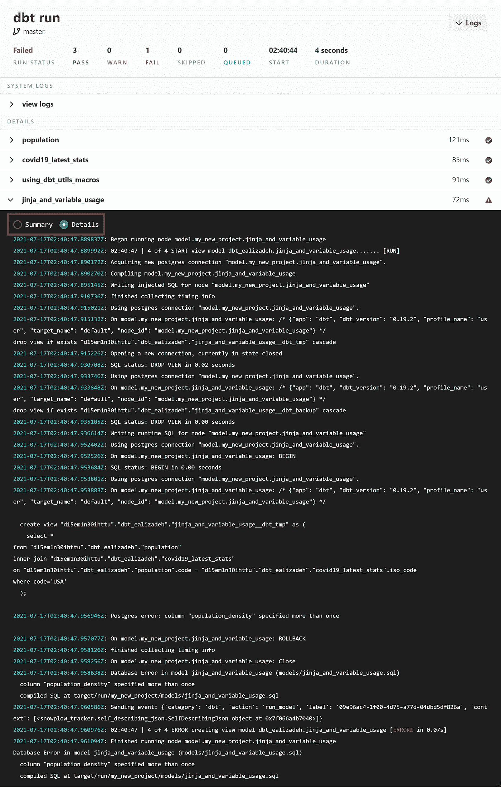
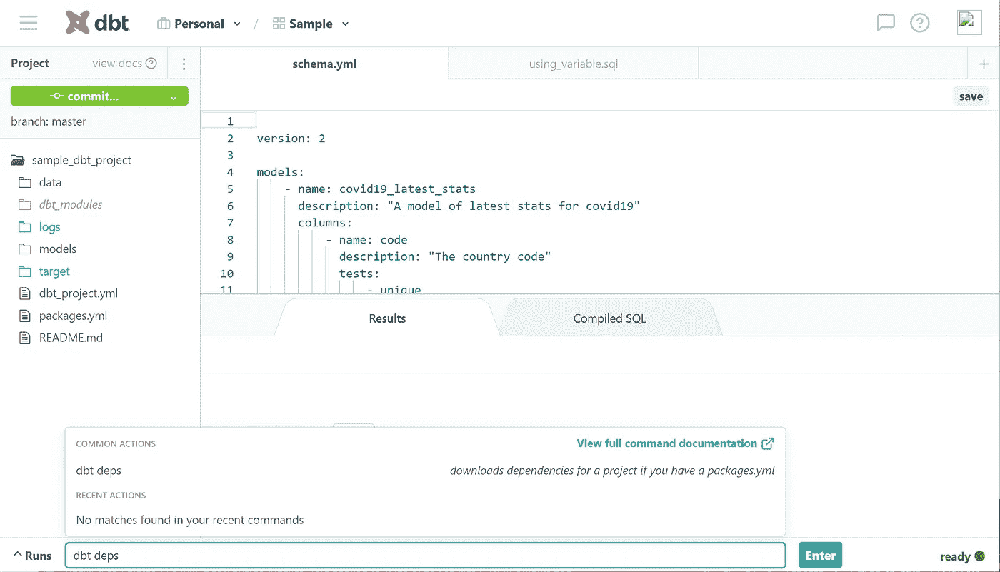
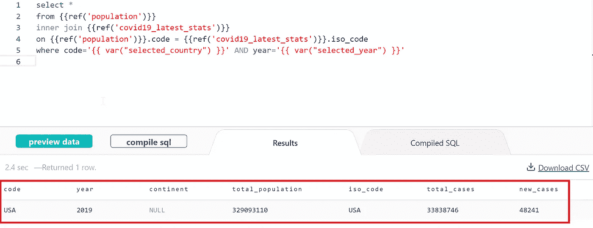
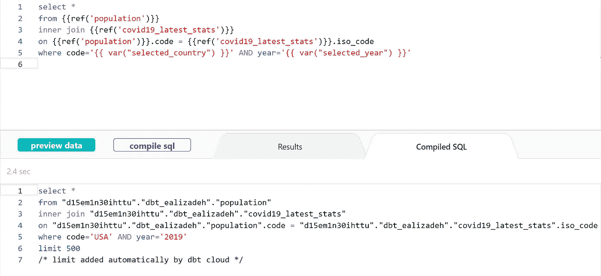
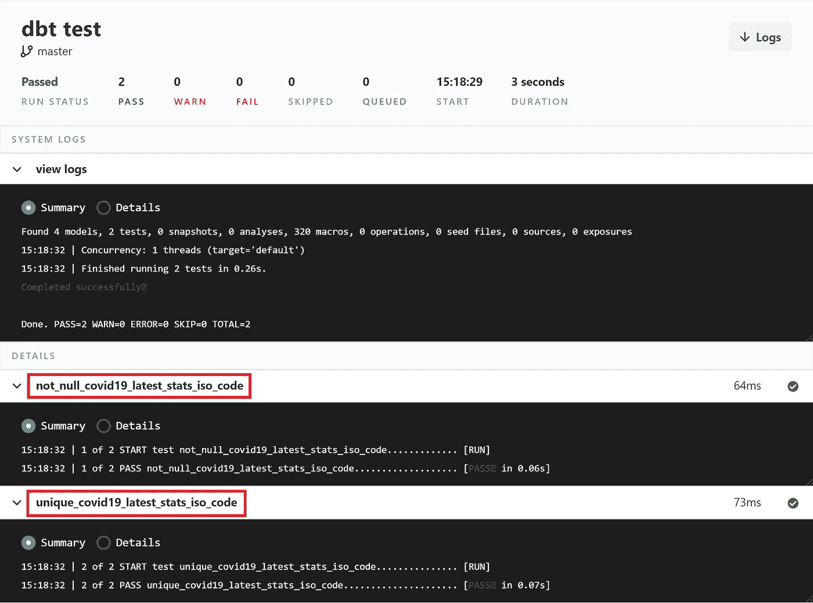
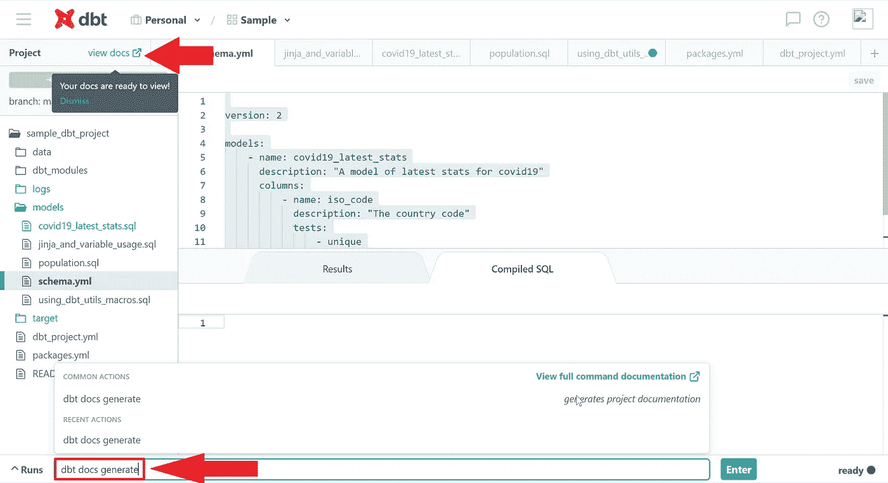

# dbt 实践教程

> 原文：<https://towardsdatascience.com/a-hands-on-tutorial-for-dbt-f749f7749c8d?source=collection_archive---------21----------------------->

## 入门指南

## 通过只编写 SQL SELECT 语句，将 dbt 用于复杂数据**转换。运行测试，生成文档，使用宏，以及更多的功能。**


*本帖中使用的所有图片/视频均由作者创作，除非另有说明。(图标来自*[](https://flaticon.com)**)**

*dbt(数据构建工具)是一个使用 select SQL 语句的数据转换工具。它允许您创建复杂的模型，使用变量和宏(也称为函数)，运行测试，生成文档，以及更多的特性。*

*dbt 不提取或加载数据，但是它在转换数据库中已经可用的数据方面很强大——dbt 在 ELT(提取、加载、转换)过程中执行 T。*

*在这篇文章中，你将学会如何…*

*   *配置 dbt 项目*
*   *创建 dbt 模型(SELECT 语句)*
*   *使用全局变量和宏构建复杂的 dbt 模型*
*   *参考其他 dbt 模型构建复杂模型*
*   *运行测试*
*   *生成文档*

# *先决条件*

## *注册*

*你可以在 getdbt.com 报名。免费计划对于小型项目和测试来说是一个很好的计划。*

## *具有填充数据的数据库*

*你可以查看我关于如何在 Heroku 上部署一个*免费* PostgreSQL 数据库的帖子。这篇文章提供了如何做的一步一步的指导。*

*您还可以查看本文附带的 GitHub repo 中的[数据摄取脚本](https://github.com/e-alizadeh/sample_dbt_project/blob/master/data/data_ingestion.py)。*

*[](https://github.com/e-alizadeh/sample_dbt_project) [## e-alizadeh/sample_dbt_project

### 此时您不能执行该操作。您已使用另一个标签页或窗口登录。您已在另一个选项卡中注销，或者…

github.com](https://github.com/e-alizadeh/sample_dbt_project) 

按照上面所述，我们已经在 PostgreSQL 数据库中生成了两个表，我们将在本文中使用它们。数据库中有两个表，分别是`covid_latest`和`population_prosperity`。您可以在 GitHub repo 上找到这篇文章的摄取脚本。

## dbt CLI 安装

您可以按照下面的 [dbt 文档页面](https://docs.getdbt.com/dbt-cli/installation/)上的说明来安装 dbt 命令行界面(CLI)。

[](https://docs.getdbt.com/dbt-cli/installation) [## 安装| dbt 文档

### 我们建议您使用以下三种屡试不爽的方法之一来安装 dbt:安装自制软件。然后，运行:测试您的…

docs.getdbt.com](https://docs.getdbt.com/dbt-cli/installation) 

# dbt 项目的基础

为了使用 dbt 工具，有三件主要的事情需要了解。

*   dbt 项目
*   数据库连接
*   dbt 命令

## dbt 怎么用？

dbt 项目是包含`.sql`和`.yml`文件的目录。最少需要的文件是:

*   名为`dbt_project.yml`的项目文件:该文件包含 dbt 项目的配置。
*   模型(`.sql`文件):dbt 中的模型仅仅是一个`.sql`文件，包含一个**单个** `**select**` **语句**。

> 每个 dbt 项目都需要一个 dbt_project.yml 文件——这是 dbt 知道一个目录是 dbt 项目的方式。它还包含告诉 dbt 如何操作您的项目的重要信息。

你可以在这里找到更多关于 dbt 项目[的信息。](https://docs.getdbt.com/docs/introduction#dbt-projects)

> 💡dbt 模型基本上是一个带有 SELECT 语句的`.sql`文件。

## dbt 命令

dbt 命令以`dbt`开始，可通过以下方式之一执行:

*   dbt Cloud(dbt Cloud 仪表板底部的命令部分)，
*   dbt CLI

有些命令只能在 dbt CLI 中使用，如`dbt init`。我们将在本文中使用的一些 dbt 命令是

*   `dbt init`(仅在 dbt CLI 中)
*   `dbt run`
*   `dbt test`
*   `dbt docs generate`

# dbt 项目设置

## 步骤 1:使用 dbt CLI 初始化 dbt 项目(示例文件)

您可以使用`[dbt init](https://docs.getdbt.com/reference/commands/init)`生成样本文件/文件夹。特别是，`dbt init project_name`将创建以下内容:

*   一个`~/.dbt/profiles.yml`文件(如果不存在)
*   名为`[project_name]`的新文件夹
*   dbt 入门所需的目录和示例文件

> **注意**:由于`dbt init`会生成一个名为`project_name`的目录，为了避免任何冲突，您应该*没有任何同名的文件夹。*


dbt 初始化<project_name></project_name>

结果是一个包含以下示例文件的目录。

```
sample_dbt_project
├── README.md
├── analysis
├── data
├── dbt_project.yml
├── macros
├── models
│   └── example
│       ├── my_first_dbt_model.sql
│       ├── my_second_dbt_model.sql
│       └── schema.yml
├── snapshots
└── tests
```

对于这篇文章，我们将只考虑最少的文件，并删除多余的东西。

```
sample_dbt_project
├── README.md
├── dbt_project.yml
└── models
    ├── my_first_dbt_model.sql
    ├── my_second_dbt_model.sql
    └── schema.yml
```

## 步骤 2:建立一个 Git 存储库

您可以使用设置期间指定的现有回购协议。您可以按照这里的 dbt 文档[来配置存储库。](https://docs.getdbt.com/docs/dbt-cloud/cloud-configuring-dbt-cloud/cloud-configuring-repositories)

**或者，如果你想创建一个新的回购…**

您可以从创建的目录中创建新的存储库。你可以像下面这样做

```
git init
git add .
git commit -m "first commit"
git remote add origing <repo_url>
git push -u origin master
```

## 步骤 3:在 dbt Cloud Dashboard 上建立一个新项目

在上一步中，我们创建了一个包含示例模型和配置的示例 dbt 项目。现在，我们想要创建一个新项目，并在 dbt Cloud 仪表板上连接我们的数据库和存储库。

在我们继续之前，您应该已经

*   一些数据已经存在于数据库中，
*   包含上一步生成的文件的存储库

您可以按照下面的步骤在 dbt Cloud 中设置一个新项目(请记住，这一步与上一步不同，因为我们只生成了一些示例文件)。

在 dbt Cloud 上建立一个新的 dbt 项目

我们项目的`dbt_project.yml`文件如下所示(你可以在这篇文章附带的 [GitHub repo](https://github.com/e-alizadeh/sample_dbt_project.git) 中找到完整版本)。

dbt_project.yml

# dbt 型号和功能

## dbt 模型

让我们创建简单的 dbt 模型来检索表中的几列。

**covid 19 _ latest _ stats**dbt 模型(models/covid 19 _ latest _ stats . SQL)

**人口** dbt 模型(models/population.sql)

> ⚠️ **注意**:dbt 模型名是`models`目录中 sql 文件的文件名。模型名称可能不同于数据库中的表名称。例如，在上面的例子中，dbt 模型`population`是数据库中`population_prosperity`表上的`SELECT`语句的结果。

## 运行模型

您可以通过执行`dbt run`来运行您的 dbt 项目中的所有模型。下面显示了一个示例 dbt 运行输出。您可以看到运行所有 dbt 模型的摘要或详细日志。这对于调试您在查询中可能遇到的任何问题非常有帮助。例如，您可以看到一个失败的模型抛出了一个 Postgres 错误。



失败**的详细日志 jinja _ and _ variable _ usage**dbt 模型

## 金佳和宏

dbt 使用 [Jinja](https://jinja.palletsprojects.com/) 模板语言，使得 dbt 项目成为 SQL 的理想编程环境。使用 Jinja，您可以进行 SQL 中通常不可能的转换，比如使用环境变量或宏——SQL 的抽象片段，类似于大多数编程语言中的函数。每当你看到一个`{{ ... }}`，你已经在用 Jinja 了。关于 Jinja 和定义的附加 Jinja 风格函数的更多信息，可以查看 [dbt 文档](https://docs.getdbt.com/docs/building-a-dbt-project/jinja-macros/)。

在这篇文章的后面，我们将讨论由 dbt 定义的自定义宏。

## 使用变量

**定义一个变量**

您可以在您的`dbt_project.yml`中的`vars`部分下定义您的变量。例如，让我们定义一个名为`selected_country`的变量，其默认值为`USA`，另一个名为`selected_year`的变量，其默认值为`2019`。

带有已定义变量的 dbt_project.yml 文件

**使用变量**

您可以通过`[var()](https://docs.getdbt.com/reference/dbt-jinja-functions/var)` Jinja 函数(`{{ var("var_key_name") }}`)在您的 dbt 模型中使用变量。

## 宏指令

在`dbt_utils`中有许多有用的转换和宏可以用在你的项目中。关于所有可用宏的列表，你可以查看他们的 GitHub repo 。

现在，让我们将 dbt_utils 添加到我们的项目中，并按照以下步骤进行安装:

1.  将 dbt_utils 宏添加到您的`packages.yml`文件，如下所示:

将 **dbt_utils** 包添加到 packages.yml

2.运行`dbt deps`安装软件包。



使用 **dbt deps** 安装软件包

## 复杂 dbt 模型

模型(选择)通常堆叠在另一个之上。为了构建更复杂的模型，你必须使用`[ref()](https://docs.getdbt.com/reference/dbt-jinja-functions/ref)`宏。`ref()`是 dbt 中最重要的功能，因为它允许您引用其他模型。例如，您可能有一个做多种事情的模型(又名 SELECT query ),而您不想在其他模型中使用它。如果不使用前面介绍的宏，将很难构建一个复杂的模型。

## 使用`ref()`和全局变量的 dbt 模型

我们可以使用本文前面定义的两个 dbt 模型构建更复杂的模型。例如，让我们创建一个新的 dbt 模型，它根据国家代码连接上述两个表，然后根据选定的国家和年份进行过滤。

**jinja _ and _ variable _ usage**dbt 模型(models/jinja _ and _ variable _ usage . SQL)

关于上述查询的几点:

*   `{{ref('dbt_model_name')}}`用于指项目中可用的 dbt 型号。
*   你可以从像`{{ref('dbt_model_name')}}.column_name`这样的模型中得到一个专栏。
*   您可以通过`{{var("variable_name)}}`使用`dbt_project.yml`文件中定义的变量。

上面的代码片段将来自`population`和`covid19_latest_stats`型号的数据连接到国家代码上，并根据 selected_country=USA 和 selected_year=2019 进行筛选。模型的输出如下所示。



**jinja _ and _ variable _ usage**dbt 模型的输出

您也可以点击**编译 sql** 按钮查看编译后的 SQL 代码片段。这非常有用，特别是如果您想在 dbt 工具之外运行查询的话。



为**jinja _ and _ variable _ usage**dbt 模型编译的 SQL 代码

## 使用 dbt_utils 包和宏的 dbt 模型

`dbt_utils`包中包含可以在 dbt 项目中使用的宏(又名函数)。所有宏的列表可以在 [dbt_utils 的 GitHub 页面](https://github.com/dbt-labs/dbt-utils/)上找到。

让我们在 dbt 模型中使用 dbt_utils `[pivot()](https://github.com/dbt-labs/dbt-utils/#pivot-source)`和`[get_column_values()](https://github.com/dbt-labs/dbt-utils/#get_column_values-source)`宏，如下所示:

**使用 _dbt_utils_macros** dbt 模型(models/using _ dbt _ utils _ macros . SQL)

上面的 dbt 模型将在 dbt 中编译成下面的 SQL 查询。

使用 _dbt_utils_macros 从**编译 SQL 查询** dbt 模型

# 在 dbt 中运行测试

使用 dbt 的另一个好处是能够测试数据。开箱即用，dbt 有以下通用测试:`unique`、`not_null`、`accepted_values`和`relationships`。对模型进行这些测试的示例如下所示:

schema.yml (dbt 测试)

你可以通过`dbt test`运行测试。您可以在下面看到输出



在 dbt 云仪表板上运行 dbt 测试的结果

关于 dbt 测试的更多信息，您可以访问 [dbt 文档](https://docs.getdbt.com/docs/building-a-dbt-project/tests)。

# 在 dbt 中生成文档

您可以通过简单地在命令部分运行`dbt docs generate`来为您的 dbt 项目生成文档，如下所示:



为 dbt 项目生成文档

您可以通过单击查看文档来浏览生成的文档。您可以在这里看到生成的文档的概述。

命令**生成的文档 dbt docs 生成**。

除了`dbt docs generate`之外，dbt docs 还可以为 web 服务器提供生成的文档。为此，您只需运行`dbt docs serve`。更多关于为你的 dbt 项目生成文档的信息可以在[这里](https://docs.getdbt.com/docs/building-a-dbt-project/documentation)找到。

# 其他功能

## 使用钩子和操作的数据库管理

有些数据库管理任务需要运行额外的 SQL 查询，例如:

*   创建用户定义的函数
*   授予对表的特权
*   还有更多

dbt 有两个接口(钩子和操作)来执行这些任务，重要的是对它们进行版本控制。这里简单介绍一下钩子和操作。有关更多信息，您可以查看 [dbt 文档](https://docs.getdbt.com/docs/building-a-dbt-project/hooks-operations)。

## 钩住

钩子只是在不同时间执行的 SQL 片段。钩子在`dbt_project.yml`文件中定义。不同的挂钩有:

*   `pre-hook`:模型建立前执行
*   `post-hook`:模型建立后执行
*   `on-run-start`:在`dbt run`开始时执行
*   `on-run-end`:在`dbt run`结束时执行

## 操作

操作是在不运行模型的情况下调用宏的一种便捷方式。使用`[dbt run-operation](https://docs.getdbt.com/reference/commands/run-operation)`命令触发操作。

注意，与钩子不同，您需要在一个 [dbt 操作](https://docs.getdbt.com/docs/building-a-dbt-project/hooks-operations#operations)中显式执行 SQL。

# 结论

dbt 是一个很好的工具，绝对值得一试，因为它可以简化您的数据 ELT(或 ETL)管道。在这篇文章中，我们学习了如何设置和使用 dbt 进行数据转换。我向您介绍了该工具的不同特性。特别是，我提供了一个分步指南

*   配置 dbt 项目
*   创建 dbt 模型(SELECT 语句)
*   使用全局变量和宏构建复杂的 dbt 模型
*   参考其他 dbt 模型构建复杂模型
*   运行测试
*   生成文档

您可以在下面找到包含所有脚本(包括数据摄取脚本)的 GitHub repo。

[](https://github.com/e-alizadeh/sample_dbt_project) [## e-alizadeh/sample_dbt_project

### 此时您不能执行该操作。您已使用另一个标签页或窗口登录。您已在另一个选项卡中注销，或者…

github.com](https://github.com/e-alizadeh/sample_dbt_project) 

感谢阅读🙏

> [*加入我的邮件列表接收类似的帖子*](https://www.ealizadeh.com/subscribe/) *。也可以关注我上* [*中*](https://medium.com/@ealizadeh)*[*LinkedIn*](https://www.linkedin.com/in/alizadehesmaeil/)*，*[Twitter](https://twitter.com/intent/follow?screen_name=es_alizadeh&tw_p=followbutton)*。**

# *有用的链接*

*[](/deploy-free-postgresql-database-in-heroku-and-ingest-data-8002c574a57d) [## 免费 PostgreSQL 数据库的逐步部署和数据接收

### 在 Heroku 中免费部署 PostgreSQL 数据库，并使用 Pandas 和 SQLAlchemy 接收数据

towardsdatascience.com](/deploy-free-postgresql-database-in-heroku-and-ingest-data-8002c574a57d) 

# 参考

[](https://docs.getdbt.com/docs/introduction) [## dbt 是什么？| dbt 文档

### dbt(数据构建工具)使分析工程师能够通过简单地编写 select…

docs.getdbt.com](https://docs.getdbt.com/docs/introduction) 

*原载于*[*https://ealizadeh.com*](https://ealizadeh.com/blog/dbt-tutorial)*。***