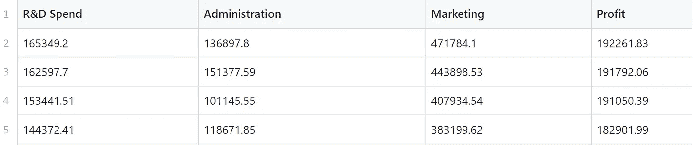
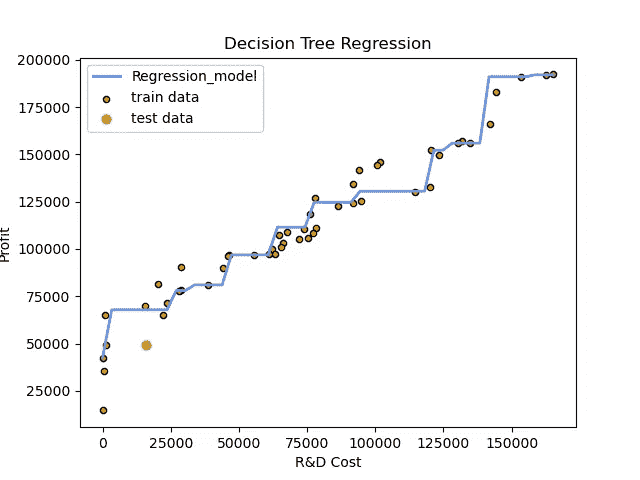
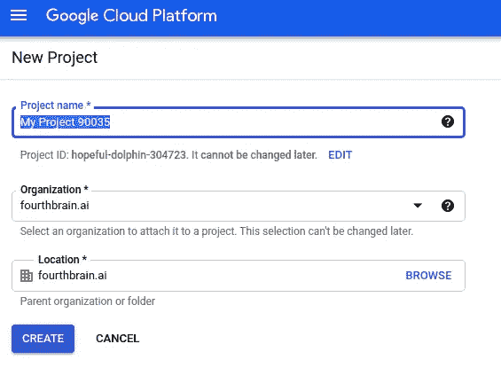
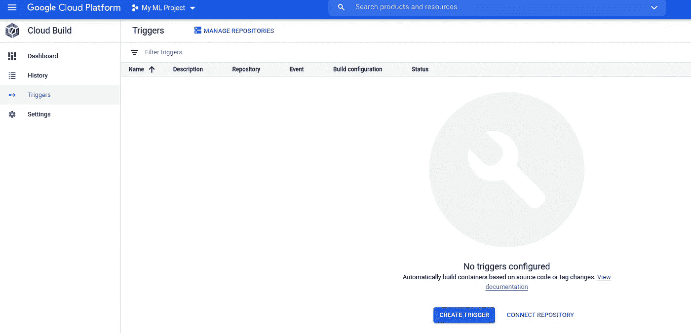
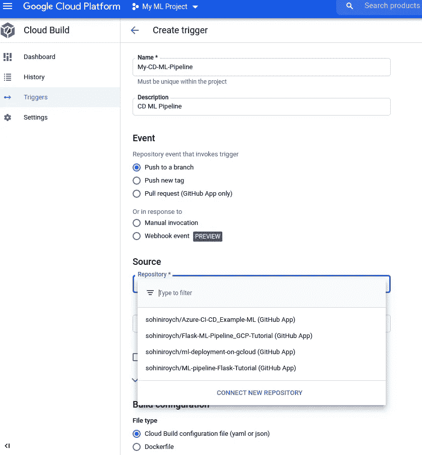
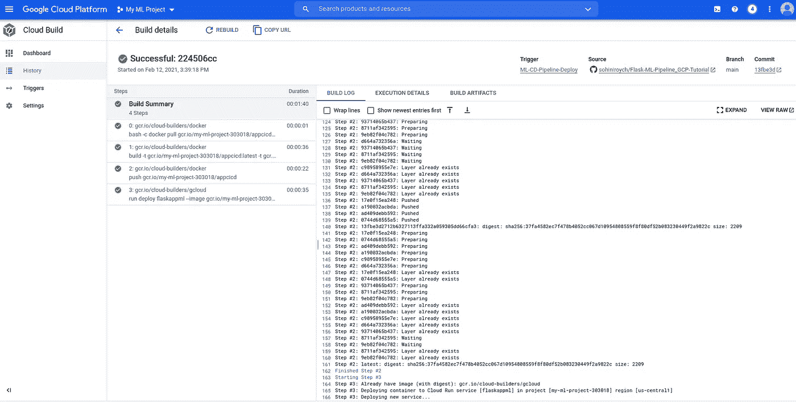
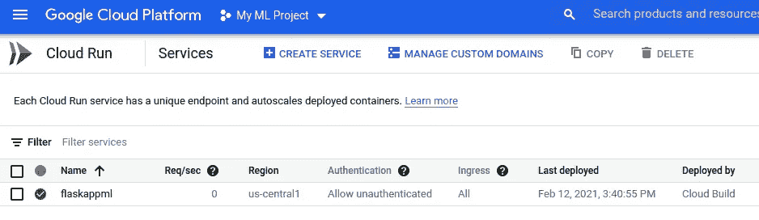

# Google Cloud 上基于 ML 的 Web 应用程序持续部署管道的实践教程

> 原文：<https://towardsdatascience.com/a-hands-on-tutorial-to-continuous-deployment-pipelines-for-ml-based-web-apps-on-google-cloud-ba3957c87bc1?source=collection_archive---------17----------------------->

## [实践教程](https://towardsdatascience.com/tagged/hands-on-tutorials)

## 使用 Flask 部署 ML 应用程序的综合指南

机器学习(ML)模型通常利用从以前看到的(训练)数据中学习模式的能力，并应用它们来预测新(测试)数据的结果。通过允许访问多个用户和测试环境，将 ML 模型部署为 web 应用程序可以帮助测试经过训练的 ML 模型的功效，从而收集测试性能指标。然而，ML web 应用程序在生产中的部署可能是一个非常复杂的过程，可能需要确保在应用程序更新过程中用户的停机时间最短。Google Cloud Platform (GCP)等基于云的部署解决方案通过管道和触发器高度简化了持续集成和持续部署(CI/CD)的流程，这些管道和触发器可以确保完整性检查以及更新应用程序运行的集成代码库的完整性。

> 在本教程中，我们将回顾一个详细的示例，其中我们通过 CD 管道在 GCP 上部署了一个 ML 模型 web 应用程序。要遵循从数据分析到最终应用部署的步骤，请在[1]处分叉 github 存储库，并遵循以下步骤。

**第一步:数据和 ML 模型描述**

第一步是理解数据，然后是 ML 模型的创建和后续部署。对于这一步，我们参考文件夹 *app_files* 下的文件 *model.py* 。

> 对于本教程，我们将使用图 1 所示的[2]中的 50_Startup.csv 数据，其目标是使用三个特征(x₁,x₂,x₃)来训练回归模型(f(X))作为( *R & D 支出、管理成本、营销成本*)，并预测公司的'*利润* ' (Y)。

图 1:用于回归数据建模的训练数据集的快照。

我们的目标是估计利润作为其特征的函数为 f(x)=g(x₁,x₂,x₃)，其中 g(.)分别代表特征 x₁、x₂、x₃的线性或非线性组合，它们可以从训练数据中估计。

虽然线性回归是上述数据集最简单的解决方案，但对于大型数据集而言，最具可扩展性的数据模型之一仍然是基于决策树的集成模型，因为它们支持数据聚合和可扩展性。在这项工作中，我们实现了一个基于非线性决策树的回归模型，如图 2 所示。为了训练和可视化回归模型，运行文件 *model.py* ，代码片段如下所示。

决策树回归器通过在特征子空间中划分子区域或块来进行训练，使得相似的样本聚集在一起，以最小化估计的残差平方和(RSS)[3]。在测试时，每个样本被投影到分割的特征子空间上，然后从相应的子区域读出平均样本值作为估计结果[3]。图 2 示出了最大深度为 5 的已训练决策树回归模型的非线性特性。下面显示了跨每个特征可视化训练模型的代码。

图 2:决策树回归模型示例，适用于 R&D 成本单一特征的可视化数据集。测试数据集为[16000，135000，450000]。

*终端*第一步命令:python model.py

**第二步:使用 Flask 的 ML Web 应用**

构建了 ML 模型后，下一步是将其打包并作为 Web 应用程序。这里我们指的是 *app_files* 中包含的 *templates* 文件夹下的文件 *app.py* 和 html 文件。

我们利用来自[4]的基于 Flask 的 RESTful api。表述性状态转移(REST)是 web API 的标准架构设计，自 2010 年问世以来，Flask 一直是 python web API 服务的选择。设计 Flask-API 的两个主要组件是[5]:

1.  烧瓶库和 POST HTTP 方法来服务于预测。
2.  对用户与 ML 模型交互有用的前端 HTML 文件。

与[4–5]中一般基于 Flask 的 python 部署相比，app.py 文件中的一个重要变化是，正在运行的 *app.py* 启动了一个在 [http://0.0.0:8000](http://0.0.0:8000) 上运行的 API，而不是它的默认设置。

这一改变是为了启用一个 Google Cloud Run (GCR ),它监听 [http://0.0.0，](http://0.0.0,)端口 8080。有关调试 GCR 应用程序的方法的详细信息，请参见[6]。

*终端第二步命令* : python app.py

**第三步:为谷歌云创建一个 Docker 容器**

现在我们有了一个功能性的 web 应用程序，我们需要为 Google Cloud 运行打包它。为此，我们将创建一个 Docker 容器，如[7]所示，它是一个独立的软件，可以安装在任何物理或虚拟机上运行容器化的应用程序。本教程的 Docker 文件，如下所示，必须包括 4 个关键组件。

1.  应用程序所需的操作系统；
2.  *requirements.txt* 文件中的库和包等依赖项列表；
3.  应用程序文件；
4.  启动应用程序的命令。

**步骤 4:为云运行创建一个 YAML 文件**

运行 CD 管道所需的最后一个组件是一个基于[7]中的应用程序的 **YAML** Ain 标记语言文件。YAML 文件遵循数据序列化标准来构建 CD 管道的配置设置。关于为你的应用构建 YAML 文件的细节可以在[8]找到。下面显示的这个教程的 YAML 文件包含 4 个步骤。

1.  如果 docker pull 请求失败，那么将执行 exit 0，即不会显示任何错误消息，构建过程将继续最后一次构建。
2.  如果目前没有构建，则创建一个构建，否则使用缓存构建。
3.  将 docker 图像推送到 GCR
4.  将应用程序部署到 GCR。

现在我们已经有了运行和部署 ML web 应用程序的所有组件，让我们创建一个触发器来在 *Google Cloud* 上部署应用程序。

**第五步:创建 CD 管道并运行**

现在我们有了一个本地运行的应用程序，下一个任务是在 GCP 建立一个项目，该项目将生成触发器和云运行。遵循以下步骤，确保您有一个可行的 Google cloud 项目来开始 CD 流程。

1.  在谷歌控制台注册:[https://console.cloud.google.com/home/](https://console.cloud.google.com/home/)
2.  创建一个新项目，如下所示:

在 GCP 创建项目

3.确保为项目激活“计费”。

4.从 Github 代码开始创建一个 CD 管道。为此，请使用您的 Github 帐户中的分叉 Github 存储库。

5.进入页面:[https://console.cloud.google.com/cloud-build/triggers](https://console.cloud.google.com/cloud-build/triggers)。确保您的项目在顶部面板上被选中。接下来点击底部的“创建触发器”按钮，如下所示。

在 GCP 制造触发器

6.这将把你带到下一页，在这里你需要为你的分叉 Github 库创建一个‘Push to a branch’事件。要部署应用程序，请选择如下所示的“云构建”配置文件选项，并点击底部的“创建”。

使用 Github 代码创建推送触发器的步骤

7.现在创建了一个触发器。点击触发器旁边的运行选项，查看生成的日志。这将需要几分钟的时间来运行和部署。最后，您应该会看到如下所示的内容。

推动触发器运行的结果

8.现在转到位于[https://console.cloud.google.com/run](https://console.cloud.google.com/run)的 GCR 控制台，注意你的应用程序(flaskappml)如下所示运行:

在 GCR 部署的应用程序

> 点击“flaskappml”将带您进入 GCR 页面，网址显示在右上角。这是您部署的 webapp 的 URL，您现在可以在任何设备上测试它。

离开前别忘了清理扳机和 GCR。这对于确保适当的资源使用至关重要。

# 结论

构建 ML 模型并将它们部署在云平台上不仅增强了可用性，而且还有助于收集对模型限制条件的见解。为了确保部署的 web 应用程序健壮，CI 管道支持以系统的方式将代码提交到存储库中，而 CD 管道支持代码健全性触发和检查，以确保成功的应用程序部署。将本教程扩展到其他 web 应用程序是一个相对简单的过程。这将需要以下 4 个主要变化:

1.  更新 app_files 以反映您感兴趣的应用。
2.  更新 Dockerfile 和 requirements.txt 文件来表示应用程序所需的库。
3.  更新 YAML 文件以包含更多 DevOps 测试案例。
4.  将所有更新的代码作为持续集成管道提交给 Github 或 Git repo。

现在，您已经拥有了为自己的基于 ML 的用例构建 CI/CD 管道所需的资源。

参考资料:

[1] S .罗伊乔杜里。Flask ML 模型 CD 管道教程【在线】:[https://github . com/sohiniroych/Flask-ML-Pipeline _ GCP-Tutorial/](https://github.com/sohiniroych/Flask-ML-Pipeline_GCP-Tutorial/)

[2] K .维拉库马。启动—多元线性回归。[在线]:[https://www . ka ggle . com/karthickveerakumar/startup-logistic-regression](https://www.kaggle.com/karthickveerakumar/startup-logistic-regression)

[3]李。决策树分类回归分析[在线]: [决策树分类回归分析| Lorraine Li |走向数据科学](/https-medium-com-lorrli-classification-and-regression-analysis-with-decision-trees-c43cdbc58054)

[4] A .贾雷尔。startup:REST API with Flask[Online]:[https://www . ka ggle . com/ahammedjaleel/startup-REST-API-with-Flask](https://www.kaggle.com/ahammedjaleel/startup-rest-api-with-flask)

5 格林伯格先生。使用 Python 和 Flask 设计 RESTful API 在线]:[https://blog . miguelgrinberg . com/post/designing-a-RESTful-API-with-Python-and-Flask](https://blog.miguelgrinberg.com/post/designing-a-restful-api-with-python-and-flask)

[6]谷歌云。故障排除。[https://cloud.google.com/run/docs/troubleshooting](https://cloud.google.com/run/docs/troubleshooting)

7j .阿劳霍。谷歌云上的机器学习部署管道运行[在线]:[https://github.com/jgvaraujo/ml-deployment-on-gcloud](https://github.com/jgvaraujo/ml-deployment-on-gcloud)

[8]谷歌云。app.yaml 参考[在线]:[https://cloud . Google . com/app engine/docs/standard/python/config/appref](https://cloud.google.com/appengine/docs/standard/python/config/appref)