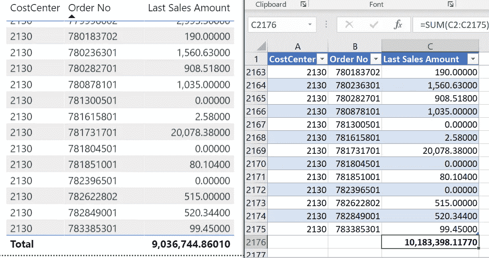

# 关于使用 Power BI 和 DAX 过滤上下文的一个很难的教训

> 原文：<https://towardsdatascience.com/a-hard-lesson-on-filter-context-with-power-bi-and-dax-c0ce5f657af4?source=collection_archive---------17----------------------->

## 一个客户对他的报告有意见。我被要求找到问题并解决它。这是关于它的故事

*上周，一位客户要求我分析 Power BI 报告中显示的总数与导出到 Excel 后的数值总和之间的差异。这项任务被证明是非常具有挑战性的，最终，差异是由于 Power BI 和 DAX 如何工作以及它如何计算数字。简而言之:过滤器上下文是如何工作的。*


照片由[米卡·鲍梅斯特](https://unsplash.com/@mbaumi?utm_source=medium&utm_medium=referral)在 [Unsplash](https://unsplash.com?utm_source=medium&utm_medium=referral) 上拍摄

# **场景**

客户是一家销售建筑材料的公司。它有一个订单积压。每天都会计算订单积压中的销售额，并将其加载到数据仓库数据库中。

这个量是所谓的半累加性度量。半累加性意味着不可能累计一段时间的总量，如仓库中的库存或银行账户的状况。

用户选择一个月，报表显示订单编号列表和每个订单对应的销售额。

总计显示所选月份所有订单的销售额。

由于销售订单积压的快照每天都被加载到数据仓库数据库中，因此对于销售额，只需考虑所选月份的最后一天。

# **问题**

用户得到一个订单编号列表，其中包含相应的成本中心和销售额。

其中一个用户希望对数据进行更深入的分析，将 Power BI 报告中的数据导出到 Excel。

当他将所有订单的总和与 Power BI 报告上显示的总和进行比较时，他注意到了一个巨大的差异。



Power BI 与 Excel 的比较

这个结果是我开始调查的出发点。

# **DAX 衡量标准**

客户使用了以下 DAX 衡量标准:

```
Last Sales Amount = 
 CALCULATE (
 SUM ( ‘SalesOrderBacklog’[SalesAmount] ),
 FILTER (
 ‘SalesOrderBacklog’,
 ‘SalesOrderBacklog’[Snapshot_Date]
 = MAX ( ‘SalesOrderBacklog’[Snapshot_Date] )
 )
 )
```

乍一看，这个措施看起来还可以。

它只考虑表中最高的日期，计算 SalesAmount 列的总和。

但是当你更深入地研究这个公式时，你开始注意到这个机制与你预期的略有不同:

1.  您需要一次查看报告中的每一行
2.  然后，您将看到该度量对订单号和成本中心的每个组合执行一次迭代，并对每个组合执行计算
3.  您需要将选定的月份作为过滤器

当您结合这些步骤时，您会开始理解该度量正在执行以下操作:

1.  它得到第一行。假设成本中心 2130 和订单号 781731701 的组合
2.  该度量将获取该组合在所选月份
    中的最新日期的行。这些行不必是所选月份中的最后一个日期
3.  选择这些行后，它将计算 SalesAmoun 列的总和，并返回值。在这种情况下，20'078.38

现在，我们需要看看这个度量是如何计算总数的。

该度量不知道在表的“总计”行中考虑了哪个订单号或成本中心。

这意味着该度量将获取所选月份中日期最晚的行。选择之后，它将计算所有这些行的 SalesAmount 列的总和，并返回值，在本例中为:
9'036'744.8601，表示所选月份的最后一天！

计算结果基于与上述行中考虑的行不同的完整行选择。

这个过程就是所有行的总和导致总数为 10'183'398.1177 的原因。

# **不同的措施**

在 DAX，我可以用另一种方法来计算股票价值。我可以使用 LASTNONBLANK()或 LASTNONBLANKVALUE()函数来代替自定义公式。

当使用这些函数之一时，测量看起来完全不同:

```
Last Sales Amount = 
 VAR LastDateWithData = LASTNONBLANK(‘Date ‘[Date]
 ,SUM ( ‘SalesOrderBacklog’[SalesAmount] )
 )
 RETURN
 CALCULATE(
 SUM ( ‘SalesOrderBacklog’[SalesAmount] )
 ,LastDateWithData
 )
```

在这里，我采用了两步走的方法:

1.  我使用 LASTNONBLANK()函数获取最新日期，该日期在 SalesAmount 列中有值。
    这一步考虑所选的月份
2.  然后，对具有此日期的所有行计算 SalesAmount 列的总和

现在，我使用一个添加到模型中的日期表。但是使用' SalesOrderBacklog '[Snapshot _ Date]不会有任何不同。

使用这种方法，DAX 只计算这些行的结果，其中包含所选月份最后一天的数据。

当我现在导出数据时，当我导出数据并计算所有行的总和时，我得到了正确的结果。

# **不同的要求**

现在，我们需要了解用户的确切需求。

我们可以提出以下两个问题:

1.  您是否需要获取所选月份
    最后一个月的订单列表，或者
2.  您是否需要在所选月份打开的所有订单的列表，而不管这些订单在月末是否仍在积压列表中？

如果用户对第一个问题回答是，那么使用 LASTNONBLANK()函数的度量就是正确的。

如果用户对第二个问题回答“是”,那么我们需要更改度量来计算正确的总和，并增加一部分来满足这一要求。

一种方法是预先计算变量中的所有行，并检查当前过滤器上下文是否是总计行:

```
Sales (Order Backlog) Extd = 
 VAR SelectedMonth = SELECTEDVALUE(‘Date’[YearMonthShort])

 VAR ListOfValues =
 CALCULATETABLE(
 SUMMARIZE(
 ‘SalesOrderBacklog’
 ,’SalesOrderBacklog’[Order No]
 ,’SalesOrderBacklog’[Costcenter]
 ,”SalesOrderBacklog”, [Last Sales Amount Custom]
 )
 ,FILTER(
 ‘Date’
 ,’Date’[YearMonthShort] = [Selected Month]
 )
 )

 RETURN
 IF(OR(HASONEFILTER(‘SalesOrderBacklog’[Order No])
 ,HASONEFILTER(‘SalesOrderBacklog’[CostCenter])
 )
 ,[Last Sales Amount]
 ,SUMX(
 ListOfValues
 ,SUM ( [SalesOrderBacklog] )
 )

 )
```

这种方法的工作方式如下:

1.  使用 SELECTEDVALUE()函数检索选定的月份，并将其存储在 selected Month 变量中
2.  变量 ListOfValues 得到一个包含订单编号和成本中心所有组合的表，以及每个组合的销售额总和
    a。该表受所选月份的限制(FILTER()函数)
3.  IF 函数检查当前过滤器上下文是否包含订单编号或成本中心的值。
    a .如果是，则调用基本度量返回实际行
    的销售额 b .如果否，则计算表变量 ListOfValues 中所有行的总和。

Power BI 计算出正确的逐行结果和正确的总计行。但是它有两个主要缺点:

1.  性能:非常慢。我等了几分钟，等待超过 200 万行的结果
2.  不可伸缩:您只能对这个特定的表使用这个度量，因为它只要求 order-number 和 cost-centre 两列。

我的客户决定使用通用的测量方法，而不是上面描述的最后一种方法。

因为他的决定，我没有花任何时间试图优化这个变种。

# **要吸取的教训**

我必须吸取的最大教训是，在对 DAX 测量结果进行故障诊断时，不要忽略关键细节。


照片由 [jaikishan patel](https://unsplash.com/@magictype?utm_source=medium&utm_medium=referral) 在 [Unsplash](https://unsplash.com?utm_source=medium&utm_medium=referral) 上拍摄

使用 DAX 时，过滤器上下文是最重要的因素。

用户的问题误导了我，我花了很多时间回到基础去理解是怎么回事。

我希望你觉得这篇文章有趣并且有价值。如果你对这个话题有任何疑问，请发表评论。