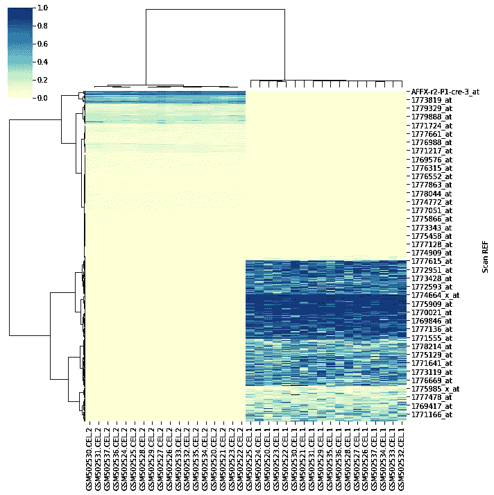

# 一颗隐藏的宝石:df.select_dtypes()

> 原文：<https://towardsdatascience.com/a-hidden-gem-df-select-dtypes-a660db0e8609?source=collection_archive---------21----------------------->

## 一个关于 2014 年熊猫功能的微帖子一直在我的雷达下飞行。

有多少次你把一个熊猫[数据帧](https://pandas.pydata.org/docs/reference/frame.html)输入到另一个库的一个实用函数中，却因为有对象列而失败。也许这是来自 seaborn 的图表？(我们在看你 [sns.clustermaps()](https://seaborn.pydata.org/generated/seaborn.clustermap.html) )。

```
>>> sns.clustermap(
        df, 
        method='ward', 
        cmap="YlGnBu", 
        standard_scale=1
    )TypeError: unsupported operand type(s) for -: 'str' and 'str'
```

因此，我构建了一个列的所有数据类型的列表，过滤掉那些非数字列，并将结果数据帧传递给只需要数字列的函数。

```
>>> numeric_cols = [
        col 
        for col, dtype 
        in df.dtypes.items() 
        if dtype=='float64'
    ]>>> print(numeric_cols)
['col1', 'col2']>>> sns.clustermap(
        df[numeric_cols], 
        method='ward', 
        cmap="YlGnBu", 
        standard_scale=1
    )
```



来自 [E-GEOD-20108](https://www.ebi.ac.uk/arrayexpress/experiments/E-GEOD-20108/) 的数据—单倍体和二倍体菌株对乙醇的反应|图片由作者提供

当我昨天在研究一些与酵母中基因表达相关的数据时，我开始思考。一定有更好的方法。按数据类型过滤数据帧的列的概念应该很常见，足以成为一行程序！事实证明确实如此，尽管我认为我已经爬了足够多的次数去查阅文档，以至于可以跨越熊猫 API，但事实证明总是有新的隐藏的宝石！

Pandas DataFrames 有一个名为`select_dtypes()`的内置方法，这正是我想要的。并且重写上面的代码来使用这个新的(对我来说)函数看起来像下面这样(注意 select_dtypes()取一个列表，可以过滤多种数据类型！):

```
>>> sns.clustermap(
        df.select_dtypes(['number']), 
        method='ward', 
        cmap="YlGnBu", 
        standard_scale=1
    )
```

我相信你们中的大多数人都已经经历过这个了，因为(我在熊猫 git repo 上做了一个 git 责备，看看它是什么时候添加的:2014 年[🤦](https://emojipedia.org/person-facepalming/#:~:text=Emoji%20Meaning,to%20the%20Picard%20Facepalm%20meme.))。无论如何，我希望也许有人会像我一样发现这很有帮助。编码快乐！

    <https://seaborn.pydata.org/generated/seaborn.clustermap.html> 