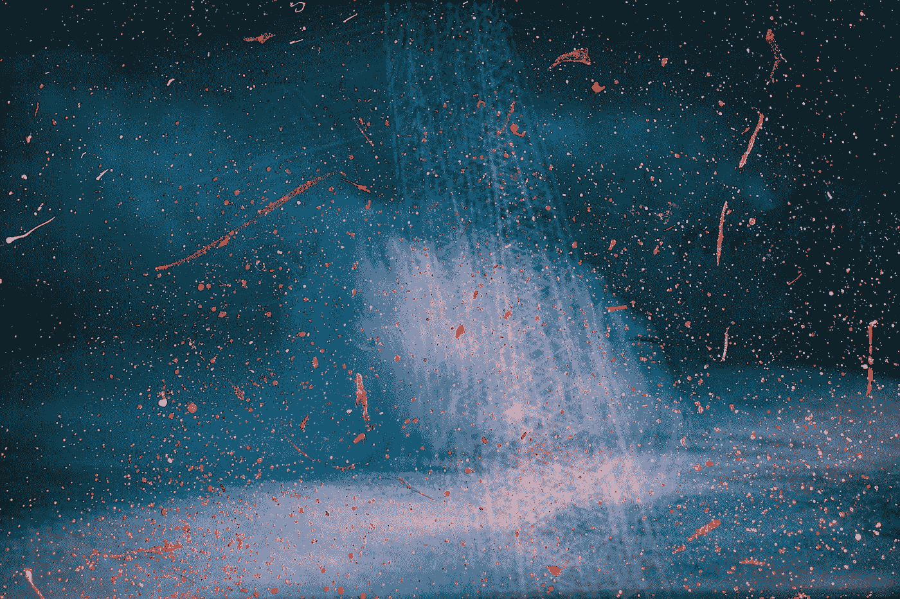
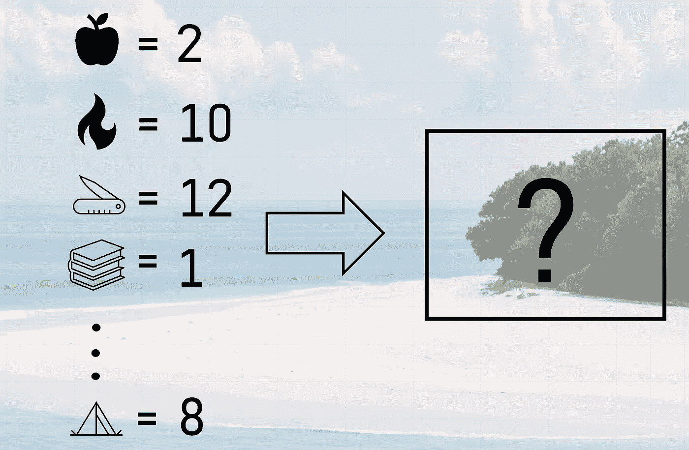
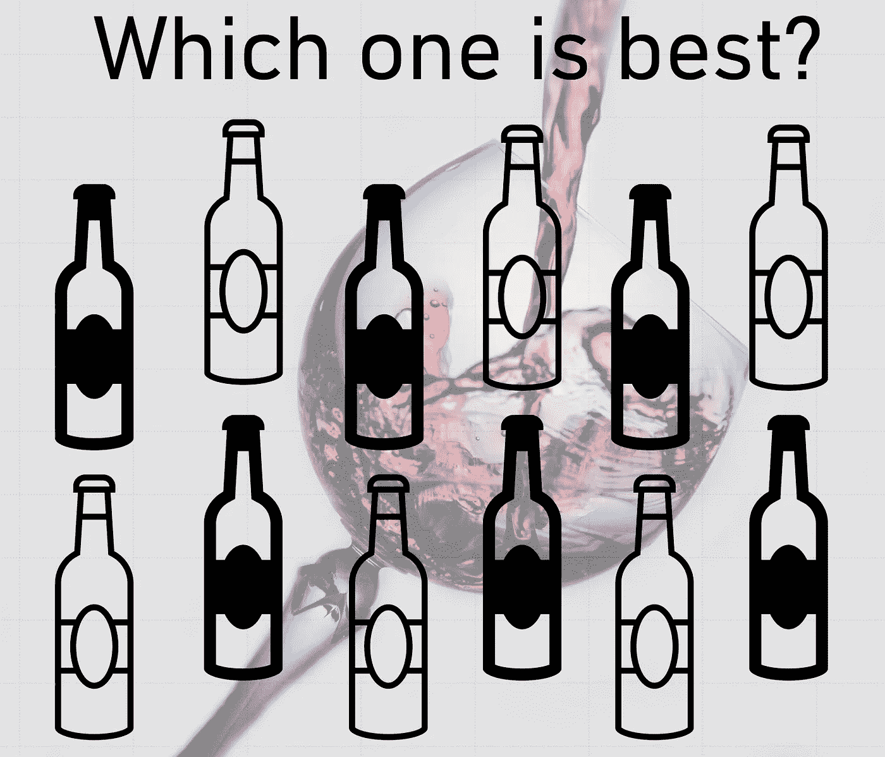

# 进化计算:一颗隐藏的竞争情报宝石

> 原文：<https://towardsdatascience.com/a-hidden-gem-of-ci-evolutionary-computation-ef8d5e815344?source=collection_archive---------33----------------------->

## 三种复杂的，受生物启发的算法

给 AI 下定义会导致很多争论，所以让我们来谈谈一些具体的东西:计算智能。计算智能由三个分支组成——神经网络、进化计算和模糊系统。在这篇文章中，我将深入进化计算的三个领域——遗传算法、粒子群优化和蚁群优化。

[Jr Korpa](https://unsplash.com/@jrkorpa?utm_source=medium&utm_medium=referral) 在 [Unsplash](https://unsplash.com?utm_source=medium&utm_medium=referral) 上的照片

# 动机

进化计算(EC)是受生物系统启发的竞争智能的一个分支。 [在我的上一篇文章](/tired-of-ai-lets-talk-about-ci-eb54f7a2d393)中，我强调了 CI 的各个分支，但是在这里，我们只关注 EC。在 IEEE CIS 中，EC 社区有很强的影响力。他们的[期刊](https://cis.ieee.org/publications/t-evolutionary-computation)影响因子 11.554，还不算寒酸。虽然这组算法共享灵感，但在 EC 中有不同的类别。我对做出一个绝对的陈述感到紧张(因为我确定会有反证)，但这些算法通常旨在优化一个函数——为给定的情况找到最佳的参数集。不太复杂的算法可以尝试每个参数组合(强力搜索)，但这在计算上是不可能的。然而，EC 算法抓住了机会，更雄辩地提供了一个解决方案。在 EC 分支中有多个类别，但在这篇文章的剩余部分，我将深入到我最喜欢的几个类别— **遗传算法、粒子群优化和蚁群优化**。

# **遗传算法**

[国立癌症研究所](https://unsplash.com/@nci?utm_source=medium&utm_medium=referral)在 [Unsplash](https://unsplash.com?utm_source=medium&utm_medium=referral) 上拍摄的照片

遗传算法可以说是进化计算中最流行的算法类型。气体在模拟自然选择过程中找到了灵感。我不太记得高中生物，但我记得自然选择的三个关键要素是突变、交叉和选择。经过许多代，最适合的生物生存下来，它们的遗传物质繁殖到下一代。但是，这个概念如何在计算智能中发挥作用呢？

**理论**

记住，GAs 寻求为给定的问题找到最佳的参数集。为了做到这一点，GAs 采取了分代方法。从第一代开始，GAs 评估每个“染色体”的适合度，在“群体”中找到最适合的。基于“选择”方法，选择“亲代”染色体。他们的遗传物质传递给下一组染色体或下一代。当我们达到收敛(我们的解决方案足够好)时，该过程结束。要查看完整的示例，请参见[这篇文章](/introduction-to-genetic-algorithms-including-example-code-e396e98d8bf3)。

**应用**

由于适应度函数的灵活性，遗传算法可以求解多种类型的优化函数。一个例子可能是组合问题。你玩过“荒岛”这个游戏吗？你会带哪五样东西去荒岛？现在，这个问题对人类来说很容易解决，但对算法来说很难。但是，遗传算法有效地解决了这个问题。为了构造一个适应度函数，我们向 GA 提供了一个可能的项目列表以及它们的价值。遗传算法搜索不同的组合，直到它最大化的价值的五个元素，你可以采取。

去荒岛应该带哪些物品？还是让阿嘎自己想办法吧！背景照片由[阿比扬·阿西夫](https://unsplash.com/@abyanathif)拍摄

你可能会问，为什么不用蛮力呢？嗯，如果我们有一千个项目，就有超过一万亿种组合。意思是，这需要一段时间的蛮力，我们明天就要去岛上了；).当然，GA 必须进行调整，但是它可以搜索列表中的元素并返回最合适的集合。

# 粒子群优化

照片由[里斯·肯特什](https://unsplash.com/@rhyskentish?utm_source=medium&utm_medium=referral)在 [Unsplash](https://unsplash.com?utm_source=medium&utm_medium=referral) 上拍摄

动物群体的行为影响粒子群优化算法。想想鸟群的行为；它们会栖息在同一个地方。在飞行过程中，它们会以不可思议的方式移动(我在谷歌上搜索过这个，它被称为 murmuration)。他们是如何如此完美地一起行动的？粒子群算法试图用数学方法来表示这种现象。

**理论**

每个粒子(或者我们例子中的鸟)代表被优化的参数。像气体一样，初始化发生，优化函数评估每个粒子。PSO 的独特性来自于它对每个粒子的表示。它的位置和速度代表每个粒子。每次迭代后，每个粒子都根据其位置(最佳解)和速度进行更新。通常，每个粒子由它的邻域中的最佳解(接近它的粒子)和最佳全局解(迭代中的粒子)更新。例如实现，查看[这个 pos](https://medium.com/analytics-vidhya/implementing-particle-swarm-optimization-pso-algorithm-in-python-9efc2eb179a6) t。

**应用**

事实证明，提出一个真实世界的解决方案对 PSO 来说是一个挑战——如果你有的话，我很乐意听一些例子。所以，我要回到我上一篇文章的例子——寻找最好的葡萄酒。在这个例子中，每个粒子都有一个酸度、甜度和酒精含量的值。目标是找到这三个特征的完美结合，找到最好的葡萄酒。假设我们有一个覆盖大部分 3D 空间的数据集(酸度对甜度对酒精含量)。

在这个例子中，每个酒瓶都是一个“粒子”，粒子群优化算法将找到酸度、甜度和酒精含量的完美组合。背景图片由[泰瑞·维里斯迪斯](https://unsplash.com/@vlisidis)拍摄

我们的算法生成许多粒子，优化函数根据我们对葡萄酒的配置的喜欢程度来评估每个粒子。每一次迭代都会产生稍微好一点的葡萄酒，因为粒子会发现我们喜欢葡萄酒的哪些品质。

# 蚁群优化

斯坦尼斯拉夫·罗日科夫在 [Unsplash](https://unsplash.com?utm_source=medium&utm_medium=referral) 上的照片

你看过蚂蚁吗？你注意到它们是如何形成线条的吗？这不是一个随机的过程，而是它们的生物学驱动的。当蚂蚁在探索时，它们会在找到必要的资源时释放信息素。信息素吸引其他蚂蚁沿着同一方向前进——留下更多的信息素。这一过程通过提供到达资源的最短路径来提高群体的效率。你能猜出这有助于解决什么类型的问题吗？我最喜欢的是优化图中的路径(寻找最佳路径)。

**理论**

存在多种 ACO 策略，但是我将强调 ACO 使用的主要步骤。记住，边和节点组成了图形。简而言之，边是节点之间的连接。ACO 处理加权图，这意味着每条边都有相关的成本。为了启动 ACO 算法，生成一组初始的“蚂蚁”。每只蚂蚁沿着不同的路径在图中行进——寻找最短的路径。蚂蚁遍历之后，每条边的信息素都会进行数学更新，突出显示哪些方式是好的，哪些是不好的。经过多次迭代后，我们希望找到图的最短路径。

**应用**

ACO 的一个明显的应用是寻找旅行的最佳路径。如果我想环游世界，我可以模拟我想去的城市之间的距离。ACO 可以找到最好的旅行计划，这样我就不会在飞机上浪费太多时间。

ACO 优化我们的路线，以确保我们采取最佳路径。背景照片由[托马斯·金托](https://unsplash.com/@thomaskinto)拍摄

使用蚁群算法，一群蚂蚁可以穿越许多不同的旅行路线。最终，他们会找到最大化我的偏好的路径。也许我们想远离高速公路？也许我想要最快的方法。然而，我们决定优化行程；蚂蚁将通过多次迭代找到最佳路径。

# 结论

使用生物系统作为动机证明创造了复杂问题的雄辩的解决方案。CI 的许多贡献来自进化计算的分支。他们找到最佳参数集的能力继续给人留下深刻印象。在这篇文章中，我从较高的层面谈到了这些算法能做什么，但请注意，它们可能会变得非常复杂。甚至这篇论文的标题(与我以前的导师合著)*学习模糊测度的约束保持遗传算法及其在本体匹配中的应用*【1】也强调了这些算法可以变得多么复杂。在 EC 中存在更多的算法，我希望有一天能写下它们。我希望你以这些为灵感来解决你的问题，甚至基于一个完全不同的生物系统创建一个新的算法。

# 参考

[1][http://derekt Anderson . com/pdf/Constraints % 20 保留% 20Genetic %算法% 20 for % 20 learning % 20 fuzzy % 20 measures % 20 with % 20 an % 20 应用程序% 20to %本体%20Match.pdf](http://derektanderson.com/pdfs/Constraints%20Preserving%20Genetic%20Algorithm%20for%20Learning%20Fuzzy%20Measures%20with%20an%20Application%20to%20Ontology%20Match.pdf)