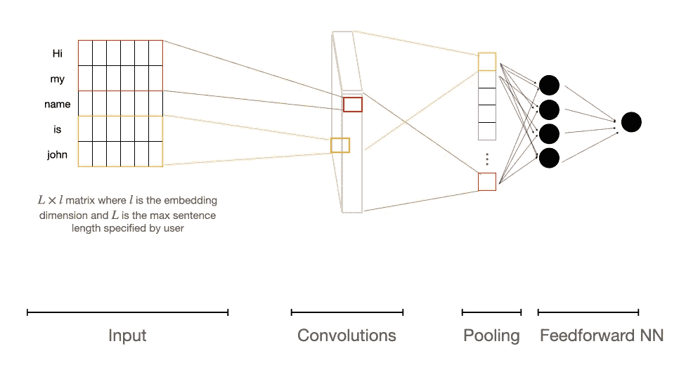

# 流行神经网络体系结构的高级解释

> 原文：<https://towardsdatascience.com/a-high-level-explanation-of-popular-neural-network-architectures-49dce63f02e8?source=collection_archive---------34----------------------->

## 从人工神经网络到变形金刚，包括 NLP 的例子

图片来自 unsplash 的 Solen Feyissa([来源](https://unsplash.com/photos/AAMldegB0x8))

神经网络无处不在，因为它们能够很好地捕捉数据中的非线性关系。本文旨在简明扼要地解释流行的神经网络结构。目的是为它们如何工作提供一种直觉，但更重要的是，为什么它们的结构可能对不同的问题有用。每个部分都有到资源的链接，用于深入解释这些主题。

## 内容

1.  [人工神经网络](#3eb9)
2.  [卷积神经网络](#b0e2)
3.  [递归神经网络(RNN)](#aad0)
4.  [变压器网络和注意机制](#59ad)
5.  [结束语](#c49f)

## 人工神经网络

神经网络是一个函数，它获取输入张量 **X** (具有 **i** 行和 **j** 列)并将其映射到输出 **y_hat** 以尝试估计真实值 **y** 。该函数具有影响映射的未知参数 **θ** 。最佳 **θ** 是使 **y** 和 **y_hat** 之间的误差最小的那些。

网络本身由输入层、隐藏层和输出层组成；下面的图 1 显示了一个带有一个隐藏层的简单网络。

图 1:具有单一隐藏层和单一向量输入的神经网络

每一层的输出作为下一层的输入。层 **(L)** 具有 **i** 个节点，其值由向量 **a_i^(L)** 表示。这是由非线性激活函数 **ϕ^(L)** 变换的前一层 **a_j^(L-1)** 的输出节点的函数，如下式所定义:

**W_ij** 是一个乘法因子(称为权重矩阵)，它线性组合前一层的输出节点。

在图 1 所示的简单网络中，预测输出由下式给出:

其中:

在这种情况下，需要估计的模型的未知参数都是权重矩阵 **W_ij^(1)** 和 **W_1j^(2)** 。这些通过最小化输出和真实值之间的误差来确定，**J =误差(y_hat，y)** 。其梯度 **J_i = Nabla(J)** 相对于每个分量 **θ** 被用于将的值微移至更接近最优值。然后使用 **θ** 的新值，即 **θ* = θ-ηJ_i** (其中 **η** 是步长)来计算新的 **y_hat** ，并且重复该过程多次迭代。这个过程被称为反向传播，也就是通常所说的*学习*。

伊恩·古德菲勒的书是深入研究神经网络的数学方面的一个很好的资源。另一方面，3Blue1Brown 的[视频](https://www.youtube.com/watch?v=aircAruvnKk&list=PLZHQObOWTQDNU6R1_67000Dx_ZCJB-3pi)为这些网络如何工作提供了一个很好的视觉效果。

## 卷积神经网络(CNN)

虽然前馈神经网络非常有用，但它们很难从高维数据中提取空间特征。卷积神经网络(CNN)正是为了做到这一点而设计的。对于一个直观的例子，考虑手写字母的图像分类。每个字母都是由像素表示的图片，如下图 2 所示。然而，由于这些字母是手写的，所以同样的字母会被扭曲、移位、缩小或旋转。

图 2:两个手写 X 像素

作为人类，我们可以识别每幅图像中的空间特征，并认识到它们都代表字母 x。然而，正常的前馈网络会将每个像素视为独立的数据点，因此会将图 2 中的两个字母视为完全不同。CNN 通过提取空间特征纠正了这一点。图 3 显示了图 2 中代表字母 x 的两幅图像的特征。

图 3:定义字母 X 的空间特征

这些特征是通过滑动窗口提取的，称为**内核**，用随机权重初始化。在图像的每个窗口，像素值与核的权重进行卷积(即，例如，取点积)。然后应用称为**池**的过程，其中在每个窗口中，取最大值(有效地提取最重要的特征)。在卷积层之后，添加标准前馈层以实现分类。整个过程的图像如下图 4 所示。

图 4:显示应用于图像的 CNN 分类器的工作原理的图表

这个图像示例也可以扩展到其他领域，例如在自然语言处理(NLP)中，您可以用单词及其嵌入维度代替像素，如图 5 所示。

图 5:应用于文本的 CNN 分类器

在这种情况下，内核是单向的，它从每个单词的上下文窗口中提取特征。这种思想可以扩展到更大的文本片段，例如，表示变成三维的句子。处理文本数据时的一个关键区别是句子的长度可能不同，因此通常会指定最大句子长度。

亚历山大·阿米尼的[视频](https://www.youtube.com/watch?v=AjtX1N_VT9E)在高层次上很好地解释了 CNN。对于那些对数学方面感兴趣的人，再次推荐 Ian Goodfellow 的书。

## 递归神经网络(RNN)

与图像或其他数据不同，文本包含空间和*序列*数据。因此，前馈神经网络和 CNN 都没有提供一种自然的*方式来读取文本数据。递归神经网络(RNNs)是一种具有反馈回路的结构，能够顺序读取数据。*

图 6:具有反馈回路的 RNN 结构(左)和展开的 RNN(右)

因此，每个时间步的输出状态**h _ t**作为该时间步的输入**x _ t**和前一个单元的输出状态的函数给出。因此:

此外，文本数据具有需要考虑的长期依赖性。例如，考虑预测下列句子中的下一个单词的任务:

> 我在法国长大，但我现在住在波士顿。我说得很流利…

在这种情况下，RNN 将不得不使用触发单词 France 来预测下一个单词 French。然而，由于单词彼此远离，在训练期间，法国的影响消失了。因此，需要某些储存记忆的激活功能，称为门控细胞。一种常见的门控细胞被称为长短期记忆(LSTM)。示意图如图 7 所示。

图 7:显示门控细胞的 LSTM 网络示意图

需要注意的重要一点是，LSTM 单元有四个作用:**忘记**先前状态的不相关信息，**存储**新信息，**更新**单元值(单独)，控制**输出**信息。这调节了流经细胞的信息，从而更好地捕捉长期依赖性。

文本处理中的另一个考虑是信息是双向流动的。例如，现在考虑我们例句的未来上下文:

> 我在法国长大，但我现在住在波士顿。我说得很流利…因为我在法兰克福住了 5 年。

单向 RNN 将仅捕获过去的信息，因此可能预测法语。然而，当考虑到未来的背景时，德语会更合适。因此，还开发了双向 RNN 模型，例如 bi-lstm，并且显示出比单向模型执行得更好。

值得一提的是，尽管 rnn 提供了更自然的文本阅读，但它们通常真的很难训练，因此仅依赖于空间特征的 CNN 通常在许多任务上表现更好。

艾娃·索莱马尼用直观的方式解释了 RNNs，特别是 LSTMs。关于 LSTMs 的详细指南，读者可以参考 Olah 的[博客](https://colah.github.io/posts/2015-08-Understanding-LSTMs/)。

## 变压器网络和注意机制

RNN 模型的一个关键限制是信息会在很长的序列中丢失。虽然 LSTM 能够捕获一些内存，但是结构本身是顺序的，因此输出不是每个序列元素的直接函数。注意机制通过确保序列中的每个项目直接影响输出来解决这个问题。下面的图 8 给出了这方面的高级示意图。

图 8:使用 RNN(左)和基于注意力的网络(右)的机器翻译示例

这具有模仿人类注意力的经验效果，其中机器*关注*序列中信息最丰富的部分，如图 9 所示。

图 9:网络关注每个单词(红色)的信息的可视化

变形金刚网络是依赖注意机制的模型，没有递归。它们的结构支持独立计算，使 GPU 并行化变得容易。变压器是自然语言处理任务的 SOTA 模型。感兴趣的读者可以参考 Peter Bloem 的[博客](http://peterbloem.nl/blog/transformers)和 Jay Alammar 的[博客](https://jalammar.github.io/illustrated-transformer/)。

## 结束语

随着 GPU 的改进，神经网络结构在数据科学中将变得越来越重要。跟上关于它们的文献几乎是不可能的，但在进一步研究之前，作为起点，了解它们在高水平上是如何工作的总是有用的。

我将更新这篇文章，提供更多关于其他结构的信息(如图形神经网络、层次神经网络等…)，敬请关注！

*所有图片均由作者提供，除非另有说明。*