# 使用朴素贝叶斯分类器的情感分析指南

> 原文：<https://towardsdatascience.com/a-hitchhikers-guide-to-sentiment-analysis-using-naive-bayes-classifier-b921c0fb694?source=collection_archive---------19----------------------->

## 自然语言处理中最优美的定理之一的教程。

图片来自 [Unsplash](https://unsplash.com/photos/g5gia1p67hE)

**分类**是机器学习和人类智能的核心。识别声音、面孔或者我们每天看到的图像都属于分类的范畴。现在来看朴素贝叶斯，对于任何开始从事自然语言处理领域的人来说，这是朝着这个目标迈出的第一步；这就是为什么我们了解如何实现这一点以及发动机罩下发生了什么是至关重要的。在这篇文章中，我们将学习如何从头开始实现朴素贝叶斯，并将其用于情感分析。

**指数:**

1.  **情感分析**
2.  **术语**
3.  **朴素贝叶斯定理**
4.  **推导**
5.  **训练模型**
6.  **已解决的示例**
7.  **结论**

## **情绪分析**

现在，情感分析，顾名思义，基本上是我们对陈述的情感进行分类的任务，或者更简单地说，是一个特定陈述试图传达的情感；无论它是正面的还是负面的，悲伤的还是讽刺的；侮辱性的或者有益健康的或者善良的。让我们再举几个例子来详细说明这一点；

假设镇上有一家新餐馆，你和你的朋友决定在那里吃晚餐，并体验这个地方。你真的玩得很开心，当你的朋友问你的意见时，你会说一些类似的话:

图片来自 [Unsplash](https://unsplash.com/photos/Gg5-K-mJwuQ)

*1。“这个地方太棒了。食物很美味，气氛也很愉快*

现在你的朋友有相反的信仰。这个新地方不适合他。所以当你反过来询问他的意见时，他会说:

2.这个地方真可怜。食物很难吃，环境让我无法忍受，让我很不舒服

我想我们都同意，陈述 1 表达了一种积极的情绪，而陈述 2 代表了一种消极的情绪或情感。同样重要的是，我们要注意的是，到底是什么给了我们线索，让我们能够将句子分为肯定和否定。

答案？线索…

如果你仔细观察…在句子中有一些特定的词支配着情感。正面词汇如 ***棒极了，好吃，过瘾*** 等。使句子积极，而像 ***可怜的、可怕的、不舒服的*** 等词语。把这个句子变成否定句。事实上，如果我们在一个句子中替换这些特殊的提示，它会完全改变它的意思。让我展示给你看:

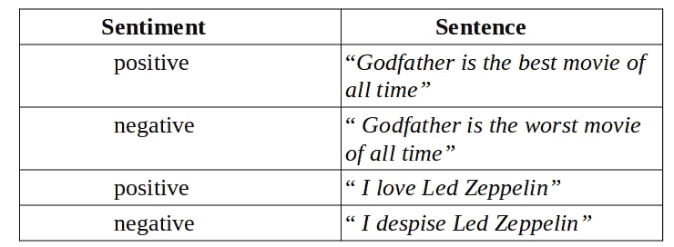

作者图片

在每一个例子中，如果你注意到，通过改变一个关键的单词改变了整个句子的味道，而句子的其余部分保持不变。这就是情感分析的本质。此外，我们将把我们的讨论限制在**二元分类**上，将句子分类为肯定或否定。

## **术语**

在深入研究数学之前，我们先来谈谈术语。我们在这里要做的属于**监督机器学习**；这意味着我们将被提供训练输入，并且这些输入中的每一个都将与其正确的输出相关联。现在你的模型的工作是理解这些数据，观察和分析给定的输入和输出之间的关系，并最终以合理的准确度预测输出；给定新的输入。

走得更远；我们通常用 x 表示输入，用 y 表示输出，其中 y ∈[y，yb，yc，…..yn]类，你的模型的任务是预测一个特定的输入 x 属于哪个输出类。现在，在这种情况下，我们将处理单词和句子，所以在术语上有一点变化。对于由多个特征组成的文档(基本上是句子)，我们的输入将是' ***d*** '，对于类，我们的输出将是' ***c*** '在这里，类将代表积极(积极情绪)或消极(消极情绪)。

所以最后我们会得到一个输入 d，我们的模型必须学会预测它属于哪个类，c。

既然我们已经完成了本质和细节，让我们从定理开始。

## **朴素贝叶斯定理**

我们先来看看**贝叶斯定理:**

P(A | B) = P(B | A) * P(A) / P(B) ->(1)

让我们来看看这些术语:

*   P(A | B) =假设事件 B 发生，事件 A 发生的概率
*   P(B | A) =假设事件 A 发生，事件 B 发生的概率
*   P(A) =事件 A 发生的概率
*   P(B) =事件 B 发生的概率

因此，贝叶斯定理给了我们一种寻找条件概率的方法。贝叶斯定理是朴素贝叶斯定理的核心。

现在我们能够描述多项式朴素贝叶斯定理了。顾名思义，这个定理使用了一个贝叶斯分类器，并对特征之间的相互作用进行了简化。

我们在朴素贝叶斯中考虑的最重要的假设之一叫做**词袋。**这意味着算法真正关心的是单词及其频率，即该单词在我们的数据中出现了多少次。这个词在我们的句子(文档)中的位置一点也不重要。我们只需要记录特定单词在文档中出现的次数。就是这样。

我举个例子解释一下:

”*茶让我快乐。红茶、绿茶、奶茶，不管是哪一种；只要是茶我就满足了。我是喝茶长大的，每喝一口都会让我想起过去的美好时光”*

我们来进一步分析一下:

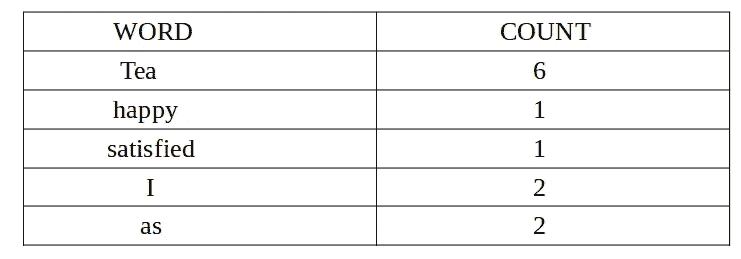

作者图片

这基本上就是单词袋的概念。哪里有*茶、我、快乐、满足*等字眼无关紧要。被用在句子中，重要的是它的频率。

图片来自 [Unsplash](https://unsplash.com/photos/GkinCd2enIY)

## **推导**

现在让我们试着用数学公式来表达。

如果您还记得，我们的主要目标是找到给定特定句子(文档)的类别(积极或消极情绪)。所以我们可以这样解决这个问题:

1.假设我们有一组可能的类 c。

2.我们发现一个文档在一个特定类中的概率。

本质上是给定一个文档的一个类的条件概率。

3.我们迭代所有的类，找到哪个类的条件概率最大；给我们答案。

将所有步骤结合在一起，我们得到:

作者图片

这里，术语ĉ表示具有最大概率的类。

我们已经了解了贝叶斯定理。所以现在我们可以把条件概率的公式代入等式(2)

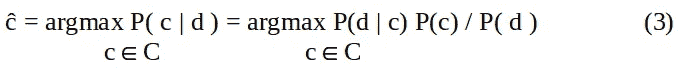

作者图片

我们可以进一步简化这个等式。在对类进行迭代时，我们的文档当然不会改变，只有类会改变；所以我们可以安全地从分母中去掉 P(d ),而不会引起任何大问题。因此，我们修改后的方程变成:

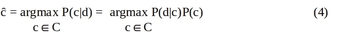

作者图片

术语 P(d|c)称为**似然概率**

第二项 P(c)称为**先验概率**

我们可以通过将每个文档分成一组特性来进一步简化它 *f1，f2，f3，…..fn。*

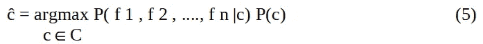

作者图片

在我们推导的这一点上，我们将做一个非常重要的假设。我们将假设给定的每个特征 f 的概率是相互独立的。这是非常关键的一步，它大大降低了我们问题的时间复杂度。让我们多理解一点。

如果两个事件 X 和 Y 彼此独立，则事件一起发生的概率(P(X 和 Y))变为:

P( X ∩ Y) = P(X) * P(Y)

这意味着:

P( f 1 | c ∩ f 2 | c) = P(f 1 | c) * P(f 2 | c)

我们可以进一步简化方程(5 )!此外，假设事件彼此独立，我们不必考虑每个特征如何与另一个特征相关，或者一个特征在给定另一个特征的情况下发生的概率。这为我们节省了大量的计算能力。

因此，我们的最终等式变成:

P( f 1，f 2，…，f n | c)= P(f 1 | c)P(f 2 | c)…P(f n | c)->(6)

或者

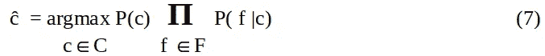

作者图片

当然，一个句子中的特征是它的单词……因此，如果我们将等式中的特征替换为第 I 个位置的单词的 *wi* ,我们可以如下重新构建等式:

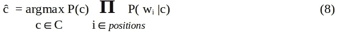

作者图片

唷！！！！我们终于完成了推导。现在，让我们转到如何在实际问题中应用这个概念。

## **训练模特**

1.**计算先验概率**。我们将首先找到属于每个类的文档的数量。找到每一类中文档的百分比将会给我们所需的先验概率。

让我们假设类 *c* 中的文档数量是 *Nc。*

假设文档总数为*n。*

所以，P(c)=*Nc/n total->*(9)

2.**计算** **似然概率**。这是有点棘手的地方。我们的主要目标是找到单词 wi 在所有 c 类文档的所有单词中出现的次数。我们首先将所有 c 类文档连接成一个大的“c 类”文本。然后我们使用 wi 在这个连接文档中的频率来给出似然概率。

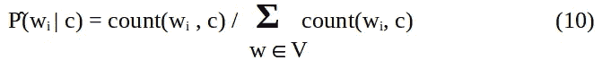

作者图片

这里 V 代表词汇表，它是所有文档中所有单词的集合，不考虑类别

然而，此时我们将面临一个非常独特的问题。假设我们输入的文档是，

我喜欢那部电影

单词“loved”只出现在积极的类别中，而没有“loved”的例子出现在消极的类别输入中。现在，根据等式(8)，我们必须通过乘以每个类别的似然概率来找到概率。如果我们计算出单词“loved”对于类别“negative”的可能性概率，我们得到:

p("爱过" | "负")= 0

现在，如果我们把这个值代入方程(8)，我们的类“负”的整个概率变为零；不管其他值是什么？

为了解决这个问题，我们将在分子和分母中引入一个附加项，**拉普拉斯平滑系数**。我们的等式将被修改如下:

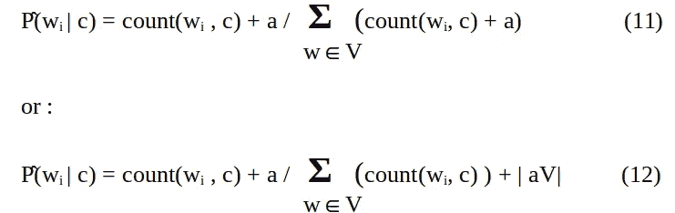

作者图片

这里 a 是拉普拉斯平滑系数。我们通常认为它的值是 1。

3.**在 eqt(8)中插入先验和似然概率。**

既然我们已经计算了先验概率和似然概率，我们就可以简单地继续下去，把它代入。

不过，我们有几种方法可以优化这一过程:

a.**使用对数**:如果我们在方程(8)的两边都应用对数，我们可以将方程转换成特征的线性函数，这将大大提高效率。

这是我们的原始方程:

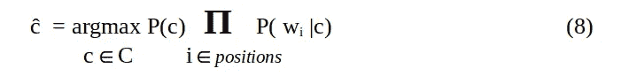

作者图片

现在，如果我们对两边都应用对数，我们会得到一个线性函数:

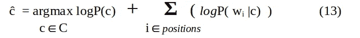

作者图片

b.**停用词**:像*这个、那个、安、曾、当*等词。做

通常不会有助于陈述的情绪。我们可以完全去掉它们来简化我们的模型训练。

c.**未知单词:**每当你面对一个出现在测试数据集中，但在从训练数据创建的词汇中不存在的单词时，建议完全丢弃这些单词，并且在概率计算中不考虑它们。

d.二进制多项式朴素贝叶斯:这是多项式朴素贝叶斯的一个略微修改的版本。在这里，我们将更重视一个词是否存在，而不是它的出现频率。正如我们已经看到的，单个单词可以引起句子情感的巨大变化，因此，忽略该特定单词在句子中出现的次数，而专注于该特定单词在文档中是否存在，这将是一种合乎逻辑的方法。

## **已解决的示例**

最后，现在我们已经熟悉了朴素贝叶斯分类器，我们可以在一个例子中实现这些知识。

训练数据集:

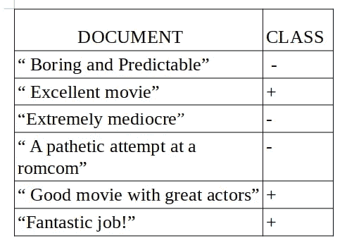

autor 提供的图像

测试数据集:

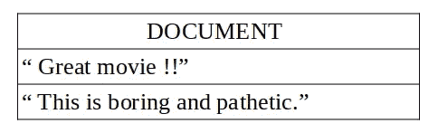

作者图片

这是一个虚构的电影评论数据集。电影评论被分别分为正面和负面两类。

让我们解决问题:(我们将考虑平滑系数， *a，*为 1)

*对于第一个测试用例:*

**先验概率:**

P(c = '正')= 3/6 = 1/2，P(c = '负')= 3/6 = 1/2

**似然概率:**

P('Great' | c = '正数')= 1 + 1 / (9 + 19) = 0.0714

p('电影' | c = '正')= 2 + 1 /(9 + 19) = 0.1071

P('Great' | c = '负数')= 0 + 1/(10 + 19) = 0.0344

P('movie' | c = '负数')= 0 + 1/(10 + 19) = 0.0344

最后，我们应用等式(8)中的发现，返回最大概率:

P(c = '正')* P('伟大' | c = '正')* P('电影' | c = '正')= 0.5 * 0.0714 * 0.1071 = 0.00382

P(c = '负')* P('伟大' | c = '负')* P('电影' | c = '负')= 0.5 * 0.0344 * 0.0344 = 0.000591

由此我们可以说这个测试用例属于 ***正向*** 类。

*对于第二个测试用例:*

**先验概率:**

P(c = '正')= 3/6 = 1/2，P(c = '负')= 3/6 = 1/2

在这个例子中我们遇到了未知单词: *this，is。我们在计算中不会考虑它们。*

**似然概率:**

P('boring' | c = '正数')= 0 + 1 / (9 + 19) = 0.03571

p('可悲' | c = '正')= 0 + 1 /(9 + 19) = 0.03571

P('and' | c = '正数')= 0 + 1 /(9 + 19) = 0.03571

P('boring' | c = '负数')= 1 + 1 / (10+ 19) = 0.0689

p('可悲' | c = '负')= 1 + 1 /(10 + 19) = 0.0689

P('and' | c = '负数')= 1 + 1 /(10 + 19) = 0.0689

最后，我们应用等式(8)中的发现，返回最大概率:

P(c = '正')* P('无聊' | c = '正')* P('可悲' | c = '正')* P('和' | c = '正')= 0.5 * 0.03571 * 0.03571 * 0.03571 = 0.00002277

P(c = '负')* P('伟大' | c = '负')* P('电影' | c = '负')= 0.5 * 0.0689 * 0.0689 * 0.0689 = 0.00016354

由此我们可以说这个测试用例属于 ***负*** 类。

## **结论**

情感分析广泛应用于社交媒体监控、市场研究等领域。它是自然语言处理最重要的方面之一。朴素贝叶斯分类器是自然语言处理的第一步。希望你喜欢阅读这篇文章。

实现二进制多项式朴素贝叶斯分类器的 python 代码可以在我的 [github repo](https://github.com/19-ade/Binary_multinomial_naive_bayes) 中找到。数据集也包含在回购中。