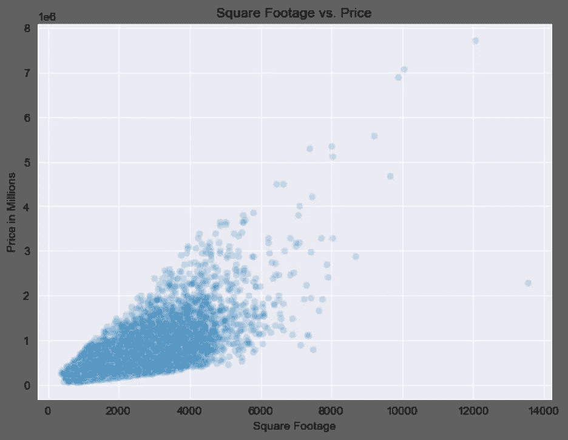
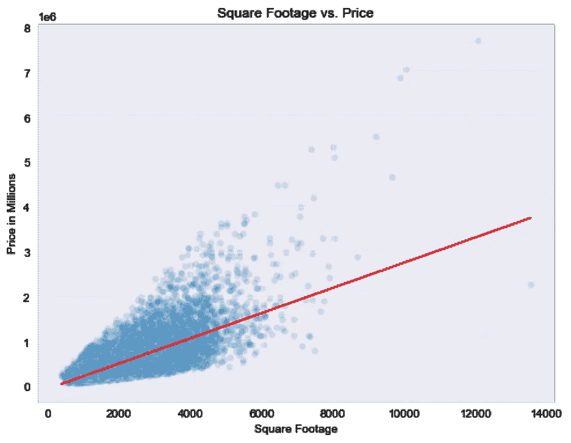

# 建模基础的直观解释(希望如此)

> 原文：<https://towardsdatascience.com/a-hopefully-intuitive-explanation-of-modeling-basics-450e06bb6338?source=collection_archive---------36----------------------->

## 仅使用基础代数和自己的直觉理解线性回归。

数据科学，像许多其他技术领域一样，起初看起来似乎令人生畏，仅仅是因为它使用的术语。像回归、均方误差、偏差和方差这样的术语听起来复杂而不直观，但花哨的词语有时就是这样；潜在的概念可能比修饰过的名字所暗示的要简单得多！事实上，通过一点解析和一些具体的例子，我希望您会发现这些概念非常直观。

如果你对数据科学一无所知，你可能还是听说过预测建模，至少是顺便听说过。简而言之，预测建模是使用现有信息来确定假设或未来事件的结果的过程。更简单地说，如果你和我在玩石头剪子布，如果你注意到我在一次欠考虑的策略尝试中，在连续十轮中选择了纸，那么如果你在第十一轮中玩剪刀，你将会赢。通过使用前十轮作为数据，你能够以很高的概率或可能性正确预测下一轮的结果。

自然，预测模型的应用涉及的数字精度比这稍高，但坚实的概念理解使数字更容易解释。在上面的例子中，有三种截然不同的结果可供我选择:石头、布或剪刀，很明显我已经建立了一种模式，也就是说，我每一轮都不是随机的。但是，我们试图确定一个更连续的变量的值，比如房子的价格，而不是不同类别的结果。比方说，除了有人随意决定价格，就像我在玩纸时决定的那样，还有某些其他变量，比如大小、位置、条件等等。这对决定房子的销售价格产生了影响。听起来…实际上很准确，不是吗？直觉上，这些因素*应该*会对房价产生影响，我们可以使用一种叫做线性回归的工具来精确地确定这些因素对房价的影响程度。

为了演示，我将使用国王郡的房屋销售价格数据集，这是由 [Kaggle](https://www.kaggle.com/harlfoxem/housesalesprediction) 提供的。该数据集提供了 2014 年至 2015 年间出售的房屋的几个特征，包括平方英尺、状况、邮政编码、卧室数量等。我们将从查看一个家庭的平方英尺开始。

作者图片，在 Python 上创建

在上图中，每个点代表一所售出的房屋，x 轴代表其面积，y 轴代表价格(以百万计)。我们可以看到这里有一种模式。这些点呈扇形散开，似乎向右上方“流动”。接下来，我们想问:这个数字模式符合我们直觉告诉我们的模式吗？我说是的；随着房子面积的增加，价格也应该上涨。

但是，如果我们的最终目的是预测，那么仅仅根据这个图表，我们能多好地预测某个平方英尺的房子的价格呢？不太好，因为我们只有一个模糊的形状。由于图中的数据点是单独的测量值，所以当我们绘制它们时，自然会出现“混乱”。您可能还记得代数，如果我们想要在给定某个 x 值(平方英尺)的情况下确定 y 值(在本例中是价格)，通常需要一个公式。最简单的方法是近似一条穿过这些数据点的线，取沿途点的平均值。我们称之为“最佳拟合线”，因为它确实是这样的；最符合给定数据的直线。

作者图片，在 Python 上创建

还可以从代数中回忆一下，一条直线的方程是 y = mx+b，其中(x，y)是直线上的一点，m 是它的斜率，b 是它的 y 截距。让我们想一想在这个上下文中斜率是什么意思。红线的斜率结果是 280 左右。因为斜率是上升的，所以 280 的斜率意味着每增加一平方英尺，价格就上涨 280。这就是我们如何用数字描述该数据集的平均面积和价格之间的关系！

但是，你可能会看着那张图表并想，当然，也许红线是平均预测值，但是有一些点明显偏离它，特别是在图表的顶部附近。事实证明，我们有一种方法来测量我们的线离数据集上的每个点有多远。我们通过测量每个数据点的 y 值与回归线上相应的 y 值之间的距离，将这些距离平方，将它们相加，然后取平均值。这被称为均方误差，因为它给出了我们预测失误的平均平方距离。

我们的均方误差可能很高的一个可能原因是，我们只看一个特征，平方英尺，来确定房屋的价格。如果一栋房子很大，但有严重的结构缺陷，该怎么办？或者，如果一个家很小，但它是那些很酷的小房子中的一个，而这些天人们出于某种原因真的很喜欢它呢？我们知道，除了大小之外，还有许多其他因素会影响房屋的成本，我们的红线预测没有将这些因素考虑在内。出于这个原因，我们会说，这个模型有很大的偏见，因为它偏向于平方英尺作为唯一的价格预测。

另一方面，如果我们要对一所房子的每一个可以想象的特征进行建模，我们可能会面临相反的问题，即基于并不存在的关系进行预测。例如，假设我们发现家中有地毯的房间数量除以房屋建造年份，再乘以吊扇数量，与房屋价格相关。然而，如果我们试图建立一个模型来预测我们还没有看过的其他房子的价格，这种关系很有可能不会持续下去。出于这个原因，我们会说这个模型有很高的方差。

上面的两个例子旨在说明“偏差-方差权衡”，这是一种说模型越复杂，偏差越低，但偏差越低，方差越高的方式。偏差和方差的概念不像其他概念那样直观，但希望模型中太少的特征会导致高偏差，太多的复杂特征会导致高方差的概念似乎是合理的。

如果你觉得这很有趣，并想了解更多，在线数据科学资源并不缺乏！我推荐看一些 [StatQuest](https://www.youtube.com/channel/UCtYLUTtgS3k1Fg4y5tAhLbw) 视频开始。