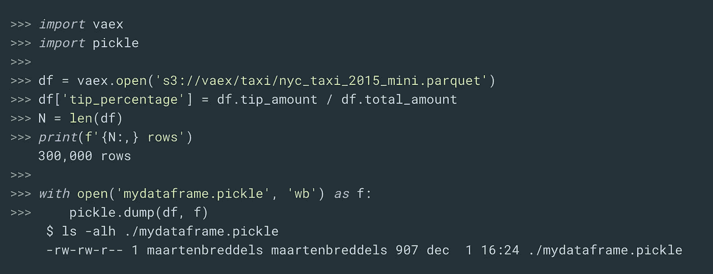

# 带有 Vaex 版本 4.0 的混合 Apache Arrow/Numpy 数据框架

> 原文：<https://towardsdatascience.com/a-hybrid-apache-arrow-numpy-dataframe-with-vaex-version-4-0-5c0d56524ced?source=collection_archive---------24----------------------->


阿帕奇之箭和 NumPy 之间的桥梁(由[https://twitter.com/modestasu](https://twitter.com/modestasu)拍摄)

# 介绍

[Vaex 数据帧](https://github.com/vaexio/vaex)一直非常快。它完全是在核心之外构建的(您的磁盘大小是极限)，突破了单台机器在大数据分析环境中所能做到的极限。

从版本 2 开始，我们增加了对字符串数据的更好支持，与当时的 Pandas 相比，速度提高了近 1000 倍。为了支持这种看似微不足道的数据类型，我们不得不选择一种磁盘和内存格式，并且不想重新发明轮子。阿帕奇箭是一个显而易见的选择，但不符合当时的要求。然而，我们仍然在 Vaex 中添加了字符串支持，但是以一种未来兼容的方式，以便当时间到来时(现在！)，我们可以采用 Apache Arrow，而不呈现过去过时的数据，也不需要数据转换。为了与 Apache Arrow 兼容，我们开发了`vaex-arrow`包，它使得与 Vaex 的互操作性变得平滑，代价是可能到处都有内存副本。

**阿帕奇箭头**

在 Apache Arrow 版本中，是时候将 Arrow 支持集成到 Vaex 的核心中了(Python 包“vaex-core ”),取代了“vaex-arrow”包。虽然所有版本的 Vaex 都支持磁盘上相同的字符串数据(HDF5 或 Apache Arrow 格式)，但 Vaex 4.0 版的不同之处在于，我们现在将这些数据作为箭头数组传递。


您可以混合使用 Arrow 和 NumPy


虽然在默认情况下，Arrow 在与 NumPy 混合时采用了类似熊猫的方法将缺失值转换为`NaN`，但在 Vaex 中，我们确保您的缺失值保持缺失值，并且您的数组不会因此被转换为浮点型。


我们不仅在 Vaex 的核心库中采用了 Apache Arrow，还将快速字符串算法从 Vaex 转移到了`arrow.compute`。因此，我们不仅有数据的互操作性，而且对字符串数据的操作也有相同的语义。这意味着 Vaex、Pandas、Dask DataFrame 都可以以相同的方式对相同的数据进行操作。这项工作是由陈·扎克伯格发起的，我们感谢汤姆·奥格斯伯格的组织。

# 列表支持

虽然对数字和字符串数据的支持完成了大部分工作，但是 Apache Arrow 支持更有趣的数据结构。例如，分割一个字符串会产生一个字符串列表。这种数据结构在高性能的内存布局中是理想的(连续布局与许多小缓冲区相比),并且仍然允许我们像常规字符串数组一样对其进行操作。这意味着我们可以`split/tokenize`字符串，并对其应用类似`strip`的操作，而不必每次都经历连接和分割:


字符串拆分甚至可以多次完成，从而创建一个嵌套列表，而不会有任何性能损失。


# 为什么是混合动力？

Apache Arrow 将给整个数据分析世界带来很多好处，而不仅仅是 Python。它发展很快，移动很快，我们相信这将是 Python 中分析的未来，在许多领域补充或替代 NumPy。然而，采用需要时间，大多数人可能更愿意看到 NumPy 数组。因此，Vaex 版本 4 a 数据帧可以同时容纳 NumPy 数组和 Apache Arrow 数组，以使过渡期更容易。如果数据来自 HDF5 文件或外部 NumPy 数组，我们将其作为 NumPy 数组保存，但字符串除外。如果数据来自一个箭头文件或外部箭头数组，我们将它们保存为箭头数组。

如果您碰巧有一个 Arrow 文件，但是更喜欢使用 NumPy 数组(因为计算语义的原因),那么您可以延迟转换除字符串数据之外的所有数据。

# 拼花地板支架

Apache 的 Arrow 来自核心的 Parquet 支持，这是一个非常受欢迎的特性。尽管以前版本的 vaex-arrow 提供了一些拼花支持，但我们现在支持延迟加载，允许您扫描大于内存的拼花数据集。虽然 Parquet 会以一些 CPU 为代价，但它的尺寸减小使它成为云存储的一种有吸引力的格式，在云存储中，网络带宽通常是一个限制因素。

使用 Apache Arrow 的另一个好处是支持读取分区的 parquet 文件。这非常方便，因为从 Spark/Hadoop 世界生成的文件通常是这种格式的，这使得从这些平台获取数据更加容易。

# 写入分区文件

我们还支持创建分区文件，这可能不是 vaex 中性能最好的部分，但我们用它来测试，并认为它可以很好地共享。


# 读取分区文件

如果分区是 Hive 格式的，就可以开始了，只需打开目录:


对于所谓的“目录”格式，您必须手动给分区命名:


# 泡菜支架

在 4.0 版本中，Vaex 支持数据帧的酸洗，这使得与 Dask、Ray 或 Python 的多处理库的集成变得更加容易。

虽然您可能习惯于以低效的方式保存数据，但在许多情况下，Vaex 本身并不保存数据。当我们这样做时:



你可能会惊讶，这只有 907 字节！。如果您检查文件，您会注意到我们提取了路径和内部状态(比如虚拟列`df.tip_amount / df.total_amount`)。

当您想将整个数据帧存储到磁盘或通过线路发送时，这非常有用。我们不是复制 1tb 的数据，而是简单地提取原始文件位置和您对它所做的所有操作(转换和过滤)。请注意，这对于云存储来说尤其适用，因为所有计算机的文件位置都是相同的。

尽管使用 Vaex 时，我们主要关注的是从单台强大的机器中获得最大的性能，但这为优化分布式计算铺平了道路，适用于那些真正需要集群的情况。

# 多处理并行应用

认识到`df.apply`是完成工作所必需的逃生出口，我们还必须认识到，与 Vaex 的其他部分相比，这非常慢，CPU 使用率降到了 100%。这里的瓶颈是由全局解释器锁(GIL)引起的，而不是直接由 Vaex 引起的。尽管如此，我们觉得应该尝试找到一种方法来提高 apply 方法的性能。

现在，默认情况下，`apply`使用多处理模块，让你的`apply`飞起来！


# 云存储

虽然 S3 对 HDF5 的支持出现在早期的 Vaex 版本中，但在 4.0 版中，我们通过 Apache Arrow 和 FSSpec 项目对此进行了进一步改进。Vaex 可以向许多云存储系统读写大多数文件格式，其中性能最好的是 S3。对于 S3 和谷歌云存储，我们原生支持它们的文件路径，例如`"s3://vaex/testing/xys.hdf5"`或`"gc://vaex/testing/xys.hdf5".`在所有其他情况下，可以通过 Apache Arrow 或 FSSpec 指定文件系统对象。


# 结论

我们希望您和我们一样对 Vaex 的 4.0 版本感到兴奋。将 Apache Arrow 和 NumPy 统一在一个 DataFrame 库中给我们带来了丰富的数据结构(例如字符串列表)、与 NumPy 的兼容性、互操作性(零拷贝数据共享)以及总体光明的未来。核外 Parquet 支持和改进的云存储支持使得在云上工作更加透明。当您需要求助于纯 Python 代码时，改进的 pickle 支持和默认并行应用允许更好的性能。

## 装置

```
$ pip install "vaex==4.*"
# Just want to core functionality?
$ pip install "vaex-core==4.*"
# Using conda or mamba?
$ conda install -c conda-forge vaex=4
```

## 投稿？

如果您想投稿或寻找问题，请加入我们在 https://github.com/vaexio/vaex[的 GitHub，或者](https://github.com/vaexio/vaex)[https://github.com/vaexio/vaex/discussions](https://github.com/vaexio/vaex/discussions)的更多一般性问题。