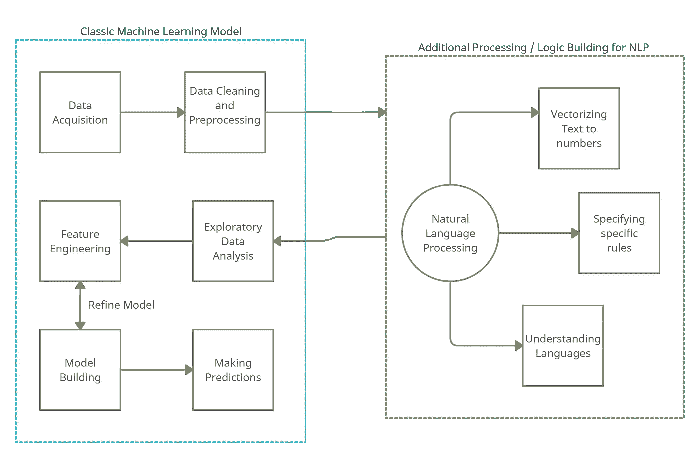
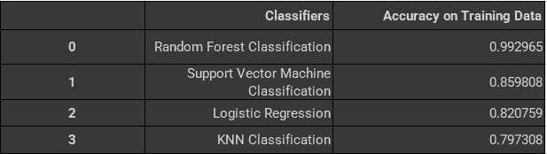

# 自然语言处理的混合方法

> 原文：<https://towardsdatascience.com/a-hybrid-approach-to-natural-language-processing-6435104d7711?source=collection_archive---------30----------------------->

## 将 NLP 集成到传统机器学习工作流的指南


阿玛多·洛雷罗在 [Unsplash](https://unsplash.com?utm_source=medium&utm_medium=referral) 上的照片

自然语言处理(NLP)是一个理论上复杂的概念。我已经尝试了几种实现这些算法的方法，几乎所有的方法都很复杂。最近，我尝试了这种新方法，从概念上讲，我们经历了一个简单的机器学习工作流程，从数据采集开始，到做出预测结束。在这个工作流程中，我添加了一个额外的步骤来处理语言，这使得它更容易理解和实现。

> 请注意:这个实现并不是一个能解决所有 NLP 问题的标准化方法。它旨在为从事预测分析工作和不熟悉处理语言的人提供一个入门工具包。

# 重温经典的机器学习步骤

1.  **数据采集:**所有的分析都需要数据。数据获取或收集是将数据提供给模型的过程。数据可以来自不同的来源，如网络抓取、数据仓库、音频和视频等实时数据流。然后，获取的数据可以以数据帧的形式存储在工作空间中，与 Python 的分析结构无缝协作。
2.  **清理和预处理:**在大多数情况下，原始数据包含的信息可能对分析没有帮助，反而不利于预测。因此，在数据采集完成后，我们执行一些清理和预处理，包括移除异常值、区分特征和标签、标准化特征、删除无助于分析的列、输入分类变量等步骤。
3.  **探索性数据分析:**EDA 步骤在分析的开始阶段非常重要，因为它揭示了我们将要处理的数据的相关信息。EDA 有助于理解数据，发现模式、类别和一些统计推断，如均值、中值、标准差和方差。
4.  **建立/训练 ML 模型:**一旦所有的数据都准备好进行分析并标准化，我们就开始建立机器学习模型。构建模型背后的想法是为它提供大量的数据来学习。该算法使用这些数据来学习数据中的模式，并训练自己处理同类的未知数据。正如我们在第一个案例研究中看到的，基于问题和期望的解决方案，有大量的 ML 算法可供选择。
5.  **做预测:**最后输出的是 ML 模型将对未知数据做的预测。一旦用数据训练了算法，它就理解了上下文中的各种信息点是如何相互关联的。在预测阶段，算法被输入一个输入变量及其相关值。该模型接收该输入并预测期望的输出值。

# 将 NLP 层集成到 ML 工作流中

在机器学习管道中，为了包括自然语言处理(NLP ),我们在数据处理和清理阶段添加了一些步骤。训练和测试算法仍然以相同的方式运行。工作流程中唯一合乎逻辑的变化是将文本转换为机器学习算法可以处理的数字数据。在这一转换过程中，有许多因素需要考虑。例如，一个单词出现的次数有助于确定谈论的话题。

## **NLP 和 ML 的混合方法**

自然语言一般都很乱。音调、解释和含义因人而异，很难与准确理解这些概念的模型一起工作。因此，机器学习本身不能作为 NLP 解决方案。ML 模型对于识别文档的整体情感或理解文本中存在的实体是有用的。但他们在提取主题或将情感与个体实体或主题相匹配时会发生冲突。因此，在混合 NLP 方法中，我们向 ML 模型解释规则。这些规则是语言中遵循的惯例。这些规则和模式有助于算法将分类与人类直觉更紧密地联系起来。



在机器学习系统中添加 NLP 步骤|作者图片

## 使用这种方法进行情感分析

**问题陈述:**输入数据集包含用户发出的关于美国境内六家航空公司的推文。目的是将这些推文和信息在情绪上分为积极、中立和消极。这将使用传统的监督学习机制来完成，其中输入训练数据集将从推文中确定。通过训练集，我们将构建一个创建类别的模型。

**解决方案:**这个问题的方法将涉及机器学习管道，遵循上面提到的步骤。初始化将从导入该分析所需的必要库开始。探索性数据分析是下一步，我们将探索数据中的各个部分是如何相互关联的，并理解输入。接下来，我们将在预处理过程中添加一个新步骤，执行文本处理。由于机器学习算法对数字数据有效，我们将把文本输入处理成数字输入。最终，一旦预处理完成，我们将继续使用 ML 模型，并对整个数据集运行它，了解它的准确性。

```
*# Data Source:* [*https://raw.githubusercontent.com/kolaveridi/kaggle-Twitter-US-Airline-Sentiment-/master/Tweets.csv*](https://raw.githubusercontent.com/kolaveridi/kaggle-Twitter-US-Airline-Sentiment-/master/Tweets.csv)import_data_url = "https://raw.githubusercontent.com/kolaveridi/kaggle-Twitter-US-Airline-Sentiment-/master/Tweets.csv"
```

执行初始步骤:数据集的数据导入和探索性数据分析(EDA)。在这个故事中，我们将不讨论导入数据和执行初始清理和 EDA 的代码，因为这里的重点是在这个经典工作流之间集成 NLP。如果你想浏览整个源代码，我已经在这个故事的底部链接了完整的项目。

> 一旦我们完成了初始预处理，现在是时候清理特定于自然语言的数据了。这是**我们将添加只适用于语言的代码的部分。**

## ML 循环中的 NLP 层

在接下来的两节中，我们将开始处理自然语言。这个流程很简单:我们首先将语言(文本)转换成向量，然后执行一些清理，以使模型能够更好地预测。

```
*# Cleaning of data: Since these tweets might contain punctuation marks and other non-relevant characters, we will process those and remove them from the model**# Let us also divide the feature and label sets for this data* feature_set = sentiment_tweets.iloc[:, 10].values
label_set = sentiment_tweets.iloc[:, 1].values
cleaned_feature_set = list()for input_phrase in range(0, len(feature_set)):
*# 1.Removing all the special characters (*,etc.) and single characters (a,an,etc.)* clean_feature = re.sub(r'\W', ' ', str(feature_set[input_phrase]))
clean_feature= re.sub(r'\s+[a-zA-Z]\s+', ' ', clean_feature)
clean_feature = re.sub(r'\^[a-zA-Z]\s+', ' ', clean_feature)*# 2.Convert the entire phrase to lower cases* clean_feature = clean_feature.lower()
cleaned_feature_set.append(clean_feature)
```

## 用于处理文本的附加库

我们将在下一节中使用两个额外的函数来增强我们对文本的处理。

***NLTK“停用词”:*** 停用词是大多数搜索引擎被编程忽略的常用词(如“the”、“A”、“an”、“in”)。它们不会在索引条目以进行搜索的过程中出现，也不会在作为搜索查询的结果检索它们时出现。因此，这些字在处理期间是不需要的，并且会浪费处理时间和资源。NLTK(自然语言工具包)是由 16 种不同语言组合而成的单词列表，是 Python 的一部分。下面是 NLTK 中预定义的英语停用词列表。可以通过在非索引字本地目录的 english.txt 文件中添加/删除单词来修改该列表。

```
{‘ourselves’, ‘hers’, ‘between’, ‘yourself’, ‘but’, ‘again’, ‘there’, ‘about’, ‘once’, ‘during’, ‘out’, ‘very’, ‘having’, ‘with’, ‘they’, ‘own’, ‘an’, ‘be’, ‘some’, ‘for’, ‘do’, ‘its’, ‘yours’, ‘such’, ‘into’, ‘of’, ‘most’, ‘itself’, ‘other’, ‘off’, ‘is’, ‘s’, ‘am’, ‘or’, ‘who’, ‘as’, ‘from’, ‘him’, ‘each’, ‘the’, ‘themselves’, ‘until’, ‘below’, ‘are’, ‘we’, ‘these’, ‘your’, ‘his’, ‘through’, ‘don’, ‘nor’, ‘me’, ‘were’, ‘her’, ‘more’, ‘himself’, ‘this’, ‘down’, ‘should’, ‘our’, ‘their’, ‘while’, ‘above’, ‘both’, ‘up’, ‘to’, ‘ours’, ‘had’, ‘she’, ‘all’, ‘no’, ‘when’, ‘at’, ‘any’, ‘before’, ‘them’, ‘same’, ‘and’, ‘been’, ‘have’, ‘in’, ‘will’, ‘on’, ‘does’, ‘yourselves’, ‘then’, ‘that’, ‘because’, ‘what’, ‘over’, ‘why’, ‘so’, ‘can’, ‘did’, ‘not’, ‘now’, ‘under’, ‘he’, ‘you’, ‘herself’, ‘has’, ‘just’, ‘where’, ‘too’, ‘only’, ‘myself’, ‘which’, ‘those’, ‘i’, ‘after’, ‘few’, ‘whom’, ‘t’, ‘being’, ‘if’, ‘theirs’, ‘my’, ‘against’, ‘a’, ‘by’, ‘doing’, ‘it’, ‘how’, ‘further’, ‘was’, ‘here’, ‘than’} 
```

**TF-IDF(词频—逆文档频率)*tfidf 矢量器* :** 每个词在词袋模型中都具有相同的权重和重要性。但是，在现实世界的场景中，讨论的主题可以通过理解上下文中重复出现的单词来推导。TF-IDF 遵循的逻辑是，在组合的所有文档中出现较少而在单个文档中出现多次的那些单词对预测的分类具有较高的贡献。顾名思义，TF-IDF 是两种解释(术语频率和文档频率)的组合。简而言之，如果一个词的词频(在文档中出现的次数)较高，并且文档频率的倒数(该词出现的文档数)较高，则该词的分类值增加。TF-IDF 的典型用途是搜索引擎优化算法。

*   TF =(一个单词在一个文档中的出现次数)/(文档的总字数)
*   IDF = Log((文档总数)/(包含该单词的文档数))

```
*# Changing the text to a numerical form: All machine learning and statistical models use mathematics and numbers to compute data. Since the input here is textual, we will use the TF-IDF scheme to process words.
# Import the necessary packages* from nltk.corpus import stopwords
from sklearn.feature_extraction.text import TfidfVectorizerinput_vector = TfidfVectorizer (max_features=3000, min_df=6, max_df=0.8, stop_words=stopwords.words('english'))cleaned_feature_set = input_vector.fit_transform(cleaned_feature_set).toarray()
```

## 训练、测试、分割

我们工作流程的语言处理部分现在已经完成。这是向经典机器学习管道的过渡。使用训练、测试、分割方法来验证模型的性能。**训练部分**用于拟合模型。**测试**用于评估训练部分的适合度。该函数将数据随机分为训练集和测试集。

```
*# Let us now use the Train, Test, Split function to divide this data into training and testing sets. We will use the training set to train the model and find the best suitable model for this prediction and then run that model on the test data to finalize the prediction score*from sklearn.model_selection import train_test_split
X_train, X_test, y_train, y_test = train_test_split(cleaned_feature_set, label_set, test_size=0.33, random_state=42)
```

## 建模和培训

根据经验，我一直认为用多种算法测试模型的性能是个好主意。算法的选择可以根据输入的类型来区分，但是应该总是在一个以上的算法上进行测试。下面，我将用四个不同的模型测试数据。

```
*# Random Forest Classification* rf_classifier = RandomForestClassifier(n_estimators=200, random_state=42)
rf_classifier.fit(X_train, y_train)
rf_classifier_score = rf_classifier.score(X_train, y_train)*# Support Vector Machine Linear Classification* svc_classifier = SVC(kernel='linear')
svc_classifier.fit(X_train, y_train)
svc_classifier_score = svc_classifier.score(X_train, y_train)*# Logistic Regression* lr_classifier = LogisticRegression(random_state=0, solver='lbfgs', multi_class='ovr').fit(X_train, y_train)
lr_classifier_score = lr_classifier.score(X_train, y_train)*# K-Nearest Neighbors Classification* knn_classifier = KNeighborsClassifier(n_neighbors=5)
knn_classifier.fit(X_train, y_train)
knn_classifier_score = knn_classifier.score(X_train, y_train)
```

## 训练数据的结果

基于训练，我们看到随机森林分类器给我们最好的结果。虽然 99.2%的准确率可能预示着过度拟合，但我们将看到它在测试数据集上的表现。



每个分类器上的结果|按作者分类的图像

## 测试数据的结果

对测试数据运行相同的随机森林分类器。

```
*# Final prediction using the best-case algorithm from the above table* final_pred = rf_classifier.predict(X_test)*# Accuracy score of the final prediction* print(accuracy_score(y_test, final_pred))
>>> 0.7667632450331126
```

我们观察到，测试数据的预测分数不如训练数据的预测分数好。但是，由于随机森林是我们最好的结果算法，为了提高这个分数，我们可以用更好的规则建立模型。添加算法要遵循的附加规则的预处理阶段为分析增加了许多意义。建立更好的规则总是可以提高准确性，因为我们在日常语言中使用的语法、词性和其他词源的概念对于 NLP 模型来说是未知的。我们在模型创建的处理阶段给模型这些规则。

有关该项目的详细实现，您可以访问以下链接的存储库:

<https://github.com/rjrahul24/ai-with-python-series/blob/main/09.%20NLP%2C%20Bag%20of%20Words%20and%20Sentiment%20Analysis/Hybrid_Approach_to_NLP.ipynb>  

就这样结束了！！|照片由[斯潘塞·伯根](https://unsplash.com/@shutterspence?utm_source=medium&utm_medium=referral)在 [Unsplash](https://unsplash.com?utm_source=medium&utm_medium=referral) 上拍摄

## 结论

本指南旨在让精通机器学习算法并希望开始自然语言之旅的工程师或分析师熟悉自然语言处理(NLP)。我们实现了一个情感分析模型，该模型将 Twitter 推文作为数据输入，并预测推文的情感作为输出。我希望本教程能够让初学者开始运行具有基本功能的 NLP 代码。有关 ML 中 NLP 代码的更高级实现，请参考参考资料部分的链接[5]和[6]。

## 参考

1.  [https://www . geeks forgeeks . org/removing-stop-words-nltk-python/](https://www.geeksforgeeks.org/removing-stop-words-nltk-python/)
2.  [https://sci kit-learn . org/stable/modules/generated/sk learn . feature _ extraction . text . tfidfvectorizer . html](https://scikit-learn.org/stable/modules/generated/sklearn.feature_extraction.text.TfidfVectorizer.html)
3.  [https://www . lex alytics . com/lex ablog/machine-learning-natural-language-processing](https://www.lexalytics.com/lexablog/machine-learning-natural-language-processing)
4.  [https://monkeylearn.com/blog/nlp-ai/](https://monkeylearn.com/blog/nlp-ai/)
5.  [https://medium . com/coders-camp/20-machine-learning-projects-on-NLP-582 effe 73 b 9 c](https://medium.com/coders-camp/20-machine-learning-projects-on-nlp-582effe73b9c)
6.  [https://analyticsindiamag . com/8-different-NLP-scenarios-one-can-take-up-for-a-project/](https://analyticsindiamag.com/8-different-nlp-scenarios-one-can-take-up-for-a-project/)