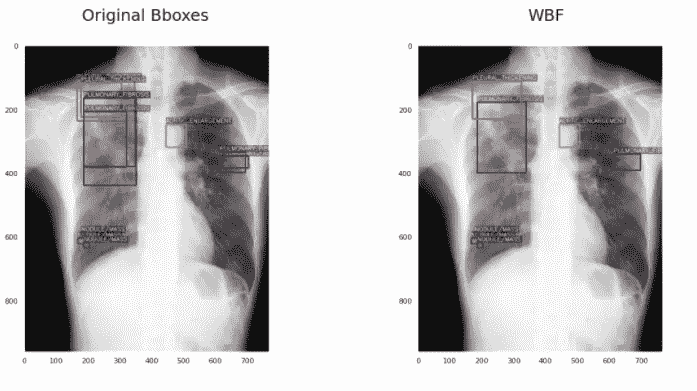
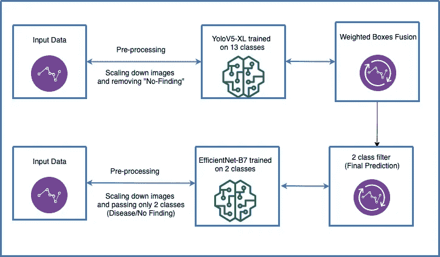

# 构建高级对象检测管道之旅——将 YoloV5 的性能提升一倍

> 原文：<https://towardsdatascience.com/a-journey-of-building-an-advanced-object-detection-pipeline-doubling-yolov5s-performance-b3f1559463bf?source=collection_archive---------12----------------------->

## 我在一次 Kaggle 物体探测比赛中使用的几个技巧在比赛的大部分时间里将我的分数提高到大约前 10%

迭戈·PH 在 [Unsplash](https://unsplash.com?utm_source=medium&utm_medium=referral) 上的照片

我花了三个月深入研究物体探测。我已经尝试了大量的东西，从实现 YoloV5，VFNets，DETR 等最先进的模型到融合对象检测模型和图像分类模型以提高性能。在比赛的早期阶段，我努力提高基线模型的分数，但我找不到有用的在线资源，这就是我写这篇文章的原因。我想带你踏上一段旅程，从起点到终点，简要地向你展示我几乎将分数翻倍的每一步。

官方的竞争指标是(平均)平均精度，这是最常用的对象检测指标之一。为了向您展示每一步相对于其他步骤的改进，我将在旁边添加它的分数。

1.  **第一步是建立一个简单的基线——0.126 地图**

我很确定这是一个陷阱，很多数据科学家早就掉进去了。我们总是兴奋地用我们能想到的每一种技术从最复杂的模型开始。这是一个巨大的错误，你最终会变得沮丧并离开你的 ML 项目，即使你不这样做，你也很可能会超负荷！

我得到了惨痛的教训，但最终我用这些规范构建了一个初始模型:

*   YoloV5-XL
*   图像从 3K 分辨率调整到 512

我知道这听起来很简单，最初，我也是这么想的。但是，实际上，建立基线可能是最烦人的步骤之一。因为有多个步骤，比如将输出后处理成竞争对手的格式等等(我不想深究)。

此外，我的实际初始 YoloV5-XL 模型只得到 0.064(上面的一半)，我花了 2 周时间调试它，结果发现我没有正确地规范化输入数据！

**2。删除其中一个输入类！— 0.143 地图(+13%)**

这一招当时对我来说没多大意义。有 14 个输入类、13 种不同的疾病和 1 个“无发现”类。大约 70%的数据集属于“无发现”类，只有 30%属于其他类。一个竞争对手发现你可以丢弃这个类，并使用“2 类过滤器”技巧来预测它(见下文)。这使得数据集不那么倾斜。此外，它允许训练明显更快(因为你将在更少的图像上训练)。

**3。增加训练和推理图像分辨率— 0.169 mAP (+18%)**

第二步是将图像分辨率从 512 提高到 1024。这是一个微不足道的进步，但我想在这里表达的观点是，如果我从这个决心开始，我可能不会进一步提高我的分数。仅仅是因为在这个更高分辨率上的训练导致批量大小从 16 减少到 4(以不耗尽 GPU 内存)，这大大减慢了训练过程。这意味着更慢的实验，你不想用慢实验开始一场竞赛…

**4。定影效率 Net 和 yolov 5–0.196 mAP(+16%)**

这不是我的主意，我从一个公共内核得到的。但是，这是我在 Kaggle 比赛中遇到的最好的想法之一。我想强调的是，在 Kaggle 上进行比赛的主要好处之一是你可以从社区中学到东西。

这里的主要想法是在这里训练一个图像分类模型(EfficientNet ),它可以实现非常高的 AUC(大约 0.99)并找出一种将其与对象检测模型融合的方法。这被称为“2 级过滤器”，实际上比赛中的每个人都采用了这个想法，因为它大大提高了分数。

如果您感兴趣，您可以在此找到更多信息:

 [## Fusing EfficientNet & YoloV5 —高级目标检测 2 阶段流水线教程

### 通过将 YoloV5 与 EfficientNet 集成，将对象检测性能提高约 20%

towardsdatascience.com](/fusing-efficientnet-yolov5-advanced-object-detection-2-stage-pipeline-tutorial-da3a77b118d1) 

**5。加权框融合(WBF)后处理— 0.226 mAP (+15%)**

这对我来说也是一个很新的想法，不是你能在网上轻易找到的。加权盒子融合是一种过滤掉物体检测模型产生的盒子数量的技术，使得结果更准确和更正确。它的性能超过了现有的类似方法，如非最大抑制(NMS)和软 NMS。

应用 WBF 的结果如下所示:

图片由作者转载。

如果你有兴趣了解更多，你可以在这里查看我的文章:

 [## WBF:优化目标检测——融合和过滤预测框

### 加权盒融合已经成为优化目标检测模型的新 SOTA

towardsdatascience.com](/wbf-optimizing-object-detection-fusing-filtering-predicted-boxes-7dc5c02ca6d3) 

*   **与 WBF 融合的 5 重交叉验证— 0.256 mAP (+13%)**

我犯的一个最大的错误是我忘记了做交叉验证，这就是为什么这是一个要点而不是一个编号点。这也是我想写这篇文章的主要原因之一，强调 ML 基础的重要性。我太专注于应用新技术和提高性能，以至于忘记了应用这个基本的 ML 技术。

如果你想知道我是如何将 0.256 附加到它上面的，那是因为我阅读了一些在比赛结束后发布的解决方案，这是他们大多数人在与我相似的模型上交叉验证后得到的结果。

最终的管道可以在这里看到:

作者图片

*   **我尝试过，但无法解决的事情**

1.  训练 DETR。DETR 是一个神奇的物体检测转换器，我在之前写了一篇[的文章。我认为这是将我所写的一切付诸实践并真诚测试它的时刻。然而，我没有发现他们随代码提供的文档有什么帮助，我也找不到很多有用的资源。此外，我花了大约 3 个星期(大约是比赛时间的四分之一)试图让它工作。我这样说的原因是，虽然离开你一直在努力的解决方案可能很难，但在实验性的 ML 世界中，有时必须这样做，老实说，我希望我早点离开它。但是，从好的方面来看，我发现另一个名为](/facebook-detr-transformers-dive-into-the-object-detection-world-39d8422b53fa) [MMDetection](/mmdetection-tutorial-an-end2end-state-of-the-art-object-detection-library-59064deeada3) 的库提供了 DETR，并且使用起来更加容易。
2.  WBF 预处理。虽然很多竞争者说这提高了他们的分数，但并没有提高我的分数。这就是关于 ML 的事情，不是所有的技术都必然以同样的方式使不同的模型受益。

最后，如果您感兴趣，可以在这里找到我的代码:

[https://github . com/mostafaibrahim 17/VinBigData-Chest-x ray-Object-detection-](https://github.com/mostafaibrahim17/VinBigData-Chest-Xrays-Object-detection-)

**最终想法**

我希望你喜欢这篇文章，并从我的错误中吸取教训。我希望看到更多的人分享他们的比赛经验，因为我发现这很有帮助。网上有很多关于构建基线的教程，但是关于下一步该做什么的很少。