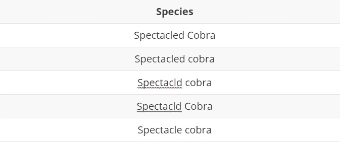
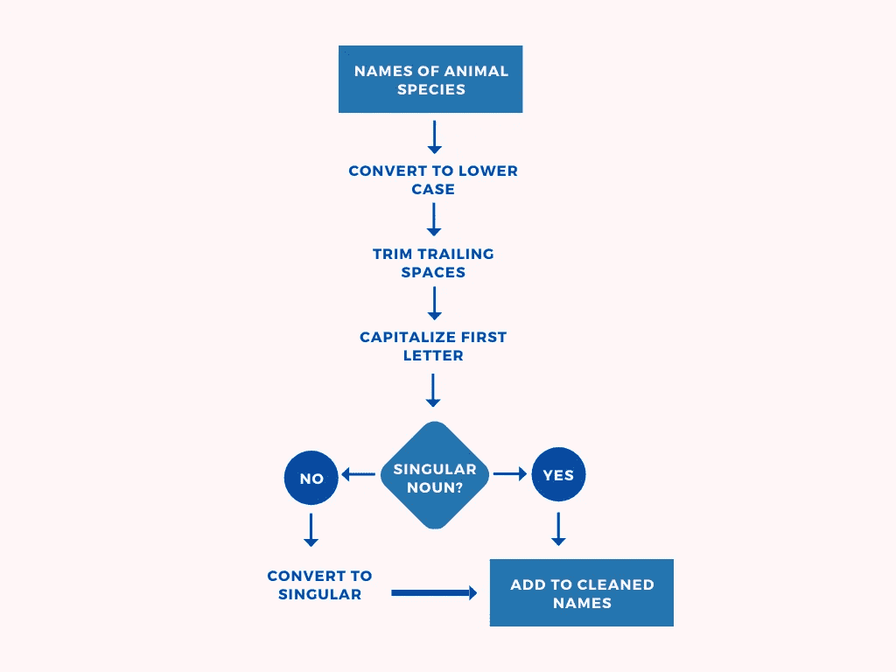
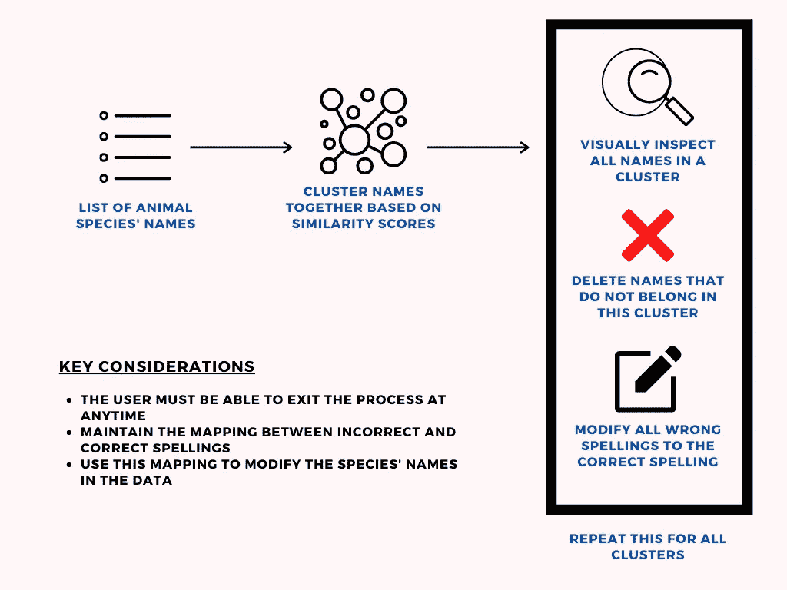

# 清理动物收容所数据之旅

> 原文：<https://towardsdatascience.com/a-journey-through-cleaning-animal-shelter-data-86c310fd0e18?source=collection_archive---------34----------------------->

## [变更数据](https://towardsdatascience.com/tagged/data-for-change)

## 用数据拯救动物的生命

照片由[多萝西娅·奥德尼](https://unsplash.com/@dorographie?utm_source=medium&utm_medium=referral)在 [Unsplash](https://unsplash.com?utm_source=medium&utm_medium=referral) 拍摄

在我的上一篇文章中，有一个关于动物收容所分析的理论驱动的讨论。这篇文章重点介绍了庇护所对分析的需求、面临的挑战以及应对这些挑战的可能解决方案。在庇护所分析数据的主要挑战之一是收集的数据质量下降。在这篇文章中，我打算阐明收容所的数据质量问题以及我是如何处理这些问题的。

# 数据显示“嗨！很高兴认识你！”

收容所收集的数据大约有 9-13 列，我无法准确定位，因为随着收容所开始增加更重要的列，列数每年都在变化。我收到的数据是关于收容所动物的数据，收集了 5 年的时间，大约有 15000 条记录。数据记录了救援的几个细节，其中一些是

*   被救动物的俗名是什么？
*   获救的动物是什么物种？
*   救援是什么时候进行的？
*   这只动物是从哪里被救出来的？
*   谁是线人？

现在，这是一个金矿。我有 15000 行关于动物救助的数据。这是我第一次在[现实世界挑战](/data-science-in-the-real-world-e97e2534e43)中工作，我对这些数据的工作可以真正*产生影响*。

好吧，你知道这是迟早的事。所以，让我继续吧——*这些数据很快就变成了邪恶的东西，并决心吸干我最后一点耐心*。很快，我就被一些非常现实的问题弄糊涂了！

# 为数据牵线搭桥

首先，数据是内部碎片。每年有 5 个不同的 excel 文件，每个文件每个月有 12 个单独的工作表。我从来没有处理过任何东西，除了一个美丽的组合。csv 文件作为我本科课程的一部分。

幸运的是，我的在线学习教会了我熊猫，这似乎是一个不错的选择。但是，如何在 excel 文件中合并工作表呢？我不得不把 60 张数据结合在一起。我只好*为数据*扮演红娘。

幸运的是，谷歌快速搜索帮助我找到了我的[指南](https://pbpython.com/pandas-excel-tabs.html)。问题解决了！这很简单。我跑去参加聚会。

# 接受数据并不完美

当我第二天回去工作时，我有一个简单的议程——对我的数据进行一些汇总统计，并让我的协调员介绍我的一些发现，这(很可能)会给团队留下深刻印象。我首先统计了获救最多的物种。这是收容所过去 5 年中获救最多的 5 个物种。

[来源](https://emoji.gg/assets/emoji/9109_Sad_Cat_Thumbs_Up.png)

我问我妈家里有没有绳子。她没有。我在这里，写这篇文章。

哭了几天后，我回去工作了。我打开 excel 文件(数据的原始来源)看了一下数据。这种人工检查可以帮助理解数据中一些最紧迫的问题，这是非常神奇的。通过检查，我发现数据中存在以下问题

*   缺少值
*   拼写错误
*   案例错误
*   学名混淆
*   不规则的日期格式

现在，这些之所以是“问题”而不仅仅是被忽略的现象，是因为对有问题的数据进行的 [*分析比根本没有进行的分析*](https://www.thedailymba.com/2019/07/26/how-poor-data-quality-negatively-impact-your-business/) 更糟糕。在动物收容所的背景下，如果我向团队提供从不一致的数据中获得的数字，从战略和决策的角度来看可能会有一些非常严重的问题。

我现在有了清理数据的任务。快速迂回，我认识到几乎每篇“数据科学初学者”文章都谈到数据清理仅限于人们喜欢的流程图绘制的第一步。我认为不止如此。数据清理可能会融入整个过程。[数据清理不必局限于处理缺失值或数据问题](https://counting.substack.com/p/data-cleaning-is-analysis-not-grunt)。它更多的是将我们拥有的数据表示成更适合手头任务的形式。

回来，我是如何清理数据的呢？

# 让数据“更好”

没有[通用的方法来清理数据](http://veekaybee.github.io/2021/03/26/data-ghosts/)。但是，不同的数据清理过程有一些共同的步骤。这些步骤可以很容易地在互联网上找到。在我掌握的数据中，属于这一类别的清洁作业包括

1.  **处理缺失值—** 在几种可用的[不同策略](https://en.wikipedia.org/wiki/Missing_data#Techniques_of_dealing_with_missing_data)中，省略通常被认为是一种糟糕的策略，因为它会导致数据丢失。在我的情况下，省略一些记录是必要的，因为其中一些缺乏重要的细节，如救援日期。但是，这个比例很小。
2.  **统一的日期格式——**救援日期在一些表格中被编码为`string`，而在另一些表格中被编码为`date`。熊猫中的[日期处理的快速梳理有助于纠正这些问题。](https://pandas.pydata.org/pandas-docs/stable/user_guide/timeseries.html)

# 处理名称中的不一致

但是，这些只是冰山一角。真正的问题是命名和拼写错误。当面临这样的挑战时，我认为我们倾向于遵循两种主要方式:

*   方法 1 或**手动**方式——想法是手动纠正问题
*   方法 2 或**自动化**方式——编写一些代码来诊断数据问题并清理它

在庇护所数据的上下文中，使用手册意味着*找到并替换*所有拼写错误的名字。很有趣，不是吗？自动化方法要求我编写一个超级智能程序来完成所有这些工作。好吧，我显然是力不从心了:)

手动方式将确保更好地控制清洁，而自动方式将要求我以控制换取速度。

那么，我到底做了什么？好吧，我选择了大多数人在两个极端选项之间困惑时选择的道路——我*创造了一个两全其美的第三个选项*！我称之为**混合**变种，决定写一个脚本，在我的干预下，以半自动的方式清理数据。

首先，这些名字是通过一个初步的清理管道传送进来的。图 1 对此进行了描述。

图一。初步命名清洗管道(鸣谢:作者)

混合方法的想法很简单→ *使用* [*相似性分数*](/overview-of-text-similarity-metrics-3397c4601f50) *对密切相关的动物/物种名称进行聚类。将群集显示为输出，检查它并删除不属于该群集的条目。重复这个过程，直到达到某个停止标准。*

这种混合方法如图 2 所示。

图二。清理不一致的名称(鸣谢:作者)

为了找出一种动物的正确拼写，我在谷歌上搜索了拼写。事后看来，我本可以将这部分自动化，并进一步减少手动操作。

> 在得到过去 5 年的数据之前，我首先得到了收容所去年运营的数据。我使用**手动**方法清理了这些初始数据。我花了大约 10 个小时(中间有休息时间，这样我才不会发疯)来做这个清洁工作。构建这个有用的脚本帮助我清除了命名中的不一致，减少了很多麻烦，整个过程只花了大约 2 个小时！

呜哇！我终于“净化”了我的数据。但是，责任仅限于清理数据吗？

# 为未来做准备

> *“清理一次数据，你是个好人。确保它永远不会变得混乱，你是一个英雄。”*

庇护所显然受益于我在数据清理操作后提供给他们的分析。然而，重要的是向庇护所传达其现有数据清理做法存在的问题。这样做将有助于利益相关者展望未来，并为在数据驱动的决策浪潮中冲浪做好准备！

当我决定与团队交流这些数据问题时，我从与父亲的一些富有洞察力的谈话中得到了 3 条建议

*   说实话
*   不要表现得“无所不知”，因为你不知道数据收集有多困难
*   成为解决方案的一部分，不要只是描述问题然后离开

最后，在庇护所协调员的帮助下，我提交了一份单独的报告，内容是庇护所如何更有效地利用其数据做出决策，并详细介绍了如何解决他们的一些数据收集和质量挑战。

平心而论，如果不是庇护所的团队非常乐于助人且以结果为导向，这一切都不可能实现。

如果你对“动物收容所分析”感兴趣，我相信你会喜欢我之前关于这个想法的文章。

[用数据拯救动物生命。《动物收容所简介》… |作者:Ramshankar Yadhunath | 2021 年 3 月|走向数据科学](/saving-animal-lives-with-data-d815c6e854eb)

这篇文章最初发表在我的个人博客上。

如果你对这篇文章的内容有任何疑问，请随时联系我。你可以在 [Linkedin](https://www.linkedin.com/in/ramshankar-yadhunath/) 和 [Twitter](https://twitter.com/thedatacrack) 上找到我。