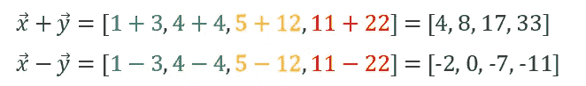

# 神经网络之旅(第 0 部分)——线性代数快速入门

> 原文：<https://towardsdatascience.com/a-journey-through-neural-networks-part-0-fast-introduction-to-linear-algebra-e9f9ffa46513?source=collection_archive---------25----------------------->

## 深度学习中使用的核心线性代数概念的更新

照片由来自 [Pexels](https://www.pexels.com/photo/black-click-pen-on-white-paper-167682/?utm_content=attributionCopyText&utm_medium=referral&utm_source=pexels) 的 [Lum3n](https://www.pexels.com/@lum3n-44775?utm_content=attributionCopyText&utm_medium=referral&utm_source=pexels) 拍摄

> "数学的研究就像尼罗河，始于细微之处，终于壮丽."—查尔斯·凯勒·科尔顿(1820 年)

本文是**系列文章的一部分，旨在解释主要的神经网络模型是如何工作的:**

1.  单层感知器
2.  前馈神经网络
3.  卷积神经网络
4.  递归神经网络

因为**这篇论文不是对任何一个神经网络**的解释，而是对那些模型使用的核心线性代数概念的**快速** **介绍，所以它被标为“第 0 部分”。**

在整个系列中，我尽了最大努力保持数学**“互补”但“非必要”**。你应该能够**理解事物如何运作**(或多或少)**而不需要掌握底层的数学**。然而，如果你需要快速更新一些概念，比如向量、矩阵、导数，或者如果你希望更深入地理解神经网络，我强烈推荐你阅读这一部分。

**要求**:我希望你有基本的数学知识(方程，不等式，笛卡尔坐标..)和**知道什么是变量，函数，或者标量，至少在本质上。**

## **目录**

1.  **矢量**
2.  **矩阵**
3.  **哈达玛产品**
4.  **线性变换**
5.  **导数和偏导数**

*— 5.1 推导的直觉*

*— 5.2 推导规则*

*— 5.3 偏导数*

6.**渐变**

## 矢量

在数学中，更具体地说是线性代数中的**，向量是元素**的有限个****的集合。例如， *x* = [2，3，5]是一个三元素向量， *x* =[ *x₁，…，xₙ* ]是一个 *n-* 元素向量。通常用字母上方的箭头表示(*图 4* )。向量可以是列向量，也可以是行向量。列向量的转置(T)是行向量。相反，行向量的转置是列向量。****

************

**图 4。列向量、行向量以及列向量到行向量的转置。每个向量的大小为 n × 1**

****向量可以被标量乘、加、减或除。**如您所料，这会产生一个相同大小的向量，每个元素都乘以/除以/加上/减去那个标量(*图 5* )。**

****

**图 5。向量与标量的乘法和加法**

**两个向量的加法/减法非常简单(*图 6* )。然而，**这两个向量需要有相同的大小** *。*设*x*=【1，4，5，11】和*y*=【3，4，12，22】为 2 个大小为 4 的向量。**

****

**图 6。2 个向量的加法/减法**

****点积**(*~矢量乘法* ) 有点棘手。当你做两个向量的点积时，**你得到的不是一个新的向量，而是一个标量** ( *图 7* )。怎么会？设*x*=【1，4，5，11】和*y*=【3，4，12，22】又是我们 2 个大小为 4 的向量。**

****

**图 7。2 个向量的点积**

**这里，**我们将每个向量的第一个元素相乘，每个向量的第二个元素相乘…每个向量的最后一个元素加在一起，**然后我们把每个结果加起来**。如果您希望将两个向量相乘并最终得到一个相同大小的向量，您需要使用哈达玛乘积(参见哈达玛乘积部分)，也称为元素级乘法。****

**[关于矢量的更多](https://nrich.maths.org/2393)。**

## **[数]矩阵**

**矩阵是一组变量(数字、表达式、函数……)，排列在 ***n* 行和 *m* 列**中，用于定义加法或乘法等运算。如果有帮助，您可以将**矩阵显示为堆叠的列/行向量**。关于向量，矩阵可以转置(*图 8* )、相加(*图 9* )、相减或相乘(*图 10* )。**

**矩阵的**转置是一种将矩阵翻转到其对角线**上的操作。设 A 是一个大小为(3，2)的矩阵。它的转置是大小为(2，3)的矩阵。**这个运算在线性代数中真的很有用，**尤其是矩阵相乘的时候！**

****

**图 8。来自 www.mathsisfun.com[的 gif](http://www.mathsisfun.com)**

**与向量一样，**用标量对矩阵进行加/减/乘/除操作将创建一个相同大小的新矩阵**，矩阵的每个元素都被标量加/减/乘/除。**

**要相加(或相减)两个矩阵，它们**必须具有相同的形状**。设 A 和 B 是大小为( *n × n* )的方阵。可以添加它们，因为它们具有相同的行数和列数。**

********

**图 9。两个大小为(3，3)的矩阵相加**

**要做 2 个矩阵的点积(矩阵乘法)，第一个矩阵的列数必须与第二个矩阵的行数匹配。这意味着在**非方阵**(又名。大小为 2×2，3×3，…， *n* × *n* 的矩阵，其中一个必须转置。**记住矩阵乘法是不可交换的** (AB ≠ BA)。**

****

**图 10。大小为(3，3)的两个矩阵相乘**

**例如，让我们看看如何得到 56 和 72。对于 56，因为它是乘法矩阵的第一个元素，我们取 A 的第一行和 B 的第一列，我们做:**

****

**对于 72，因为它是我们相乘的矩阵的最后一行和第二列，我们取 A 的最后一行和 B 的第二列，我们这样做:**

****

**乘法矩阵的中间元素在第二行第二列。因此，我们取 a 的第二行( *r₂* )和 b 的第二列( *c₂* )做与*I*-元素类似的操作:**

****

**[更多](https://medium.com/linear-algebra/part-14-dot-and-hadamard-product-b7e0723b9133)关于矩阵乘法。**

## **哈达玛乘积**

**Hadamard 乘积，或元素-wize 乘法，是一种**乘法，其中矩阵 a 的每个 xᵢⱼ元素乘以矩阵 b 的元素 yᵢⱼ**(*图 11* )。考虑用于点积的**相同矩阵 A 和 B**(*图 10* )。**

****

**图 11。大小为(3，3)的两个矩阵的 Hadamard 乘积**

**如你所见，Hadamard 乘积(元素-wize 乘法)**并没有给出与点积**相同的矩阵。做矩阵乘法的时候要时刻小心！！**

**[更多关于 Hadamard 产品的](https://en.wikipedia.org/wiki/Hadamard_product_(matrices))**

## **线性转换**

**让我们称之为线性变换。首先，要确定我们的线性变换 T 真的是线性变换，**它必须遵循一些规则** ( *图 12* )。设 2 个向量 *a* ， *b* ∈ *ℝⁿ，x∈ ℝ.* T 是线性变换，如果**

****

**图 12。线性变换的规则。x 是标量，a 是矢量**

**这意味着，如果我将线性变换应用于 *a* + *b* ，**如果我将它应用于 a 和 b 并将结果相加，我应该得到相同的结果**。同样，如果我将线性变换应用于( *x.a)* ，如果我将它应用于 *a* 素数，然后将结果乘以标量 *x* ，我会得到相同的结果。**

**如果你不熟悉术语 a，b∈ ℝⁿ，它基本上意味着我们的向量 a 和 b 都是“大小 n”的，并且包含ℝ空间中的元素(即-1.2，3，56.00897，-787，2/3…).**

**线性变换的主要例子由**矩阵乘法**给出。让我们举一些例子:**

1.  **设 A 是一个大小为(3，2)的矩阵。t 是来自 *ℝ →ℝ* 的线性变换，定义如下:**

****

**图 13。矩阵(3，2)线性变换 T**

**2.由 T(w，x，y，z) = (x-y+z，w-z+y)定义的来自*ℝ⁴→*t32】ℝ的线性变换 t 由矩阵给出:**

****

**图 14。由矩阵(2，4)给出线性变换 T**

**[更多](https://brilliant.org/wiki/linear-transformations/)和[更多](https://www.youtube.com/watch?v=kYB8IZa5AuE) ( *推荐*)关于线性变换**

## **导数和偏导数**

****实数函数的导数测量函数在某一点相对于其参数变化的敏感度**。我们来举例说明一下。**

****直觉的推导:****

**你正从柏林旅行到东京(相当长的一段旅程)。现在是晚上 8:50 *点*分，你在马路中间。你的车很旧了，车速表也坏了。抛开危险的情况不谈，你怎么知道你的车的速度？**

**让我们**拿 100 米外的 2 个路标，测一下你从第一个路标到第二个路标所用的时间**(*图 15* )，再用**除以这个时间**(因为*速度=距离/时间*)。**

****

**图 15。我们得到了 100 米的距离和 2 秒的时间。这意味着我们的汽车以 50 米/秒或 180 公里/小时(112 英里/小时)的速度行驶**

**太好了。你现在知道你的车的速度是 180 公里/小时(112 英里/小时)。但是等等……开车时，**你减速以避开一个鲁莽的司机，**然后以同样较慢的速度移动到下一个路标。**你在这 100 米中没有保持恒定的速度**！为了避免计算错误，你决定**测量两棵树相距 50 米的时间** ( *图 16* )，认为你应该在这个较短的时间内获得一个恒定的速度。**

****

**图 16。我们得到两棵树之间的距离是 50 米，时间是 1.16 秒。这意味着我们的车以 43 米/秒或 154 公里/小时(98 英里/小时)的速度行驶**

**太好了。我们的测量更精确一点，但是**你运气不好**……**你打了个喷嚏，还踢了油门踏板**最后 5 米。在这 50 米中，速度不是恒定的。为了避免实验过程中的任何变化，你将距离减少到 1 米，然后 50 厘米，5 厘米，1 毫米…你继续，继续，继续，**将距离减少到几乎为 0 的点**。你刚才在这里做的是**直观展示导数的定义** ( *图 17* ):**

****

**图 17。你越减少两个地标之间的距离来测量速度，你就越精确。你选择的两个地标之间的极限距离越接近 0 (limite: h →0)，你就越准确！**

**现在，**你在做高等微积分的时候会很少用到这个符号。事实上，你将会看到类似于图 18 中的符号。****

****

**图 18。两种类型的导数符号:f'(x)和δy/δx，其中 y = f(x)**

**在这个例子中，你试图找到 f(x) = (3- *x* )相对于 *x* 的导数。**求导数的过程叫做微分**。它可以写成 f'(x)或 dy/dx，其中 y = f(x)**

****推导规则:****

****推导规则很多**。比如一个常数的导数永远是 0，c 的导数 *xⁿ* 是 c *n.xⁿ⁻(例:f'(2x )= 2×3x)，*导数 a 复合函数 f(g(x))是 f'(g(x))。g'(x)… **了解它们并理解它们从何而来是个好主意**。它们都遵循导数的定义。比如[**这里的**](https://faculty.atu.edu/mfinan/2243/business33.pdf) 就是复合函数求导的证明。**

**[更多](https://www.mathsisfun.com/calculus/derivatives-rules.html)关于推导规则**

****偏导数:****

****当你试图对一个多变量函数求导时会发生什么？还记得我总是提到“关于我感兴趣的变量”的导数吗？就像“速度”是距离“相对于时间”的导数？或者说 *f'(x)* 是 *f(x)* 相对于 *x* 的导数？嗯，当你计算一个多变量函数的偏导数时，你所做的就是**计算那个函数对一个变量的导数，忽略另一个**(又名。将它们定义为“常数”)。你用变量**来区分**。****

****符号:**代替用于导数的 dy/dx，我们使用符号∂(参见*图 19* 或*图 20* 中的示例)。**

**设 f(x，y) = 3x + 4y。计算 f(x，y) **相对于 *x*** (图 19)的偏导数相当于说:“让我们计算 f(x，y)的导数，如果 y 是常数而不是变量”。**

***记住:***

1.  **常数的导数总是等于 0。**
2.  **和的导数等于它的导数之和[f (x)+ g(x)]' = f'(x) + g'(x)**
3.  ****的衍生物 *c* 。 *x* ⁿ** 是**c*n .*x*ⁿ⁻，***同**t55】c**一个常数**

****

**图 19。f(x，y) = 3x + 4y 关于 x 的导数(≈ y 设为常数)。**

**尝试**自己做这个函数关于 y 的偏导数**。你需要记住的一个数学规则是 ***x* ⁰ = 1** 。有了这个和上面解释的所有东西，你应该能够对函数 f(x，y)相对于 y 求导。**

*****剧透:*** ∂ *f/* ∂ *y = 4***

## **梯度**

****梯度的定义****

**梯度**在数学、物理、生物**中无处不在……在多变量计算的情况下**它是一个强大的工具。例如，它在**优化理论**中起着重要作用，在这里它被用来最大化/最小化一个函数。处理神经网络训练的时候也是天天用。****

**对于多变量的标量值函数，梯度定义为**向量场∇f** ，其在点 *p* 的值是其分量为 *f* 在 *p* 的偏导数∂的向量(*图 20* )。**

****

**图 20。n 维空间中函数 f *在 p 点的梯度向量***

**简单来说，梯度向量可以被认为是某事物增长最快的速度和方向。假设你在一个房间里。**一个散热器在房间的一端散热**，另一端**一个空调冷却空气**(*图 21* )。它们以恒定的速度加热/冷却空气。**温度稳定不变**(温度与时间无关)。温度梯度表示温度上升最快的方向。这个梯度的大小(它的幅度)显示了这个效应的强度。**

****

**图 21。温度的梯度矢量表示。**

**你可以看到，**我离空调越远，梯度就变得越大**。但是在某一点上，梯度停止增加，然后又开始下降。这是因为房间中间的两个点之间的温差比靠近加热/冷却源的两个点之间的温差更大。**

****梯度在机器学习中真的很有用**。它可以在线性回归中用于**避免使用矩阵求逆**(当有大量特征时计算量很大)、在**岭回归**、在**对数回归**、在**神经网络** …**

**[坡度上多了](https://www.calculushowto.com/gradient/)。**

## **结论**

**很容易理解神经网络的概念。使用诸如 Tensorflow 或 Pytorch 之类的 API 创建一个**更容易。媒体或其他网站上有很多教程。但是**完全理解它们是如何工作的是一项长期的工作**，尤其是如果你像我一样，来自不同于数学或计算机科学的背景。****

**恢复精神是件好事。知道基本面更好。能够轻松应用它们是最好的。坚持学习，一步一个脚印，你会好起来的。**

**我希望在我的下一篇文章“神经网络之旅(第一部分)——人工神经网络和感知机”中，或者在我将来写的任何其他论文中，能再次见到你。**感谢您阅读**和**快乐学习！****

# **神经网络系列之旅**

**</a-journey-through-neural-networks-part-1-artificial-neural-network-and-perceptron-e970614b9cc7> **