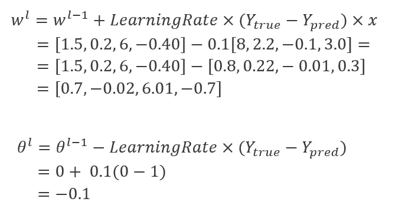

# 神经网络之旅(一)——人工神经网络和感知器

> 原文：<https://towardsdatascience.com/a-journey-through-neural-networks-part-1-artificial-neural-network-and-perceptron-e970614b9cc7?source=collection_archive---------26----------------------->

## 从生物学到 Python 代码

[纳斯蒂亚·杜尔希尔](https://unsplash.com/@dulgier?utm_source=unsplash&utm_medium=referral&utm_content=creditCopyText)在 [Unsplash](https://unsplash.com/s/photos/neural-network?utm_source=unsplash&utm_medium=referral&utm_content=creditCopyText) 上拍摄的照片(已修改)

D eep-Learning，很大一部分**人工智能**，越来越受欢迎。随着计算机变得更加强大，数据的可用性增加，模型变得更加强大，使得深度学习蓬勃发展。深度学习参与了**新冠肺炎疫苗和药物研究**(纽约时报，2020 年)、**蛋白质折叠**与 AlphaFold (DeepMind，2020 年)、在**监视** (Carnegie，2017 年)、**自动驾驶汽车** (Intellias，2020 年)和其他领域，被许多人认为是下一个*罗塞塔石碑。*

本文**提出了人工神经网络的概念**以及一个著名的模型:单层感知器**。**

**为避免信息过载**，部分概念将不作完整描述，其他神经网络模型将在未来的一篇文章中解释(敬请关注！).尽管如此，**每个主要概念都会指向一个 url** 来更深入地讨论这个主题。

## 目录

1.  **什么是深度学习**

— 1.1 *大脑与深度学习—生物激励技术*

— 1.2 *大脑和深度学习—差异*

— 1.3 *大脑和深度学习——技术的极限*

2.**机器学习术语定义**

— 2.1 *监督、半监督和无监督学习*

— 2.2 *自变量和因变量*

— 2.3 *训练、验证和测试装置*

3.**感知器，前馈神经网络的祖先**

— 3.1 *简介*

—3.2 *理论步骤*

—3.3 *应用示例*

— 3.4 *极限值*

4.**Python 中感知器类的例子**

5.**结论**

# 什么是深度学习？

你可能在两位数据科学家之间的模糊讨论中听说过深度学习，或者在网上一篇有点模糊的文章中听说过人工智能机器人将统治世界。好消息是，还没有……还没有。

深度学习是人工智能领域的一部分。牛津语言将其定义为一种“*类型的机器学习，基于人工神经网络[……]用于从数据中提取逐步更高层次的特征*。别担心，这个定义在本文的这一端会更清晰。

## 大脑和深度学习——生物启发技术

先说生物神经元。神经元是存在于大脑中的微小细胞，它们使用少量的电流和化学物质来相互交流。当你写、想、抓、喊、打或读著名的“**你好！** **克诺比将军**”，大脑特定部位一定数量的神经元点亮，产生这种行为(*图 1* )。

图一。当阅读“你好！克诺比将军……”(图片来自 [Pixabay](https://pixabay.com/images/search/brain/) )

*F.Y.I:照片中，“亮起来”的区域是韦尼克区和布罗卡区(左中—语言区)、视觉皮层(右下—视觉过程)和运动皮层的某些部分(左上—运动过程)，这些区域在语音阅读时使用。*

你可以想象，大脑中有相当数量的神经元。我们谈论的是数十亿。但是这些神经元并不是随机堆积在大脑中，希望一切顺利。事实上，你可以发现被称为**层**的**神经元**的众多结构，它们组织良好，具有**特定的神经密度、长度以及**与其他**层**的连接。你也可以**把大脑分成执行特定任务的全局区域**。例如，*顶叶皮层*用于空间任务，而*视觉皮层*主要由 7 层结构组成(*图 2* )，专门处理视觉过程。

图二。视觉皮层中不同层次的神经元。(背景图片来自[维基百科](https://en.wikipedia.org/wiki/Cerebral_cortex#:~:text=The%20cerebral%20cortex%2C%20also%20known,per%20cent%20consisting%20of%20allocortex.))

**深度学习领域复制了这种构造神经元的方式**，将其简化，诞生了人工神经网络。这个想法是一样的，用**层** **人工神经元**，每层更深一层，处理信息最终输出一些东西(*图 3* )。**神经网络的这些节点层和每个网络专门从事一个独特的**(或多或少复杂)**过程**像人脸检测、语法理解、基于文本的情感分类…

> **不管专业化程度如何，任何深度学习算法的目标都是减少预测输出和期望输出之间的误差**。他们通过更新他们模型的一些参数来做到这一点，直到误差不再减少。

图 3。取一个句子，转换成数字，通过神经网络，输出一个新的句子！

## 大脑和深度学习——差异

其中**生物神经元用于输出行为反应**，例如*举手*，**人工神经网络用于以一种或另一种形式输出数据**。可以用来将一张图片归类为“*风景*或“*城市*”，预测*何时买卖股票*，驾驶*自动驾驶汽车*等。

其中**生物神经元从经验和重复中学习**，**人工神经网络从数据中学习**。

最后，如果**生物神经元没有被充分使用，它们就会死亡**，如果**人工神经元被认为在网络中不够有用，它们就会停止处理数据**。

## 大脑和深度学习——技术的极限

大脑是无限复杂的，我们还不能用人工神经网络来复制它。此外，**生物神经元利用过程 s** 等一个[离子通道](https://pubmed.ncbi.nlm.nih.gov/8658599/)来诱发反应。我们不能用人工神经网络做同样的事情。为了模拟这些电和化学反应，**人工神经网络**(ann)**纯粹且完全基于数学函数**。

如果您需要数学概念的更新，请随时查看文章“**神经网络之旅(第 0 部分)——线性代数快速介绍**”!**在下一节中，将解释一些机器学习定义。**

# **机器学习术语定义**

**深度学习是机器学习** ( *图 4* )的一个子领域。接下来的定义适用于机器学习领域，因此也适用于深度学习领域。

图 4。机器学习算法的类型

## 有监督的、无监督的和半监督的

当你使用机器学习算法时，你需要数据来训练你的模型。该数据可以有三种类型:**标记、半标记和未标记** ( *图 5* )。

图 5。有标签和无标签数据的例子

正如你所看到的，在标记的数据中，我们知道一个 35 岁，拥有硕士学位和 8 年工作经验的人的工资是 55K 美元。**在未标注的数据中，**我们仍然知道年龄、经验和教育程度，但不知道工资是多少。如你所料，在半标签数据中，只有某些工资是已知的。

当你用**标记的数据**训练一个模型时(像*图 6* 中的回归，决策树，SVM…)，你是在执行**监督学习**。这是**最常见和最准确的学习类型**。你的**模型试图通过比较其预测输出和标签数据**来减少其误差。该模型试图**拟合**数据。

图 6。回归作为监督学习算法。这条线尽可能地符合数据。

当你**用未标记数据**训练一个模型的时候，你就是在执行**无监督学习**。该模型检查您的数据点，并尝试**猜测每个数据点是否属于特定类别**(又名。集群如图*图 7* 。**你不确定假设是否正确**，因为你没有任何标签可以和这个假设做比较。这就是为什么**无监督学习通常不太准确，人们倾向于避免它**。这样做的好处是，你不需要有标签数据，这通常是更昂贵的获取。事实上，你需要有人来标记数据，检查任何错误…

*例如，谷歌创造了一个游戏，要求玩家说出一幅图像是什么(一辆汽车？一个人？…).然后，它记录了答案，并设法创建了一个带有标签的数据集，其中包含基于这些数据的数百万条观察结果。但是花了很多年，花了很多钱。*

图 7。基于 K-均值无监督算法的数据聚类

在半监督学习中，模型使用半标记数据。

更多关于[半监督](https://jagan-singhh.medium.com/semi-supervised-learning-19e431be16e)、[无监督](https://en.wikipedia.org/wiki/Unsupervised_learning)和[监督学习](https://medium.com/machine-learning-for-humans/supervised-learning-740383a2feab)。

## *自变量和因变量*

在监督学习中，**因变量是我们试图预测的数据**。这是我们正在观察的事物，我们可以看到的行为。在我们之前的例子中，这是*工资*。但是它可能是一所房子的价格，取决于它的大小和房间数量。也可能是基于*以前的成绩*和*学习时间*的的*考试结果。**在机器学习领域，我们称之为 *y* 向量** *。**

> 如果 *y* 指的是我们数据集中的标签数据，那么我们通常称之为 *yₜᵣᵤₑ.*
> 
> 如果 *y* 指的是我们的模型预测的值，我们通常称之为 yₚᵣₑ (pre for prediction)
> 
> 任何机器学习的目标都是缩小 yₜᵣᵤₑ和 yₚᵣₑ之间的差异！

**在监督、非监督和半监督学习中，独立变量是我们的模型用来预测我们的向量*y*的值。这是**可能对观察值**产生** **影响。年龄、工作经验和文凭可能会影响薪水。房间的数量和房子的表面积会对它的价格产生影响。在机器学习领域，我们称这个**独立变量矩阵为*特征*** ，我们通常称之为*x .***

**注——在数学中，大写字母通常指矩阵。小写字母通常指向量。因此* y *是向量，* x *是特征向量，* X *是特征矩阵！**

*[机器学习中更多的](https://www.dailysmarty.com/posts/difference-between-independent-and-dependent-variables-in-machine-learning)依赖于因变量和自变量。*

## **训练、验证和测试装置**

*构建机器学习模型是一个迭代过程。你通常**在你的模型中设置初始参数，并改变这些参数**直到你找到最佳组合(又名。你的预测和你想要的 *y* 值之间的误差最小。*

*在这个迭代过程中，**我们将数据分成 3 类** ( *图 8* ) **:***

1.  **一个* ***车组*** *，反复使用调整参数**
2.  **一个* ***验证集*** *，允许您检查在训练阶段所做的调整是否正确**
3.  **一个* ***测试集*** *，这是验证我们模型的最后一步。一旦我们确定我们的模型运行良好，我们就把它应用到最后一组，这将给我们最终模型的准确性。**

**

*图 8。训练-验证-测试集中的数据拆分*

***为什么在构建模型时要将数据集分成 3 份？***

*以足球为例。**你执教一支名为****学员**的足球队。你的目标是**赢得每一场比赛**。你开始训练“**学员**”对抗另一个叫做“**学员**”的团队。*

*每场比赛后，你**完善你的团队战略，你的位置和你的球员**。现在到了**不能再做调整的时候**，**你赢了每一场对“火车人”的比赛**。你可能会想:“*哇，我的团队是最棒的，他们远远超过了其他团队，一定非常棒*”。*

*但是在你和新球队的第一场比赛中，你输了。很难。你的团队只是被训练和打磨过，以便在与对手的对抗中表现出色。它特别学会了与这支球队对抗，而不是推广到其他球队。*

> *用机器学习的术语来说，我们说模型过度拟合了数据。*

*你已经从错误中吸取了教训。你带着你的团队，对着“**车队**进行训练，但这次，**在每次调整后，你都要对着另一个叫做 Bulk** 的车队验证你的策略。此外，你决定找一个**第三个对手**，它将在所有训练-调整-验证阶段结束时用于进行**实际测试**。祝贺你，你已经创建了一个训练集(The Trainies)，一个验证集(The Bulk)和一个测试集(The 无名的第三个对手)。**这可以防止过度拟合和改变特定数据集的参数，而** **允许将模型推广到其他数据。***

> *将数据划分到训练-验证-测试集中总是一个好主意。比例由你决定，但通常是 70%/20%/10%。*

*[关于数据集分割的更多信息](https://medium.datadriveninvestor.com/k-fold-cross-validation-6b8518070833)。*

# ***感知器，所有前馈神经网络的祖先***

> *"神经网络就像回归或 SVM 模型一样，是一种数学函数."安德烈·布尔科夫*

## *介绍*

*正如你之前看到的，人工神经网络可以**粗略地比作大脑**。最初由神经生理学家和数学家在 1943 年([麦卡洛克和皮茨，1943](https://www.cs.cmu.edu/~./epxing/Class/10715/reading/McCulloch.and.Pitts.pdf) )作为命题逻辑单元(和/或)提出，人工神经网络的第一个**实用**想法后来由认知心理学家([罗森布拉特，1958](https://www.ling.upenn.edu/courses/cogs501/Rosenblatt1958.pdf) )提出。*

*罗森布拉特基于大脑的生物结构创造了一个电子设备，它可以通过反复试验来学习输入。他诞生了**感知器**。这个网络由一个**输入层**、一个**隐藏层**和一个**输出层** ( *图 1* )组成，隐藏层由**一个或多个称为 TLU 的节点(**阈值逻辑单元)组成。 **TLU 由加权和函数和阶跃函数**组成。*

**

*图一。在隐藏层有一个 TLU 节点的单层感知器*

## *理论步骤*

*在感知器中，我们**将输入 xᵢ乘以权重向量 wᵢ** 。然后我们计算**加权和 wₛᵤₘ=σxᵢwᵢ**，这**给我们一个单一的数字**，并且**通过一个阶跃函数** ( *图 2* )。该函数简单地将 Wₛᵤₘ与阈值θ进行比较。如果 Wₛᵤₘ ≥ θ，则阶跃函数输出 1。否则输出 0 **。***

**

*图二。θ = 0.25 的阶跃函数 s(x)示例。如果 xᵢ ≥ θ，则 s(xᵢ) = 1.0。否则，s(xᵢ) = 0。*

*如果模型预测值 *yₚᵣₑ* 等于期望值 *yₜᵣᵤₑ* ，则模型成功。否则，使用两个公式更新**权重和阶跃函数阈值**:***=wˡ⁻+学习率×(yₜᵣᵤₑ—yₚᵣₑ)×*x******，*和 ***θˡ =θˡ⁻ —* 学习率× (Yₜᵣᵤₑ — yₚᵣₑ)****

## **应用示例**

****

**图 3。感知器网络步骤。在将输出与真实值 Y 进行比较之后，完成权重的更新**

**单层感知器(*图 3* )取一个输入向量 *x* = [8，2.2，-0.1，3.0]。权重随机设置为*w*=【1.5，0.2，6，-0.40】。初始阶跃函数设置为θ = 0。我们希望我们的模型，基于 x 值，输出 yₜᵣᵤₑ = 0。让我们看看是不是这样:**

1.  **计算加权和σxᵢwᵢ=(8 * 1.5)+(2.2 * 0.2)+(-0.1 * 6)+(3 *-0.40)=**10.64****
2.  **将阶跃函数应用于 **10.64** ，这给了我一个预测 ***yₚᵣₑ* = 1** 。**
3.  *****yₜᵣᵤₑ*= 0*****yₚᵣₑ*= 1**，因此 ***yₜᵣᵤₑ* ≠yₚᵣₑ** 。模型没有给我一个好的预测。我需要更新权重！**
4.  **用θ = 0，学习率 *=* 0.1， *yₜᵣᵤₑ* = 0， *yₚᵣₑ* = 1， *w* = [1.5，0.2，6，-0.40]， *x* = [8，2.2，-0.1，3.0]:**

****

**5.计算新的**加权和σ**xᵢδwᵢ= 2.85**

**6.将阶跃函数(参数θ = -0.1)应用于这个新结果，得到 yₚᵣₑ！= yₜᵣᵤₑ.我们的模型仍然是错误的…让我们再来一次:**

**7.用θ = -0.1，学习率 *=* 0.1， *yₜᵣᵤₑ* = 0， *yₚᵣₑ* = 1， *w* = [0.7，-0.02，6.01，-0.7]和 *x* = [8，2.2，-0.1，3.0]:**

****

**8.计算新的**加权和σ**xᵢδwᵢ=-4.93**

**9.将阶跃函数(参数θ = -0.2)应用于这个新结果，得到 yₚᵣₑ = yₜᵣᵤₑ！**

****模型现在成功预测了产量，给出了 *x* 和新的权重！**如果模型不能给我一个正确的预测，我重复第 7 步到第 9 步，直到它给我一个正确的预测！**

****

**图片由[at ree23](https://pixabay.com/users/athree23-6195572/?utm_source=link-attribution&utm_medium=referral&utm_campaign=image&utm_content=3695073)从 [Pixabay](https://pixabay.com/?utm_source=link-attribution&utm_medium=referral&utm_campaign=image&utm_content=3695073) 获得**

## **限制**

**问题是，**单层感知器太简单了**。比如不能解决[异或(XOR)分类问题](https://medium.com/@jayeshbahire/the-xor-problem-in-neural-networks-50006411840b#:~:text=The%20XOr%2C%20or%20%E2%80%9Cexclusive%20or,gates%20given%20two%20binary%20inputs.&text=XOr%20is%20a%20classification%20problem,outputs%20are%20known%20in%20advance.)。此外，在感知机被开发出来的时候，计算能力有些有限，这导致了在随后的几十年里对神经网络的兴趣下降。后来，一个**多层感知器**模型解决了最初单层感知器的一些限制，它成为了第一个**前馈神经网络**(这个网络将在**“神经网络之旅”** ) **的下一篇文章中介绍)。****

# **Python 中感知器类的简单例子**

> **对于那些想看 python 中感知器的简单代码实现的人，请跟着做吧！**

****我们需要导入** `**numpy**` **这是一个著名的用于数据科学的库**。它让我们做一些矩阵/向量/数学运算，如**矩阵求逆、**等。，是一个真正节约资源的包。我们将使用 numpy 计算我们的**矢量化矩阵运算。查看** [**此处**](https://numpy.org/doc/stable/) **的 numpy 文档。****

**好了，现在我们需要创建我们的**感知器类**，它将包含**拟合和预测方法**。正如你所看到的，感知器类只有 4 个参数 **: learning_rate，** *，它定义了我们的感知器学习的速率*， **n_iter，** *，它定义了历元的数量*(用于训练我们的模型的~循环)， **bias** ，*，它们让你选择是否要在你的模型*和**θ***中添加一个 bias 参数***

**我们的**权重被设置为 None** ，当我们调用 perceptron.fit()方法时**将被初始化。 **init_weight 属性用于避免多个权重**的初始化(它帮助我们的模型知道权重是否已经初始化)。****

***注意——建议您创建一个 docstring 来解释参数和属性、类返回的内容以及可能出现的错误。方法也应该被适当地描述。***

**现在，让我们创建我们的拟合函数。这种方法用于将我们的模型与数据(又名。更新权重以适合数据)。正如我们对应用示例所做的那样，如果模型预测不正确，我们需要计算***=wˡ⁻+学习率× (Yₜᵣᵤₑ — yₚᵣₑ)× *x 和ˡ =θˡ⁻ —* 学习率× (Yₜᵣᵤₑ — yₚᵣₑ)*** *。在代码的第一部分，权重被初始化(有或没有偏差，取决于偏差参数值)。**代码的第二部分循环通过由 **n_iter** 设置的迭代次数**，并且**在每个时期更新权重和θ**(*阶跃函数阈值*)。通常，如果有偏差或没有偏差，**代码略有不同，因此出现了** `**if bias**`条件。***

**最后，预测方法，它使用 numpy 的惊人的`**np.where()**`方法实现了一个**阶跃函数。它所做的只是将每个`net_input(x)`值与θ进行比较，如果`net_input(x)` ≥ θ，则将值设置为 1。否则，它会将`net_input(x)`设置为 0。****

**这就对了。你得到了一个**基础感知类**。你可以添加一个`.score()`方法，**将其修改为 multioutput，将阶跃函数改为单位阶跃**或成对阶跃函数……我会让你好好享受它的。**

# **结论**

****祝贺阅读本文**。完整地、小块地、只有几个段落或只是欣赏图片，你现在对数据科学和深度学习的世界有了更多的了解。**

****深度学习的主题很复杂**，你永远不要害怕花时间去理解这个主题。继续看文章，教程，应该就没事了！为了帮助你记住本文的主要部分，这里有一个总结:**

**记住**神经网络是数学函数**，即**需要数据来学习**。你的目标是**获取大量(带标签的)数据**，**通过输入→隐藏→输出层。**网络会学习(又名。**每次给他相同的数据时，更新权重和偏置**)多一点。**这种重复传递相同数据的过程称为历元**。最后，您通过传递您的测试数据集来验证您的模型，这将为您提供模型的最终准确性。**

**非常感谢您阅读这篇文章。祝您愉快！S **tay 收听了“神经网络之旅”的下一篇文章**，它将讨论**前馈神经网络**！这些是更复杂的神经网络。**

# **神经网络系列之旅**

** [## 神经网络之旅(第 0 部分)——线性代数快速入门

### 深度学习中使用的核心线性代数概念的更新

pierre-louis-weiss.medium.com](https://pierre-louis-weiss.medium.com/a-journey-through-neural-networks-part-0-fast-introduction-to-linear-algebra-e9f9ffa46513) 

# 参考

1.  m . AlQuraishi(2019 年)。CASP13 的 AlphaFold，*生物信息学*，35 (22)，*第 4862–4865 页。*[https://doi.org/10.1093/bioinformatics/btz422](https://doi.org/10.1093/bioinformatics/btz422)
2.  布尔科夫，A. (2019)。一百页的机器学习书
3.  费尔德斯坦，S. (2019)。[AI 监控的全球扩张——卡内基国际和平基金会](https://carnegieendowment.org/2019/09/17/global-expansion-of-ai-surveillance-pub-79847)
4.  Géron，A. (2019)。使用 Scikit-Learn、Keras & Tensorflow 进行机器学习。第二版。奥赖利。
5.  Hastie，Tibshirani，r .，Friedman，J. (2017 年)。统计学习的要素。数据挖掘、推理和预测。第二版。施普林格。
6.  海丁 V. (2020)。联网汽车平台的大数据:引擎盖下是什么？。[互联汽车平台:用大数据驱动未来——Intellias](https://www.intellias.com/big-data-for-connected-car-platforms/)。
7.  麦卡洛克，W.S .，皮茨，w.《神经活动中固有观念的逻辑演算》。*数学生物物理学通报* **5，**115–133(1943)。[https://doi.org/10.1007/BF02478259](https://doi.org/10.1007/BF02478259)
8.  罗森布拉特 f(1958)。感知器:大脑中信息存储和组织的概率模型。*心理复习*， *65* (6)，386–408。[https://doi.org/10.1037/h0042519](https://doi.org/10.1037/h0042519)
9.  Sah P. (1996 年)。神经元中 ca(2+)-激活的 K+电流:类型、生理作用和调节。*神经科学趋势*， *19* (4)，150–154。[https://doi . org/10.1016/s 0166-2236(96)80026-9](https://doi.org/10.1016/s0166-2236(96)80026-9)**