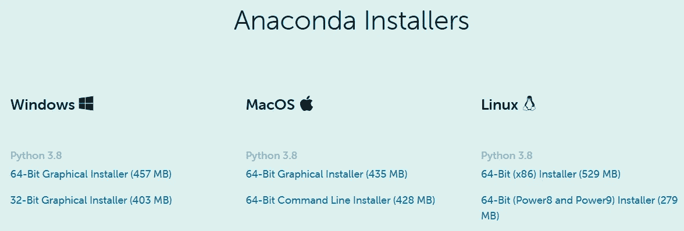
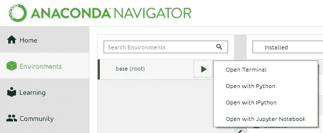
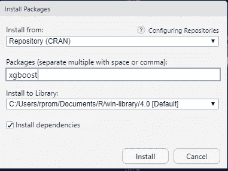

# XGBoost 之旅:里程碑 1

> 原文：<https://towardsdatascience.com/a-journey-through-xgboost-milestone-1-ff1be2970d39?source=collection_archive---------12----------------------->

## 设置背景

马丁·亚当斯在 [Unsplash](https://unsplash.com/s/photos/drive?utm_source=unsplash&utm_medium=referral&utm_content=creditCopyText) 上的照片

欢迎来到另一个文章系列！这一次，我们讨论的是 **XGBoost** **(极限梯度提升)**——21 世纪数据科学家中领先且最受青睐的机器学习算法。大多数人说 XGBoost 是一种赚钱的算法，因为它很容易超越任何其他算法，给出尽可能好的分数，并帮助其用户从数据科学竞赛中获得豪华现金奖励。

我们正在讨论的主题既广泛又重要，因此我们将通过一系列文章来讨论它。这就像一次旅行，对新人来说可能是一次漫长的旅行。我们一步一步地讨论整个话题。在这里，每个子主题被称为一个*里程碑*。当您完成所有里程碑的旅程时，您将在以下方面拥有丰富的知识和实践经验(使用 R 和 Python 有效地实现算法)。实现算法时，默认的编程语言是 Python。重要的地方我会偶尔用 R。

*   **里程碑 1:** 设置背景
*   **里程碑 2:** 使用 XGBoost 分类
*   **里程碑 3:** 使用 XGBoost 进行回归
*   **里程碑 4:** 通过交叉验证评估您的 XGBoost 模型
*   **里程碑 5:** XGBoost 的超参数调优
*   里程碑 6: 为 XGBoost 准备好数据
*   **里程碑 7:** 用 XGBoost 构建管道

## 先决条件

我假设你已经熟悉了流行的 Python 库如 **numpy** 、 **pandas** 、 **scikit-learn** 等并使用过 **Jupyter Notebook** 和 **RStudio** 。建议对交叉验证、机器学习管道等机器学习技术以及决策树、随机森林等算法有很好的了解和理解。你也可以通过阅读以下我之前写的内容来刷新你的记忆。

*   [使用决策树训练回归模型](/train-a-regression-model-using-a-decision-tree-70012c22bcc1)
*   [随机森林——决策树的集合](/random-forests-an-ensemble-of-decision-trees-37a003084c6c)
*   [用简单的英语解释 k 重交叉验证](/k-fold-cross-validation-explained-in-plain-english-659e33c0bc0)
*   [具有机器学习流水线的多项式回归](/polynomial-regression-with-a-machine-learning-pipeline-7e27d2dedc87)

# 设置编码环境

在进行任何机器学习任务之前，有必要设置您的本地机器。对于 Python 和 R 用户来说，获取 Python、R 和其他数据科学库最简单的方法就是通过 **Anaconda** 安装。对于数据科学来说，它是 Python 和 R 的最受欢迎的发行版。它包括所有的东西:数百个包，ide，包管理器，导航器等等。它还提供了安装新库的工具。您需要做的就是通过 Anaconda 终端运行相关的命令。要开始使用 Anaconda:

*   转到[https://www.anaconda.com/products/individual](https://www.anaconda.com/products/individual#Downloads)
*   点击相关的下载选项
*   下载安装文件后，双击它并按照屏幕上的说明在本地机器上安装 Anaconda

Anaconda 安装程序选项(图片来自 Anaconda 官网)

安装后，您可以在桌面上找到图标。双击它启动 **Anaconda Navigator** 。大多数常用的软件包，如 numpy、pandas、scikit-learn，都已经附带了 Anaconda。您不需要单独安装它们。但是，XGBoost 包不是一个内置的包。我们需要手动安装它。如果您使用的是 Windows 操作系统，

*   就去[https://anaconda.org/anaconda/py-xgboost](https://anaconda.org/anaconda/py-xgboost)
*   只需复制**conda install-c anaconda py-xgboost**
*   打开 Anaconda 导航器
*   点击**环境**选项卡，然后点击向右箭头**基本(根)**
*   从下拉菜单中选择**打开端子**。
*   现在应该会出现一个新窗口。粘贴**conda install-c anaconda py-xgboost**并点击回车。
*   按照说明完成安装

通过 Anaconda 终端安装 XGBoost(图片由作者提供)

现在通过 Anaconda Navigator 启动 Jupyter 笔记本。形成 Jupyter 主页，打开 Python 3 笔记本并运行

**将 xgboost 导入为 xgb**

如果没有错误，您已经成功安装了 Python 的 XGBoost 包。现在您已经准备好使用 Python 中的 XGBoost 包了

注意:如果您使用的是 MacOS 或 Linux，

*   前往[https://anaconda.org/conda-forge/xgboost](https://anaconda.org/conda-forge/xgboost)
*   复制**康达安装-康达锻造 xgboost**
*   重复以上相同的步骤

也可以在 Jupyter Notebook 中使用 XGBoost 配合 R 编程语言。要在 Jupyter 笔记本中安装并运行 R:

*   启动 Anaconda 导航器
*   要安装 R 语言和 r-essentials 包，选择**环境**创建一个新环境。点击**创建**。
*   将环境命名为“ **R** ”。在**包**旁边，选择 Python 版本(此时为 Python 3.8)和 r，从下拉菜单中选择 **r** 。点击**创建**。
*   等到安装完成。点击箭头右边的 **R**
*   从下拉菜单中选择**打开端子**。
*   现在应该会出现一个新窗口。运行**康达安装-c r r-xgboost**
*   按照说明完成安装
*   安装后，再次点击箭头右侧的 **R** 。**选择**用 Jupyter 打开笔记本选项。
*   要为 R 语言创建新笔记本，在 Jupyter 笔记本菜单中，选择**新建**，然后选择 **R** 。
*   在新笔记本中运行**库(" xgboost")** 。
*   如果没有错误，您已经成功地为 R 安装了 XGBoost 包。现在，您可以在 Jupyter Notebook 中使用 XGBoost 包了。

要在 RStudio 中安装 XGBoost:

*   启动 RStudio。
*   转到**工具**标签，然后**安装包**。
*   在新窗口中，在**包**字段中输入 **xgboost** 。
*   点击**安装**。

作者图片

**注意:**或者，您可以在 R 终端中运行**install . packages(" xgboost ")**在 RStudio 中安装 XGBoost。

# XGBoost 所需的背景知识

## 决策树

**决策树**是一种非参数监督学习方法，能够发现数据中复杂的非线性关系。他们可以执行分类和回归任务。决策树是 XGBoost 模型的基础。

XGBoost 是一种由不同的机器学习模型组成的集成(组)方法。XGBoost 中组成系综(组)的各个模型被称为**基础学习者**。最常用的 XGBoost 基础学习器是决策树。这就是为什么决策树中的知识在学习 XGBoost 时如此重要。

阅读以下资源，了解更多关于决策树的信息。

*   [使用决策树训练回归模型](/train-a-regression-model-using-a-decision-tree-70012c22bcc1)
*   [sci kit-learn 中的决策树分类器](https://scikit-learn.org/stable/modules/generated/sklearn.tree.DecisionTreeClassifier.html)
*   [sci kit-learn 中的决策树回归器](https://scikit-learn.org/stable/modules/generated/sklearn.tree.DecisionTreeRegressor.html)

## 随机森林

***随机森林*** 是当今最强大的机器学习算法之一。它是一种*监督的*机器学习算法，可用于**分类**(预测离散值输出，即一个类)和**回归**(预测连续值输出)任务。

像 XGBoost 一样，随机森林是决策树的集合(组)。在随机森林中，每棵决策树通过**打包**(引导聚集)进行组合。你可以通过阅读下面这篇我写的文章来了解更多关于装袋和随机森林的知识。

*   [随机森林——决策树的集合](/random-forests-an-ensemble-of-decision-trees-37a003084c6c)

还建议看一看 Scikit-learn 关于随机森林算法的官方文档。

*   [sci kit-learn 中的随机森林分类器](https://scikit-learn.org/stable/modules/generated/sklearn.ensemble.RandomForestClassifier.html)
*   [sci kit-learn 中的随机森林回归器](https://scikit-learn.org/stable/modules/generated/sklearn.ensemble.RandomForestRegressor.html)

## 弱学习者对强学习者

一个**弱学习器**是一个机器学习算法，比概率稍微大一点。例如，预测略低于 50%的决策树可以被认为是弱学习者。

一个**强学习者**，相比之下，是一个机器学习算法，它从数据中学习了很多，表现相当好。

## 装袋与增压

如果你读过我以前的文章，[随机森林——决策树的集合](/random-forests-an-ensemble-of-decision-trees-37a003084c6c)，你现在对**装袋**已经很熟悉了。在随机森林中，每棵树都通过**装袋**组合在一起。

XGBoost 通过 **boosting** 合并树，这是一种从以前的树所犯的错误中学习的方法。Boosting 通过数百次迭代将弱学习者转化为强学习者。

# 摘要

在本文中，我们刚刚开始 XGBoost 之旅。有许多里程碑需要完成。我们还为整个旅程制定了一个大纲。

随着我们的进展，您将了解 XGBoost 如何在幕后工作。在接下来的里程碑中，您还将获得实现 XGBoost 算法的实践经验。所以，阅读接下来的文章很重要。我会尽快出版它们。敬请关注最新消息！

感谢阅读！

本教程由 [*鲁克山·普拉莫迪塔*](https://www.linkedin.com/in/rukshan-manorathna-700a3916b/)*[数据科学 365 博客](https://medium.com/data-science-365)作者设计创作。*

*阅读我在 https://rukshanpramoditha.medium.com[的其他文章](https://rukshanpramoditha.medium.com/)*

*2021–03–02*