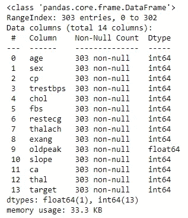
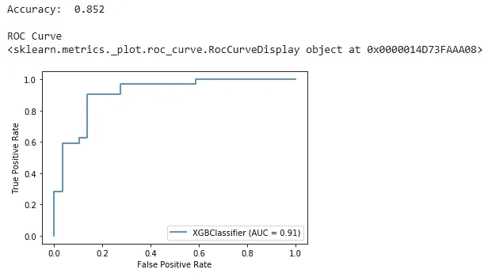
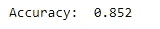
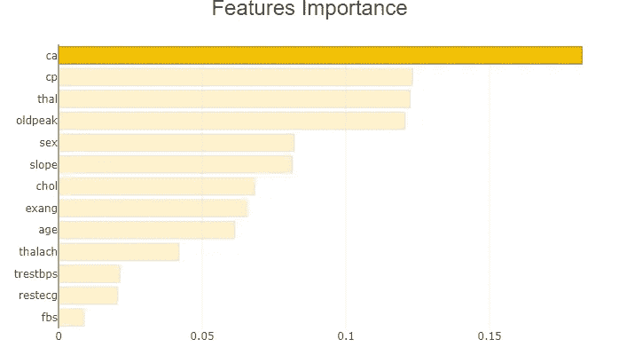
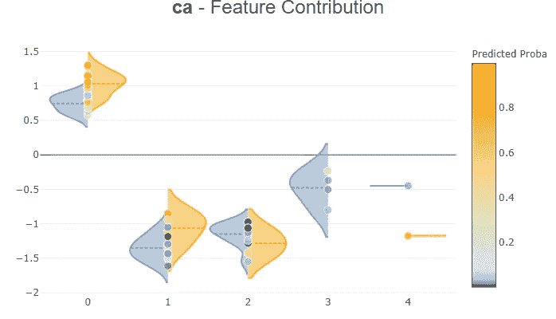
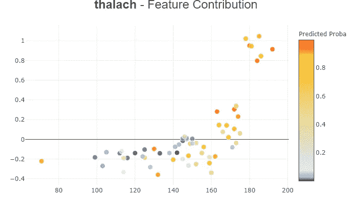
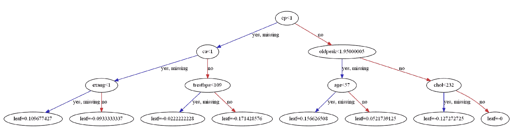

# XGBoost 之旅:里程碑 2

> 原文：<https://towardsdatascience.com/a-journey-through-xgboost-milestone-2-f3410109be5a?source=collection_archive---------14----------------------->

## 使用 XGBoost 分类


马丁·亚当斯在 [Unsplash](https://unsplash.com/s/photos/drive?utm_source=unsplash&utm_medium=referral&utm_content=creditCopyText) 上的照片

欢迎来到**【XGBoost 之旅】**系列第二篇。今天，我们将在“心脏病”数据集上构建我们的第一个 XGBoost 模型，并制作一个小的(但有用的)web 应用程序来与最终用户交流我们的结果。以下是我们今天讨论的话题。

## 我们讨论的话题

*   形成一个分类问题
*   识别特征矩阵和目标向量
*   构建 XGBoost 模型(Scikit-learn 兼容的 API)
*   描述**【准确性】**和**【ROC 曲线下面积】**指标
*   解释 XGBoost 分类器超参数
*   构建 XGBoost 模型(与 Scikit-learn 不兼容的 API)
*   XGBoost 的数据矩阵
*   用 **Shapash** Python 库为我们的 XGBoost 模型创建一个小的 web 应用程序
*   做一些奇特的想象

## 先决条件

在继续之前，请确保您已经阅读了 XGBoost 系列的第一篇文章([**XGBoost 之旅:里程碑 1 —设置背景**](/a-journey-through-xgboost-milestone-1-ff1be2970d39) )。这将帮助您设置自己的计算机来运行和试验这里讨论的代码。除此之外，我还假设您对 Python Scikit-learn ML 库有基本的了解。

我们开始吧！

## 心脏病数据集

今天，我们在“心脏病”数据集上构建了我们的第一个 XGBost 模型([此处下载](https://drive.google.com/file/d/19s5qMRjssBoohFb2NY4FFYQ3YW2eCxP4/view?usp=sharing))。下图显示了数据集的前 5 行。


“心脏病”数据集的前 5 行(图片由作者提供)

下图包含由 Pandas **info()** 方法返回的数据集的信息。



“心脏病”数据集的有用信息(图片由作者提供)

数据集没有缺失值。所有的值都是数字。因此，不需要预处理步骤，数据集就可以使用了。该数据集有 303 个观测值和 14 个特征(包括“目标”列)。

现在，我们定义我们的问题陈述。

## **问题陈述**

基于年龄、性别、cp、…、thal，我们想要预测一个给定的人(一个新的实例)是否患有心脏病(1 级)。这是一个分类问题，因为它的结果是一个离散值(一个已知的类)。我们用来解决这个分类问题的算法是 XGBoost (XGBClassifier)。因此，我们将为这个分类问题构建一个 XGBoost 模型，并使用模型的评估指标(如准确性和 ROC 曲线下的面积)来评估它在测试数据(看不见的数据/新实例)上的性能。

我们提供特性矩阵和目标列作为 XGBoost 模型的输入数据。

*   **特征矩阵:**称为 **X** 。包括除“目标列”之外的所有列。该矩阵可以是熊猫数据帧或二维 numpy 阵列的形式。
*   **目标矢量:**称为 **y** 。包括数据集的“目标列”。这个向量可以是熊猫序列或一维 numpy 数组的形式。

之后，XGBoost 模型(带有用户自定义参数)会根据 **X** 和 **y** 学习规则。基于这些规则，我们对新的或未知的数据进行预测。

让我们通过编写 Python 代码构建我们的第一个 XGboost 模型来获得实践经验。

# 构建 XGboost 模型

这里，我们讨论两种情况。

*   使用 Scikit-learn 兼容 API 构建模型
*   使用 XGBoost 自己的非 Scikit-learn 兼容 API 构建模型

随着我们的进展，您将会看到这两个 API 之间的区别。

## 使用 scikit-learn 兼容 API 构建模型

构建 XGBoost 模型最简单的方法是使用它的 Scikit-learn 兼容 API。**“sci kit-learn 兼容”**表示您可以使用 Scikit-learn **。fit() /。用 XGBoost 预测()** **范式**。如果你以前用过 Scikit-learn，这里就没有什么新东西了。让我们编写完整的 Python 代码来构建 XGBoost 模型。

等到加载 Python 代码！(代码片段-1)

上述代码段的输出是:



作者图片

**准确率:85.2%** —这是测试集上所有正确预测的总和除以测试集中的观察总数。我们的模型正确地预测了 100 次观察中的 85 次。这个准确度分数对于初始模型来说并不差，因为我们还没有用最优超参数组合来调优模型(模型调优部分将在 XGBoost 系列的第 5 篇文章中讨论)。

**注:**如果您在 **train_test_split()** 函数中为 **random_state** 参数设置不同的整数值，您会得到略有不同的精度分数。我们将在 XGBoost 系列的第 4 篇文章中解决这个问题。

**ROC 曲线下面积:91%** — ROC 是概率曲线，曲线下面积(AUC)是类别可分性的度量。AUC 表明模型能够区分多少类别。AUC 越高，模型预测 0 为 0，1 为 1 越好。非常差的模型的 AUC 接近 0。如果一个模型的 AUC 为 0.5，则该模型根本没有类别分离。91%的 AUC 对于我们的模型来说是一个非常好的值。它有很强的区分这两个阶级的能力。

让我们一行一行地解释上面的 Python 代码。

首先，我们导入所有必要的带有社区标准约定的库( **xgboost →xgb** 、 **numpy →np** 等)。然后我们用 Pandas **read_csv()** 函数加载数据集。数据集在同一个工作目录中。然后我们创建 **X** 和 **y** 。通过混洗数据集，我们为 **X** 和 **y** 创建了训练和测试集。这是因为我们需要用训练集训练我们的模型，用测试集评估我们的模型——新的或看不见的数据。我们从不使用训练阶段使用的相同数据来测试我们的模型。如果您这样做，您将获得更好的准确性分数，但是模型将无法对新的或看不见的数据进行归纳，并且对新的或看不见的数据的预测将不会准确。

然后我们从 **XGBClassifier()** 类创建一个 XGBoost 对象(称为 **xgb_clf** )。用于分类的 XGBoost 模型被称为 **XGBClassifier** 。我们在 **XGBClassifier()** 类中指定了 6 个超参数。

*   这里，XGBoost 使用决策树作为基础学习器。通过设置 **max_depth=3** ，每棵树将进行 3 次分割并在那里停止。
*   **n_estimators=100:** 集合中有 100 棵决策树。
*   **objective = ' binary:logistic ':**我们的模型中使用的损失函数的名称。**二进制:逻辑**是 XGBoost 中二进制分类的标准选项。
*   **booster='gbtree':** 这是 ML 模型在每一轮 boosting 中使用的基础学习者类型。**‘GB tree’**是 XGBoost 默认基础学习者。使用 **booster='gbtree** '，XGBoost 模型使用决策树，这是非线性数据的最佳选择。
*   **n_jobs=2:** 使用处理器的两个内核进行并行计算来运行 XGBoost。
*   **random_state=1:** 控制创建树的随机性。您可以使用任何整数。通过为 **random_state** 指定一个值，您将在代码的不同执行中获得相同的结果。

使用上述超参数创建模型后，我们使用训练集对其进行训练。然后，我们在测试集上进行预测。最后，我们使用两个评估指标评估该模型——准确性和 ROC 曲线下面积。

接下来，我们通过运行 XGBoost 自己的非 Scikit-learn 兼容 API 获得了相同的结果。

## 使用 XGBoost 自己的非 Scikit-learn 兼容 API 构建模型

创建 XGBoost 模型的另一种方法是使用 XGBoost 自己的非 Scikit-learn 兼容 API。**“不兼容 Scikit-learn”**表示您不能使用 Scikit-learn **。fit() /。predict()范型**和其他一些 Scikit-learn 类。让我们编写完整的 Python 代码来构建 XGBoost 模型。

等到加载 Python 代码！(代码片段-2)

上述代码段的输出是:



准确率评分和上一个一模一样！这个 API 的主要区别在于，我们显式地创建了一个名为 **DMatrix** 的特殊数据结构，这是一个由 **XGBoost** 使用的内部数据结构。函数的作用是:将类似数组的对象转换成矩阵。在 scikit-learn 兼容 API for XGBoost 中，这种转换发生在后台，我们不需要显式创建 DMatrices。使用 DMatrices 时，该算法针对内存效率和训练速度进行了优化。

该 API 的其他不同之处包括:

*   为了训练模型，我们使用 XGBoost 自带的 **train()** 函数。之前，我们使用 Scikit-learn **fit()** 方法来训练模型。
*   预测以概率的形式返回。我们需要将它们转换成类(整数:0 和 1)
*   对于这个 XGBoost 模型，我们不能使用一些 Scikit-learn 函数。例如，我们不能将 **plot_roc_curve()** 函数与使用此 API 创建的 XGBoost 模型一起使用。

注意:只要有可能，我推荐你使用 XGBoost scikit-learn 兼容的 API。这是因为它的语法非常一致且易于使用。除此之外，我们还可以充分利用所有的 Scikit-learn 库函数。

# 创建一个小型 web 应用程序，与最终用户讨论 XGBoost 模型

在这里，我们利用了 **Shapash** Python 库的优势，该库旨在使机器学习模型能够被没有太多技术知识但有兴趣看到可视化结果的最终用户解释和理解。只需几行代码(也许 5 或 6 行)，我们就可以毫不费力地用 **Shapash** 做出一些奇特的可视化效果。让我们开始吧。

**注:**要了解更多关于 **Shapash** Python 库的信息，请阅读其[官方文档](https://shapash.readthedocs.io/en/latest/overview.html#getting-started-3-minutes-to-shapash)。

## 装置

只需在 Anaconda 命令提示符下运行以下命令来安装 **Shapash** 。安装后，你可以用 Python 在你的 Jupyter 笔记本中使用 **Shapash** 。

```
pip install shapash --user
```

## **制作网络应用**

使用 XGBoost scikit-learn 兼容的 API 创建 XGBoost 分类模型后(运行上面的**代码片段-1** ，执行以下代码创建 web 应用程序。 **xpl** 对象的 **compile()** 方法将 X ( **X_test** )、XGboost 模型( **xgb_clf** )的测试数据和预测作为与 **X_test** 具有相同索引的熊猫序列。预测的数据类型(y_pred_as_series)应该是 integer 或者 float(我们需要明确定义为 dtype=np.int 或者 dtype=np.float)。否则，您将得到一个错误。

等到加载 Python 代码！(代码片段-3)

运行后，web 应用程序链接现在应该出现在 Jupyter 输出中(作为下图中的第二个链接)。点击它启动网络应用程序。


作者图片

你可以看到一些奇特的可视化效果(特性重要性图，特性贡献图，局部解释图)。最棒的是你可以和这些情节互动。观看下面 50 秒的视频，了解我如何在这个 web 应用程序中与情节进行交互。

XGBoost Web 应用程序演示(视频由作者提供)

在这个 web 应用程序中，您甚至可以下载单个地块并将其保存在本地计算机上。你可以根据你试图解决的问题来解释它们。例如，您可以使用特征贡献图来回答诸如“我的模型中的特征如何影响预测？”。

以下是从 **Shapash** 库中创建的一些图。

**特征重要性图**



作者图片

**特征贡献图(分类变量的小提琴图)**



作者图片

**特征贡献图(连续变量的散点图)**



作者图片

为了完成这篇文章，我将可视化一个单独的决策树 XGBoost 模型中的基础学习者。下面的代码显示并保存了模型中的第一个决策树(索引为 0)。

等到加载 Python 代码！(代码片段-4)

输出是:



可视化 XGBoost 基础学习者(图片由作者提供)

# 摘要

在 XGBoost 文章系列的第一篇文章中，我们刚刚开始了 XGBoost 之旅。在那里，我们设置了在我们自己的计算机上运行 XGBoost 的环境。更进一步，在本文中，我们用 XGBoost 完成了一个分类任务。我们已经讨论了支持 XGBoost 的两个 API 之间的区别。不仅如此，我们还制作了一个小的(但是有用的)web 应用程序来与最终用户交流我们的模型。最棒的是，我们只编写了 5 行额外的代码来创建 web 应用程序。web 应用程序非常具有交互性。添加文章结尾，我添加了一些花哨的可视化。

下一步是什么？我们还没有讨论 XGBoost 的数学背景。在下一篇文章中，我将使用 XGBoost 构建一个回归模型。在那里，我还会讨论“制定 XGBoost 的学习目标”等数学背景。在本文中，更多的重点放在了技术和编码部分，这对于在真实世界数据集上实现该算法非常有用。现在，您将拥有实现算法和为最终用户可视化结果的实践经验。

请继续关注 XGBoost 系列的下一篇文章的更新！

感谢阅读！

本教程由 [*鲁克山·普拉莫迪塔*](https://www.linkedin.com/in/rukshan-manorathna-700a3916b/)*[数据科学 365 博客](https://medium.com/data-science-365)作者设计创作。*

*在 https://rukshanpramoditha.medium.com[阅读我的其他文章](https://rukshanpramoditha.medium.com/)*

*2021–03–07*