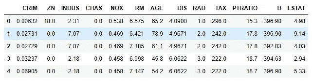
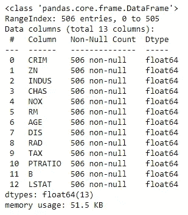
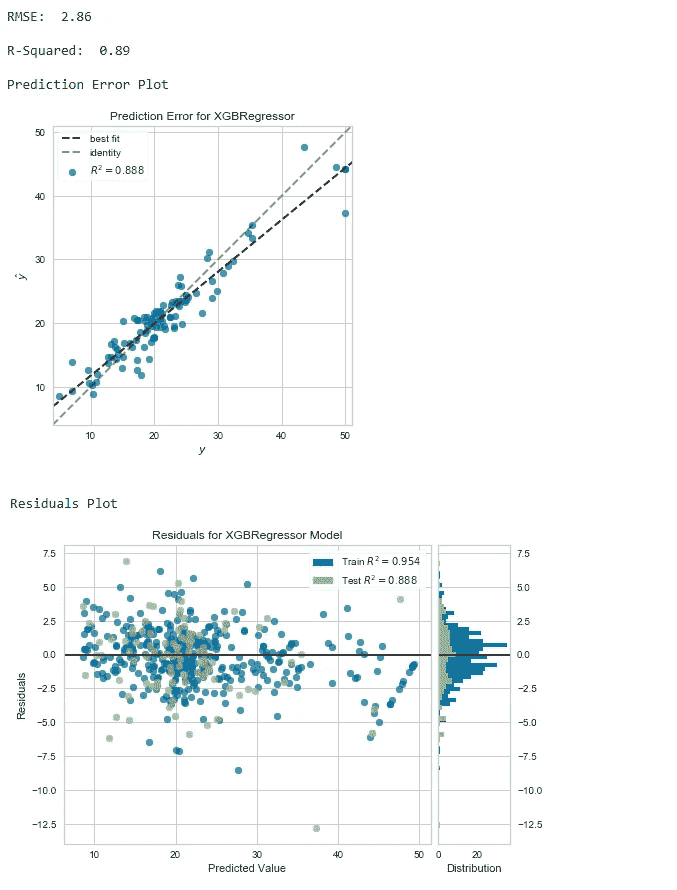
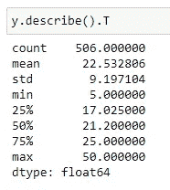
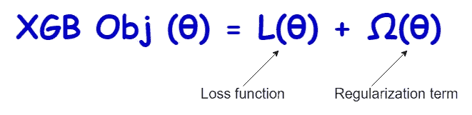
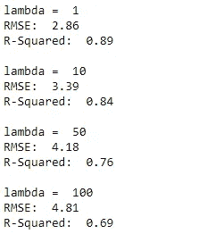

# XGBoost 之旅:里程碑 3

> 原文：<https://towardsdatascience.com/a-journey-through-xgboost-milestone-3-a5569c72d72b?source=collection_archive---------4----------------------->

## 使用 XGBoost 进行回归

马丁·亚当斯在 [Unsplash](https://unsplash.com/s/photos/drive?utm_source=unsplash&utm_medium=referral&utm_content=creditCopyText) 上的照片

欢迎来到**【XGBoost 之旅】**系列第三篇。到目前为止，我们已经完成了 2 个里程碑。到目前为止，我们所做的是，基本上，我们讨论了如何设置系统以在我们自己的计算机上运行 XGBoost，我们还使用 XGBoost 完成了一项分类任务，并创建了一个小型(但有用)的 web 应用程序，以便与没有太多技术知识的最终用户交流我们的结果。如果你是第一次来这里，我推荐你阅读**“XGBoost 之旅”**系列的前两篇文章。以下是链接。

*   【XGBoost 之旅:里程碑 1 —设置背景
*   [XGBoost 之旅:里程碑 2 —使用 XGBoost 分类](/a-journey-through-xgboost-milestone-2-f3410109be5a)

更具体地说，今天，我们将使用 XGBoost 对“波士顿房价”数据集执行回归任务。以下是我们今天讨论的话题。

## 我们讨论的话题

*   形成回归问题
*   构建 XGBoost 回归模型(Scikit-learn 兼容的 API)
*   描述**‘RMSE’**和**‘R 平方’**指标
*   创建预测误差和残差图
*   解释 XGBoost 回归变量超参数
*   XGBoost 的目标函数
*   将 L2 正则化应用于我们的 XGBoost 模型

## 波士顿房价数据集

“波士顿房价”数据集是 Scikit-learn 中的内置数据集。要访问数据，你需要做的就是调用 **load_boston()** 函数，并将它赋给一个名为 ***data*** 的变量，这是一个 Python 对象。然后我们调用那个对象的各种属性得到 **X** (特征矩阵) **y** (目标向量)和列名。当我们编写代码时，您将看到如何做到这一点。现在，只需看看“波士顿房价”数据集的结构和可变信息。

“波士顿房价”数据集的前 5 行(图片由作者提供)

下图包含由 Pandas DataFrame **info()** 方法返回的数据集的变量信息。

“波士顿房价”数据集的可变信息(图片由作者提供)

数据集没有缺失值。所有的值都是数字。因此，不需要预处理步骤，数据集就可以使用了。该数据集有 506 个观测值和 13 个特征(不包括“目标”列)。目标列(可以使用 ***数据*** 的**目标**属性访问)包含中值房价。要找到关于这个数据集的更多信息，请阅读它的[文档](https://scikit-learn.org/stable/datasets/toy_dataset.html#boston-dataset)。

## 定义问题

基于 CRIM，ZN，…，LSTAT，我们希望预测给定房屋(新实例)的房价中值。这是一项回归任务，因为其模型预测的是连续值输出(房价是连续值)。

我们用来解决这个回归问题的算法是 XGBoost。用于回归的 XGBoost 模型称为 **XGBRegressor** 。因此，我们将为这个回归问题构建一个 XGBoost 模型，并使用**均方根误差(RMSE)** 和 **R 平方(R-决定系数)**来评估它在测试数据(看不见的数据/新实例)上的性能。我们还将使用各种图形技术，如预测误差图、残差图和残差分布，来评估回归模型并验证其假设。

让我们通过编写 Python 代码在“Boston house-prices”数据集上构建 XGboost 回归模型来获得实践经验。

# 构建 XGboost 回归模型

这里，我们使用 XGBoost Scikit-learn 兼容 API。**“sci kit-learn 兼容”**表示您可以使用 Scikit-learn **。fit() /。predict()****paradigm**和其他几乎所有的 Scikit-learn 类。这是代码。

等到加载 Python 代码！(代码片段-1)

上述代码段的输出是:

代码片段-1 的输出

请注意我是如何使用几个 **print()** 函数在同一个输出中打印多个值和图形的。为了创建预测误差和残差图，我只使用了两行代码。在这里，我利用了 **Yellowbrick** Python 库。Yellowbrick 是一个优秀的机器学习可视化库。我推荐您使用它，因为您只需一两行代码就可以制作精美的可视化效果，而且它与 Scikit-learn 完全兼容。如果你感兴趣的话，读一下它的文档。

我们的模型返回测试数据的 RMSE 值为 2.86(y 单位)。这个值吗？为了找到答案，我们来看看目标列(房价)的一些统计方法。

目标列的统计度量

标准偏差为 9.197，平均值为 22.53，我们得到的 RMSE 值(2.86)非常好。RMSE 值越小，模型越好。**平均而言，我们模型的价格预测值与实际值相差 2.86 个单位**。

我们模型的 r 值是 0.89。这意味着**我们的模型捕捉到了房价中观察到的 89%的可变性，另外 11%是由于其他一些因素，当然还有随机性！**

作为图解法，我们可以使用预测误差图、残差图和残差分布来评估我们的回归模型并验证其假设。

*   **预测误差图:**我们可以看到大部分的点都在一条直线上。我们可以将该图与 45 度线进行比较，在 45 度线上，预测与模型完全匹配。总的来说，预测是跟随着实际房价的。
*   **残差图:**我们看不到预测和残差之间的任何模式。因此，我们可以验证残差是不相关或独立的。这对我们的模式来说是个好兆头。
*   **残差分布图:**通过查看这个图，我们可以验证残差(实际值-预测值)近似正态分布。

我们创建的模型遵循标准回归假设。

现在，是时候描述一下 **XGBRegressor()** 超参数了。我们指定了 7 个超参数。

*   **max_depth=3:** 这里，XGBoost 使用决策树作为基础学习器。通过设置 **max_depth=3** ，每棵树将进行 3 次分割并停止在那里。
*   **n_estimators=100:** 集合中有 100 棵树(个体模型)。
*   **objective = ' reg:squarederror ':**我们的模型中使用的损失函数的名称。reg:squarederror 是 XGBoost 中回归的标准选项。你也可以使用 **reg:linear** 得到相同的结果。但是 **reg:linear** 现在已经被弃用，在未来的版本中会被删除。
*   booster='gbtree': 这是 ML 模型在每一轮 boosting 中使用的基础学习者类型。**‘GB tree’**是 XGBoost 默认基础学习者。使用 **booster='gbtree** '，XGBoost 模型使用决策树，这是非线性数据的最佳选择。
*   **n_jobs=2:** 使用处理器的两个内核进行并行计算，以运行 XGBoost。
*   **random_state=1:** 控制创建树的随机性。您可以使用任何整数。通过为 **random_state** 指定一个值，您将在代码的不同执行中获得相同的结果。
*   **learning_rate=0.05:** 每轮提升缩小树的权重。降低 **learning_rate** 可防止过度拟合。

# XGBoost 的目标函数

XGBoost 的目标函数决定了预测值与实际值的差距。我们的目标是找到一个为目标函数提供最小值的模型。XGBoost 的目标函数由两部分组成:

*   **损失函数**
*   **正则化项**

数学上，这可以表示为:

XGBoost 的目标函数(图片由作者提供)

## 损失函数

对于回归问题，损失函数是**均方误差(MSE)** 。对于分类问题，损失函数是**对数损失**。XGBoost 中常见损失函数的超参数值为:

*   **reg:squarederror** 或 **reg:linear** —用于回归
*   **二元:逻辑** —用于二元分类
*   **multi:softprob** —用于多类分类

## 正则项

正则化可以定义为**【对模型复杂度的控制】**。我们需要创建一个既准确又简单的模型。正则项是一个惩罚项，用于防止模型过度拟合。XGBoost 与其他基于树的模型的主要区别在于，XGBoost 的目标函数包含一个正则项。XGBoost 中的正则化参数是:

*   **伽玛:**默认为 0。小于 10 的值是标准值。增加该值可以防止过度拟合。
*   **reg_alpha:** 叶子权值上的 L1 正则化。较大的值意味着更多的正则化，并防止过度拟合。默认值为 0。
*   **reg_lambda:** 对叶权重的 L2 正则化。增加该值可以防止过度拟合。默认值为 1。

# 将 L2 正则化应用于我们的 XGBoost 模型

现在，我们将 L2 正则化应用于上面创建的 XGBoost 模型。我们将为 **reg_lambda** 超参数尝试 4 个不同的值。我们可以用一个简单的**来完成**循环。

等到加载 Python 代码！(代码片段-2)

输出是:

L2 正则化对 XGBoost 模型的影响

这里，我们可以注意到，随着“λ”值的增加，RMSE 增加，R 平方值减少。

# 摘要

到目前为止，我们已经完成了 XGBoost 系列的 3 个里程碑。今天，我们用 XGBoost 的 Scikit-learn 兼容 API 执行了一个回归任务。正如我们在分类问题中所做的那样，我们也可以使用 XGBoost 的非 Scikit-learn 兼容 API 来执行回归。

在下一篇文章中，我将讨论如何使用 XGBoost 执行交叉验证。敬请关注最新消息！

感谢阅读！

本教程由 [*鲁克山·普拉莫迪塔*](https://www.linkedin.com/in/rukshan-manorathna-700a3916b/)*[数据科学 365 博客](https://medium.com/data-science-365)作者设计创作。*

*在 https://rukshanpramoditha.medium.com[阅读我的其他文章](https://rukshanpramoditha.medium.com/)*

*2021–03–11*