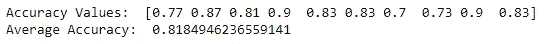
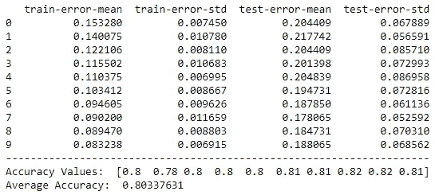

# XGBoost 之旅:里程碑 4

> 原文：<https://towardsdatascience.com/a-journey-through-xgboost-milestone-4-303545a40fb0?source=collection_archive---------20----------------------->

## 通过交叉验证评估 XGBoost 模型

马丁·亚当斯在 [Unsplash](https://unsplash.com/s/photos/drive?utm_source=unsplash&utm_medium=referral&utm_content=creditCopyText) 上的照片

你好。这是我们 XGBoost 旅程的第四个里程碑。到目前为止，我们基本上讨论了用 XGBoost 执行回归和分类任务。如今，通过交叉验证的 XGBoost 模型评估得到了更多的重视。还记得在“用 XGBoost 分类”(里程碑 2)的文章中，如果为 **train_test_split()** 函数中的 **random_state** 参数设置不同的整数值，会得到略有不同的准确率分数吗？今天，我们将通过交叉验证来解决这个问题。

基本上，我们将使用兼容 Scikit-learn 和不兼容 Scikit-learn 的 API 执行交叉验证。但是，最后一件事！在继续之前，请务必阅读以下文章，它们是今天内容的先决条件。那些文章中讨论的概念非常重要，我强烈推荐你阅读它们。

## 先决条件

*   【XGBoost 之旅:里程碑 1(设置背景)
*   [XGBoost 之旅:里程碑 2(用 XGBoost 分类)](/a-journey-through-xgboost-milestone-2-f3410109be5a)
*   [用简单的英语解释 k 倍交叉验证](/k-fold-cross-validation-explained-in-plain-english-659e33c0bc0)

我们开始吧！

## 使用 Scikit-learn 兼容 API 评估 XGBoost 模型

这里，我们使用相同的“心脏病”数据集([在此下载](https://drive.google.com/file/d/19s5qMRjssBoohFb2NY4FFYQ3YW2eCxP4/view?usp=sharing))和在“[XGBoost 之旅:里程碑 2(用 XGBoost 分类)](/a-journey-through-xgboost-milestone-2-f3410109be5a)”文章中构建的分类模型。

**“sci kit-learn compatible”**表示这里我们可以使用 sci kit-learn**cross _ val _ score()**函数与 XGBoost 进行交叉验证。

让我们来写 Python 代码。

等到加载 Python 代码！(代码片段-1)

输出是:

代码片段-1 的输出(图片由作者提供)

0.818 的平均精度更稳健，是我们模型的良好性能估计。请注意，这里我们执行了 10 重交叉验证，并为我们的模型获得了 10 个不同的精度值。

这里我们只输入 **X** 和 **y** 。我们不需要把数据集拆分为 **X_train** 、 **y_train** 、 **X_test** 、 **y_test** 。在交叉验证中，分割是根据我们在 **cv** 中指定的折叠数在内部完成的(这里是 10)。使用交叉验证可以保证我们的 XGBoost 模型的准确性分数不会受到随机数据分割过程的太大影响。如果我们只使用 **train_test_split()** 函数*而不进行* t 交叉验证，那么根据我们在 **train_test_split()** 函数中提供的 **random_state** ，准确率得分会有很大的差异。在交叉验证中，使用 10 次(cv=10)这样迭代的平均值来计算精确度！

在 k-fold 交叉验证中，我们假设数据集中的所有观察值都以数据没有偏差的方式很好地分布。这就是为什么我们首先使用**混洗**函数混洗数据集。

接下来，我们使用 XGBoost 非 Scikit-learn 兼容的 API 执行相同的交叉验证过程。

## 使用 XGBoost 非 Scikit-learn 兼容 API 评估 XGBoost 模型

用 XGBoost 执行交叉验证的另一种方法是使用 XGBoost 自己的非 Scikit-learn 兼容 API。**“与 Scikit-learn 不兼容”**意味着这里我们不使用 Scikit-learn**cross _ val _ score()**函数，而是使用 XGBoost 的 **cv()** 函数和显式创建的**d matrix**。A **DMatrix** 是由 **XGBoost** 使用的内部数据结构。

让我们来写 Python 代码。

等到加载 Python 代码！(代码片段-2)

输出是:

交叉验证结果(作者图片)

在这里，您将得到一个格式良好的输出，其中包含许多细节。XGBoost 的 **cv()** 函数返回每个折叠的训练和测试错误。你可以用 1 个误差得到精度。这里的平均准确度分数与之前的分数非常接近。有一些小的不同，因为在混排数据时涉及到随机性。

# 摘要

今天，我们讨论了交叉验证过程，它可以用来以一种更好的方式评估我们的 XGBoost。我们已经用 XGBoost 的两个不同的 API 进行了交叉验证。我们在两个 API 中获得了相同的准确度分数，但是 XGBoost 自己的非 Scikit-learn 兼容 API 获得了更多的细节。

在下一篇文章中，我们将讨论如何调优 XGBoost 的超参数。交叉验证也包括在内。因此，如果你仍然不太熟悉交叉验证，请阅读我的“[用简单英语解释的 k 重交叉验证](/k-fold-cross-validation-explained-in-plain-english-659e33c0bc0)”文章。下次见！

感谢阅读！

本教程由 [*鲁克山·普拉莫迪塔*](https://www.linkedin.com/in/rukshan-manorathna-700a3916b/)*[数据科学 365 博客](https://medium.com/data-science-365)作者设计创作。*

*阅读我在 https://rukshanpramoditha.medium.com[的其他文章](https://rukshanpramoditha.medium.com/)*

*2021–03–19*