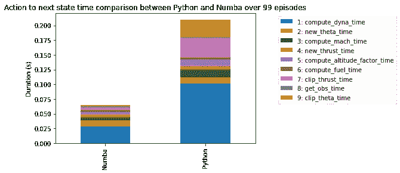
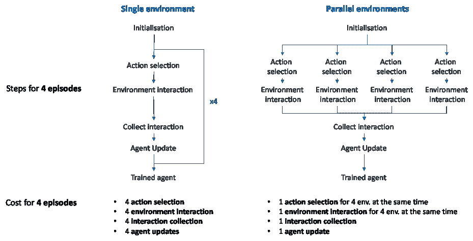

# 快速强化学习之旅

> 原文：<https://towardsdatascience.com/a-journey-towards-faster-reinforcement-learning-1c97b2cc32e1?source=collection_archive---------11----------------------->

## [提示和技巧](https://towardsdatascience.com/tagged/tips-and-tricks)

## 由于并行化和 Numba，本文可以在几分钟内为您节省数小时

让我们为我们的飞机研发项目增加动力(来源: [Pixabay](https://pixabay.com/photos/airplane-airline-aircraft-travel-2566205/)

> *从伊卡洛斯燃烧自己的翅膀到莱特兄弟翱翔天际，人类花了几千年才学会飞行，但人工智能要多久才能做到？*

在这篇文章中，我们将回顾强化学习的一个实践方面:如何让它更快！我进入强化学习的旅程是一次奇妙的经历，从理论知识到应用实验。然而，有一件事真的让我很苦恼，那就是在尝试另一个想法来改进我的项目之前，我不得不等待代理人完成培训。所以，有一天我决定想办法让整个过程更快。这篇文章的目标是作为加速你的 RL 项目的不同方法的指南。要做到这一点，我们将看到我如何加速我的飞机项目，以超过 2 倍的原始速度！

这篇文章是一系列文章的一部分，我在这些文章中写了我使用**人工智能**让飞机飞起来和**投入强化学习**的旅程(第 1 部分是这里的[和这里的](https://medium.com/@yannberthelot1/how-i-taught-a-plane-to-fly-using-rl-c170a152b771)和第 2 部分是[和](/ai-learns-to-fly-part-2-create-your-custom-rl-environment-and-train-an-agent-b56bbd334c76))。尽管我们将使用前几篇文章中创建的一些材料，**这篇文章可以独立阅读。**

# 介绍

## 强化学习的效率

RL 是机器学习的一个强大而通用的分支。它允许模型学习，不是通过例子甚至数据，而是通过与环境的交互来优化决策。这个过程的结果称为策略。

机器学习技术的主要类别。图片由作者提供，图标来自[平面图标](https://www.flaticon.com/)

这种特殊性允许强化学习用于其他机器学习(ML)技术失败或甚至不适用的地方。然而，当涉及到 RL 和 ML 都可以应用的领域时，后者往往更有效。即使在其他应用中，RL 仍然可能相对较慢。为了解决这个问题，我们需要提高 RL 的效率。

## 在这种情况下，效率是什么？

效率可以通过两个不同的方面来定义:

*   数据效率:在我们的目标达到之前，我应该有多少数据点(对于 ML)或与环境的交互(对于 RL)？
*   时间效率:给定固定的硬件和适量的数据，需要多长时间才能达到我们的目标？这包括收集数据和用它来训练模型(对于 ML)或代理(对于 RL)。

从现在开始，我们将只讨论 RL 的效率，并尝试看看如何提高它。

RL 中更大的效率成本往往来自于“数据”。数据收集(在在线 RL 中与环境交互，或在离线 RL 中收集数据用于后续计算)的难度/成本可能会因设置不同而有很大差异。当获得像 Atari 2600 games 这样的模拟时，收集数据是相当简单的，但当涉及到控制 Space X 火箭时，成本会迅速上升(如果你打算让它坠毁几次，成本会更高)。由于现实世界的强化学习伴随着它的问题，今天我们将从讨论基于模拟的强化学习开始。

运行一个 Atari 2600 游戏听起来比破坏几个这样的游戏便宜，然而，他们确实使用 RL 着陆！来源: [Giphy](https://media.giphy.com/media/3ohs4gSs3V0Q7qOtKU/giphy.gif?cid=ecf05e474gpzmy90u24q8t9q2xvc7o01qi2zuf3k5vapyh45&rid=giphy.gif&ct=g)

即使在模拟中，一些比另一些更有效。你的基本 2D 健身房环境，如 CartPole，在每秒发作次数方面将比 Atari 2600 游戏更有效。然而，模拟确实有一个主要的优势，那就是它实际上和驱动机器的电力一样便宜。因此，当使用模拟进行在线 RL(代理与模拟实时交互)时，数据效率和时间效率变得错综复杂，并融合到一个共同的目标中:尽可能快地与环境交互。

这个目标可以转化为环境代码的优化。为了进一步讨论这个主题，我们将使用我在《RL:我的飞机模拟》中开始旅程以来一直工作的环境。

## 培训环境

我们将在 100 集里评估代理商的时间效率。在选定的设置中，称为水平飞行，代理人学习尽可能直线驾驶飞机，尽可能接近给定的目标高度。

机长正试图将飞机保持在水平线代表的高度！作者图片

代理的行动不能缩短或延长发作的持续时间。即使我们不关心本文中的代理性能，代理的实际训练时间仍然必须包括在内，以便对训练时间和加速可能性有一个正确的了解。我们将使用的代理是近端策略优化(简称 PPO)。

## 摘要

在本文中，我们将讨论两种提高 RL 项目速度的方法:

*   **环境**，使用代码加速
*   **代理**，使用并行化和超参数

在本文中，我们将不讨论所选代理在该过程中的影响。在描述不同药剂的文献中已经很好地测量和讨论了效率。此外，请注意，因为我们只对本文中的执行速度感兴趣，所以我们只培训代理，而不评估其在奖励或目标实现方面的表现。

# 1.执行时间测量

## 如何精确测量执行时间？

现在，为了优化我们的代码，让我们看看它的每个部分运行需要多长时间(也称为分析)。然而，测量执行时间并不像听起来那么简单。我们可以测量代码开始和执行结束之间的时间，然后称之为一天…但是这只有在没有其他进程运行的情况下才有可能，因为任何其他进程都可能影响执行性能。因此，如果我们想要精确地测量执行时间，并且能够比较它们来量化改进，我们首先需要隔离执行。在个人电脑上做这些太难了，因此我们将在没有其他进程运行的专用 AWS EC2 实例(基于云的专用计算机)上运行这些测试，这将保证我们在 iso 可用资源上运行代码。对于第一组实验，我们将使用一个 [t2.micro](https://aws.amazon.com/fr/ec2/instance-types/t2/) ，它是 AWS 自由层的一部分。

## 项目结构

这个项目由两个主要部分组成，即**环境、**和**代理**。

标准 RL 框架。作者图片

代理**相对简单，因为它主要由库管理:stable-baselines3。**

**环境**是一个定制的飞机环境，在[本文](/ai-learns-to-fly-part-2-create-your-custom-rl-environment-and-train-an-agent-b56bbd334c76)中开发，遵循 OpenAI gym 模板。它被细分为多个子功能，我们将在深入分析时发现这些子功能。

这两部分通过以下方式进行通信:

在一个事件中，代理人和环境之间相互作用的简化视图。作者图片

代理观察环境的当前状态，并根据该观察及其当前策略选择动作。该动作随后被环境接收，环境据此计算下一个状态和奖励。根据这些信息，代理可以更新其参数以提高未来的性能。

## 执行时间分析

让我们从测量开始:我们收集 100 集以上的执行时间，并对不同部分之间平均花费多少时间的结果进行平均:动作选择(基于当前状态和当前策略选择动作)，展开(收集数据或与环境交互)，以及实际学习(根据新的体验更新模型权重)。“其他”类别只是将所有其他操作重新分组，这些操作对于理解培训没有用处，并且是过程的一小部分(调用回调、更新信息缓冲区和检查动作格式)。

图 1:RL 过程中时间消耗的重新分配。作者图片

环境(橙色)大约占计算成本的三分之一，而代理成本(绿色的动作选择和蓝色的参数更新)几乎占了其余的三分之一。让我们从与环境的互动开始我们的优化之旅。我们不会在这里讨论实现的细节，您只需要知道在健身房环境中有 3 个主要部分:

*   步骤:计算行动对环境的影响
*   奖励:它计算奖励
*   终端:评估代理是否已经到达终端状态

现在让我们测量这些不同部分的执行时间，并对它们进行分析。

图 2:时间消耗在“环境步骤”中的重新分配(上图(1)中的最高消耗)。作者图片

**计算成本的主要来源是与环境的推理**(蓝色的“环境步时间”)。让我们仔细看看这一部分，它计算行动对环境的影响。再说一次，如果你不想的话，没有必要去了解函数做什么的细节。对不同功能的描述可以在文章的最后找到，或者在前面的文章中找到。就像之前一样，让我们看看计算时间是如何在这些不同的任务中分配的:

图 3:时间消耗在“包络步骤时间”中的重新分配(上图(2)中的最高消耗)。作者图片

我们可以看到空气动力学计算(compute_dyna)的明显优势，这是命令对飞机状态(位置、速度、加速度、俯仰角等)影响的计算。然而，其余的操作仍然占所花费时间的 50%,前 3 位的成本是推力和角增量以及马赫数计算。这种成本主要来自于“复杂”函数的使用，如 NumPy 的 clip 和 norm 函数。

让我们深入最后一层，看看 compute_dyna 的计算成本是如何分布的(更多细节请参考[第一篇](/how-i-taught-a-plane-to-fly-using-rl-c170a152b771?source=your_stories_page-------------------------------------)或本文结尾):

图 4:时间消耗在“计算动态”中的重新分配(上图(3)中的最高消耗)。作者图片

在这里，牛顿第二定律是最昂贵的函数。这并不奇怪，因为它有最多的运算，而不仅仅是琐碎的运算，比如三角学和处理数组。

然而，再一次，马赫数的计算伴随着巨大的代价，因为范数计算确实是昂贵的。

Cx(以及 Cz、Sx 和 Sz)也很重要，因为它有很多运算，比如三角学或平方根。最后，新速度和位置的计算是最后一个重要的成本，只留下代码中无关紧要的部分(重量、襟翼或坠毁的计算)。

看一看我们在这里编译的所有元素，我们看到除了基本操作符(+、-、/和*)之外，涉及数学函数的计算往往很昂贵，即使使用 NumPy 的优化版本也是如此。我们代码中最差的函数是 numpy.linalg.norm 函数。

既然我们已经确定了计算成本的领域，让我们来看看降低它们的解决方案。

# 2.使用 Numba 的代码加速

来源:[跨编程语言的能效](https://greenlab.di.uminho.pt/wp-content/uploads/2017/10/sleFinal.pdf)。结果以与 c 语言相比的效率比率表示。例如，Python 消耗的能量是 c 语言的 75.88 倍。

从上表中可以看出，就执行时间而言，Python 并不是一种高效的语言。这并不奇怪，因为 Python 最出名的是它的简单性和开发速度，而不是它的性能。当使用用更有效的语言设计的库时(例如用 C++和 CUDA 编码的 Tensorflow ),这个缺陷可以得到部分解决。对于代码的其余部分，我们需要另一个解决方案。

我们可以首先尝试修改代码来优化它，避免昂贵的功能，重复，使用较低的精度…我们将假设这项工作已经完成。我们还可以尝试用更高效的语言(如 C++)重新编写，这是我尝试过的解决方案，但不如我们将要讨论的解决方案高效:

来源: [Numba](http://numba.pydata.org/)

[**Numba**](http://numba.pydata.org/) 是一个基本上在执行时将部分 Python 代码转换成 C 语言的库。它允许将 Python 的简单性与 C 语言的高效性结合起来。它唯一的缺点是仅限于纯 Python 和 NumPy 函数，并且在代码的第一次迭代中有少量的前期编译成本(但在后面的迭代中没有)。如果你想了解更多细节，我建议你看下面的视频。

这里有一个很棒的视频展示了 Numba 的利与弊。

使用 Numba 非常简单，您只需在函数中添加一个装饰器，并确保它只包含 Numba 兼容的元素(只有 Python 或 NumPy，没有列表，只有 NumPy 数组)。

用 Numba 转换的一个函数的例子

@njit decorator 代表**N**opython**J**ust**I**N**T**ime。没有 Python，这意味着如果使用了任何 Numba 不能处理的代码，Numba 将会引发错误，这会降低速度。**J**ust**I**n**T**ime 意味着它将在需要之前将代码编译成 C。 **nogil** (无全局解释器锁)允许多重处理(这在以后会很有用) **fastmath** 顾名思义，允许以牺牲一些精度为代价的更快的数学运算。

我们将把这个装饰器应用于空气动力学计算中的所有函数，并观察结果:

Numba 加速后(左)和加速前(右)空气动力学计算时间分配的比较。作者图片

结果很好看！对于空气动力学计算，我们在 Numba 上比 Python 有了 363%的改进。现在让我们向上移动一个阶段，到“下一个功能的动作”,它调用空气动力学计算作为其计算时间的主要来源。

提醒:空气动力学计算(右侧)是“下一个功能的动作”(左侧)的一部分，它计算动作对下一个状态的影响。作者图片

Numba 加速后(左)和加速前(右)动作到下一状态计算的时间分配比较。作者图片

这同样适用于整个“到下一个状态函数的动作”,我们在 Numba 上比 Python 提高了 326 **%** ！没有任何辛苦！

我们已经释放了能量！(来源:[吉菲](http://gph.is/1EcbNf5))

我们现在已经加速了我们环境的主要部分。让我们来看看我们对**全局训练时间**的影响，不限于来自环境的下一步的计算，还包括动作选择和代理的实际更新(图中的训练时间) :

不同配置的总训练时间的组成。作者图片

我们 326%的提速变成了 12%的提速！令人失望？是的，可以预见？也是的。这种差异是由于这样一个事实，即整个过程的加速不仅仅是基于与我们到目前为止已经优化的环境的相互作用。在这种特殊情况下，环境交互仅占计算成本的一小部分，因此，即使这部分的重要改进对总训练时间的影响也很小。然而，我们会就此止步吗？绝对不是，现在让我们来看看如何加速这个过程的其他部分

# 3.RL 加速:并行化和超参数

加快强化学习训练的第二个显而易见的方法是拥有一个更快的代理。假设你已经选择了一个高效的代理(在我们的例子中是 PPO)，你还能做什么？好了，并行化来了！

并行化的力量(来源: [Giphy](https://giphy.com/gifs/pbs-jets-planes-l0ExdAn5aQzxQFkxq)

**强化学习不允许在剧集内部并行化太多。但是，可以同时运行多个环境，并让代理同时学习所有环境！为了做到这一点，我们将使用[稳定基线 3](https://stable-baselines3.readthedocs.io/en/master/index.html) 来实现我们的代理(这是一个非常好的、有良好文档记录的 RL 库，为了简单起见，我强烈推荐它)。稳定基线允许定义矢量化环境(基本上是堆叠环境)及其与代理的连接，代理将能够同时从所有堆叠环境中学习:**

矢量化环境的创建。更多信息请参考 SB3 的[文档](https://stable-baselines3.readthedocs.io/en/master/guide/vec_envs.html)。

太好了，我们可以并行化环境！现在让我们来看看并行环境如何加快我们的学习过程:

4 个环境的单一环境与并行环境。作者图片

如此图所示，在并行化环境时，我们可以用我们可以同时运行的并行环境的数量来划分操作选择和环境交互的时间。这是因为我们可以同时运行几个环境，而只需要运行一个环境。此外，动作选择还可以同时在几个环境中并行化，这也降低了成本。

现在让我们看看这如何转化为我们的实际执行时间。为此，我们将根据环境的数量对执行速度进行基准测试。为此，我们将使用一个带有 32 个 vCPU 的 [c5a.8xlarge](https://aws.amazon.com/fr/ec2/instance-types/c5/) AWS 实例，并为每种环境运行 1000 集。

总执行时间与并行环境数量。作者图片

我们可以看到时间收敛到 200 秒左右。这是因为在某些时候，与其他成本相比，环境时间将变得可以忽略不计，我们将在下一张图中看到这一点。

现在，让我们来看看与前面的方法相比，这种加速是如何实现的。使用 32 个 vCPU 实例只是为了进行基准测试，为了限制成本，我将回到使用 4 个 vCPU 的机器上:

不同配置的总训练时间的组成。作者图片

我们可以看到，动作选择已经大大减少，同时也稍微减少了环境交互时间。这使我们的速度比原始设置提高了 67%。现在，时间成本的主要来源是培训时间，让我们也尽量减少培训时间。

正如在经典的机器学习中一样，减少训练时间可以通过几种方式来完成(时期数、学习速率、批量大小、GPU/图形处理单元上的计算)。然而，它们中的大多数也会影响模型的性能。最常见和最安全的方法是批量和使用 GPU。

## 批量

批量大小表示要同时处理的用于梯度计算的数据点的数量，如在标准机器/深度学习中。这不要与同时使用的环境数量相混淆，这里我们说的是代理更新步骤，参考上面的单环境与并行环境图)。

**我们想要什么，小批量还是大批量？**

*   批量越大，梯度计算越精确，但花费的时间越长。同时，较大的批处理大小允许在这些计算中进行并行化，从而节省时间。
*   批量越小，梯度计算越不精确，但速度越快。关于准确性，有时，一些“不准确的”小批量更新比计算较少的较大批量更新更快地收敛到真正的最优值。

批量大小的权衡不是一件容易的事，我强烈建议你阅读更多关于这个主题的文章。在强化学习中，最佳批量通常在 64 到 2048 个样本之间变化，但像任何超参数一样，它通常需要根据当前问题进行调整，以获得最佳性能。让我们看看，如果我们将批量从默认的 64 个样本增加到 1024 个样本，我们的培训会进行得如何:

不同配置的总训练时间的组成。作者图片

正如所料，我们观察到列车运行时间大幅缩短。请注意，这种减少有时可能是以牺牲性能为代价的，但是，在本文中，我们只对减少整体训练时间的方法感兴趣。当调整到最佳性能时，读者当然应该管理训练时间和性能之间的平衡。我们只是在审查减少总体流程时间的方法，但它们确实需要一些判断力。随着这个重要的减少，动作选择和环境交互现在是主要的执行时间原因。在具有复杂环境的应用程序中，通常会出现这种情况。现在，我们通过 Numba 实现的环境执行成本的降低真的很棒！

## GPU 加速

当您的网络中有重要维度的输入时，GPU 加速通常是一件好事，最好的例子是计算机视觉和 CNN。然而，在 RL 中，除非你考虑的状态空间是一个图像或者是一个非常高的维度，否则使用 GPU 来加速梯度计算和更新很可能是有害的。你从 GPU 获得的计算梯度的速度将不如将数据从 CPU(计算环境)移动到 GPU 所增加的时间。如上所述，在大多数复杂环境中，环境和行动选择成本通常是主要问题。在这种设置下，CPU 运行环境的速度通常比 GPU 快得多，因此促使选择 CPU 来运行环境和其余代码(与在 GPU 上运行环境和代理以消除在 CPU 和 GPU 之间移动数据的成本相反)。

GPU 配置(1 个 GPU 个 vCPU，AWS [g4dn.xlarge](https://aws.amazon.com/fr/ec2/instance-types/g4/) 实例)与 vcpu 对时间曲线的对比。我们可以看到，它大大减缓了这一进程。只尝试了一种 GPU 配置，因为成本太高，结果很简单。作者图片

# 4.云计算

就像我们的飞机一样，让我们向云移动吧！来源:[吉菲](https://giphy.com/gifs/SafranGroup-safran-patrouille-de-france-french-air-army-lAVoKzQMp17GFu0LBR)

目前 236%的提速，令人满意有余！然而，让我们更进一步，看看使用更强大的机器会在多大程度上提高我们的性能。为此，我将再次使用一个 [c5a.8xlarge](https://aws.amazon.com/fr/ec2/instance-types/c5/) AWS 实例，它具有比我的计算机更快的 CPU(2.0 GHz 对 3.0Ghz)和更多的 vCPU 对 32)。让我们来看看结果:

不同配置的总训练时间的组成。作者图片

我们可以看到，使用更快的 CPU 时，性能提升了 236%,达到 278%;使用更多 vCPUs 并行环境时，性能提升了 349%。然而，这也带来了运行 AWS 实例的成本。因此，我们很可能会坚持 236%的改进来试验未来的应用程序，而只将 349%的改进用于大规模训练。

任务完成了。

# 结论和下一步措施

在本文中，我们看到了加速 RL 项目的不同简单方法。这些加速的方法允许更快的训练，因此更快的反复试验来创建适合我们需要的工作 RL 代理。这也有助于降低计算成本，可能是财务成本(电力、计算机或实例的成本)或环境成本(过程中消耗的能源)。提出的方法快速且易于实现，因此可以应用于几乎任何 RL 项目。

从我们的原型到我们的快速环境，我们已经走过了漫长的道路！照片由[菲利普·布朗](https://unsplash.com/@nebirdsplus?utm_source=unsplash&utm_medium=referral&utm_content=creditCopyText)在 [Unsplash](https://unsplash.com/s/photos/old-plane?utm_source=unsplash&utm_medium=referral&utm_content=creditCopyText) 上拍摄

我希望这篇文章可以被其他人作为一个资源，当他们想让他们的 RL 项目更快的时候可以去看看！我打算写的下一篇文章将谈论奖励工程:如何定义一个有效的强化学习奖励，以在你的自定义设置中达到你的目标。

感谢阅读，我真的很喜欢分享我的强化学习之旅，我将非常感谢你的回报。如果您有任何问题，请随时联系我，并关注下一部分！

**扬恩·贝特洛**

[领英](https://www.linkedin.com/in/yann-berthelot/)

[Github](https://github.com/YannBerthelot)

## 密码

环境代码(分支:与本文相关的代码的 testing_automation)。请随意测试，它包括易于安装的诗歌文件。

<https://github.com/YannBerthelot/CaptAIn_v2/tree/testing_automation>  

编辑 SB3 版本，打印代码不同部分的时间:

<https://github.com/YannBerthelot/stable-baselines3>  

## 资源

*   [Numba 文档](https://numba.pydata.org/numba-doc/dev/index.html)
*   [稳定基线 3 文档](https://stable-baselines3.readthedocs.io/en/master/index.html)

## 功能描述

**env_step**

*   compute_dyna:根据当前状态和施加到飞机上的力，计算下一个时间步的飞机的加速度、速度和位置。
*   compute_mach:根据当前速度计算马赫数。
*   计算海拔系数:根据当前海拔计算反应堆能量的减少。
*   new_theta:根据飞行员的输入计算新的 theta 角度(基本上是将 a -1 对 1 的输入映射到一个实际角度)。
*   new_thrust:根据飞行员的输入计算新的推力功率((基本上将 0 到 1 的输入映射到实际值))
*   clip_thrust:将飞行员选择的推力值限制在限制值之间，以防止时间帧之间的θ出现重大差异
*   clip_theta:将飞行员选择的俯仰角(theta)值限制在限制值之间，以防止推力在时间范围内出现重大差异
*   compute_fuel:根据当前状态计算油耗和剩余油量。
*   get_obs:根据上述所有内容更新当前观察结果，并将其提供给代理。

**compute_dyna**

*   牛顿:使用牛顿第二定律计算飞机新的加速度矢量
*   马赫:计算马赫数(这个是计算速度对不同因素如 Cx 和 Cz 的影响所需要的)
*   gamma:计算 gamma(地面和速度向量之间的角度)
*   cx，cz:计算飞机沿 x 和 z 轴的阻力系数
*   sx，sz:沿着 x 和 z 轴计算平面的表面
*   阻力:计算阻力和升力的相互作用(它们使用相同的公式)
*   new_pos_V:使用新计算的加速度计算飞机的(近似)下一个速度和位置。
*   坠毁:检查飞机是否已经坠毁(希望没有)。
*   襟翼:计算襟翼对表面的影响(Sx 和 Sz)和阻力系数(Cx 和 Cz)
*   p:根据飞机的质量计算出它现在的重量。