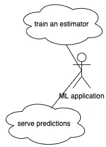
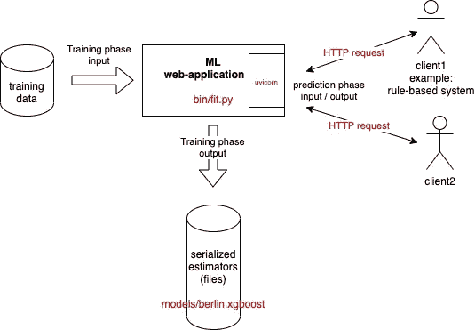
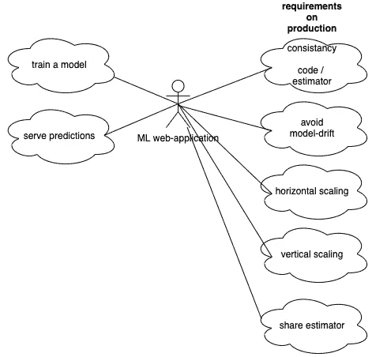
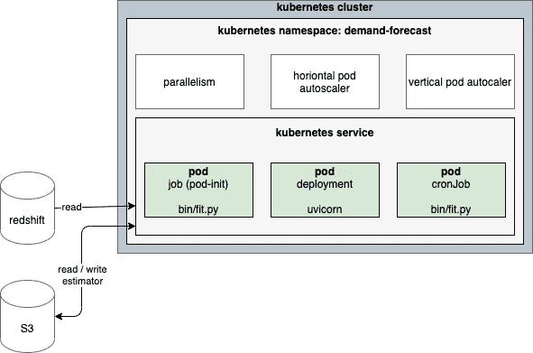
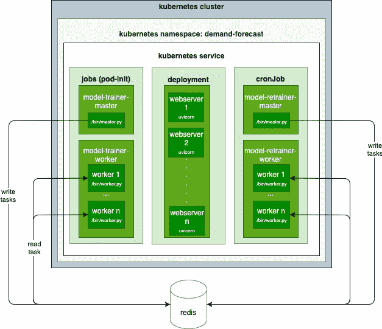

# 用于机器学习网络应用部署的 Kubernetes 架构

> 原文：<https://towardsdatascience.com/a-kubernetes-architecture-for-machine-learning-web-application-deployments-632f7765ef29?source=collection_archive---------23----------------------->

## [理解大数据](https://towardsdatascience.com/tagged/making-sense-of-big-data)

## 使用 Kubernetes 降低机器学习基础设施成本，轻松扩展资源。


照片来自[维基百科](https://commons.wikimedia.org/wiki/File:Operation_Deep_Freeze_2006,_MV_American_Tern,_Krasin_200601.jpg)

Kubernetes 成为容器编排的参考。容器编排意味着启动容器、关闭容器、纵向扩展容器(归因于内存和 CPU 的数量)和横向扩展容器(并行运行的容器数量)。

Kubernetes 是否为机器学习增加了价值？机器学习需要大量的资源来训练一个模型，但需要少量的资源来服务预测。Kubernetes 会自动调整资源！机器学习通常意味着长时间的训练，可以通过将任务分配给几台计算机来缩短训练时间。Kubernetes 在调整必要的计算机数量方面大放异彩。总的来说，Kubernetes 通过随着时间的推移只需要必要的资源来降低基础设施成本。

本文描述了一个用于机器学习 web 应用程序的 Kubernetes 架构。术语“Kubernetes 架构”回答了“应用程序如何部署到 Kubernetes 中？”。本文分四个部分回答了这个问题:

1.  定义一个机器学习网络应用。
2.  分析将机器学习 web 应用程序部署到生产环境的要求。
3.  建议使用 Kubernetes 架构来部署机器学习网络应用。
4.  为分布式培训调整架构。

如果您对本文感兴趣，您可能还会对以下内容感兴趣:

[](/how-to-scale-the-training-of-several-models-64180480ca3d) [## 几款车型的训练如何规模化？

### 这用 python 和 celery 描述了一个简单的架构来训练多个模型，而不增加总的…

towardsdatascience.com](/how-to-scale-the-training-of-several-models-64180480ca3d) 

# 机器学习网络应用的定义

在高层次上，机器学习应用负责两件事:

1.  训练模型:基于训练数据集，它训练估计器
2.  服务预测:基于经过训练的估计器和新数据，它预测新的值



*作者图片*

一个例子:需求预测者

假设有一个应用程序可以预测城市某个区域的踏板车需求。它的输入和输出是红色的。在下一步中，每个输入和输出都将被映射到它的 Kubernetes 组件。



*作者图片*

*   输入:它从数据库中读取历史需求。
*   输出:它用一个 REST API 服务于预测。Uvicorn 是网络服务器。
*   序列化:它在硬盘上读写经过训练的评估器。这是训练阶段的输出，也是预测阶段的输入。

# 部署机器学习网络应用的要求

部署机器学习网络应用的要求:



*作者图片*

1.  **确保代码和估算器之间的一致性**。更改估计器库(例如 sklearn、xgboost、tensorflow 的版本)可能需要重新训练模型。添加特征、更新特征或删除特征也需要重新训练模型。因为 web 应用程序不断地为预测服务，所以必须避免部署的代码和估计器之间的差异。
2.  **避免模型漂移**。昨天训练好的模型，明天就不那么准确了。这就是所谓的模型漂移。它在某些领域比在其他领域更重要。在预测中，最新的观察很重要，所以模型漂移得很快。相反，在计算机视觉中，如果任务是对不同类型的汽车进行分类，当新型号的汽车出现时，模型就会漂移。为了更加精确，必须避免模型漂移。
3.  **垂直缩放**。训练一个模型需要大量的记忆。为了避免内存不足的错误，必须提供足够的内存量。
4.  **水平缩放**。训练机器学习模型可能会很长。将培训分布在多台计算机上会有所帮助。必须提供足够数量的计算机。
5.  **共享受过训练的估计器。**模型的估计器在一台计算机上训练，预测在另一台计算机上提供。这些预测也可以由几台计算机来完成。串行估计器必须在所有计算机之间共享。

# 用于机器学习网络应用的 Kubernetes 架构

在生产中部署机器学习网络应用增加了新的需求。本节介绍如何使用 Kubernetes 解决这些问题。

**Kubernetes 术语**

之前，这篇文章谈到了“计算机”，在 Kubernetes 中它被翻译为“豆荚”。

> *吊舱是 Kubernetes 中最小、最基本的可部署物体。Pod 代表集群中正在运行的进程的单个实例。箱包含一个或多个容器，例如码头集装箱。*

Kubernetes 发动机文件

但是为了使事情更简单:在本文中，每个 pod 总是有一个容器。这篇文章还谈到了 Kubernetes 的服务:

> *Kubernetes 服务是集群中已部署的一组 pod 的逻辑抽象(它们都执行相同的功能)。因为 pod 是短暂的，所以一个服务启用一组 pod，它们提供特定的功能(web 服务、图像处理等)。)被分配一个名称和唯一的 IP 地址(clusterIP)。*

在这个例子中，Kubernetes 将有一个服务。这项服务负责预测需求。它将做两件事:训练机器学习模型和服务预测。

用于机器学习网络应用的 Kubernetes 架构



*作者图片*

**Kubernetes 作业**(又名 pod-init)

Kubernetes 作业是在实际部署之前执行的 pod，在 web 服务器的 pod 启动之前执行。Kubernetes 的作业可以用来训练模型。因此，可以确保代码和估计器之间的一致性。

**Kubernetes cronJob**

Kubernetes cronJob 是计划定期执行的 pod。它可用于使用最新数据定期(例如每天)重新训练模型。因此，可以避免模型的漂移。

**Kubernetes 共享卷**

Kubernetes 共享卷在 pod 之间共享文件。因此，经过训练的估计器可以在吊舱之间共享。

在上面的模式中，序列化模型实际上保存在 AWS S3 上，但是纯 Kubernetes 方法是使用共享卷。

**Kubernetes 垂直 pod 自动缩放器**

Kubernetes 垂直 pod 自动缩放器会随着时间的推移向 pod 动态分配所需的内存和 CPU。因此，可以避免内存不足错误，并确保垂直缩放。

**水平缩放**

这一要求由两个组件满足。部署吊舱的数量由 **Kubernetes 水平吊舱自动缩放器控制。**它启动和停止 pod，以满足并发 HTTP 请求的数量。此外，Kubernetes 作业有一个参数“ **parallelism** ”来控制有多少个 pod 并行运行。作业用于训练模型，在 Kubernetes 之外，以分布式方式训练机器学习模型需要一些适应。这是下一节的重点。

# 分布式训练的适应性

在部署过程中训练模型会使部署更容易。贡献者不需要考虑:这个新特性将如何影响遗留评估者？新的数据标准化将如何影响传统的评估者？库的更新将如何影响遗留评估者？

尽管如此，它有一个缺点:在部署期间(在 pod 初始化步骤中)训练模型可能会持续很长时间，并使部署工作流(CI/CD)效率低下。缓慢的部署流程破坏了 CI/CD 最佳实践。

在这种情况下，将培训分散到几个单元会有所帮助。一些库被设计成分发一个模型的训练:例如 MLlib 或 Tensorflow。这不是本文的重点。

在其他情况下，培训是适合几个模型，而不是一个。在这种情况下，[很容易用主/工模式](/how-to-scale-the-training-of-several-models-64180480ca3d)来分配培训。假设入口点是 bin/master.py 和 bin/worker.sh，这是 Kubernetes 编排的 pod 的表示:



*作者图片*

浅绿色的框显示了被操作的 Kubernetes 对象的种类:它们按照类型对 pod 定义进行分组。中间的绿色方框是 pod 的定义，即 YAML，如下图所示。深绿色的方框显示了该定义的实际实例。

```
apiVersion: batch/v1beta1
kind: CronJob
spec:
  schedule: "40 2 * * *"
```

在一个分布式世界中，Kubernetes 协调多个 pod 实例。

对于 jobs 和 cronJobs，首先执行名为“master”的 pod:它在数据库(redis，Kubernetes 之外)中创建任务。然后，工人们开始了:他们执行任务。需要终止工作进程，以便 Kubernetes 停止 pod，然后启动部署 pod。对于芹菜，下面的伪代码很有帮助:

# 结论

部署机器学习 web 服务增加了新的需求，如确保代码和估计器之间的一致性、可伸缩性、在所有计算机之间共享模型以及避免模型漂移。本文展示了用 Kubernetes 解决这些需求的一种方法。此外，它还为降低基础设施成本增加了巨大价值。