# 一个容易提取和标记维基百科数据的标签工具

> 原文：<https://towardsdatascience.com/a-labelling-tool-to-easily-extract-and-label-wikipedia-data-63f58e2e76ae?source=collection_archive---------20----------------------->

## 使用 DataQA 从维基百科建立一个训练数据集

照片由 [Unsplash](https://unsplash.com?utm_source=medium&utm_medium=referral) 上的[哈迪贾·赛义迪](https://unsplash.com/@hadijasaidi?utm_source=medium&utm_medium=referral)拍摄

*免责声明:我是 DataQA 的开发者，data QA 是一个免费的开源文本探索和标记工具。*

任何数据科学家的一个非常典型的任务是必须通过找到与其相关的附加属性来“丰富”一些种子数据集。诸如此类的问题经常出现:

*   这份 2000 家公司名单的总部在哪里？
*   这 500 种药物的主要副作用是什么？
*   这 400 家公司推出的主要产品有哪些？
*   这份 1000 名人榜的主要朋友有哪些？

好吧…也许不是最后一个。

维基百科拥有近 650 万篇文章(还在增加)，是世界上最大的人类知识库之一，因此也是我们大多数人寻找答案的第一个地方。好消息是它是在线的，而且(大部分)可以免费使用，坏消息是它主要是由非结构化文档组成的，手动提取这些信息会花费不合理的时间。开源工具 [DataQA](https://github.com/dataqa/dataqa) 最近刚刚推出了一项新功能，可以让你快速有效地从维基百科中提取信息。在本教程中，我们将带您完成基本步骤。

# 下载你的数据

本教程的先决条件是拥有感兴趣的文章的维基百科 URL(或子路径)列表。在本教程中，我们有一个几乎 400 家公司的列表，其中一些是私有的“独角兽”,另一些是公开上市的，我们希望提取这些公司推出的产品的所有名称。输入文件必须是 csv 文件。

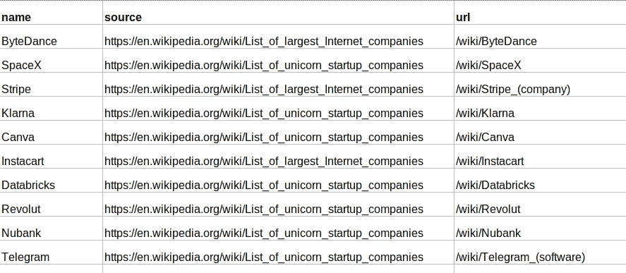

示例输入 csv 文件。

**步骤 1:创建一个新项目，从维基百科中提取实体**

启动 DataQA 并创建一个新项目。关于如何安装和启动 DataQA 的说明可以在[官方文档网站](https://dataqa.ai/docs/latest/)上找到。安装只是一个简单的 pip 安装命令。

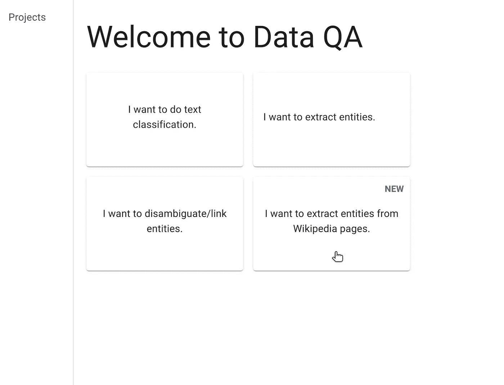

创建一个项目来从 Wiki 页面提取实体。

**步骤 2:加载包含页面 URL 的 csv 文件。**

下一步是加载文件。DataQA 只在启动时连接互联网，一切都在本地运行，你的数据不会离开你的电脑。

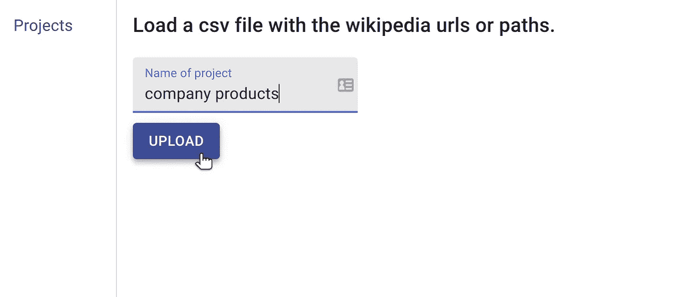

上传输入文件。

上传可能需要几分钟，具体取决于有多少行。一个包含 400 个网址的列表大约需要 10 分钟。DataQA 从维基百科中提取段落和表格，并对所有内容运行 NLP 管道。DataQA 中的每个文档都只是原始文章的一部分，大约是一个段落。标注较小的文本块要容易得多。

步骤 3:加载带有实体名称的 csv 文件。

下一步是上传一个带有我们想要标记的实体名称的文件。在这个例子中，只有一个名为“products”的类型，所以我们的 csv 除了列名之外只有一行。

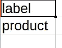

我们的实体名称。这个文件可以根据需要包含任意多的实体，但是对于这个项目，我们只有“产品”。

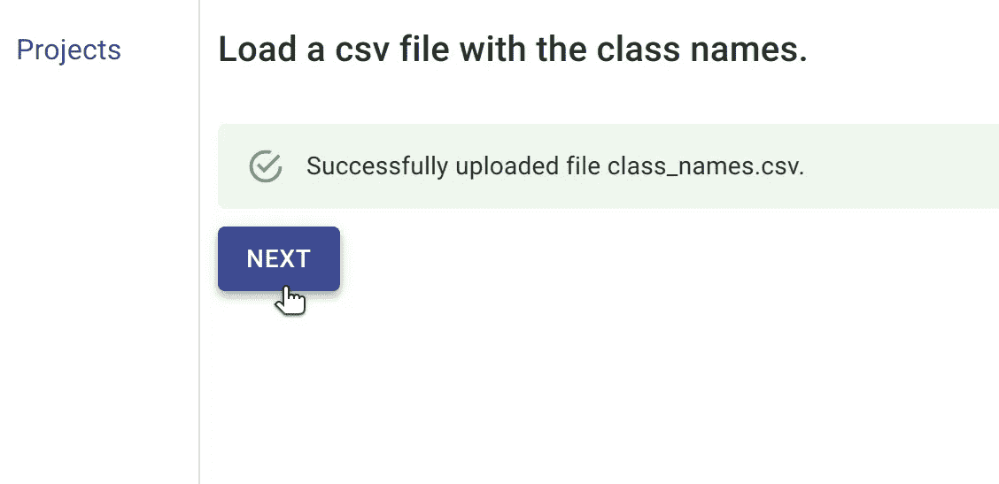

上传带有实体名称的文件。

完成这一步后，您将进入项目的汇总表，其中包含关于已处理文档总数的信息。

在我们的例子中，尽管原始文件只有 400 个 wikipedia urls，但最终上传的文本“块”总数略超过 12，000。

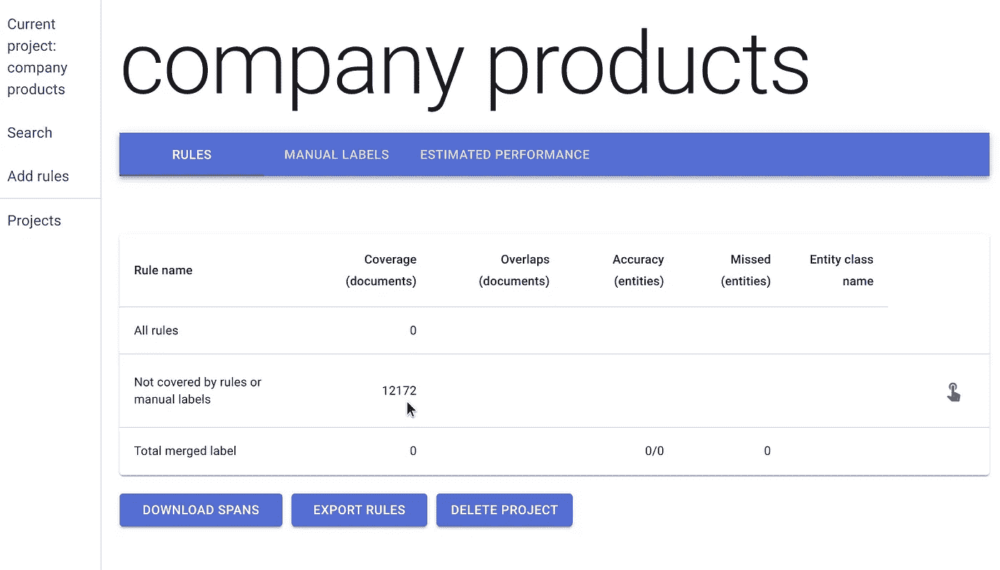

项目概述:从维基百科中提取了 12，172 个不同的章节/段落。

# 开始标记你的文件

一旦数据被上传，你可以点击左边的“搜索”开始探索从维基百科中提取的数据。

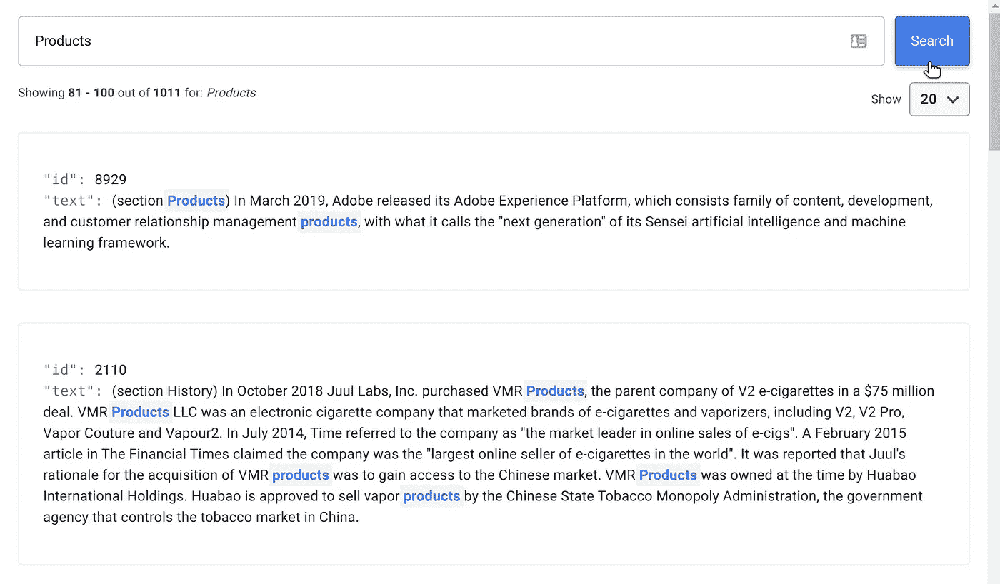

查询“产品”的搜索结果示例

手动标记 12，000 份文档实际上并不是一项可行的任务。幸运的是，DataQA 提供了一些方法来缩小最有可能包含所需信息的文档的范围。每个段落都以页面部分的名称开始，我们注意到在这些维基百科页面中发现一个名为“产品”的部分是非常常见的。您可以输入正则表达式来匹配特定的文档或实体，并自动提取实体。

*   我们可以创建一个规则，提取正则表达式 ***部分产品之后的实体。*?开发*** ，
*   并且还 ***款产品。*?发布*** 。

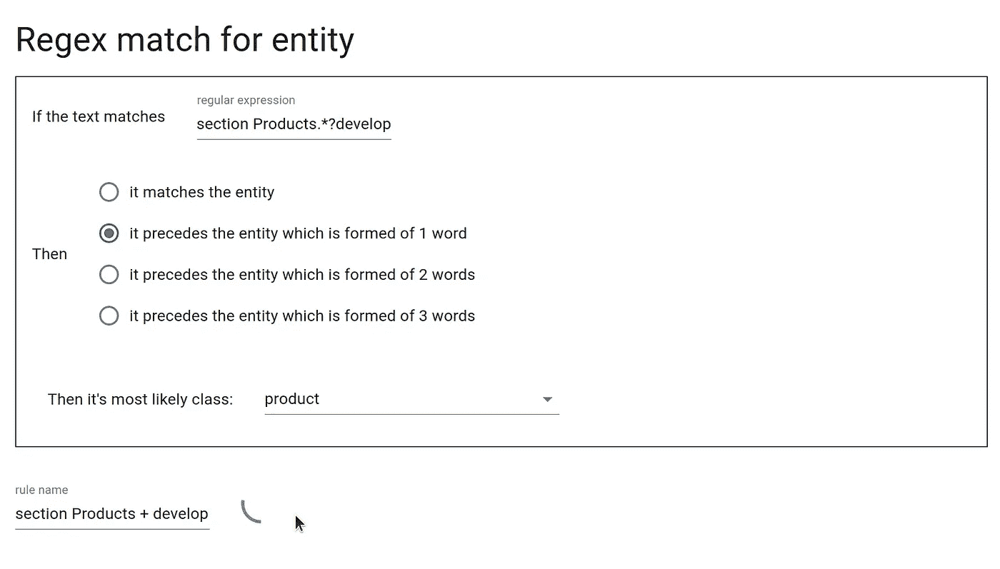

创建一个规则，自动标记正则表达式后面的任何实体。

我们还可以使用其他规则来缩小要标记的文档的范围:

*   用名为“产品”的列标记任何表。
*   获取任何包含单词“develop”和包含大写字母的名词短语的句子的段落。
*   获取包含单词“release”和包含大写字母的名词短语的句子的任何段落。

添加这些简单的规则后，我们的汇总表如下所示:

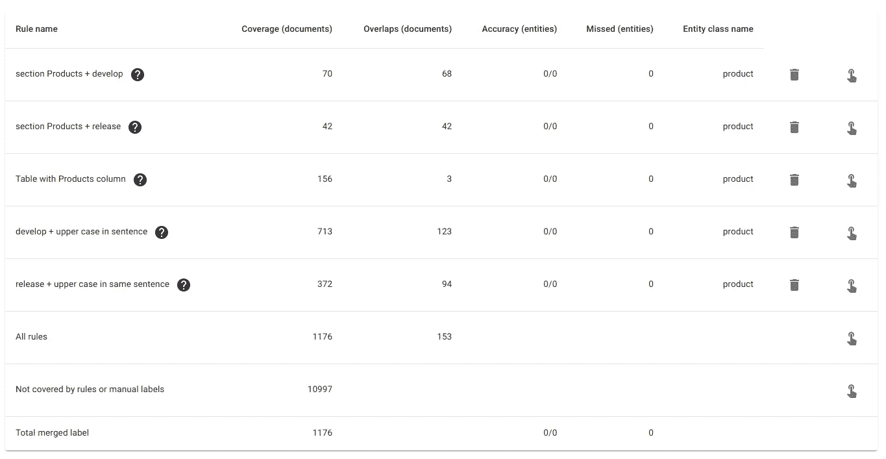

这些规则从超过 12，000 个候选段落中确定了 1176 个可能包含产品名称的段落。

现在我们准备给这些文档贴标签。单击与规则位于同一行的手形图标，将仅显示该规则选择的文档。

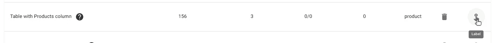

标记包含带有名为“产品”的列的表格的文档。

点击上面的手形图标将带您进入包含 Wiki 表格的文档，这些表格有一个名为“产品”的列。使用 DataQA，可以从表格和段落中提取实体。在许多情况下，这些表将包含特定的产品名称，这就是我们希望从这个项目中提取的内容。

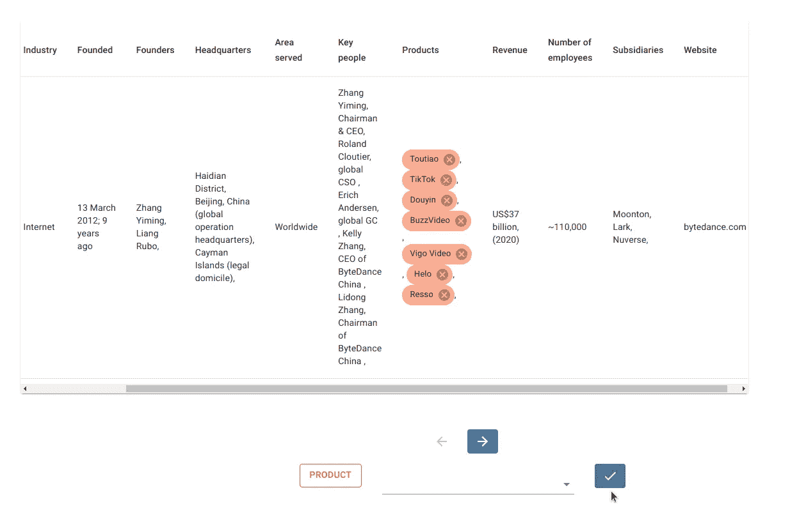

从 Wiki 表中提取实体的示例。

只有某些跨度是有效的实体。例如，不可能将单词的一部分标记为实体。第一次单击检查图标时，将验证跨度的有效性。如果高兴，第二次点击时，这些标签被确认并保存，显示下一个文档。

# 将结果导出为 csv 格式

一旦我们对收集的标签数量感到满意，我们就可以将标签导出为 csv 文件。

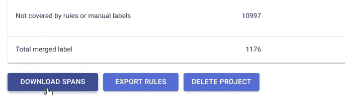

输出 csv 文件将包含以下字段:

*   *row_id* :段落的索引，
*   *网址*:原维基百科网址
*   *正文*:文档、
*   *is_table* :如果文档是 Wiki 表，则为 True，
*   *手动 _ 标注*:手动标注跨度，
*   *merged_label* :所有规则跨度，
*   *【规则名称】*:单个规则跨度。

读取带有标签的文件。

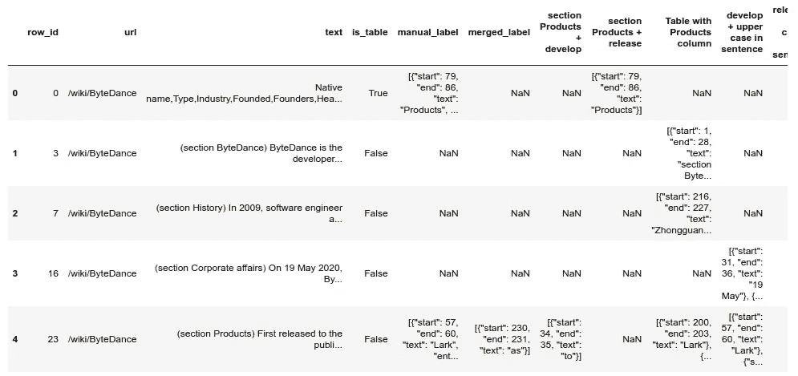

输出 csv 文件。

*manual_label* 列包含所有已被手动标记的量程。

我们现在有了一个公司名称与该公司推出的所有产品的映射。

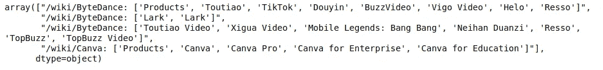

当段落是表格时，文本是该表格的 csv 格式版本，可以加载到 pandas 数据框架中:

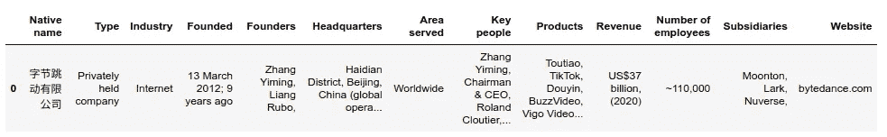

将维基表读入熊猫数据帧。

暂时就这样吧！

在以后的博客文章中，我们将看到这些标签如何被用来训练 NER 模型。

# 参考

*   Github 库:[https://github.com/dataqa/dataqa](https://github.com/dataqa/dataqa)
*   官方文档页面:[https://dataqa.ai/docs/latest](https://dataqa.ai/docs/v1.1.1/)