# 版本控制系统入门

> 原文：<https://towardsdatascience.com/a-laymans-introduction-to-version-control-system-288dea3c3026?source=collection_archive---------15----------------------->

## 玩 Git

照片由 [Unsplash](https://unsplash.com?utm_source=medium&utm_medium=referral) 上的 [ammar sabaa](https://unsplash.com/@ammar_sab3?utm_source=medium&utm_medium=referral) 拍摄

> “没有真理这种东西。每个人都有自己的**版本**

你曾经用日期时间戳保存过你的文件吗？我想我们大多数人都这样做是为了保存现有文件的一个版本。当我们要做某些更改，但又想保留原始内容的历史时，这是必需的。在任何时间点，如果你想回到原来的内容，你可以回去。此外，您可能希望记录当前更改完成的原因。

我有一个保存开支的文件夹。我可以通过在文件名中添加日期来维护不同日期的费用，如下所示:

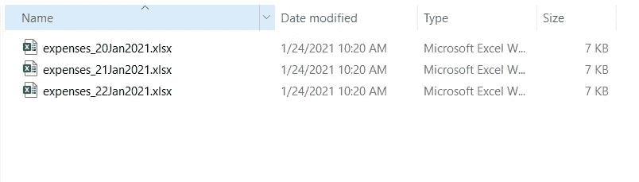

这是**“版本控制”**的粗略形式，其中我们保留了原始文件的备份，并将更改保存到新文件中。如果你正在做一些小的个人工作，比如一些班级项目，这种版本控制或者版本维护是很好的。然而，当您在一个多人工作的软件项目中工作时，您需要一个更好的机制，通过它在多个文件(源代码文件、配置文件或任何类型的文件…..)由多人可以处理。这就是版本控制系统(VCS)的用处。版本控制软件提供了一种在一段时间内跟踪文件变化的机制。

***通过使用 VCS，我们可以知道什么、什么时候、由谁进行了更改。***

让我们看看您在任何版本控制系统中使用的基本术语和操作:

1.VCS 将提供一个数据库或存储位置，您可以在其中存储您的文件。这被称为**储存库**或**回购**。回购协议中包含的文件将被 VCS 追踪。存储库所在的计算机称为“**服务器**”，而连接到存储库的计算机称为“**客户端”**。因此，您的计算机将是客户机，而运行版本控制系统的计算机是服务器。

2.在您的机器或本地计算机上，您保存文件和进行更改的位置或文件夹称为“**工作副本**

3.在存储库中，保存文件的主要地方称为“**主干**”或**“主分支】**。

4.当你第一次上传你的文件到回购，这被称为“**添加**”，即你要求 VCS 开始跟踪你的文件。

5.VCS 将为您的文件分配一个版本号。这就是所谓的**改版**。

6.如果您决定对存储在回购协议上的文件进行更改，您将“**检出**”该文件。这意味着你现在正在从回购下载一个文件。

7.进行更改后，您可以将文件上传到存储库。这叫做“**签到**”。除了签入，您还可以提供注释，解释为什么要进行这些更改。

8.VCS 还提供了已完成的更改列表。这叫做“**变更日志**”。

9.如果一个文件或文件夹被复制为私人使用，它被称为**分支**。

10.如果一个文件的更改被应用到另一个文件，这被称为**合并**或**修补**。

11.如果一个变更与同一个文件的另一个变更相矛盾，这被称为“**冲突**”。在继续之前，用户必须"**解决**冲突。

任何好的版本控制系统都应该提供以下特性:

1.备份和恢复

2.跟踪更改

3.分支

4.合并

现在让我们讨论一个 VCS 系统— ***GIT***

GIT 是一个非常流行的版本控制系统，由 Linus Torvalds 于 2005 年创建。它的免费开源软件具有分布式架构。分布式体系结构意味着每个对存储库做出贡献的人在他自己的机器上都有一个存储库的副本。这使得操作非常快。

您可以从下面的链接下载 GIT:

[https://git-scm.com/downloads](https://git-scm.com/downloads)

注意，URL 中的“SCM”代表**源代码管理**。这只是源代码文件的“版本控制”的另一种说法。

在查看基本的 GIT 功能之前，请记住任何版本控制系统(如 GIT)的目的都是为了跟踪以下关于文件的信息:

> 有哪些改变？
> 
> 谁进行了更改？
> 
> 什么时候做的改动？

# 基本 GIT 命令和函数:

一旦安装了 GIT，第一个任务就是创建一个新的存储库，这样 GIT 就可以开始跟踪您的文件。首先，您需要向 GIT 提供基本的配置信息，比如您是谁。这可以在 GIT 中实现，如下所示:

**添加配置信息— GIT 配置**

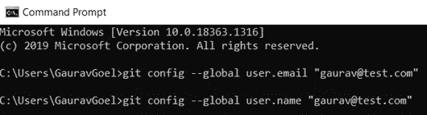

上面命令中的“— global”意味着我们将对所有将要使用的存储库使用 user.email 和 user.name 的给定值。

**创建新的存储库**

下一步是创建新的存储库。为此，我们可以创建一个新文件夹，并使用**“GIT init”**命令在其中创建一个 GIT 存储库。

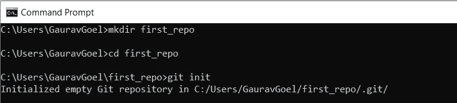

first_repo 是一个文件夹，我们在它下面创建了一个新的存储库。请记住，存储库是我们保存所有希望 GIT 跟踪的文件的地方。

init 命令在文件夹“first_repo”下创建一个空的 git 存储库。如果我们检查 first_repo 文件夹的内容，我们会看到一个目录”。饭桶"

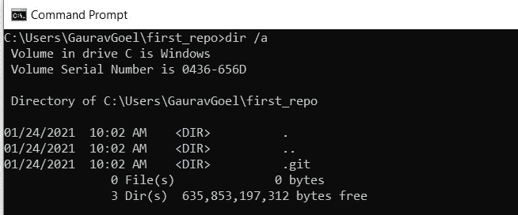

这被称为 **Git 目录**。它是存储更改和保存更改历史的数据库。里面有一堆文件和目录”。饭桶"

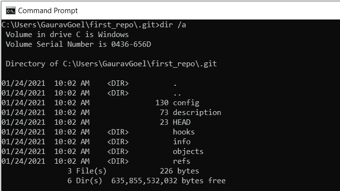

这些目录和文件不应该被直接接触或操作。每当克隆一个存储库时，它都是这样的。git”目录。

git 目录之外的区域称为“工作树”。它是保存当前或新文件的地方。您必须使用“git add”命令开始跟踪一个新文件。

**添加新文件到轨道**

目前，我们的工作树或工作目录是空的。我们将复制一个希望 GIT 跟踪的文件“expenses.xlsx”。

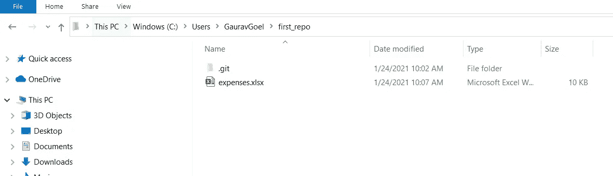

该 excel 文件的内容如下:

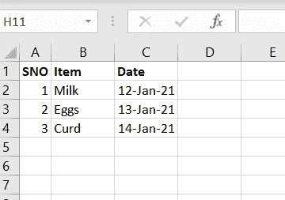

我们现在在工作树中有一个文件。我们将使用**“git add”**命令要求 GIT 开始跟踪它。

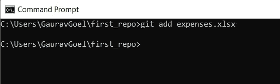

“git add”命令将文件添加到一个叫做**“staging area”**的地方。Staging Area(也称为 index)是一个由 GIT 维护的文件，它包含关于哪些文件和哪些更改将被**“提交”**的信息。这是一个非常重要的概念。GIT 中的文件可以处于以下 3 种状态中的任何一种:

***“已修改”*** —表示文件已被修改，但尚未提交。

***【暂存】*** —表示文件已经添加到暂存区。它将被提交。

***【已提交】*** —表示文件已经存储在 GIT 数据库中。

因此，一个基本的 GIT 工作流由 3 个部分组成:

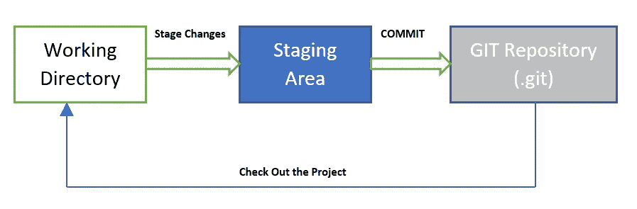

第一步:在工作树中修改文件

步骤 2:您存放那些您希望成为下一次提交的一部分的文件(或更改)

步骤 3:执行一个提交，从 Staging Area 获取文件，并将它们永久存储在 Git 存储库中。

您可以通过**“git status”**命令来检查您的更改的状态

**检查文件状态**

**“git 状态”**用于检查文件的当前状态

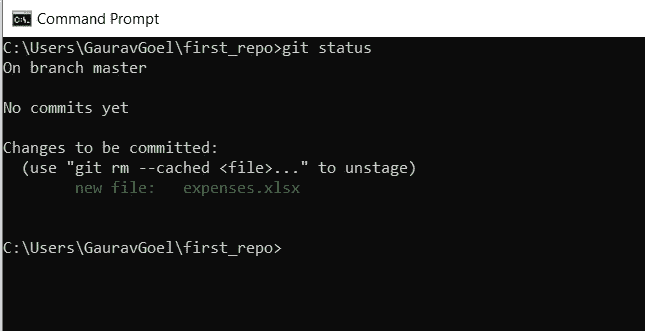

显示我们的文件“expenses.xlsx”是**标记为**待提交。为了提交它，我们将运行**“git commit”**命令。

**提交对回购的变更**

**“git commit”**—运行该命令时，GIT 会打开一个文本编辑器，我们可以在其中输入提交消息。在 GIT 软件的安装过程中，您将选择希望 GIT 使用哪个编辑器作为默认编辑器。我选择了 Notepad++因此它是默认打开的。

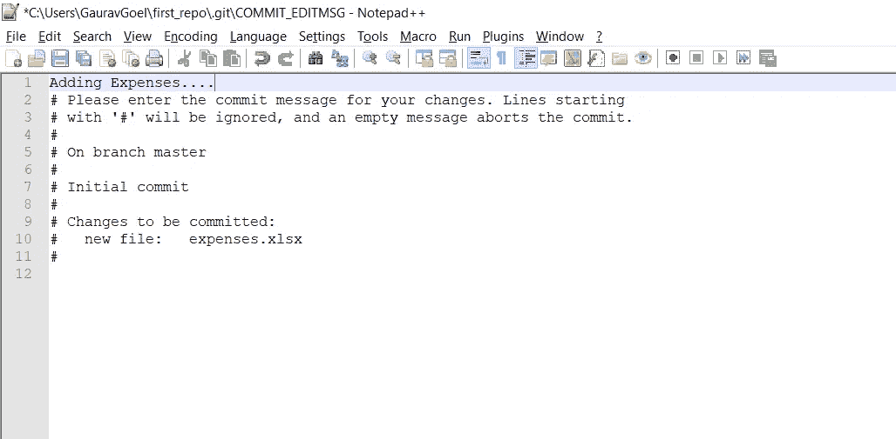

我在上面加了一行“增加费用…”

在保存消息时，我们的文件被提交到存储库。

我们刚刚提交了 GIT 中的第一个文件！！

## 在 GIT 中跟踪文件

您可以将 GIT 视为您的项目的*表示。项目不过是一些文件(源代码文件、配置文件、图像文件、数据文件等)的集合。每次我们提交时，GIT 会在那个时间点获取项目(即所有文件)的**快照**。因此，每当您修改任何文件、暂存它们并提交时，GIT 都会拍摄快照。如果你看这些快照，你会看到你项目的历史。*

因此，让我们通过运行 git status 命令来查看我们项目的状态:

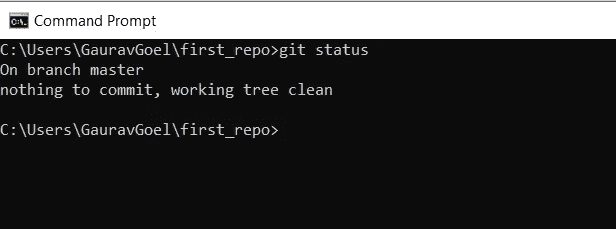

这表明没有需要提交的更改，工作树是干净的。让我们修改我们的文件并做一些更改。

我只是添加了一个费用项“西红柿”并保存了文件。

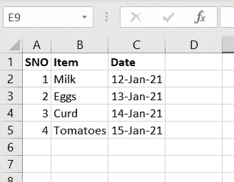

让我们再次运行 git status 命令。

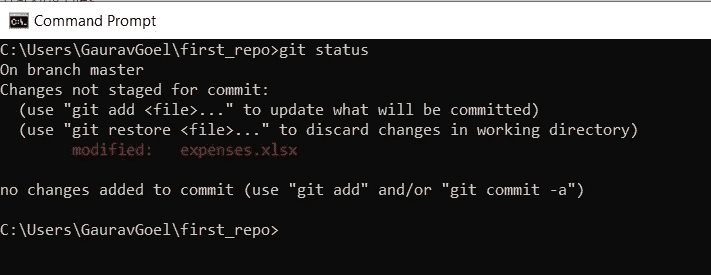

现在，它清楚地告诉我们 expenses.xlsx 已经被修改，并且存在“未提交的更改”

让我们运行“git add”命令来准备更改。

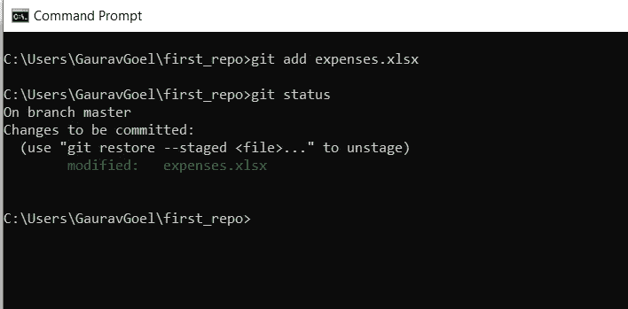

这将我们的文件标记为在下一次提交时提交。

这次，我们将使用一个参数来传递提交消息，如下所示:

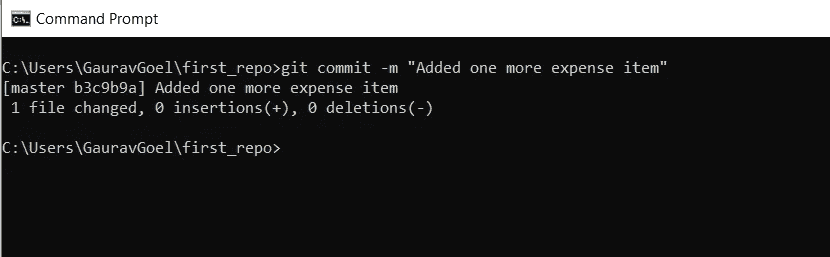

我们可以通过发出“git log”命令来检查提交日志。

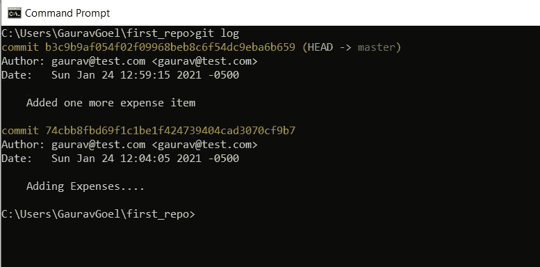

结果清楚地显示出做了什么更改，由谁做的，以及在什么时间做的。“头->主”表示这是主分支。它是指向项目当前分支的指针。

40 个字符的字母数字字符串-“b 3c 9 b 9 af 054 f 02 f 09968 beb 8 c 6 f 54 DC 9 eba6b 659”是文件内容的**哈希值**或**校验和**。GIT 通过这样的哈希值存储每个文件。

## **撤销更改**

可能有这样的情况，我们对一个文件做了一些更改，但是我们想在提交之前撤销它们。我在 expenses.xlsx 文件中增加了一行。

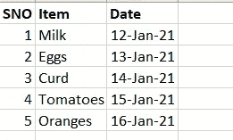

如果我们现在检查 git 状态，它将显示文件已被修改，但更改尚未提交。

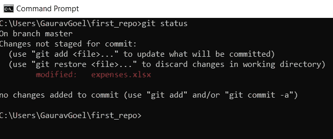

假设我们想要“撤销”这些更改。为此，我们可以使用**“git check out”**命令从 git 存储库中“检出”最后提交的快照。

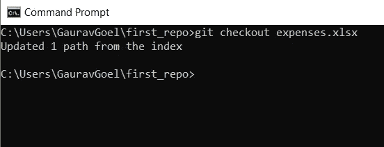

它将恢复我们所做的更改。如果我打开 expenses.xlsx 文件，它将显示以下内容:

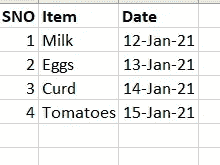

如果，你已经*上演了*的变化。你能恢复它们吗？是的。我们可以使用**“git reset”**命令来恢复已经暂存的变更。

如果您已经*提交了*更改，那该怎么办。你能恢复它们吗？是的。我们可以使用**“git revert”**命令来恢复已经提交的更改。

**分支和合并**

在一个多个人一起工作的项目中，一个人想要做一些变更，而同时另一个人想要做一些其他的变更，这是很常见的。在这种情况下，这些人可以制作项目的单独副本。每个人都可以在他们自己的副本(或者分支)上工作，最后应该有一种方法来合并和提交这些个人对主项目所做的变更。

所以当一个新的存储库被创建时，这个默认的分支被称为**“master”。**当我们提交“expenses.xlsx”文件时，我们是在主分支中完成的。

假设我们有另一个人也记下了费用。为了测试 GIT 的分支特性，我们可以为这个额外的人创建一个新的分支。

**【git 分支】**用于显示当前所有分支。

目前，除了主服务器，我们没有任何其他分支。我们可以创建一个名为“new_expenses”的新分支。

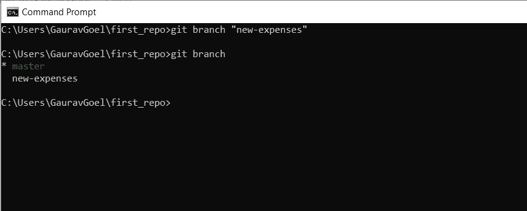

现在，这个新人可以通过使用“git checkout”命令切换到“new-expenses”分支。

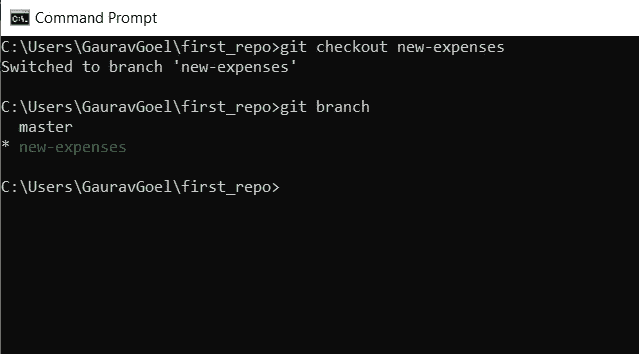

注意，星号(*)现在出现在 new-expenses 分支的前面。

我创建了一个新文件“expenses2.xlsx”。让我们将它添加到存储库中。

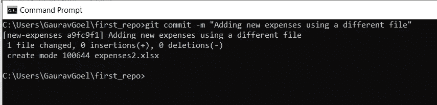

让我们使用“git log”检查日志

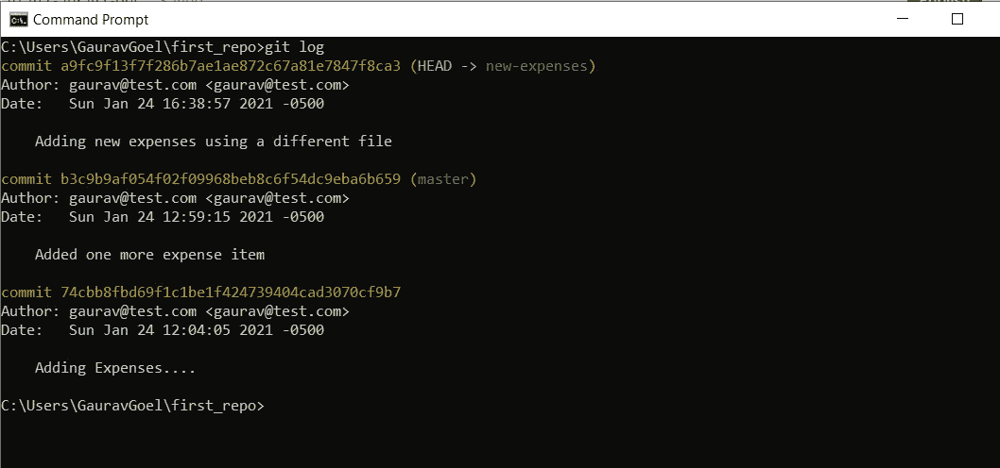

请注意，现在标题指向新费用分支。

现在，让我们将这个新分支与 master 合并。为此，您需要切换回主分支并使用**“git merge”**命令

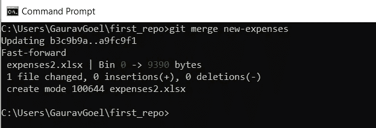

# 开源代码库

*Github* 是一个基于网络的存储库托管服务。因此，我们不用创建自己的 GIT 服务器，而是可以使用这个服务来共享和访问 web 上的存储库。我们团队的其他用户可以复制和克隆它们，并根据需要合并更改。 *GitLab* 和 *BitBucket* 是其他类似的基于 web 的存储库托管服务。

所以基本上，Github 提供了一个免费的 GIT 服务器。你可以在上面托管你的库，但是你可以托管的免费私有库的贡献者数量是有限制的。您可以随时支付月费，以获得 Github 私人服务器访问的无限制权限。

在 GitHub 上创建一个存储库非常简单。你应该有一个 https://github.com/的账户

一旦创建了一个帐户，就可以从 GITHUB 本身的用户界面创建一个新的存储库开始。

您可以使用**“git clone”**命令将 GitHub 库克隆到您的本地机器上。您必须为这个命令提供您的 GitHub 用户名和密码，它会将一个存储库副本下载到您的本地机器上。

版本控制系统是任何软件开发工作的核心。每个在软件行业工作的人都应该对这些系统如何运行有一些工作知识。本文的目的是给读者一个关于版本控制系统(特别是 GIT)的开端。在下一篇文章中，我将围绕冲突解决和托管服务(如 Github)讨论更多细节。