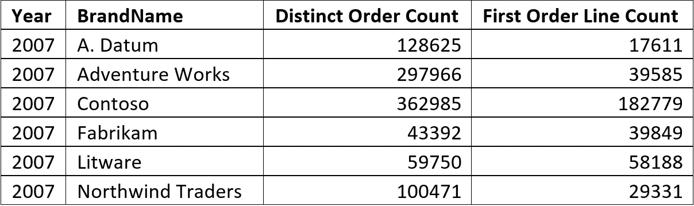
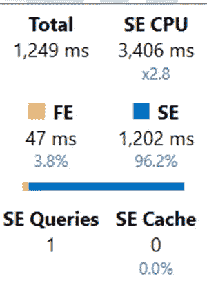
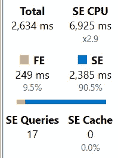
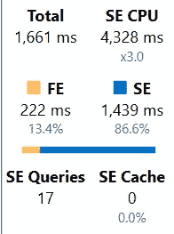
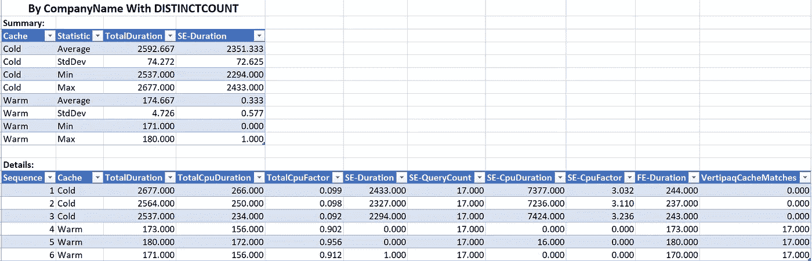
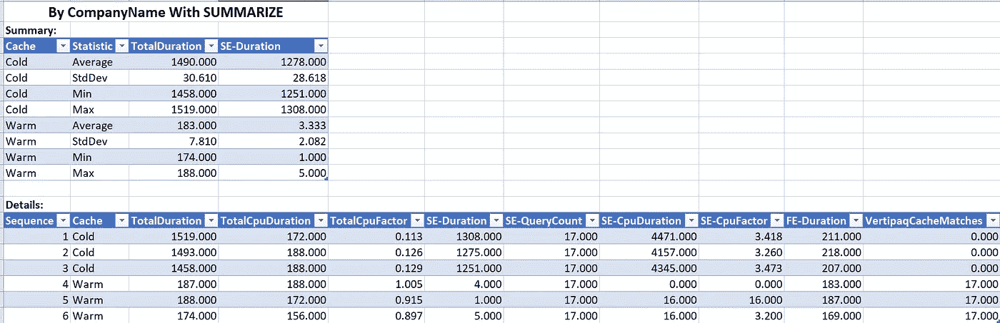
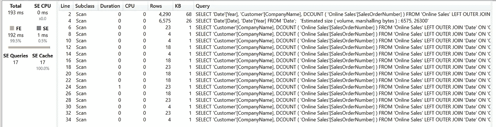
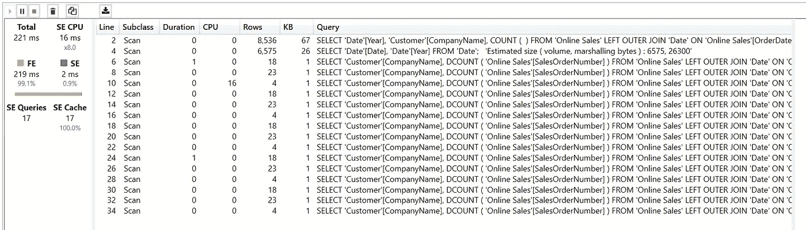
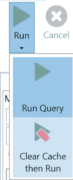

# DAX 优化的一个小挑战

> 原文：<https://towardsdatascience.com/a-little-distinct-challenge-with-dax-optimisation-16c557cc5ed3?source=collection_archive---------22----------------------->

我的一个客户问我如何最好地清点他所有的订单。在 DAX 中，这看起来是一个简单的任务，但要以最佳方式回答这个问题，它还存在一些小障碍。


由[克莱顿·罗宾斯](https://unsplash.com/@claytonrobbins?utm_source=medium&utm_medium=referral)在 [Unsplash](https://unsplash.com?utm_source=medium&utm_medium=referral) 上拍摄的照片

# 使用的数据集和场景

在本文中，我使用了微软的 Contoso 数据集。你可以在这里找到:[面向零售业的微软 Contoso BI 演示数据集](https://www.microsoft.com/en-us/download/details.aspx?id=18279)。请注意，此数据集需要一个 SQL Server 实例，因为下载的文件是 SQL Server 数据库备份文件。

因为原始文件“只”包含在线销售表中的 1200 万行，并且我希望有尽可能多的测试数据，所以我在这个表中又生成了 5100 万行，总共 6300 万行。零售表现在包含 1550 万行，而不是 340 万行。

我将这些数据加载到 Power BI 文件中，该文件现在有 1.45 GB，而不是原始数据集中的 210 MB。

我使用 [DAX Studio](https://daxstudio.org/) 来衡量不同变体的性能。

当我们查看在线销售表时，我们会注意到

*   该表包含 SaleOrderNumber 列
*   每个 SaleOrderNumber 都存在多次
*   每一行都有一个 SalesOrderLineNumber，每个订单编号从 1 开始。


图 1:每个订单的订单编号和行号

我的客户的问题是，“我如何最有效地计算我的订单？”。

# **第一次接近**

满足要求的最直接的方法是 DISTINCTCOUNT(“在线销售”[销售订单号])。

但是我已经体验了 DISTINCTCOUNT()的一些性能问题，并且想尝试一些不同的东西并比较性能。您可以在 SQLBI 文章[分析 DAX](https://www.sqlbi.com/articles/analyzing-distinctcount-performance-in-dax/) 中 DISTINCTCOUNT 的性能中了解 DISTINCTCOUNT()可能存在的问题。

所以我尝试了以下方法:

我使用以下表达式向在线销售表中添加了一个计算列:

```
[First Order Line Counter] = IF(‘Online Sales’[Sales Order Line Number] = 1, 1, 0)
```

为了测试结果，我执行了以下查询:

```
DEFINE
   MEASURE ‘All Measures’[Distinct Order Count] =
         DISTINCTCOUNT(‘Online Sales’[Sales Order Number])

   MEASURE ‘All Measures’[Sum First Line Counter] =
         SUM(‘Online Sales’[First Order Line Counter])

EVALUATE
   SUMMARIZECOLUMNS(
       ‘Date’[Year]
       ,”Distinct Order Count”, ‘All Measures’[Distinct Order Count]
       ,”First Order Line Count”, ‘All Measures’[Sum First Line Counter]
         )
```

两种测量的结果是相同的。

但是，一旦您开始按其他属性(例如，按品牌名称)对结果进行分割，情况就会发生变化:

```
DEFINE
   MEASURE ‘All Measures’[Distinct Order Count] =
      DISTINCTCOUNT(‘Online Sales’[Sales Order Number])

   MEASURE ‘All Measures’[Sum First Line Counter] =
      SUM(‘Online Sales’[First Order Line Counter])

EVALUATE
   SUMMARIZECOLUMNS(
      ‘Date’[Year]
      ,**’Product’[BrandName]**
      ,”Distinct Order Count”, ‘All Measures’[Distinct Order Count]
      ,”First Order Line Count”, ‘All Measures’[Sum First Line Counter]
       )
```

结果不再一样了:



图 DISTINCTCOUNT()与一阶行总和的结果

大多数行都有一个[销售订单行号]，它不同于 1。因此，所有这些行的[第一级行计数器]都为 0。

使用计算列的方法在这种情况下不可用。尽管如此，我通常在每一行中添加一个计数器列 1 来简化计算(SUM()而不是 COUNTROWS())。

# **第二种方法**

第二种方法是使用以下衡量标准:

```
‘All Measures’[Order Count] =
   COUNTROWS(
      SUMMARIZE(
          ‘Online Sales’
          ,’Online Sales’[Sales Order Number]
          )
      )
```

您可以使用 VALUES(' Online Sales '[SalesOrderNumber])或 DISTINCT(' Online Sales '[SalesOrderNumber])，而不是 SUMMARIZE()。但是这三种解决方案在性能上几乎没有区别。不过，如果您注意到 VALUES()和 DISTINCT()之间与可能的空值相关的不同行为，这将会有所帮助(详细信息请参见此处:[DAX(SQLBI)](https://www.sqlbi.com/articles/blank-row-in-dax/)中的空行)。

我用我的测试模型测试了这两种变体，我得到了几乎相同的性能:



图 3:不同计数度量

两者都很快，查询几乎完全由存储引擎完成。所有三种变体都返回相同的结果。


图 4:比较基本度量

稍后，我将解释为什么存储引擎而不是公式引擎完成查询很重要。

此时，我本可以去找我的客户，告诉他我的发现:“没关系。你想用什么方法都可以”。

但是我知道他有一些依赖于 DISTINCTCOUNT()模式的复杂计算。所以我也需要测试这些模式。

其中之一是使用 LASTNONBLANK()函数对特定列使用 DISTINCTCOUNT()来计算库存项目。

# **高级图案**

为了使用相同数量的数据，我创建了一个度量来计算特定时间段内最后一天的订单数。

我从 DISTINCTCOUNT()函数开始获取基线:

```
‘All Measures’[Count Last Day Sales] =
   VAR LastSaleDate = LASTNONBLANK(‘Date’[Date]
         ,DISTINCTCOUNT(‘Online Sales’[SalesOrderNumber])
         )
RETURN
   CALCULATE(
         DISTINCTCOUNT(‘Online Sales’[SalesOrderNumber])
         ,LastSaleDate
         )
```

我用这个测度查询数据，得到了这个结果:



图 5:统计最后一天的销售额

在这个测试之后，我将上述第二种方法应用于这个度量:

```
‘All Measures’[Count Last Day Sales 2] =
   VAR LastSaleDate = LASTNONBLANK(‘Date’[Date]
         ,COUNT(‘Online Sales’[SalesOrderNumber])
         )
RETURN
   CALCULATE(
      COUNTROWS(
         SUMMARIZE(
            ‘Online Sales’
            ,’Online Sales’[SalesOrderNumber]
         )
      )
      ,LastSaleDate
   )
```

表现明显不同:



图 6:统计最后一天的销售额 2

可以看到，总时间几乎少了一秒。

更重要的是，与 DISTINCTCOUNT()一样，存储引擎的使用增加了约 5%。

为什么这如此重要:

两个因素使得存储引擎的使用优于公式引擎:

1.  存储引擎是多线程的，而公式引擎只是单线程的。
2.  存储引擎有缓存，而公式引擎没有任何缓存。

第一个因素使存储引擎更快、更高效。第二个因素使使用更多存储引擎的 measures 更具可伸缩性。这意味着当几个用户都在使用一个带有这个度量的报表时，存储引擎会使用他的缓存，性能会更好。

这个话题在这里详细讲解:[DAX(SQLBI)中的公式引擎和存储引擎](https://www.sqlbi.com/articles/formula-engine-and-storage-engine-in-dax/)

# **真实世界基准**

正如 SQLBI 的家伙们总是指出的，理解理论是必不可少的，但更重要的是在具体情况下测试这些知识。

所以我在 DAX Studio 中执行了一个基准测试。结果令人惊讶:



图 7:使用 DISTINCTCOUNT()的基准测试结果

现在，将基准测试结果与使用 SUMMARIZE()的度量进行比较:



图 8:使用 SUMMARIZE()的基准测试结果

当您使用热缓存查看结果时，这个结果令人惊讶。

使用冷缓存时，使用 SUMMARIZE()的测量总是更快。但是一旦我们使用了缓存，DISTINCT()的度量就变得更快了。

当查询执行多次时，使用较少存储引擎的度量执行得更好。这个结果出乎意料，需要更多的分析。

当您并排查看执行计划时，可以找到导致这一结果的原因:



图 9:用缓存计算最后一天的销售额



图 10:用缓存计算最后一天销售额 2

当您比较前两行时，您会看到显著的差异。

使用 DISTINCTCOUNT()的度量生成 4'290 和 6'575 个中间行，而使用 SUMMARIZE()的度量生成 8'536 和 6'575 个中间行。

以下步骤使用较少的行以及 DISTINCTCOUNT()度量值。
这就是使用缓存时 DISTINCTCOUNT()的度量更快的原因。缓存中存储的数据较少，因此要检索的数据也较少。

# **结论**

我给你的主要信息是:不要把任何建议视为理所当然。您的情况总是独一无二的，它会改变应用于您的代码的任何优化的结果。

您需要很好地理解这两个引擎是如何工作的，以及如何使用可用的工具来获得尽可能多的知识。

当您测试代码时，在有缓存和没有缓存的情况下执行查询。为此，您可以使用 DAX Studio 中的“清除缓存然后运行”功能:



图 11:DAX Studio 中的运行选项

将你的专业知识应用到你的具体情况中，不要因为你在网上读过一些东西就认为任何事情都是理所当然的。

考虑现有的用例，以及用户将如何查询数据。使用这些知识来执行有意义的基准测试，并进行有价值的测量。

记录所有的步骤，代码的变更和每次变更后的度量。

对于我的测试，我使用下面的 DAX 查询和所有不同度量的定义来执行测试:

```
DEFINE
   MEASURE ‘All Measures’[Distinct Count] =
      DISTINCTCOUNT(‘Online Sales’[SalesOrderNumber])

   MEASURE ‘All Measures’[Order Count] =
      COUNTROWS(
         SUMMARIZE(
            ‘Online Sales’
            ,’Online Sales’[SalesOrderNumber]
         )
      )

   MEASURE ‘All Measures’[Order Count D] =
      COUNTROWS(
         DISTINCT( ‘Online Sales’[SalesOrderNumber] )
         )

   MEASURE ‘All Measures’[Order Count V] =
      COUNTROWS(
         VALUES( ‘Online Sales’[SalesOrderNumber] )
         )

   MEASURE ‘All Measures’[Sum Main Row] =
      SUM(‘Online Sales’[First Order Line Count])

   MEASURE ‘All Measures’[Sum Sales Line] =
      SUM(‘Online Sales’[Sale Line Counter])

   MEASURE ‘All Measures’[Sales Last Date] =
      VAR LastSaleDate = LASTNONBLANK(‘Date’[Date]
         ,COUNT(‘Online Sales’[SalesOrderNumber])
         )
   RETURN
       LastSaleDate

   MEASURE ‘All Measures’[Count Last Day Sales] =
      VAR LastSaleDate = LASTNONBLANK(‘Date’[Date]
         ,DISTINCTCOUNT(‘Online Sales’[SalesOrderNumber])
         )
   RETURN
      CALCULATE(
         DISTINCTCOUNT(‘Online Sales’[SalesOrderNumber])
         ,LastSaleDate
         )

   MEASURE ‘All Measures’[Count Last Day Sales 2] =
      VAR LastSaleDate = LASTNONBLANK(‘Date’[Date]
           ,COUNT(‘Online Sales’[SalesOrderNumber])
           )
   RETURN
      CALCULATE(
         COUNTROWS(
            SUMMARIZE(
               ‘Online Sales’
               ,’Online Sales’[SalesOrderNumber]
               )
          )
         *// Alternative to SUMMARIZE is:
         // VALUES(‘Online Sales’[SalesOrderNumber]
         // )
         // )*
         ,LastSaleDate
      )

 *//EVALUATE
 //   SUMMARIZECOLUMNS(
 //      ‘Date’[Year]
 //      ,’Customer’[CompanyName]
 //      ,”Distinct Count”, ‘All Measures’[Distinct Count]
 //      ,”Sum First order Line”, ‘All Measures’[Sum Main Row]
 //      ,”Sum Line Counter”, ‘All Measures’[Sum Sales Line]
 //      ,”Order Count Adv.”, ‘All Measures’[Order Count]
 //      ,”Distinct Count”, ‘All Measures’[Distinct Count]
 //      ,”Distinct Count D”, ‘All Measures’[Order Count D]
 //      ,”Distinct Count V”, ‘All Measures’[Order Count V]
 //      )*

 EVALUATE
    SUMMARIZECOLUMNS(
       ‘Date’[Year]
       ,’Customer’[CompanyName]
       *// ,”Distinct Count”, ‘All Measures’[Distinct Count]
       // ,”Sum First order Line”, ‘All Measures’[Sum Main Row]
       // ,”Sum Line Counter”, ‘All Measures’[Sum Sales Line]
       // ,”Order Count Adv.”, ‘All Measures’[Order Count]
       // ,”Sales Last Date”, ‘All Measures’[Sales Last Date]*
       ,”Count Last Sales”, ‘All Measures’[Count Last Day Sales]
  *    // ,”Count Last Sales 2", ‘All Measures’[Count Last Day Sales 2]*
      )
```

我取消了想要测试或比较的部分的注释，并直接在脚本中更改了度量。

最后:当你试图找到最佳解决方案时，运用你的常识选择正确的方法。

BTW:您可以将本文中的所有内容应用到 Power BI 和分析服务中。