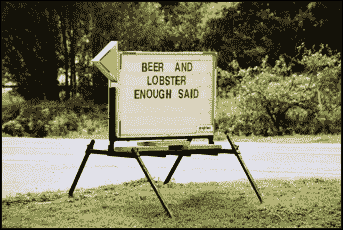
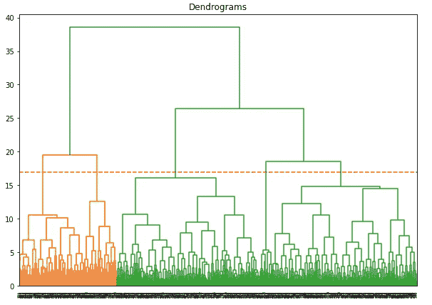
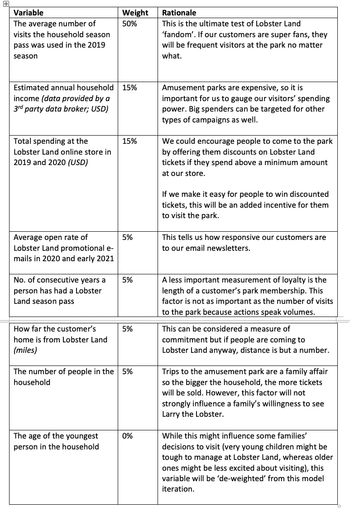
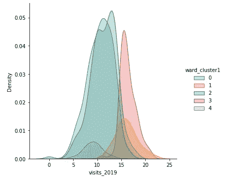
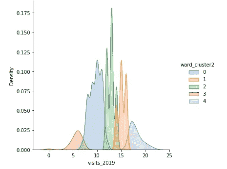

# 层次聚类中一个鲜为人知的技巧:权重

> 原文：<https://towardsdatascience.com/a-little-known-trick-in-hierarchical-clustering-weights-762156a2fce0?source=collection_archive---------17----------------------->

## *重新校准你的数据集来回答一个商业问题*

休伊·费恩·泰

和格雷格·佩奇一起

*上图:照片由* [*马克·柯尼希*](https://unsplash.com/@markkoenig?utm_source=unsplash&utm_medium=referral&utm_content=creditCopyText) *上图* [*Unsplash*](https://unsplash.com/s/photos/lobster-land?utm_source=unsplash&utm_medium=referral&utm_content=creditCopyText)

当数据被分成有意义的组时，营销分析师可以看到消费者行为的模式，并为公司创造有针对性的促销活动奠定基础。但是集群应用不仅仅局限于营销场景。例如，研究基因测序的科学家可以使用聚类分析来分析一个群体中序列之间的进化关系；房地产分析师可以使用这种技术来了解某些类型的房地产相对于该地区类似的房地产应该如何定价。

在本文中，我将演示如何使用一种流行的细分方法——层次聚类来创建客户角色。除此之外，我将说明如何使用权重来重新校准数据集，以反映您当前的业务优先级。

我的数据集？虚构的，可爱的缅因州游乐园:龙虾王国。

想象一下这个场景:随着美国许多地区疫苗接种率的上升，龙虾之乡在因新冠肺炎疫情而暂停业务后，希望赢回客户。公园的管理层如何瞄准他们的顾客？

**第一步:丢失分类变量**

第一步是删除分类变量*“户主”*和*“家庭状态”。* *户主*只是一个唯一的标识，任意分配给数据集中的每一户。由于*‘homestate’*是绝对的，因此它不适合在此模型中使用，该模型将基于欧几里德距离。

pandas 的 drop()函数将帮助我们实现这一点:

**第二步:将数据标准化**

我们的数据集包含以不同单位和完全不同的尺度衡量的变量。例如，我们的家庭年收入从 16000 美元到 213000 美元不等，而每个家庭的平均电子邮件打开率从 11%到 34%不等。

如果我们不把这些数据放在一个“公平的竞争环境”中，我们的聚类模型就会因为家庭收入而相形见绌，因为这些数字更大。我们需要以这样一种方式转换数据，使得变量之间可以直接比较。将这些数字改为 z 分数，每个分数的平均值为 0，标准差为 1，就可以达到这个目的。

**步骤 3:绘制树状图，决定聚类数，并创建聚类**

树状图将记录放在一个轴上，将距离放在另一个轴上，使分析人员能够看到嵌套聚类模型的形成方式。树状图有助于人们确定要构建多少个集群。但是，请记住，图表只是一个决策工具，对于“有多少个集群？”没有“正确”的答案问题，因为这是一个无人监督的学习过程。

经过一些迭代和实验后，我决定在 y=17 标记处切割树突，以生成具有五个不同聚类的模型。

下面的代码单元格包含设置距离阈值为 17 的聚集(自下而上)聚类模型的说明。

请注意，上面的结果是一系列数字，范围从 0 到 4，两端都有方括号。这些数字表明了我们每一次观察的聚类分配。我们需要将这些聚类分配转换到一个数据框中，这样我们就可以将这些数字附加到原始数据集的最后一列。这将使我们以后更容易比较集群。

**第四步:给每个变量加上权重**

到目前为止，聚类模型中的每个变量都是同等重要的——但是，这并不反映我们的业务优先级。为了对哪些顾客群体更容易被说服重返做出有根据的猜测，我们需要更加重视某些因素，如他们在 2019 年季节参观公园的次数。

带着这个目标，我对数据进行了重新加权:

这种重新加权是一个简单的过程。只需将每个变量的 z 分值乘以一个常数即可。使用这一过程的建模者可以容易地调整这些权重，以便试验不同的结果。

**第五步:重新聚类数据**

对变量应用不同的权重改变了一些家庭的分组方式。对' *visits_2019'* 的高度重视将我们大多数的常客家庭集中到了两个特定的群组(群组 3 和群组 4)。但是等等…还有更多。这只是已经发生的变化的一瞥。

**步骤 6:检查加权数据引起的差异**

当访问次数乘以 50 倍时，最频繁的访问者(和最不频繁的访问者)会更清楚地与群体中的其他人分开。大乘数放大了访问量的差异。

下表展示了这种差异。

在 ward_cluster1 模型(未加权)中，跨集群的平均访问范围略大于 7。我们可以看到两个频繁访问者聚类的平均值在 16 以上，而其他聚类的平均值在 10 左右徘徊。这些平均值的标准偏差为 3.33。

相比之下，使用加权聚类模型，聚类平均值的范围变得明显更大-对于 ward_cluster2 模型，类内平均值的范围跳到 12 以上。每个集群的平均访问量的标准偏差上升了近 44%，因为加权模型为我们带来了更高的高点和更低的低点，这是我们最感兴趣的变量。

**步骤 7:可视化未加权和加权数据之间的差异**

在我们对基于聚类的图表进行颜色编码之前，我们需要将它们转换成分类数据。

请注意，第二张密度图中的加权数据并未显示组间有太多重叠。在第二张图中，紫色组(聚类 4)中的“超级粉丝”与大部分数据集明显分开。这同样适用于代表“粉丝指数”下端的粉色组(聚类 3)。

*上图:未加权数据集中‘visits _ 2019’的分布图。注意一些集群聚集在一起。*

*上图:加权数据集中“访问量 _2019”的分布图。请注意，集群之间的重叠较少，紫色集群中的超级粉丝更加明显。红色集群中的群体也很突出。*

**步骤 8:检查加权聚类以创建客户角色**

到目前为止，我们的演示集中在权重最大的*‘visits _ 2019’*上，权重为 50%。虽然这些结果本身就能说明问题，但我们需要考虑权重对其余变量的影响，以便更清楚地了解龙虾之乡的客户群。

当我们查看所有变量的平均值时，我们会看到访客档案，这将有助于我们营销部门的员工开展有针对性的活动。以下是这个模型在龙虾王国的游客中识别出的群体的真相:

**死忠粉丝:**这些家庭都是龙虾地的宠儿。尽管平均每个家庭都住在离龙虾产地 85.73 英里(约 137.8 公里)的地方，但他们并不介意“徒步”去公园。2019 年，这些超级家庭平均参观公园 18.03 次。他们是网上商品的最大消费者，也最有可能打开我们的营销邮件。

**套现粉丝:**团里最有钱的。他们也是龙虾之地的坚定支持者，整个 2019 赛季平均有近 13 次访问。

**购物狂忠实者:**这些顾客对龙虾王国的奉献精神应该受到表扬，因为尽管他们住的离公园最远，但他们在这个季节平均会去 15 次以上。这组家庭的平均年收入位居第二。他们是以网上商品消费高而闻名的两个集群之一，他们的电子邮件打开率在所有集群中排名第二。

**中等粉丝:**这个群体的平均访问次数在五个集群中倒数第二。

**远方的仰慕者:**这群家庭大概是最难说服回来的。即使他们很可能会打开营销邮件，但他们在 2019 年只访问了公园 5.69 次。这些家庭在支出方面也相对克制。

**这对龙虾之乡意味着什么:**

龙虾土地管理公司应该为培养了与家庭的紧密联系而感到自豪。在新冠肺炎疫情之前，普通家庭每个月都会去公园，尽管公园至少有 84.47 英里(约 135.94 公里)远——不完全是在大多数人居住的拐角处。

现在疫苗接种率已经上升，好消息是说服人们重游龙虾之地应该不是很困难，因为人们显然对这个公园有着深厚的感情。

*“铁杆粉丝”*最容易被打动，应该是营销部门的第一批目标家庭。这些家庭最有可能打开营销电子邮件，具有强大的购买力，并且显然喜欢龙虾之乡的体验，因此他们最容易出于任何目的而推动营销漏斗:公园一日游、最新的拉里龙虾毛绒玩具、居家度假、生日派对——只要你能想到的。

*【套现粉丝】*也是狂热粉丝，不需要太多说服就能回来。他们可能会被像居家度假这样的活动所吸引，在龙虾之乡花大钱，因为他们的家庭年收入估计是平均最高的。

如前所述，最难说服的是*‘远方的崇拜者’*。

**结论:**

缅因州这种地方的主题公园，每年只有三个月的时间赚钱，才会变得太冷。考虑到短暂的机会，这些企业必须进行高度集中的营销，以确保今年的收入最大化。与此同时，主题公园需要通过创造新的游乐设施和体验来确保与观众保持联系。

上面展示的重新平衡的例子仅仅是让人们在新冠肺炎混乱之后回到公园的第一步。为了抓住消费者的脉搏，龙虾土地管理需要定期评估市场状况和消费者情绪。他们可以与他们的“超级粉丝”进行焦点小组讨论，以测试新景点的想法，并分析他们的整体营销组合，以确定他们的钱是否得到了最大的回报。此外，A/B 测试也可以应用到电子邮件简讯中，看看哪种类型的内容更适合作为“诱饵”。

无论哪种方式，跟踪、测试和迭代都是为子孙后代维持龙虾土地未来的必备条件。

***数据创建者:***

*波士顿大学高级讲师 Gregory Page 教授*

***数据来源:***

*页，格雷戈里。(2021).龙虾地往届通行证持有者[复出. csv]。检索自*[*https://drive . Google . com/file/d/13 bescseg 95 xluosfbj-h 191 ozzbgf 49h/view？usp =共享*](https://drive.google.com/file/d/13bEScSEG95XluoSfbJ-H191oZZbgf49h/view?usp=sharing)

*许可证:CC0*