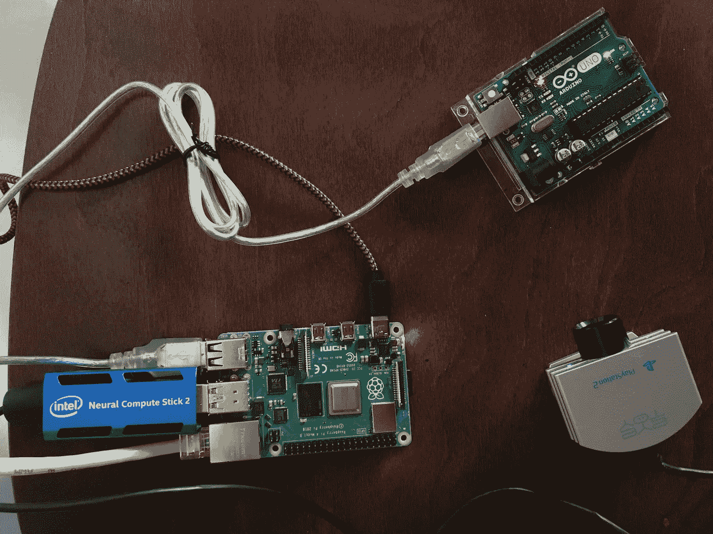
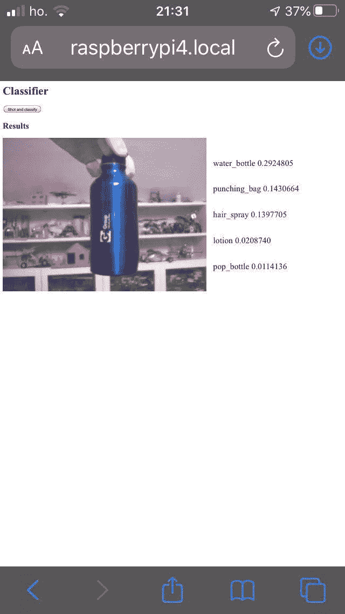

# 采用英特尔神经计算棒和 RaspberryPi 的实时人工智能网络服务器

> 原文：<https://towardsdatascience.com/a-live-ai-web-server-with-intel-ncs-and-a-raspberrypi-9831dce859e6?source=collection_archive---------42----------------------->


迈克尔·泽兹奇在 [Unsplash](https://unsplash.com?utm_source=medium&utm_medium=referral) 上的照片

人工智能的应用是无穷无尽的。我收集了一个 **RaspberryPi4** 和一个英特尔**神经计算棒**和它们一起玩。树莓是一台具有无限能力的车载计算机，但它还不足以运行复杂的神经网络。NCS 带来了新的可能性。当连接在一起时，它们是一个强大的工具，能够以小尺寸和低能耗加载**复杂神经网络** **架构**。

我将它们组合在一起，构建了一个人工智能支持的网络服务器。任何连接到家庭网络的设备都可以通过网络摄像头观看直播，并根据显示的图像进行智能预测。

# 设置

给定一个网络摄像头、一个 RaspberryPi 和一个 NCS，它们可以组装在一起，构建一个集成了人工智能的网络服务器。硬件连接很简单，人们只需注意将 NCS 连接到 Raspberry 的 *USB3.0* 端口，即可获得**更好的性能**。



这个实验的设置:RaspberryPi4，Intel NCS2 和一个网络摄像头。是的，那是一个 Arduino，但这将是另一个故事。图片作者。

# 软件

这个项目由三个不同的部分组成，每个部分都有特定的工具。

*   我们需要使用网络摄像头捕捉图像。在这种情况下， [OpenCV](https://opencv.org/) 会很有用；
*   当使用 [OpenVINO](https://en.wikipedia.org/wiki/OpenVINO) 框架捕获图像时，会执行机器学习操作，以获得网络摄像头所看到内容的分类。
*   最后，使用[瓶](https://flask.palletsprojects.com/en/1.1.x/)对图像和分类进行流式传输。

## 拍摄图像

使用 openCV 在 Python 中拍摄图像非常简单。

```
cap = cv2.VideoCapture(0) # open a connection to webcam
ret, frame = cap.read() # shot
```

人们必须创建一个与网络摄像头的连接，然后从其中读取数据。

## 机器学习

给定一张图像，棘手的部分，树莓必须请求**神经计算棒**来推断一个标签并返回结果。

NCS 可以加载**预先训练好的模型**，例如 *inception-v4* 网络。有重量的模型可以从 [openVINO](https://docs.openvinotoolkit.org/latest/openvino_docs_MO_DG_prepare_model_convert_model_Convert_Model_From_TensorFlow.html) 网站获得。

而且 outpu 中每个类的标签都要下载:[imagenet _ classe _ index . JSON](https://s3.amazonaws.com/deep-learning-models/image-models/imagenet_class_index.json)

```
def load_model(self):
        model_xml = self.model
        model_bin = os.path.splitext(model_xml)[0] + ".bin"

        # Plugin initialization for specified device
        ie = IECore()
        # Read IR
        self.net = ie.read_network(model=model_xml, weights=model_bin)

        assert len(self.net.inputs.keys()) == 1, "Sample supports only single input topologies"
        assert len(self.net.outputs) == 1, "Sample supports only single output topologies"

        self.input_blob = next(iter(self.net.inputs))
        self.out_blob = next(iter(self.net.outputs))
        self.net.batch_size = len(self.input)

        # Loading model to the plugin
        self.exec_net = ie.load_network(network=self.net, device_name=self.device)

        #load classes
        with open("/home/pi/inception/imagenet_class_index.json",'r') as file:
            self.labels_map=json.load(file)
```

## 推断图像中的内容

一旦模型和标签被加载到**神经计算棒**设备中，并且**图像**被拍摄，就可以简单地推断它在网络摄像头前面是什么。

```
res = self.exec_net.infer(inputs={self.input_blob: images})
```

## 计算机网络服务器

因此，在这一点上，我们有一个图像和一个向量`res`,其中包含了网络摄像头正在查看的信息。

我们可以通过网络服务器传输这个。使用烧瓶很简单。

```
def generator():
    global model
    cap = cv2.VideoCapture(0)
    while True:
        ret, frame = cap.read()
        frame = model.process(frame)
        encode_return_code, image_buffer = cv2.imencode('.jpg', frame)
        io_buf = io.BytesIO(image_buffer)
        yield (b'--frame\r\n'+
               b'Content-Type: image/jpeg\r\n\r\n' + io_buf.read() + b'\r\n')

@app.route("/video")
def video():
    return Response(generator(),mimetype='multipart/x-mixed-replace; boundary=frame')
```

此功能`generator` **连续产生**个新帧，因此可以传输视频。

请注意`frame = model.process_frame(frame)`，它将帧发送到计算棒，然后连同标签一起发送回来。

## 连接到新创建的服务器

使用网络中的任何设备，将浏览器指向[*http://raspberrypi . local*](http://raspberrypi.local)我们可以看到整个系统的运行。



系统能正确识别瓶子。图片作者。

# 现在去月球

在这一点上，极限是天空。这可以用作家庭监视系统、机器人的眼睛、便携式物体识别器等等..

# 代码

想玩这个吗？代码在 https://github.com/fvalle1/ai_server[的 GitHub 上](https://github.com/fvalle1/ai_server)