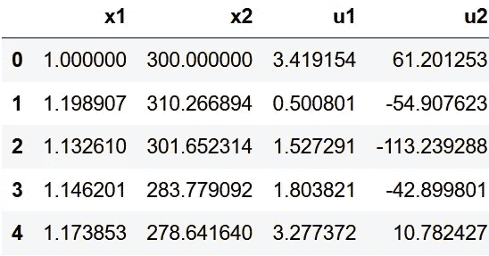

# 模拟非线性动态系统的长短期记忆网络

> 原文：<https://towardsdatascience.com/a-long-short-term-memory-network-to-model-nonlinear-dynamic-systems-72f703885818?source=collection_archive---------15----------------------->

## 基于 PyTorch based 的非线性动态系统建模

# 介绍

简而言之，动态系统是随着时间而发展的系统。随着时间的推移会发生什么变化？系统的状态。什么是状态？状态是描述系统的变量。例如，在天体运动的情况下，我们可以把当前的位置和速度看作状态。这些状态可以用来预测天体未来的位置。在这个例子中，天体的运动就是动力系统。

更正式地说，任何未来状态依赖于当前状态以及一组进化规则的系统都被称为动态系统。回到天体的例子，我们知道它的运动受万有引力定律的约束。

为了更好地理解这些系统并做出合理的预测，我们依靠数学方程来表示它们。在动态系统的情况下，我们使用常微分方程。简单地说，常微分方程是关于函数及其导数的方程。特别是，在动态系统中，我们处理关于时间的导数。单变量动态系统的一般形式可以表示为如下所示的 ODE。

有几种数值方法可用于求解常微分方程，如欧拉法、隐式欧拉法、龙格-库塔法等。那么，为什么我们需要另一种方法呢？我们为什么需要深度学习？虽然确实存在几种数值近似法来求解常微分方程，但是在实践中，对于高度非线性的系统，获得这些方程是相当复杂的。这是因为很难考虑影响系统的所有因素。例如，在天气预报的情况下，根本不可能知道影响天气预报的所有变量。因此，我们依靠数据来模拟这些系统。

在第一原理模型中，从质量平衡、能量平衡和动量平衡等物理守恒定律获得的一组数学方程用于表示系统。然而，在基于数据的模型(黑盒模型)中，我们试图从收集的数据中学习过程的行为。如下所示，我们不知道真正的潜在现象。因此，我们使用输入和输出数据来确定最能代表系统的模型。

图 1:基于数据的模型表示[【来源】](https://www.routledge.com/Principles-of-System-Identification-Theory-and-Practice/Tangirala/p/book/9781439895993)

在这篇文章中，我们将集中讨论长短期记忆(LSTM)网络来模拟非线性动态系统。对递归神经网络(RNN)和 LSTM 的基本理解将会有所帮助。为了更好地理解 RNN 和 LSTM 的工作方式，请参考下面这些精美的插图文章。

</illustrated-guide-to-recurrent-neural-networks-79e5eb8049c9>  </illustrated-guide-to-lstms-and-gru-s-a-step-by-step-explanation-44e9eb85bf21>  

# 考虑中的动态系统

让我们考虑一个黑盒非线性过程。让我们将(x₁(k)，x₂(k))定义为时间 k 时的状态，而(u₁(k)，u₂(k))作为时间 k 时的输入，(x₁(k+1)，x₂(k+1))是下一时间步的状态。

考虑中的非线性动力系统

假设非线性过程处于(x₁(k)、x₂(k 的当前状态，我们用输入信号(u₁(k)、u₂(k)).来激励该过程然后，我们测量输出并将其存储为(x₁(k+1)，x₂(k+1)，如上所示。我们重复这个实验几次，并记录我们的数据。我们的目标是使用这些数据来模拟底层流程。这种方法对于客户需要基于数据的模型的任何过程都是一样的。

> 为了公平对待我的化学工程学位，我将考虑一个非线性连续搅拌釜反应器(CSTR)作为我们的动力系统。对于那些了解 CSTR 的人来说，两个状态 x₁和 x₂分别是反应物的浓度(Cₐ)和反应器的温度(t)，而两个输入 u₁和 u₂分别是入口浓度(Cₐ₀)和提供给反应器的热量(q)。如果您从未听说过这一点，请不要惊慌，这只是给系统一些背景。

# 数据生成

不幸的是，我的后院没有一个化学反应堆来进行这个实验(如果我有，那会很奇怪)。幸运的是，这样的系统可以用下面显示的一组 ode 精确地表示。

这些方程足以完整地描述基本过程。然而在实践中，数据会被测量噪声和不可测量的干扰所污染。因此，要为这个项目生成数据，我们可以使用上面显示的一组微分方程，并添加随机噪声来获得非常实用的数据。下面显示了前几个示例。

在实践中，通常数据是成批收集的。为了复制这一点，我收集了 15 批数据。在每一批中，我从不同的初始状态开始，用随机输入信号轰击它。批号 15 的示例图如下所示。

批号 15 的数据

> 由于所考虑的变量大小的差的数量级，在训练模型之前缩放这些数据是很重要的。

# LSTM 网络

本项目使用的 LSTM 网络

**目的:**在 PyTorch 中建立一个 LSTM 网络来模拟上面讨论的非线性动态系统。

我们将使用两个隐藏层，分别有 15 个和 10 个 LSTM 单元。这个网络的输入是我的当前状态和输入信号，而网络的输出是系统的未来状态

我将解释这个过程，并提供一个代码供您在自己的系统中使用。

我已经将全部数据存储在*数据帧*中。让我们从定义批量大小来批量处理数据开始。我在每一批中收集了 101 个数据点。我用了 14 批数据来训练 LSTM 网络，用剩下的一批来测试模型。

我使用批号 5 作为测试集。我们正在确保数据点属于浮点类型，我正在分割训练集和测试集。

如前所述，缩放对于我们的数据至关重要。我们正在创建两个 MinMax scaler 对象，用于在-1 和 1 之间缩放数据，并将其脱机保存为 pickle 对象。

> 注意:为了避免任何形式的数据泄漏，测试集不包括在内以适应缩放参数。

然后，归一化的训练和测试集被转换成 torch 张量对象。我们必须以内置 PyTorch 模型能够理解的方式呈现数据。为此，我们定义了一个函数 *input_data* ，它接收数据和一个窗口大小，以返回输入和输出数据的时间序列。窗口大小是指未来预测的大小。在我们的例子中，我们只需要下一个即时输出。因此窗口大小为 1。

我的数据框的前几个样本

函数 *input_data* 接收上面显示的数据框以及窗口大小，并返回下面显示的张量对象列表。在列表的每个元素中，有一个大小为(4，2)的元组，分别具有到 LSTM 网络的输入和输出。这形成了我们的训练数据。

我训练数据的前几个样本

我们现在准备用两个隐藏层来定义 LSTM 模型。上面写的类 *LSTMmodel* 适用于任何输入大小、输出大小和隐藏层中的神经元。这个类中的 forward 函数接收数据序列并返回预测值。

我们现在关注手头的问题，定义一个 *LSTMmodel* ，其输入大小为 4，两个隐藏层分别具有 15 和 10 个神经元，输出大小为 2。我们还定义了一个*均方差*损失和 *Adam* 优化器。

> 这里使用的所有超参数都是通过交叉验证获得的。

这里，我们训练 100 个时期的模型，并打印每 10 个时期的训练损失。务必分批训练数据，这一点很重要。

我们现在准备对测试集(批号 5)进行预测。我们将模型设置为评估模式，并让 PyTorch 知道我们不再对渐变感兴趣。我们对测试集进行预测，并将其存储在 *preds* 中。

测试数据的预测值与真实值

瞧啊。上图显示了预测状态与状态真实值的比较。我们可以看到，该模型在测试数据上的性能非常好，RMSE 为 3.27 (1%)。

# 奖金

对于一些应用程序，有必要对不止一个一次性步骤进行预测。也就是说，我们可能有一个更长的预测范围。在这些情况下，我们可以调整代码以使用预测来进行进一步的预测，如下所示。

预计表现会略差。这是因为第一个时间步之后的预测严重依赖于第一个预测。如果第一次预测偏差很小，误差就会累积并发散，导致性能下降。改进该模型的一个方法是在头脑中训练多个未来预测。

可以看出预测值偏离了真实值

# 结论

我们总是会遇到非线性动态系统。为了做出预测或未来的预测，必须有一个好的模型来表示这些动态系统。有时很难将高度非线性的系统建模为显式的数学方程。因此，我们依赖于基于数据的模型或黑箱模型。在这篇文章中，我介绍了一种用 LSTM 建模非线性动态系统的方法。我在这里展示的代码非常灵活。请随意使用它们来解决您的问题。你可以在我的 [GitHub repo](https://github.com/srpraveen97/LSTM_nonlinear) 找到代码。

# 参考

1.  Heidarinejad，m .，J. Liu 和 P. D。2012."使用李亚普诺夫技术的非线性过程系统的经济模型预测控制."AIChE journal 58(3):855–870 . doi:10.1002/AIC . 12672 .[https://AIChE . online library . Wiley . com/doi/ABS/10.1002/AIC . 12672](https://aiche.onlinelibrary.wiley.com/doi/abs/10.1002/aic.12672)
2.  吴，陈哲，安和林孔，大卫和，帕纳吉奥蒂斯。(2019).基于机器学习的非线性过程预测控制。第一部分:理论。爱车杂志。65.10.1002/aic.16729
3.  [https://www . udemy . com/course/py torch-for-deep-learning-with-python-boot camp/](https://www.udemy.com/course/pytorch-for-deep-learning-with-python-bootcamp/)