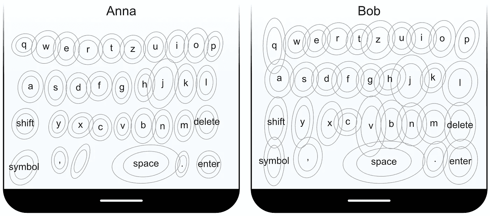
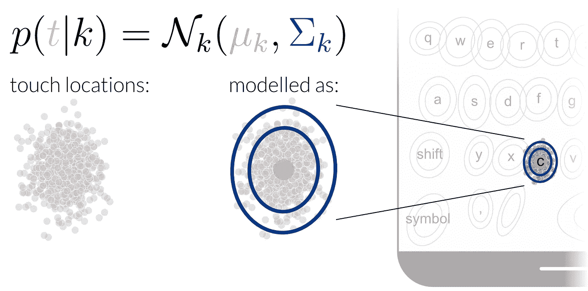
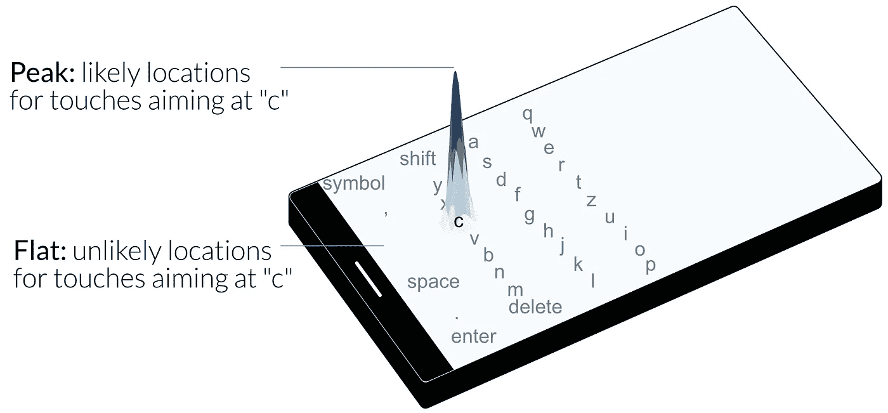
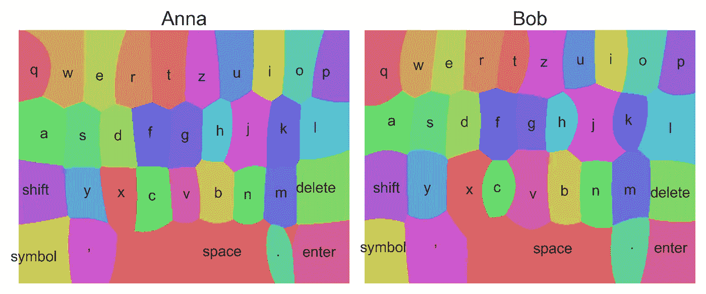
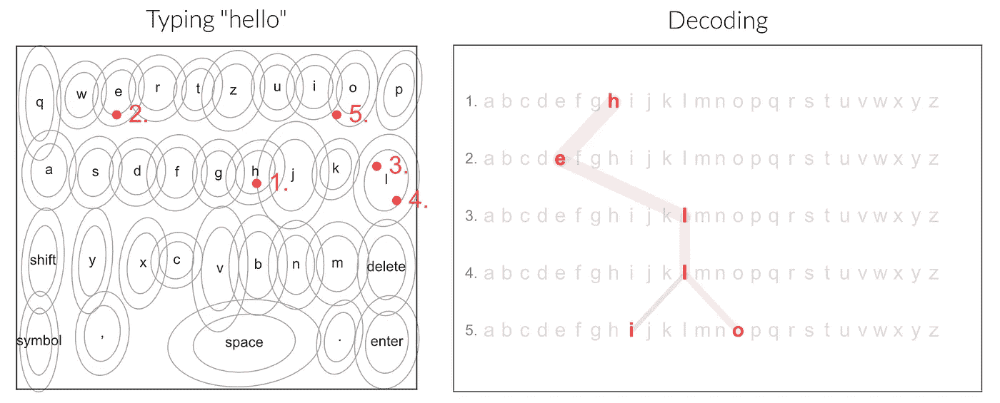
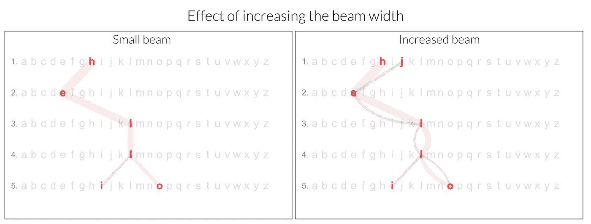
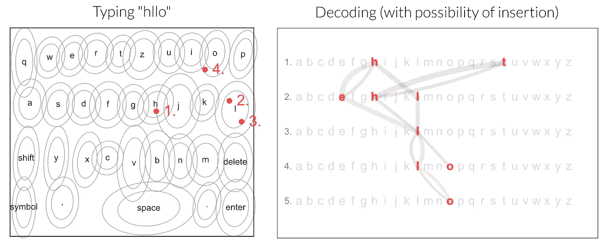
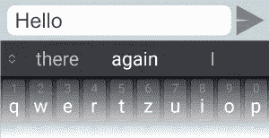
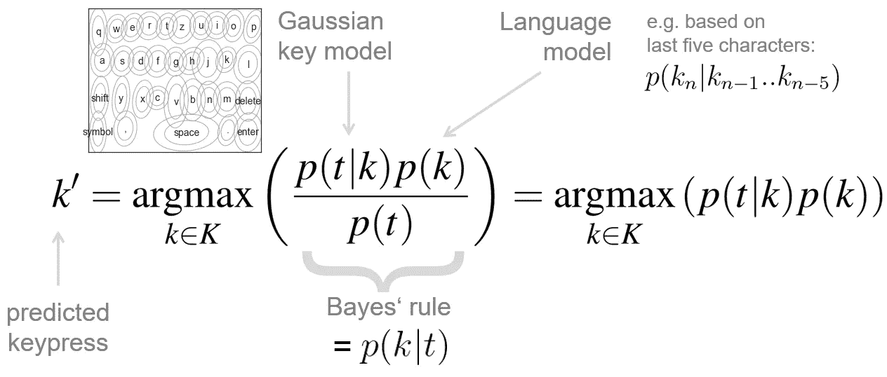

# 看看贝叶斯键盘的内部

> 原文：<https://towardsdatascience.com/a-look-inside-the-bayesian-keyboard-c10c53e6d5a?source=collection_archive---------16----------------------->

## 让现代智能手机键盘变得智能的数据驱动功能的视觉之旅

个性化的概率智能手机键盘，具有各种可视化功能:触摸分布、键区、不确定性/熵测量。(作者本人*法师)*

你输入的就是你得到的？没有现代触摸键盘。这篇文章直观地解释了 smarpthone 键盘的四个核心功能——包括个性化、自动纠错和单词预测。基于我为“智能用户界面”讲座创建的材料，我们检查了这些功能在我们日常打字中的内部工作，并以启发、评估和批判性反思数据驱动和“智能”用户界面的要点作为结论。

# 特点 1:调整关键领域

现代智能手机键盘对分配给每个按键的屏幕区域进行了个性化设置。这通常不会显示在图形用户界面中，以避免混淆和不良的共同适应——但我们可以在这里揭示它。

## 触摸数据

当用户打字时，键盘收集背景中的触摸位置(2D 点:x，y)。该图显示了几天来收集的两个人的触摸数据。

触摸两个用户的智能手机键盘。(作者本人*法师)*

## 触摸键盘模型

使用这些触摸，我们可以为每个用户创建个性化的按键:这些按键模型可以捕捉每个用户在键盘上的手指放置行为。例如，对 Anna 来说，字母“x”最好放在与 Bob 稍有不同的位置。

适用于两个用户的个性化键盘型号，安装在上图所示的触摸屏上。(我作者*法师)*

如图所示，我们为个性化键盘建模，每个键 *k* 具有正态分布 *p(t|k)* ，安装在该键的触摸位置上。形式上:

每个键 k 被建模为正态分布，以该键的平均触摸位置为中心。该图示出了“c”键的例子。(本人*作者法师)*

对于每个键 *k* ，模型因此存储对于该键观察到的触摸的平均位置*(x，y)* ，以及*协方差矩阵*(可以直观地认为其描述了键的大小和形状)。视觉上，圆圈显示了这些分布的两个和三个标准偏差。

我们在 **3D** 中也可以这样看:每个键都是一座“小山”，高度对应的是触摸可能性 *p(t|k)* 。图中显示了“c”键的示例。

“c”键触摸可能性的 3D 图。(我作者*法师)*

## 用户按了哪个键？解码触摸

这种键盘模型可以用来解码触摸。“解码”仅仅意味着计算出用户想要按哪个键。

结果显示在这些图中，其中颜色表示每个触摸位置(即像素)最可能的按键。我们已经推出了个性化键盘，根据每个用户的触摸行为进行像素到按键的分配。

两个用户的像素到按键分配，揭示了手指在按键上放置的差异，键盘可以解释这种个性化。(作者本人*法师)*

形式上，为了得到这些图，我们评估 *p(k|t)，*，即，给定触摸位置 *t* 的按键 *k* 的可能性。键盘模型产生了 *p(t|k)* ，我们用[贝叶斯法则](https://en.wikipedia.org/wiki/Bayes%27_theorem)将其翻转为 *p(k|t)* 。这产生了最可能的键*k’*:

> 注意事项:
> 
> *p(k)* 是按键 *k* 上的**先验**分布，描述了一般按键的可能性，不考虑触摸位置。简单的先验是一致的(即所有的关键字都有相同的可能性)。一个更好的先验使用语言环境，我们将在后面讨论。
> 
> *p(t|k)* 是假设键为 *k* 时触摸 *t* 的**可能性**。这就是上面描述的**高斯关键模型**。

## 不确定

既然这是一个概率模型，那么我们可以看看键盘的**不确定性**。后验 *p(k|t)* 的[熵](https://en.wikipedia.org/wiki/Entropy_(information_theory))就是这样一种不确定性的度量。直觉上，如果许多按键 *k* 对于触摸位置 *t* 的可能性相等，则该值为高。相反，如果一个特定的键被认为是唯一可能的键，则它是低的。

键盘像素上模型后验的不确定性(熵)。(我作者*法师)*

上面的图显示了这种熵:不确定性在不同像素-键分配之间的“边界”处最高。这符合我们的直觉，即靠近按键边缘的触摸是“草率的”，或者换句话说，比击中按键死点的触摸更难以理解。

# 特点二:整合语言语境

这种个性化键盘可以通过整合语言环境来进一步改进。为了说明，我们在这里使用一个简单的**二元语言模型**。二元组是一对字母(例如“th”)。这很容易建立:简单地计算大量文本中的字母对，并计算它们的相对频率。

在形式上，这个二元模型语言模型是给定前一个键的下一个键的可能性。将此作为解码等式中的先验，我们得到:

我们可以通过比较前一个字母是“q”的例子和前一个字母是“t”的例子来检验语言模型的影响。考虑到英语中这些字母的常见配对，我们期望“u”在“q”之后获得屏幕空间，“h”在“t”之后获得屏幕空间。事实上，该图揭示了这一变化。

(简单)语言模型影响的例子:根据前一个字母是“q”还是“t”来改变按键分配。这些关键区域大小的变化符合我们的直觉，即英语中“q”后面经常跟着“u”，“t”后面经常跟着“h”。(作者本人*法师)*

为了进一步检验这一结果，我们接下来比较了两种语言环境下模型不确定性的**差异**。这显示了由于变化的上下文，每个像素的确定性的增益(或损失)。

对于我们从“q”切换到“t”的例子，如前一个字母，我们期望“u”周围的像素失去确定性，而“h”周围的像素获得确定性。这是因为:

*   许多字母很可能跟在“t”后面——这与“q”形成对比，因为“q”后面除了“u”之外很少跟别的字母。
*   反过来，“th”很常见，增加了模型在“t”之后“h”的确定性。

事实上，该图揭示了这种影响。

键盘不确定性(后验熵)的变化取决于前一个字母是“q”还是“t”。(我作者*法师)*

# 特点三:解码全词

到目前为止，我们一次解码一个触摸，这相当于关键区域个性化。打字由许多连续的触摸组成。因此，我们也可以研究如何将触摸序列解码成单词，包括语言环境。这可以用来实现“自动校正”。

## 推广到序列

我们现在寻求找到最可能的字母序列 *s* ，给定一个观察到的触摸位置序列 *o* 。那就是:

该等式与单次触摸的等式相同，并且原理保持不变。为了解码单词，我们只需要将其组成部分归纳为按键/触摸序列。为简单起见，假设 *n* 触摸长度为 *n* 的字 *(* 即无遗漏或虚假触摸)，这可以形式化为:

> 注意事项:
> 
> *p(s)* 是一个先于的**字母序列。为了说明，我们重用我们的**二元模型**。也就是说， *n* 个字母(例如一个单词)的序列的联合概率是其键到键转换(即二元模型)的产物。**
> 
> *p(o|s)* 是假设字母序列为 *s* 时，触摸观察值 *o* 的**可能性**。这里我们重用我们的**高斯键模型**，它为每次触摸产生 *p(t|k)* 。我们通过乘法在序列上将其聚合为联合概率。

## 用令牌传递算法寻找最可能的单词

尝试所有可能的字母序列 *s* 长度 *n* 以找到最有可能的一个是极其昂贵的(指数)。我们需要做出妥协。具体地说，这里我们使用一个带有波束修剪的令牌传递算法。

简而言之，该算法将一组部分序列作为“标记”来跟踪，这些部分序列可以被分割(即路径中的“分叉”:探索当前序列的多个延续)或被丢弃(即“死胡同”:由标记表示的序列变得太不可能)。

下面显示了一个具体的例子:一个用户想要输入“hello”(左图)。该算法在假设空间中探索了两条路径(右图):“hello”和“helli”。如线条粗细所示，“你好”的可能性较大；解码发现正确的单词是最可能的单词(红色路径)。

通过令牌传递解码预期输入“hello”的触摸序列(左图)。右边的图显示了算法通过假设空间的探索路径；从上到下阅读(垂直:触摸 1-5，水平:红色探索字母，线条粗细表示可能性，红色路径最有可能)。(作者本人*法师)*

## 波束搜索宽度

直观地说，波束宽度决定了我们希望允许多少探索。更多的探索可能会增加找到正确单词的机会，但也会增加计算时间。

通过比较不同波束宽度的探索假设，波束宽度的影响变得可见，如下所示:在右侧，算法另外探索了“jello”，然而它认为这比正确的“hello”更不可能(参见与“he”相比以“je”开始的更细的路径)。

增加波束宽度导致探索假设空间中的更多部分(这里将“jello”添加到候选单词列表中)。(作者本人*法师)*

## 插入和删除

令牌传递算法的扩展引入了插入(产生一个字母而不处理下一个触摸)和删除(处理下一个触摸而不产生字母)。这些解决了两个常见的用户错误:虚假(误)触摸和意外跳过的按键。

虽然我们在这里不涉及技术细节，但是接下来的两个图用具体的例子说明了插入和删除的解码。

对于**插入**，我们看例子“hllo”(不小心跳过了“e”)。下图中的插入解码器正确地找到“hello”作为最可能的单词:直观地说，插入“e”比简单地跟随触摸证据产生更高的总体可能性，因为“he”在英语中比“hl”更可能。

用可以插入额外字母的解码器解码“hllo”(用户不小心跳过了“e”)。(作者本人*法师)*

请注意，本例中的解码器还通过在开头插入“t”来探索“thllo”，因为“th”在英语中的可能性很高。

补充一下，对于**删除**，我们看“hqello”(偶然的“q”)的例子。解码器正确地发现“hello”是最有可能的假设:虽然“hq”很可能被触摸，但“qe”不太可能通过“ε”(空)跳过“q”而取“he”。

用可以删除触摸(ε)而不是产生字母的解码器解码“hqello”(注意伪“q”)。(作者本人*法师)*

# 功能 4:建议下一个单词

到目前为止，所有功能都假设用户已经触摸了按键。相比之下，如果我们没有接触，我们只能依靠语言环境。这产生了“单词建议”的特征。

智能手机键盘上的单词建议，在键入“Hello”后显示。(我作者*法师)*

例如，我们可以查看最后的 n-1 个字来预测下一个字:

这是一个简单的单词级的*n*gram 模型，可以通过统计大型文本语料库中的单词序列来训练。最近，深度学习语言模型也被用于这项任务。它们提供了一些优势，比如能够包含更长的上下文。

# 讨论和要点

在深入你的键盘之后，这一切意味着什么？这里有三个观点可能会影响未来“智能”用户界面的设计，分别是:1)构思，2)评估，3)超越交互的批判性思考。

## ***你的数据驱动键盘的幕后正在进行很多事情***

回到一个键盘应用程序，例如五到十年前。我最近这样做是为了好玩，但感觉不太对劲:我觉得奇怪地笨拙和缓慢——可能是因为旧键盘还没有关于我的触摸数据，当然也没有我已经习惯的语言建模和解码的质量。

→ *构思:*为了激发“智能”ui 的新想法，我们可能会问，如何将成功的数据驱动和概率概念从键盘更普遍地转移到 GUI 上(也见最后的建议阅读)。

## ***UX 不止是 UI，尤其是具有“智能”的 UI***

如上所述，旧键盘看起来和我最新的键盘应用几乎一样，但是我的用户体验要差很多。今天的键盘是一个交互系统的主要例子，在这个系统中，UX 不能从视觉 UI 中辨别出来，这不能揭示潜在的算法质量。

→ *评估:*经验评估对于自适应 ui 的设计至关重要。可以预期，未来的进展将受益于来自人机交互和人工智能的知识和方法。

## ***数据驱动的 ui 中的数据是如何使用的？***

我们已经每天与数据驱动的用户界面交互，这些用户界面收集我们的数据。键盘是极少数交互系统之一，至少在原则上，这些系统只收集输入数据来改进输入法*本身*。

→ *反思:*我们可以通过调查用户数据在原位(即交互中)与非原位(即超出使用范围)的使用情况，来批判性地检验数据驱动的用户界面。

## 回顾和思考要点

为了激发进一步的讨论和见解，我们可以将今天的触摸键盘视为:

*   *数据驱动的 ui:*键盘使用触摸数据和语言数据来改善你的打字体验和效率。
*   *概率 ui:*键盘在解释你的输入时会考虑到不确定性。
*   *动态和自适应的用户界面:*集成一个语言模型并不是脱离输入的“魔法”,而是导致像素到键分配的动态变化。
*   *生物识别用户界面:*为了适应按键，键盘会学习你个人触摸行为的表现，这因用户而异，就像行为指纹一样。
*   *欺骗性用户界面:*键盘内部使用不同的像素到按键的分配，而不是屏幕上显示的按键(出于好意:避免混淆和恶化的协同适应)。
*   *搜索者:*键盘搜索一个巨大的假设空间，将你的输入触摸“解码”成单词和句子。

# 结论

我们已经获得了使今天的智能手机键盘智能的核心功能，并通过基于具体触摸和语言数据的可视化来探索它们的效果和中心参数。

至关重要的是，这里解释的四个核心特征都来自一个概率框架(贝叶斯规则)，通过用不同的具体组件填充它的槽。以下是总结:

贝叶斯键盘概述。(我作者*法师)*

总之，移动触摸键盘已经成为“智能”、数据驱动和概率用户界面的一个普遍的日常例子。

延伸阅读:

*   [键盘以外的其他触摸图形用户界面的概率概念](https://uxdesign.cc/what-if-gui-elements-were-not-limited-to-boxes-2f73a9ff9ec4)
*   [关于令牌传递和输入解码的更多信息](https://oxford.universitypressscholarship.com/view/10.1093/oso/9780198799603.001.0001/oso-9780198799603)
*   寻找幻灯片，代码等。？这是基于我在德国拜罗伊特大学的“智能用户界面”讲座上创作的材料。与他人共同教授的开放版本，可在此获得:【https://iui-lecture.org/】T4(包括重现剧情的 Python 笔记本)。