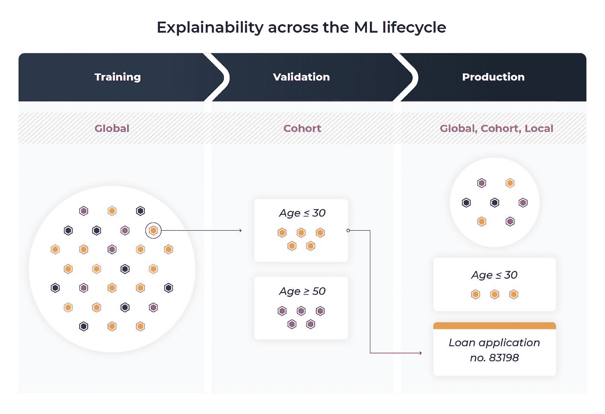
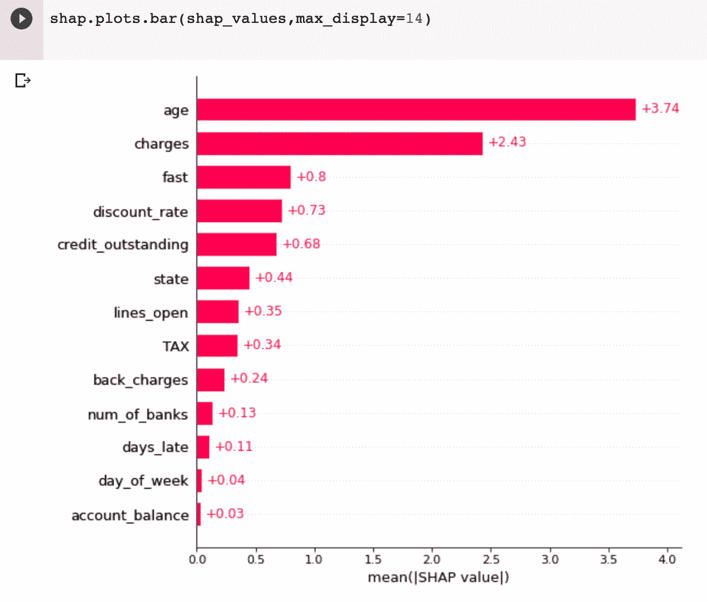
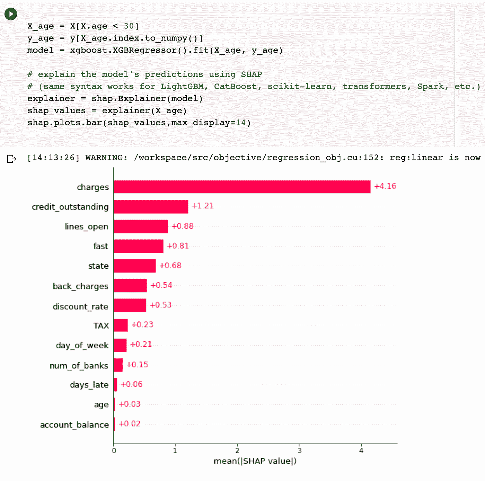
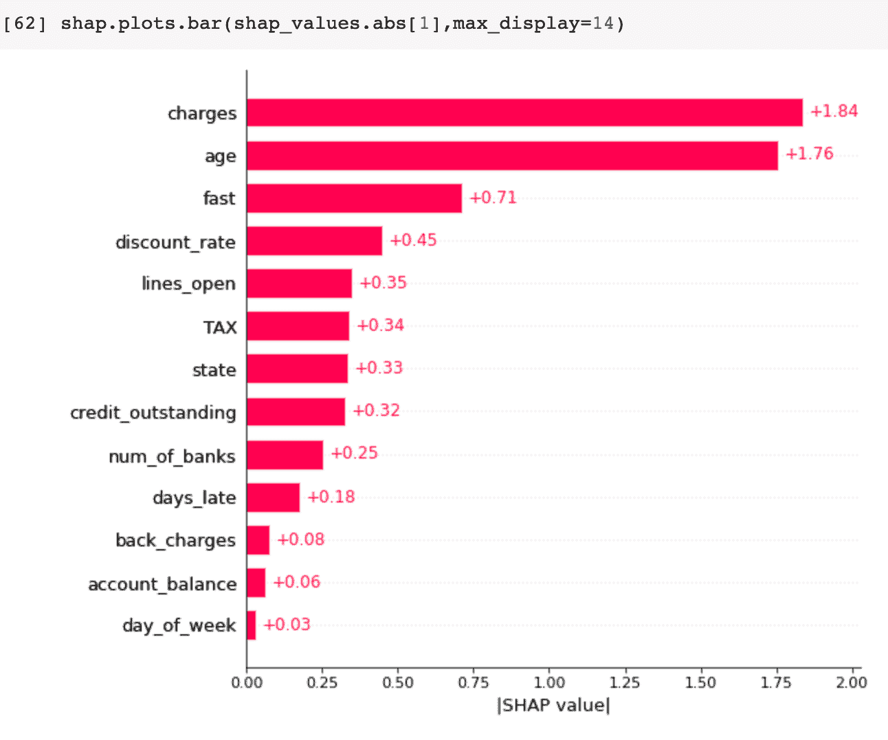
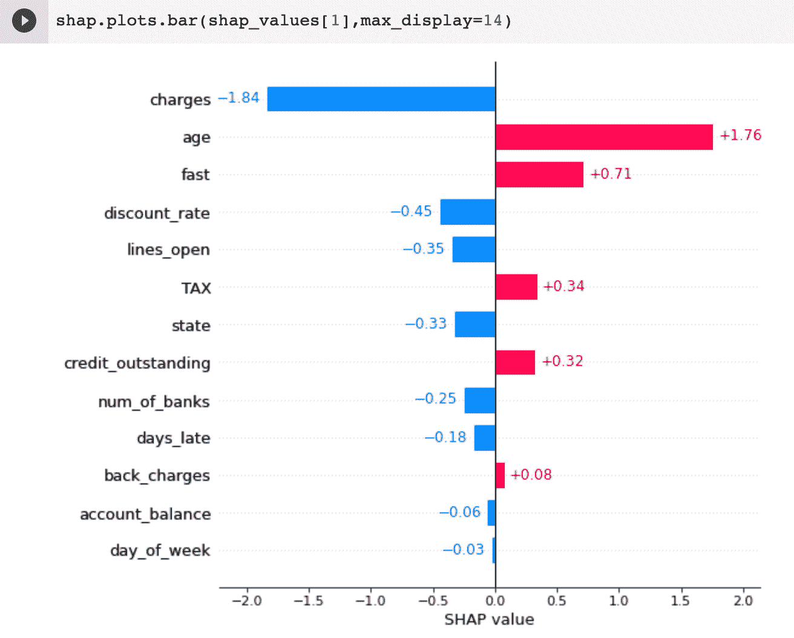
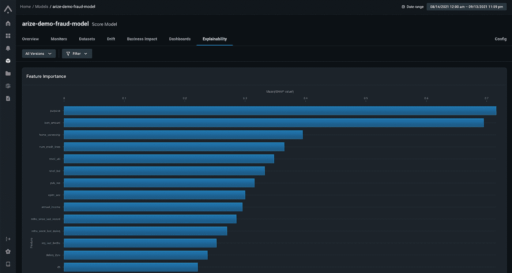
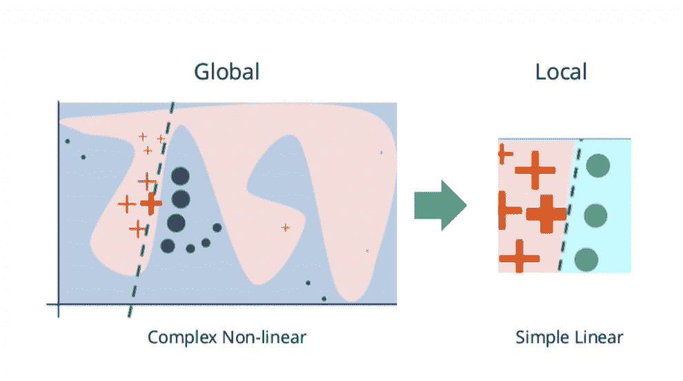

# 全球、群体和局部模型的可解释性研究

> 原文：<https://towardsdatascience.com/a-look-into-global-cohort-and-local-model-explainability-973bd449969f?source=collection_archive---------8----------------------->

## *关于不同层次的可解释性以及如何在 ML 生命周期中使用每一层的初级读本*

在过去的十年中，机器学习应用的众多进步迅速推动了重大的技术进步。新颖的人工智能技术通过破解计算机视觉、自然语言处理、机器人学和许多其他领域中历史上难以捉摸的问题而彻底改变了工业。今天，说 ML 改变了我们的工作方式、购物方式和娱乐方式并不夸张。

虽然许多模型的性能有所提高，在流行的数据集和挑战上提供了最先进的结果，但模型的复杂性也有所增加。特别是，自省和理解模型为什么做出特定预测的能力变得越来越困难。

既然 ML 模型能够影响我们生活的重要部分，那么我们有能力*解释*他们是如何做出预测的就变得更加重要了。

在这篇文章中，我们将展示 ML 可解释性的不同层次，以及如何在 ML 生命周期中使用每一个层次。最后，我们将介绍一些常用的方法来获得这些层次的可解释性。

# 培训中的可解释性

作者图片

首先，让我们来看看可解释性如何在机器学习生命周期的模型训练阶段发挥作用。特别是，让我们开始梳理 ML 可解释性的不同风格。

在训练中特别重要的是**全局可解释性。**如果*在所有预测中*ML 工程师能够确定哪些特征对模型的决策贡献最大，那么我们认为 ML 工程师能够获得全局模型的可解释性。这里的关键术语是“所有预测”，不同于群组或局部可解释性——全局是所有**预测的平均值。**

换句话说，全局可解释性让模型所有者决定每个特征在多大程度上有助于模型如何对所有数据进行预测。

在实践中，使用全局可解释性的一个领域是在特定的基础上向非数据科学团队提供关于模型平均使用什么来做决策的信息。示例:营销团队在查看客户流失模型时，可能想知道预测客户流失最重要的特征是什么。

在此使用案例中，该模型为数据科学之外的利益相关方提供全局洞察，其需求频率和对象可能会有所不同-它更像是一种分析功能，为业务利益相关方提供更多洞察。

还有一个全局可解释性的模型构建器用例，即确保一个模型做你期望的事情，并且没有版本之间的变化。您的模型可能会以不可预见的方式“学习”您打算教给它的函数，如果不能理解它所依赖的特性，就很难说它选择了哪个函数来近似。

让我们用一个模型来预测一个新客户应该为你的银行的新信用卡获得的信用额度。该模型可以通过多种方式完成为新客户分配信用额度的工作，但并非所有方式都是平等的。可解释性工具可以帮助你建立信心，相信你的模型正在学习一个函数，这个函数不会过度索引可能在生产中引起问题的特定特性。

*全球特征重要性—年龄最重要|作者图片*

例如，假设一个模型非常依赖年龄来预测要分配的信用额度。虽然这可能是偿还大额信贷账单能力的一个强有力的预测因素，但它可能会低估一些有能力支持更高信贷限额的年轻客户的信贷，或高估一些可能不再有收入支持高信贷限额的年长客户的信贷。

可解释性工具可以帮助你在将模型交付生产之前*发现潜在的问题。全局可解释性有助于抽查模型中的特性是如何对模型的整体预测做出贡献的。在这种情况下，全局可解释性将能够突出年龄作为模型所依赖的主要特征，并允许模型所有者了解这可能如何影响他们的用户群并采取行动。*

在训练过程中，全局可解释性有助于获得对您选择的特征的信心，以便为其预测提供模型。通常，模型构建者会添加大量的特性，并观察到关键模型性能指标的积极变化。了解哪些特性或特性之间的交互推动了这种改进，可以帮助您构建一个更精简、更快速、甚至更通用的模型。

# 验证中的可解释性

ML 生命周期的下一个阶段:模型验证。让我们看看可解释性是如何帮助模型构建者在将模型交付生产之前验证模型的。

为此，定义我们的下一类模型可解释性很重要:**群组可解释性**。有时，您需要了解模型如何为数据的特定子集(也称为群组)做出决策。群组可解释性是了解模型特征对数据子集预测的贡献程度的过程。

群组可解释性对于模型所有者来说非常有用，有助于解释为什么模型对于其输入的特定子集表现不佳。它有助于发现模型中的偏差，并帮助您发现可能需要支持数据集的地方。

退一步说，在验证期间，我们的主要目标是看看我们的模型在服务上下文中是如何支持的。更具体地说，验证是关于探测你的模型从它在训练中接触到的数据中概括得有多好。

评估泛化性能的一个关键因素是发现模型性能不佳的数据子集，或者依赖于对其进行训练的数据过于具体的信息，这通常也称为过度拟合。

群组可解释性可以作为模型验证过程中的一个有用工具，帮助解释模型在表现良好的群组和表现不佳的群组之间的预测差异。

群组特征重要性 *|作者图片*

例如，假设您有一个用于预测特定用户信用评分的模型，并且您想知道该模型是如何对 30 岁以下的用户进行预测的。值得注意的是，该组最重要的特性“费用”不同于全局特性的重要性。群组可解释性有助于调查与其他数据群组(如 50 岁以上的用户)相比，您的模型如何对待这些用户。这可以帮助您发现输入要素和模型结果之间的某种意外或不良关系。

群组可解释性带给你的另一个重要好处是，你能够理解何时将你的模型分割成模型集合，并联合它们的预测。您试图学习的功能很可能最好由模型联盟来处理，群组可解释性可以帮助您发现不同的特性集或模型架构可能更有意义的群组。

# 生产中的可解释性

最后，让我们看看可解释性如何在生产环境中帮助模型所有者。一旦模型离开研究实验室并投入生产，模型所有者的需求就会有所改变。

在生产中，模型所有者需要能够回答所有上述群组和全局可解释性，除了关于非常具体的例子的问题，以帮助客户支持，实现模型可审计性，或者甚至只是向用户提供关于发生了什么的反馈。

这让我们进入了 ML 可解释性的最后一个类:个体，也被称为**局部可解释性**。这在某种程度上是不言自明的，但是局部可解释性有助于回答这个问题，“对于这个特定的例子，为什么模型做出这个特定的决定？”

每个预测级别的可解释性—局部 *|作者的图像*

对于一个 ML 工程师来说，特异性水平是工具箱中一个非常有用的工具，但是需要注意的是，在你的系统中拥有局部可解释性并不意味着你拥有全局和群体可解释性。

局部可解释性对于找到生产中特定问题的根本原因是必不可少的。假设您刚刚看到您的模型拒绝了一个贷款申请人，您需要知道为什么做出这个决定。本地可解释性将帮助您了解哪些特性对拒绝贷款最有影响。

特别是在受监管的行业，比如我们前面例子中的贷款，本地可解释性是最重要的。受监管行业中的公司需要能够证明其模型做出的决策是合理的，并证明该决策不是使用受保护类别信息的特征或衍生产品做出的。

*注意:在我们所有的例子中，我们使用 Shap 的绝对值进行可视化；这些隐藏了单个特征的方向信息。*

带方向信息的预测级形状 *|作者图片*

带有方向信息的预测级别形状可以说明特征如何影响结果—在这种情况下，“收费”会降低“年龄”增加时的违约概率。

随着越来越多的法规影响技术，公司将无法躲在 ML 黑匣子后面对他们的产品做出决策。如果他们想获得机器学习的好处，他们将不得不投资于提供本地可解释性的解决方案。

当模型被提供并为你的用户做出预测时，个人推理水平的可解释性可以作为理解你的模型动态的一个极好的切入点。一旦您看到模型预测可能出错，无论是从错误报告还是从您设置的监控阈值，都可以开始调查为什么会发生这种情况。

它可能会让你发现哪些特征对这个决定贡献最大，甚至会让你更深入地研究一个群体，这个群体也可能受到你发现的这种关系的影响。这有助于关闭 ML 生命周期循环，允许你从“我看到了一个单独例子的问题”到“我发现了一种改进我的模型的方法。”

# ML 可解释性的常用方法:

既然我们已经定义了 ML 可解释性的一些宽泛的类别，以及它们在 ML 生命周期的不同阶段是如何被使用的，那么让我们把注意力转向今天驱动 ML 可解释性解决方案的一些技术。

# SHapley 沙普利加法解释

首先，让我们看看 SHAP，它代表着沙普利加法解释。SHAP 是从合作博弈论的概念发展而来的一种解释技术。SHAP 试图解释*为什么*一个特定的例子与一个模型的整体预期不同。

对于模型中的每个要素，将计算一个 Shapley 值，该值解释了此要素如何影响此示例中模型预测与“平均”或预期模型预测之间的差异。

*利用 SHAP 解释的例子|作者图片*

所有输入特征的 SHAP 值将总是加起来作为该示例的观察模型输出和基线(预期)模型输出之间的差，因此是 SH **A** P 中名称的加法部分

SHAP 还可以使用为每个数据点计算的 Shapley 值来提供全局可解释性，甚至允许您对特定群组进行调整，以获得关于群组之间特征贡献差异的一些见解。

在模型不可知的上下文中使用 SHAP 对于局部解释来说足够简单，尽管如果没有关于你的模型的特定假设，全局和群组计算会很昂贵。

# LIME —本地可解释模型不可知

LIME，或局部可解释模型不可知解释，是一种试图提供局部 ML 可解释性的可解释性方法。在高层次上，LIME 试图理解模型输入中的扰动如何影响模型的最终预测。由于它没有对模型如何达到预测做出假设，因此它可以用于任何模型架构，这就是 LI **M** E 的“模型不可知”部分。

*使用感兴趣区域内的线性模型对模型进行局部近似，以获得可解释性。图像由* [*c3.ai*](https://c3.ai/glossary/data-science/lime-local-interpretable-model-agnostic-explanations/) 组成

LIME 试图通过训练一个更易解释的模型来理解特定示例的特征和模型的预测之间的这种关系，该模型例如是一个线性模型，其示例来自原始输入的微小变化。

在训练结束时，可以从线性模型学习到高于特定阈值的系数的特征中找到解释(在考虑一些归一化之后)。这背后的直觉是，线性模型发现这些特征在解释模型的预测中最为重要，因此对于此局部示例，您可以推断每个特征在解释模型所做预测中的作用。

# 结论

我们正处于一个极其激动人心的机器学习时代，在过去十年左右的时间里，这些技术的历史障碍正在被颠覆。对现代机器学习最常见的批评之一是缺乏可解释的工具来建立信心，提供可审计性，并实现机器学习模型的持续改进。

今天，人们对克服下一个障碍有着浓厚的兴趣。正如所涵盖的一些现代可解释技术所证明的，我们正在前进。

## 联系我们

如果这个博客引起了你的注意，并且你渴望了解更多关于[机器学习可观察性](https://arize.com/platform-overview/)和[模型监控](https://arize.com/model-monitoring/)，请查看我们其他的[博客](https://arize.com/blog/)和 [ML 监控](https://arize.com/ml-monitoring/)上的资源！如果您有兴趣加入一个有趣的 rockstar 工程团队，帮助模型成功生产，请随时[联系](https://arize.com/contact/)我们，并在此处[找到我们的空缺职位](https://arize.com/careers/)！