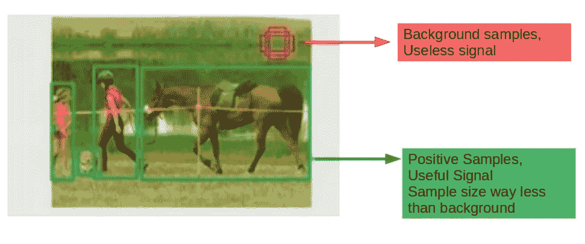
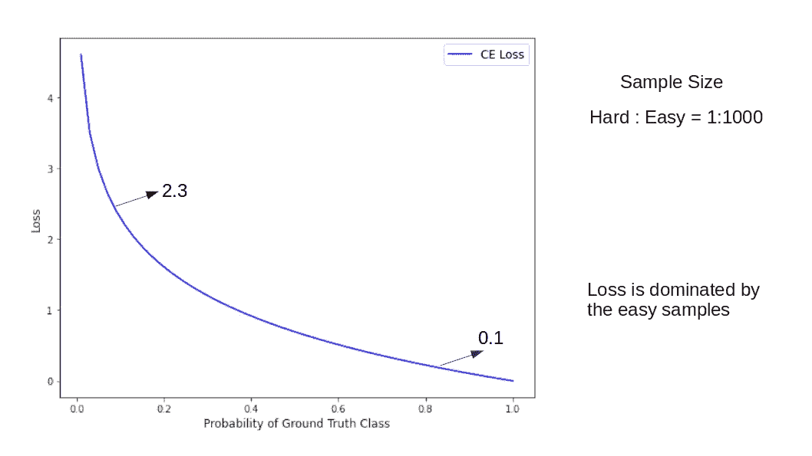
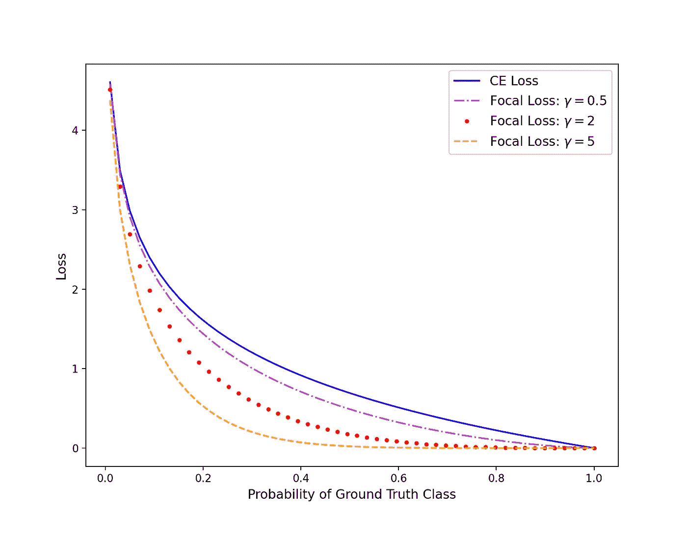
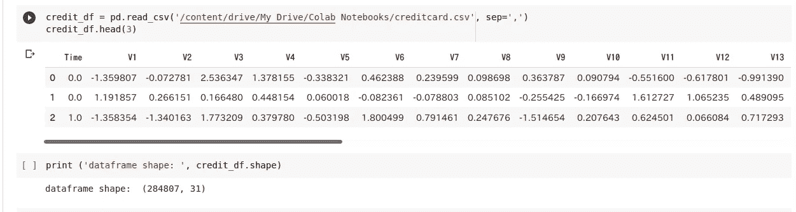
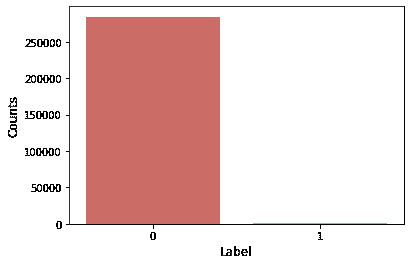
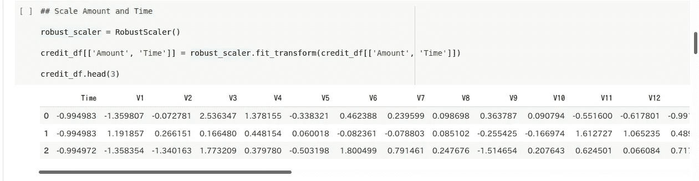
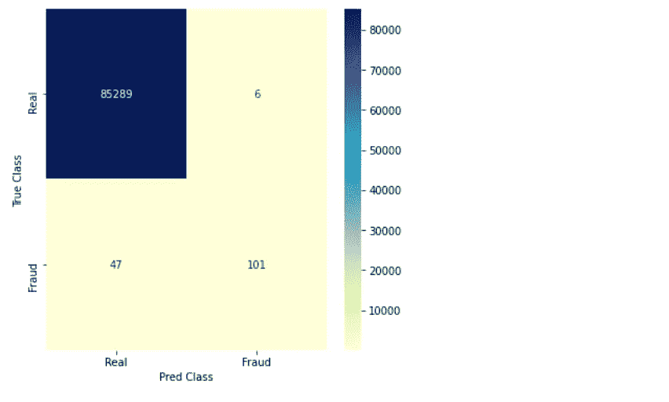
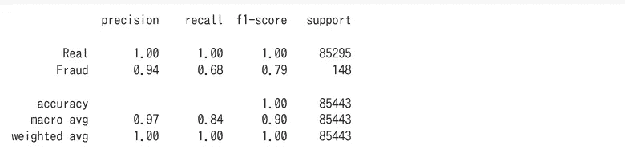
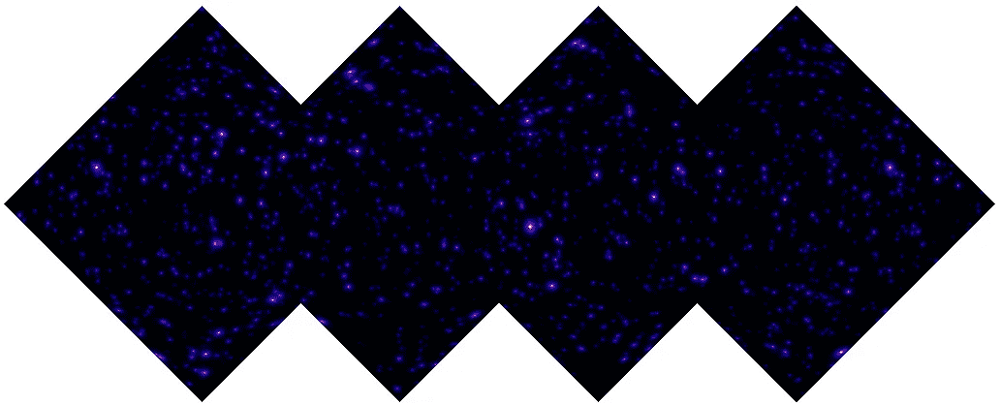
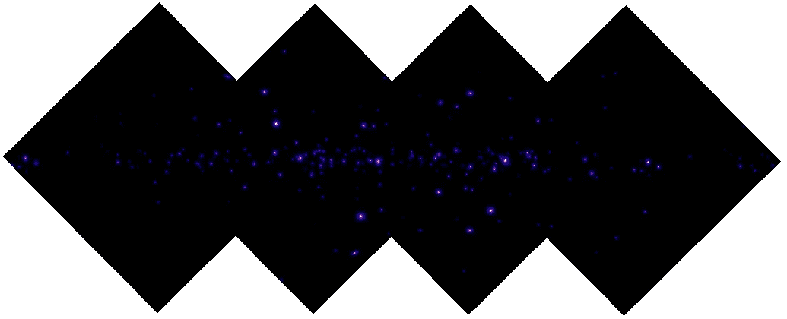

# 一种适用于类不平衡数据的损失函数:“焦点损失”

> 原文：<https://towardsdatascience.com/a-loss-function-suitable-for-class-imbalanced-data-focal-loss-af1702d75d75?source=collection_archive---------6----------------------->

## 类别不平衡数据下的深度学习


日本长野雾蒙蒙的午后(图片:作者自己的作品)

## 阶级不平衡:

在机器学习中，有时我们会遇到像 MNIST 时尚数据或 CIFAR-10 数据这样的高手，数据集中每个类别的例子都很平衡。如果在一个分类问题中，样本在已知类别中的分布有偏差，会发生什么？这种在数据集中有严重或轻微偏差的问题是常见的，今天我们将讨论一种处理这种类不平衡数据的方法。让我们考虑一种邮件数据集不平衡的极端情况，我们建立一个分类器来检测垃圾邮件。由于垃圾邮件相对较少，我们假设所有邮件中有 5%是垃圾邮件。如果我们写一行简单的代码——

```
def detectspam(mail-data): return ‘not spam’ 
```

这将给我们 95%的正确答案，尽管这是一个极端的夸张，但你得到了问题。最重要的是，用该数据训练任何模型将导致对普通邮件的高置信度预测，并且由于训练数据中垃圾邮件的数量极低，该模型将很可能无法学会正确预测垃圾邮件。这就是为什么精确度、召回率、F1 分数、ROC/AUC 曲线是真正告诉我们故事的重要指标。正如您已经猜到的，减少这个问题的一个方法是进行采样以平衡数据集，这样类就平衡了。还有其他几种方法来解决机器学习中的类别不平衡问题，杰森·布朗利(Jason Brownlee)整理了一份出色的综合评论，点击这里查看。

## 计算机视觉中的阶级不平衡；

在计算机视觉问题的情况下，这种类别不平衡问题可能更加严重，这里我们讨论作者如何处理导致焦点丢失的物体检测任务。在快速 R-CNN 类型的算法的情况下，首先我们通过 ConvNet 运行图像以获得特征图，然后在高分辨率特征图上执行区域提议(通常大约 2K 个区域)。这些是两级检测器，当焦损失文件推出时，一个有趣的问题是，像 YOLO 或 SSD 这样的一级检测器是否可以获得与两级检测器相同的精度？单级检测器速度很快，但在此期间的精确度大约是两级检测器的 10–40%。*作者认为训练中的等级不平衡是阻止一级探测器获得与二级探测器相同精度的主要障碍。*



图 1:对象检测中的类不平衡。[2])

这种等级不平衡的一个例子显示在不言自明的图 1 中，该图取自原作者的演示文稿本身。他们发现，当有更多数量的包围盒覆盖可能物体的空间时，一阶段检测器表现更好。但是这种方法导致了一个主要问题，因为前景和背景数据不是平均分布的。例如，如果我们考虑 20000 个边界框，大多数情况下，其中 7-10 个将实际包含关于对象的任何信息，其余的将包含背景，大多数情况下，它们很容易分类，但没有信息。这里，*作者发现损失函数(如交叉熵)是简单例子会分散训练注意力的主要原因。*以下是图示



图 2:阶级失衡和交叉熵损失(图片由作者提供)。

即使错误分类的样本(图 1 中的红色箭头)比正确分类的样本(绿色箭头)受到更多惩罚，在密集对象检测设置中，由于不平衡的样本大小，损失函数被背景(简单样本)淹没。焦点损耗解决了这一问题，其设计方式使得**减少了简单示例的损耗(“下降重量”)，因此网络可以专注于训练困难的示例。**以下是焦点损失的定义—


焦点损失定义

在焦点损失中，有一个调制因子乘以交叉熵损失。当样本被错误分类时， *p* (代表模型对标签为 y = 1 的类别的估计概率)较低，调制因子接近 1，损失不受影响。当 *p* →1 时，调制因子接近 0，并且良好分类示例的损耗被向下加权。γ参数的影响如下图所示—



图 3:焦损失与交叉熵损失的比较(图片由作者提供)。代码可在我的笔记本中找到[参考。3]

引用报纸上的话—

> 调制因子减少了简单示例的损耗贡献，并扩展了示例接收低损耗的范围。

为了理解这一点，我们将使用上述定义比较交叉熵(CE)损失和焦点损失，γ = 2。考虑真值 1.0，我们考虑 3 个预测值 0.90(接近)，0.95(非常接近)，0.20(离真值很远)。让我们用 TensorFlow 看看下面的损失值—

```
CE loss when pred is close to true:  0.10536041
CE loss when pred is very close to true:  0.051293183
CE loss when pred is far from true:  1.6094373

focal loss when pred is close to true:  0.0010536041110754007
focal loss when pred is very close to true:  0.00012823295779526255
focal loss when pred is far from true:  1.0300399017333985
```

这里我们看到，与 CE 损耗相比，焦点损耗中的调制因子起着重要作用。当预测接近事实时，损失受到的惩罚要比预测远离事实时多得多。重要的是，当预测值为 0.90 时，焦损失将为 0.01 × CE 损失，但当预测值为 0.95 时，焦损失将约为 0.002 × CE 损失。现在，我们了解了聚焦损耗如何降低简单示例的损耗贡献，并扩展了示例获得低损耗的范围。这也可以从图 3 中看出。现在，我们将使用一个真实的不平衡数据集，看看焦点损失的实际情况。

## 信用卡欺诈:阶级不平衡数据集:

*数据集描述:*在这里，我考虑了一个在 [Kaggle](https://www.kaggle.com/mlg-ulb/creditcardfraud) 中可用的极端类别不平衡数据集，该数据集包含欧洲持卡人在 2013 年 9 月通过信用卡进行的交易。让我们用熊猫——



该数据集显示了两天内发生的交易，我们有 284，807 笔交易。V28 的特征…V28 是通过 PCA 获得的主要组成部分(由于机密问题，未提供原始特征)，唯一未通过 PCA 转换的特征是“时间”和“数量”。特征“时间”包含数据集中每笔交易和第一笔交易之间经过的秒数，特征“金额”是交易金额。特征“类别”是响应变量，在欺诈的情况下取值 1，否则取值 0。



图 4:真实交易(0)和欺诈交易(1)在数据集中的分布。图片作者。

*类别不平衡:*让我们画出“类别”特征的分布，它告诉我们有多少交易是真实的和虚假的。如上面的图 4 所示，绝大多数交易都是真实的。让我们用这段简单的代码得到这些数字—

```
print (‘real cases:‘, len(credit_df[credit_df[‘Class’]==0]))print (‘fraud cases: ‘, len(credit_df[credit_df[‘Class’]==1])) >>> real cases:  284315
    fraud cases:  492
```

因此，类别不平衡比率约为 1:578，因此，对于 578 个真实交易，我们有一个欺诈案例。首先让我们使用一个简单的具有交叉熵损失的神经网络来预测欺诈和真实交易。但在此之前，一个小小的检查告诉我们,“数量”和“时间”功能没有被缩放，而其他功能“V1”，“V2”等被缩放。在这里，我们可以使用[standard scaler](https://scikit-learn.org/stable/modules/generated/sklearn.preprocessing.StandardScaler.html)/[RobustScaler](https://scikit-learn.org/stable/modules/generated/sklearn.preprocessing.RobustScaler.html)来缩放这些特征，由于 robust scaler 对异常值具有鲁棒性，所以我选择了这种标准化技术。



现在，让我们选择如下功能和标签—

```
X_labels = credit_df.drop([‘Class’], axis=1)
y_labels = credit_df[‘Class’]X_labels = X_labels.to_numpy(dtype=np.float64)y_labels = y_labels.to_numpy(dtype=np.float64) y_lab_cat = tf.keras.utils.to_categorical(y_labels, num_classes=2, dtype=’float32')
```

对于训练测试分割，我们使用分层来保持标签的比率—

```
x_train, x_test, y_train, y_test = train_test_split(X_labels, y_lab_cat, test_size=0.3, stratify=y_lab_cat, shuffle=True)
```

现在我们建立一个简单的神经网络模型，它有三个密集层

```
def simple_model(): input_data = Input(shape=(x_train.shape[1], )) x = Dense(64)(input_data) x = Activation(activations.relu)(x) x = Dense(32)(x) x = Activation(activations.relu)(x) x = Dense(2)(x) x = Activation(activations.softmax)(x) model = Model(inputs=input_data, outputs=x, name=’Simple_Model’) return model
```

用类别交叉熵作为损失来编译模型—

```
simple_model.compile(optimizer=Adam(learning_rate=5e-3), loss='categorical_crossentropy', metrics=['acc'])
```

训练模型—

```
simple_model.fit(x_train, y_train, validation_split=0.2, epochs=5, shuffle=True, batch_size=256)
```

为了真正理解模型的性能，我们需要绘制混淆矩阵以及精确度、召回率和 F1 分数——


图 5:混淆矩阵、精确度、召回率、交叉熵损失下的 F1 分数(图片由作者提供)

我们从混淆矩阵和其他性能指标得分中看到，正如预期的那样，该网络在对真实交易进行分类方面做得非常好，但对于欺诈类，召回值低于 50%。我们的目标是在不改变任何东西的情况下进行测试，除了损失函数。我们能得到更好的性能指标值吗？

## 使用焦点损失:

首先，让我们用α和γ作为超参数来定义焦点损失，为此，我使用了由 SIG-addons (tfa)维护的 TensorFlow 功能模块。在这个模块下的附加损耗中，有一个[聚焦损耗](https://www.tensorflow.org/addons/api_docs/python/tfa/losses/sigmoid_focal_crossentropy)的实现，首先我们导入如下—

```
import tensorflow_addons as tfafl = tfa.losses.SigmoidFocalCrossEntropy(alpha, gamma)
```

利用这一点，让我们定义一个自定义损失函数，该函数可以作为“焦点损失”的代理，用于两类特定问题

```
def focal_loss_custom(alpha, gamma): def binary_focal_loss(y_true, y_pred): fl = tfa.losses.SigmoidFocalCrossEntropy(alpha=alpha, gamma=gamma) y_true_K = K.ones_like(y_true) focal_loss = fl(y_true, y_pred) return focal_loss return binary_focal_loss
```

我们现在只是重复上述模型定义、编译和拟合的步骤，但这次使用焦点损失，如下所示

```
simple_model.compile(optimizer=Adam(learning_rate=5e-3),       loss=focal_loss_custom(alpha=0.2, gamma=2.0), metrics=[‘acc’])
```

对于 alpha 和 gamma 参数，我刚刚使用了论文中建议的值(然而问题是不同的),需要测试不同的值。

```
simple_model.fit(x_train, y_train, validation_split=0.2, epochs=5, shuffle=True, batch_size=256)
```

使用焦点损失，我们看到如下改进—



图 6:混淆矩阵、精确度、回忆、焦点丢失的 F1 分数(图片由作者提供)

我们看到，使用“焦点损失”后，性能指标显著提高，与之前的案例(69/148)相比，我们可以正确检测到更多的“欺诈”交易(101/148)。

在这篇文章中，我们讨论焦点损失，以及当数据高度不平衡时，它如何改善分类任务。为了演示焦点损失，我们使用了信用卡交易数据集，该数据集高度偏向于真实交易，并显示了焦点损失如何提高分类性能。

我还想提到的是，在我对伽马射线数据的研究中，我们试图将活动星系核(AGN)与脉冲星(PSR)区分开来，伽马射线天空主要由活动星系核构成。下图是这种模拟天空的一个例子。这也是计算机视觉中类不平衡数据集的一个例子。



图 7:作为不平衡数据集示例的活动星系核(上图)和 PSRs(下图)的伽马射线天空图示例。虽然银河系外的活动星系核均匀地分布在整个天空中，但它们大多分布在银道面附近。作者图片。

## 参考资料:

[1] [焦损原纸](https://openaccess.thecvf.com/content_ICCV_2017/papers/Lin_Focal_Loss_for_ICCV_2017_paper.pdf)

[2] [焦损原图展示](https://www.youtube.com/watch?v=44tlnmmt3h0)

[3]本帖使用的笔记本: [GitHub](https://github.com/suvoooo/Machine_Learning/blob/master/FocalLoss_Ex.ipynb)