# 部署到 IBM Cloud Kubernetes 服务的机器学习应用程序

> 原文：<https://towardsdatascience.com/a-machine-learning-application-that-deploys-to-the-ibm-cloud-kubernetes-service-852c2e26732a?source=collection_archive---------34----------------------->

## Python、Docker、Kubernetes


Annamária Borsos 摄影

我们将看到，与之前的文章相比，使用 IBM Cloud 创建 Kubernetes 集群非常容易。Kubernetes 丰富的资源可能会让你很难找到基本的东西。简化 Kubernetes 开发并使其易于部署的一个简单方法是使用 IBM Cloud Kubernetes Services 之类的解决方案。为了创建部署到 IBM Cloud Kubernetes 服务的机器学习应用程序，我们需要一个 [IBM Cloud 帐户](https://cloud.ibm.com/registration) ( [注册一个免费帐户](https://cloud.ibm.com/registration?cm_sp=ibmdev-_-developer-tutorials-_-cloudreg/) ) [，](https://cloud.ibm.com/registration),) IBM Cloud CLI，Docker CLI，Kubernetes CLI。

# 在 IBM Cloud 上创建 Kubernetes 服务

IBM Cloud 上的 Kubernetes 服务提供了两种集群类型:

-一个空闲集群(一个工作池，带有一个虚拟共享工作节点，具有两个内核、4GB RAM 和 100GB SAN)

-完全可定制的标准集群(虚拟共享、虚拟专用或裸机),适用于繁重的工作。

如果我们只是想探索，自由集群是很棒的。

在 IBM Cloud 中，只需几次点击，我们就可以自动创建一个 Kubernetes 服务。首先，我们需要连接到我们的 [IBM 云仪表板](https://cloud.ibm.com/dashboard/apps/)。

我们转到 IBM Kubernetes Service，单击 create clusters，为我们的集群键入一个名称，根据我们的帐户(付费或免费)，我们可以选择适当的集群类型(在我们的示例中，我们将只创建一个具有 2 个 vCPUs 和 4 个 RAM 的工作节点)，几分钟后，集群就创建好了。

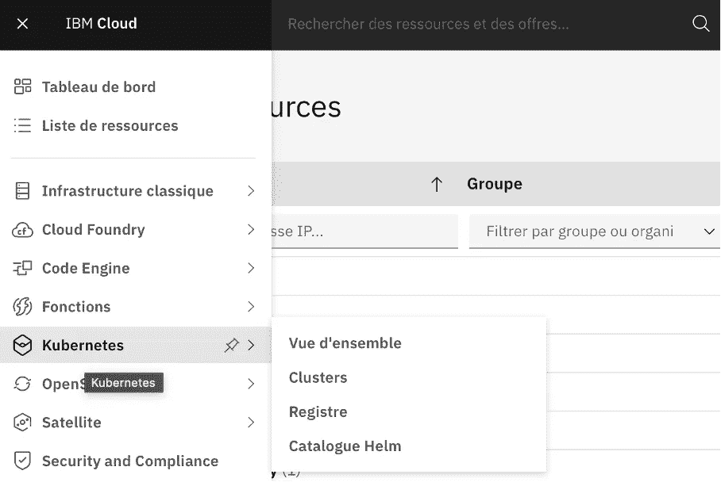

来源:作者

一旦集群准备就绪，我们可以单击我们的集群的名称，我们将被重定向到一个新的页面，其中包含有关我们的集群和工作节点的信息。

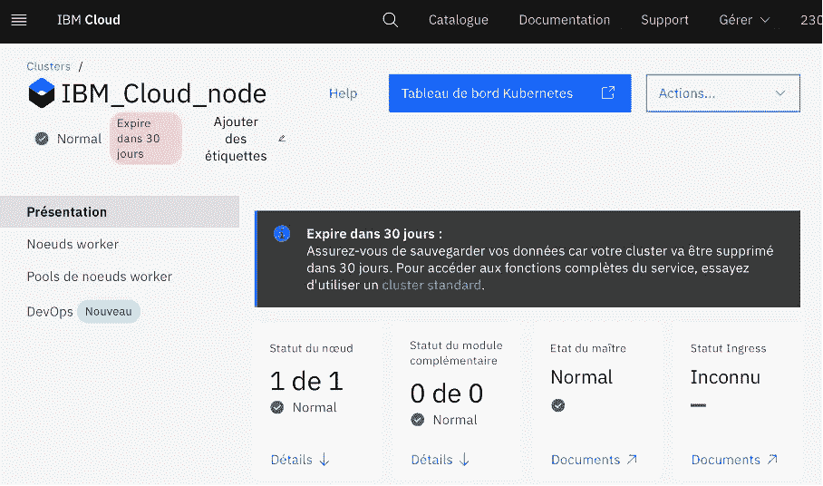

来源:作者

要连接到我们的集群，我们可以单击 worker node 选项卡来获取集群的公共 IP。

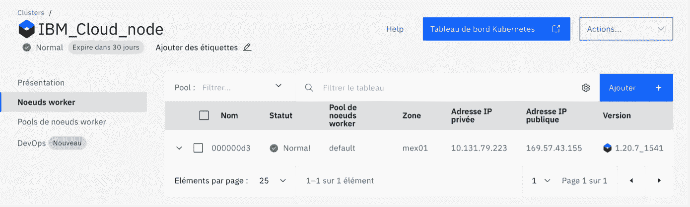

来源:作者

搞定了。我们可以使用 [IBM 云外壳](https://cloud.ibm.com/docs/containers?topic=containers-cs_cli_install#cloud-shell)进行快速访问。

如果我们想使用自己的终端，我们需要一些先决条件，如果还没有安装的话。我们需要安装所需的 CLI 工具:IBM Cloud CLI、Kubernetes 服务插件(ibmcloud ks)、Kubernetes CLI (kubectl)。

要安装 IBM Cloud CLI，我们将在终端中键入以下内容来安装独立的 IBM Cloud CLI (ibmcloud):

```
curl -fsSL [https://clis.cloud.ibm.com/install/linux](https://clis.cloud.ibm.com/install/linux) | sh
```

这是针对 Linux 的。您可以找到自己的[发行版](https://cloud.ibm.com/docs/containers?topic=containers-cs_cli_install.)所需的所有命令。

我们通过在出现提示时输入我们的 IBM Cloud 凭据来登录 IBM Cloud CLI:

```
ibmcloud login
```

如果我们有一个联邦 ID，我们可以使用 IBM Cloud log in–SSO 来登录 IBM Cloud CLI。

否则，我们也可以使用 IBM Cloud API 键进行连接，如下所示:

```
ibmcloud login — apikey < IBM CLOUD API KEY >
```

如果还没有完成，我们可以创建一个 IBM Cloud API 密匙。为此，我们需要转到 IBM 云控制台，转到管理>访问(IAM)并选择 API 密钥:

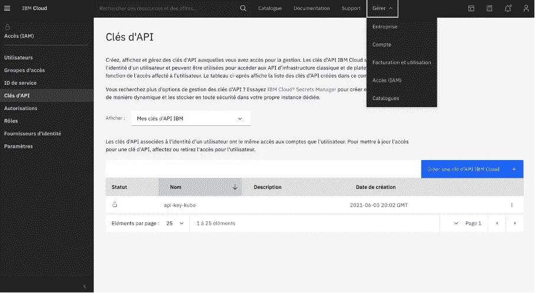

来源:作者

我们可以单击 create an IBM Cloud API key，添加名称和描述，并将 API key 复制或下载到一个安全的位置。由于上面的命令，我们可以登录。

我们可以为 IBM Cloud Kubernetes 服务安装 IBM Cloud 插件(ibmcloud ks):

```
ibmcloud plugin install container-service
```

为 IBM Cloud Container Registry 安装 IBM Cloud 插件(ibmcloud cr):

```
ibmcloud plugin install container-registry
```

我们还可以安装 IBM Cloud Kubernetes 服务可观察性插件(ibmcloud ob)

```
ibmcloud plugin install observe-service
```

我们的环境中已经安装了 Kubernetes CLI。如果还没有安装，只需按照几个步骤[这里](https://cloud.ibm.com/docs/containers?topic=containers-cs_cli_install)。

如果我们想列出客户中的所有集群:

```
ibmcloud ks cluster ls
```

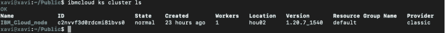

来源:作者

我们可以通过运行以下命令来检查我们的群集是否处于健康状态:

```
ibmcloud ks cluster get -c IBM_Cloud_node
```

这里， *IBM_Cloud_node* 是我们的集群名；您还可以使用集群的 ID。

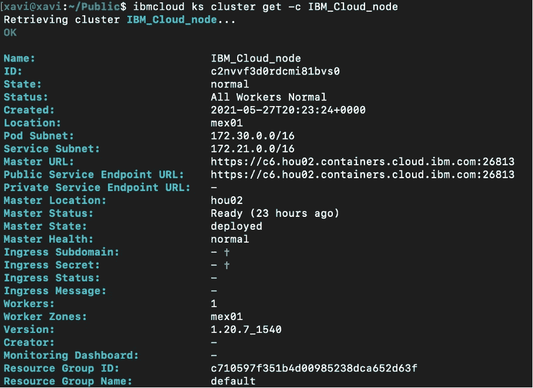

来源:作者

# 机器学习应用程序的容器化

这个简单的例子将展示如何使用 Python API 和 Flask 创建一个 Docker 容器，通过一个训练有素的机器学习模型来执行在线推理。为此，我们将使用 scikit-learn 和 Iris 数据集训练一个简单的 C-支持向量分类模型，我们将把它分成训练数据和测试数据。

首先，让我们考虑以下文件:

- **Dockerfile**

- **train.py**

- **api.py**

- **requirements.txt**

你可以在 [GitHub](https://github.com/xaviervasques/ML_Kubernetes_IBM_Cloud.git) 上找到所有的文件。

**train.py** 是一个 python 脚本，用于加载和训练我们的模型。 **Dockerfile** 将用于构建我们的 Docker 映像，requirements.txt (flask，flask-restful，joblib)用于 Python 依赖关系，而 **api.py** 是将被调用来使用 api 执行在线推理的脚本。

**train.py** 文件如下:

我们还需要构建一个 API 来接收数据(X_test)并输出我们想要的东西。在我们的例子中，我们将只请求模型的分类分数:

我们现在已经准备好容器化你的烧瓶应用程序。在我们的项目目录中，我们用 **jupyter/scipy-notebook** 映像创建了我们的 **Dockerfile** ，设置了我们的环境变量并安装了 **joblib** 和 **flask** ，我们将 **train.py** 和 **api.py** 文件复制到映像中。

我们想公开 Flask 应用程序运行的端口(5000 ),所以我们使用 expose。

为了检查我们的应用程序是否运行正常，让我们在本地构建并运行我们的映像:

```
docker build -t my-kube-api -f Dockerfile .
```

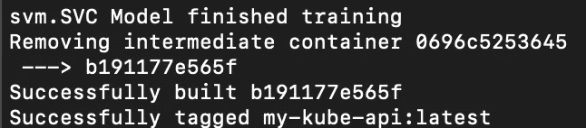

来源:作者

```
docker run -it -p 5000:5000 my-kube-api python3 api.py
```

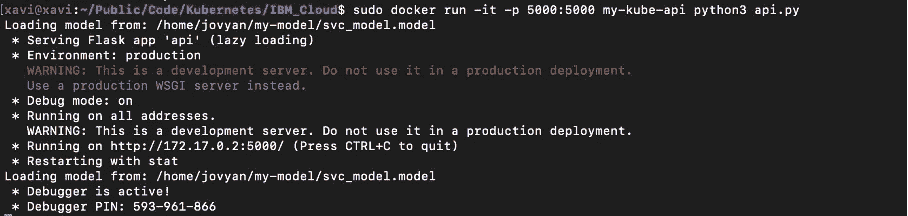

来源:作者

我们现在可以使用 curl 测试应用程序:

```
curl [http://172.17.0.2:5000/](http://172.17.0.2:5000/line/232)score
```

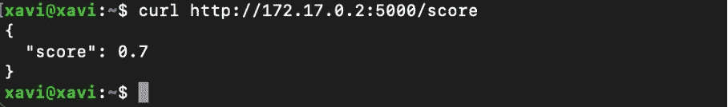

来源:作者

一切正常。

# 将映像推送到 IBM 云注册中心

有用！既然我们的应用程序工作正常，我们可以进入下一步，在 Kubernetes 集群中部署它。在此之前，我们需要将图像推送到存储库。这里，我们将在 IBM Cloud Registry(一个私有存储库)上推送映像。从我们的帐户仪表板中，我们可以选择**集装箱注册:**

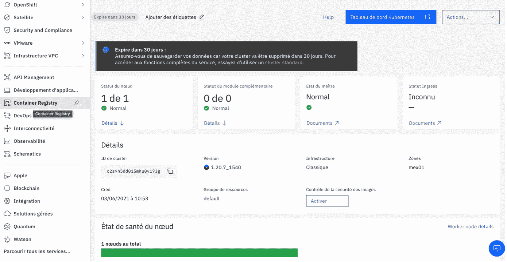

来源:作者

我们需要使用以下命令在本地安装容器注册插件:

```
ibmcloud plugin install container-registry -r “IBM Cloud”
```

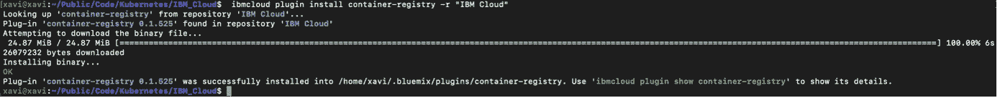

来源:作者

然后，我们登录我们的帐户:

```
ibmcloud login
```

然后，我们命名并创建我们的名称空间:

```
ibmcloud cr namespace-add xaviervasques
```

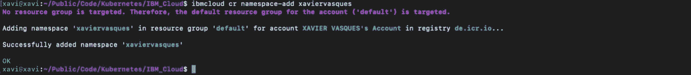

来源:作者

我们使用以下命令将本地 Docker 守护进程登录到 IBM Cloud Container 注册表中:

```
docker login -u iamapikey -p <YOUR API KEY> de.icr.io
```

我们选择一个存储库和标签，通过它我们可以识别图像:

```
docker tag my-kube-api de.icr.io/xaviervasques/my-kube-api:latest
```

而我们推送图像(docker 推送 <region_url>/ <namespace>/ <image_name>: <tag>):</tag></image_name></namespace></region_url>

```
docker push de.icr.io/xaviervasques/my-kube-api:latest
```

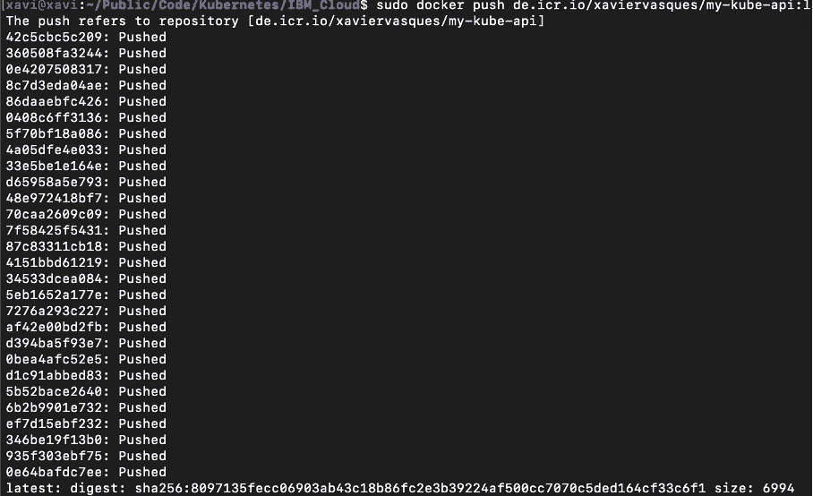

来源:作者

我们可以通过检查图像是否在我们的私有注册表上来验证图像的状态:

```
ibmcloud cr image-list
```

# 将应用程序部署到 Kubernetes

一旦图像上传到私有注册中心，我们就可以将应用程序部署到 Kubernetes。我们可以使用用户界面或 CLI。对于本章，我们将使用 CLI。我们使用上面的步骤创建我们的 Kubernetes 集群(我们也可以使用命令行创建一个:IBM cloud ks cluster create classic–name my-cluster)。要查看状态，我们键入以下命令:

```
ibmcloud ks clusters
```

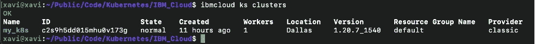

来源:作者

我们的 my-k8s Kubernetes 集群已经启动并运行。我们可以将 kubectl 连接到集群:

```
ibmcloud ks cluster config — cluster my_k8s
```

我们可以检查我们是否连接到集群:

```
kubectl get nodes
```

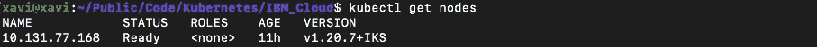

来源:作者

我们将在主节点中创建一个名为“base”的文件夹，并在其中创建以下 YAML 文件:

o namespace.yaml

o 部署. yaml

o service.yaml

o service_port.yaml

o kustomization.yaml

**namespace.yaml** 文件提供了 Kubernetes 资源的范围:

这个**部署. yaml** 将让我们管理一组相同的吊舱。如果我们不使用部署，我们将需要手动创建、更新和删除一组 pod。这也是一种轻松自动缩放应用程序的方式。在我们的示例中，我们决定创建两个 pod(副本)，加载我们之前推送的 Docker 映像，并运行我们的 **api.py** 脚本。

**service.yaml** 文件将我们在一组 Pods 上运行的应用程序作为网络服务公开。

我们还需要创建 **service_port.yaml** 文件:

我们创建 service_port.yaml 文件的原因是，通过使用 Kubernetes 集群中任何工作节点的公共 IP 地址并公开一个节点端口(node port ),可以通过互联网访问我们的容器化应用程序。我们可以使用这个选项来测试 IBM Cloud Kubernetes 服务和短期的[公共访问](https://cloud.ibm.com/docs/containers?topic=containers-nodeport)。

最后，我们创建了 **kustomization.yaml** 文件:

我们可以配置自己的镜像 pull secret，在 Kubernetes 名称空间而不是默认名称空间中部署容器。通过这种方法，我们可以使用存储在其他 IBM Cloud 帐户中的图像，或者存储在外部私有注册表中的 us 图像。此外，我们可以创建自己的映像 pull secret 来执行 IAM 访问规则，这些规则限制对特定注册表映像名称空间或操作(如 push 或 pull)的权限。我们有几个选项可以做到这一点，其中之一是将图像获取秘密从 Kubernetes 的默认名称空间复制到我们的[集群](https://cloud.ibm.com/docs/containers?topic=containers-registry#other)中的其他名称空间。

让我们首先列出集群中的名称空间:

```
kubectl get namespaces
```

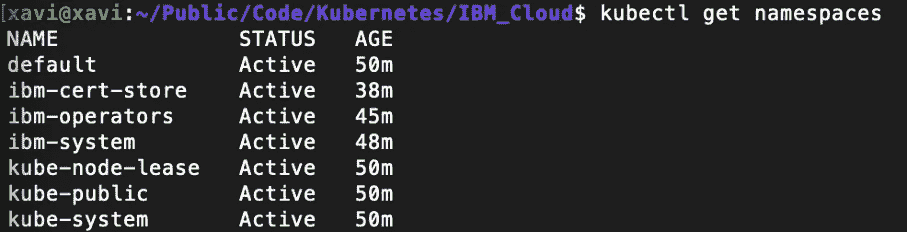

来源:作者

然后，让我们列出 IBM Cloud Container 注册表的 Kubernetes 默认名称空间中的图像提取秘密:

```
kubectl get secrets -n default | grep icr-io
```

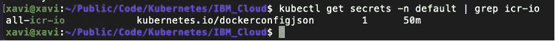

来源:作者

为了部署我们的应用程序，我们在主节点中使用这个命令:

```
kubectl apply — kustomize=${PWD}/base/ — record=true
```

我们将 **all-icr-io** 图像提取秘密从默认名称空间复制到我们选择的名称空间。新的图像获取秘密被命名为<名称空间 _ 名称> -icr- <区域> -io:

```
kubectl get secret all-icr-io -n default -o yaml | sed ‘s/default/mlapi/g’ | kubectl create -n mlapi -f -
```

我们检查秘密的创建是否成功:

```
kubectl get secrets -n mlapi | grep icr-io
```

要查看部署到此名称空间中的所有组件:

```
kubectl get ns
```

我们应该获得以下输出:

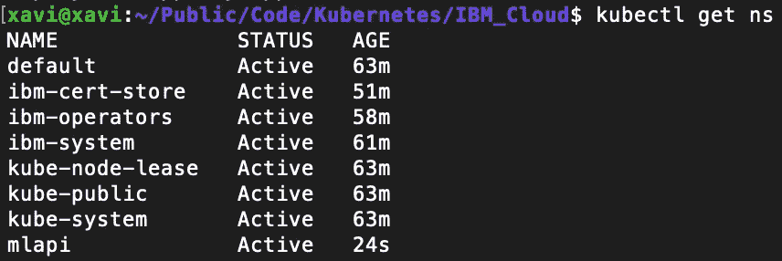

来源:作者

要查看部署的状态，我们可以使用以下命令:

```
kubectl get deployment -n mlapi
```

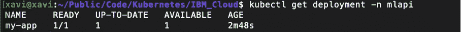

来源:作者

要查看服务的状态，我们使用以下命令:

```
kubectl get service -n mlapi
```

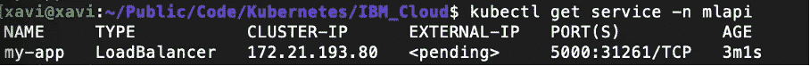

来源:作者

我们可以获得集群中一个工作节点的公共 IP 地址。如果您想要访问专用网络上的工作节点，或者如果您有一个 VPC 集群，请获取专用 IP 地址。

```
ibmcloud ks worker ls — cluster my_k8s
```

我们现在可以通过 curl 或您的 web 浏览器来使用我们的部署模型了:

```
curl [http://172.21.193.80:31261/score](http://172.21.193.80:31261/score)
```

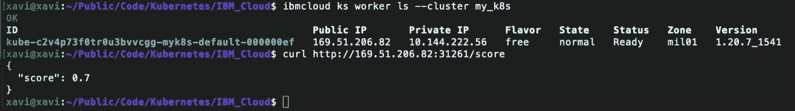

来源:作者

我们还浏览我们的 **Kubernetes 仪表盘**并查看我们的服务和许多功能:

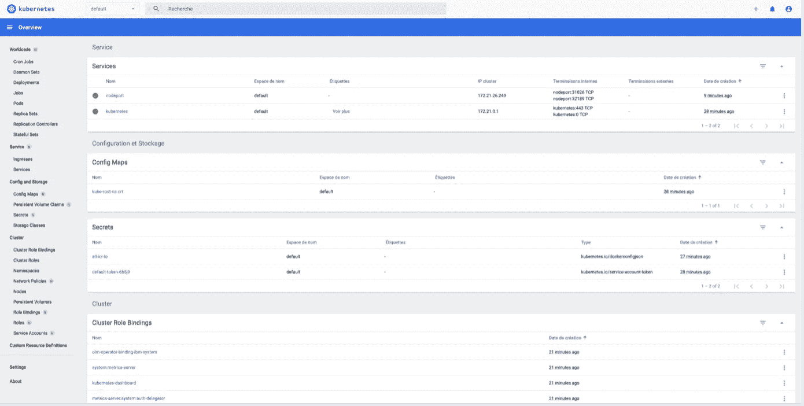

来源:作者

# 后续步骤

当我们致力于将机器学习/深度学习模型投入生产时，在某个时间点会出现一个问题。我在哪里部署我的代码用于训练，在哪里部署我的代码用于批量或在线推理。我们经常需要在多架构环境和混合/多云环境中部署我们的机器学习流程。我们已经了解了如何在 IBM Cloud 上部署应用程序，以及如何部署本地/虚拟机。Kubernetes 可以在各种平台上运行:从简单的集群到复杂的集群，从我们的笔记本电脑到多架构、混合/多云 Kubernetes 集群。问题是什么是最适合我们需求的解决方案。

**来源**

[https://developer . IBM . com/technologies/containers/tutorials/scalable-python-app-with-kubernetes/](https://developer.ibm.com/technologies/containers/tutorials/scalable-python-app-with-kubernetes/)

[https://cloud . Google . com/community/tutorials/kubernetes-ml-ops](https://cloud.google.com/community/tutorials/kubernetes-ml-ops)

[https://github.com/IBM/deploy-ibm-cloud-private](https://github.com/IBM/deploy-ibm-cloud-private)

[https://kubernetes . io/fr/docs/setup/pick-right-solution/# solutions-clés-en-main](https://kubernetes.io/fr/docs/setup/pick-right-solution/#solutions-cl%C3%A9s-en-main)

[https://www . IBM . com/cloud/architecture/tutorials/micro services-app-on-kubernetes？任务=1](https://www.ibm.com/cloud/architecture/tutorials/microservices-app-on-kubernetes?task=1)

[https://cloud.ibm.com/docs/containers?topic = containers-registry #其他](https://cloud.ibm.com/docs/containers?topic=containers-registry#other)

[https://cloud.ibm.com/docs/containers?topic=containers-nodeport](https://cloud.ibm.com/docs/containers?topic=containers-nodeport)

[https://cloud.ibm.com/docs/containers](https://cloud.ibm.com/docs/containers)