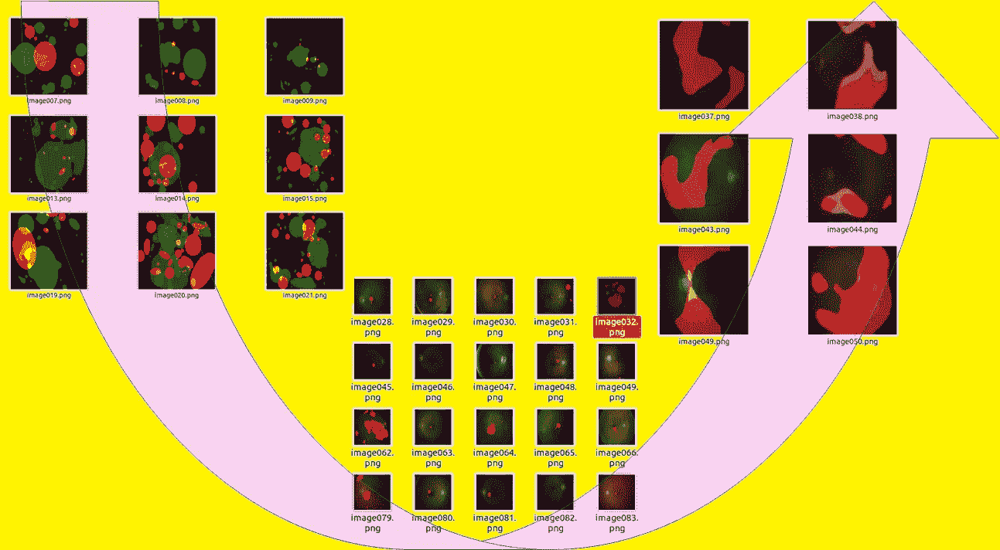
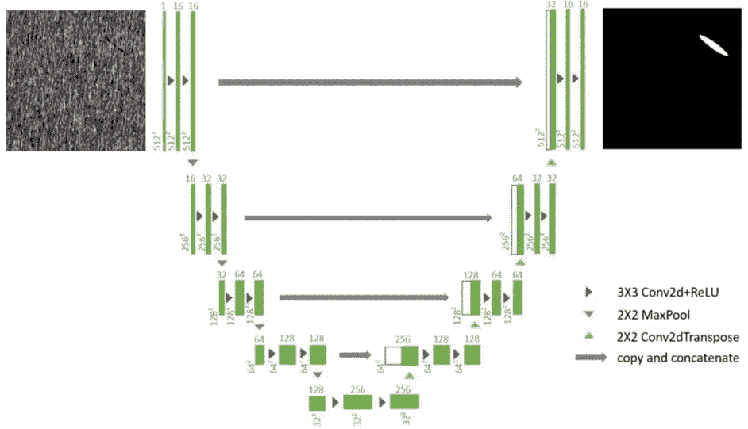
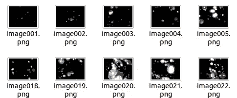
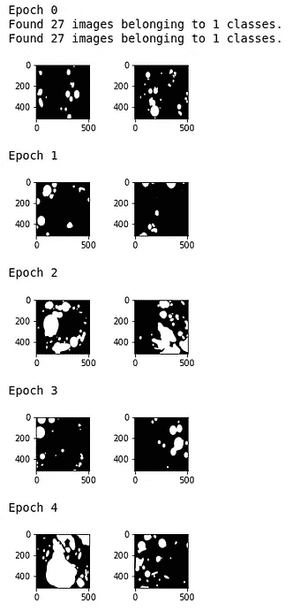
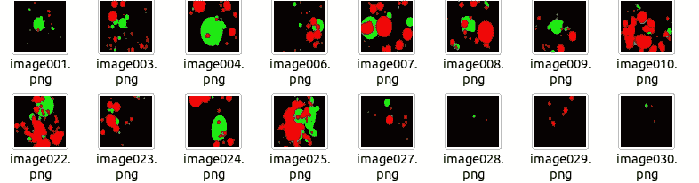
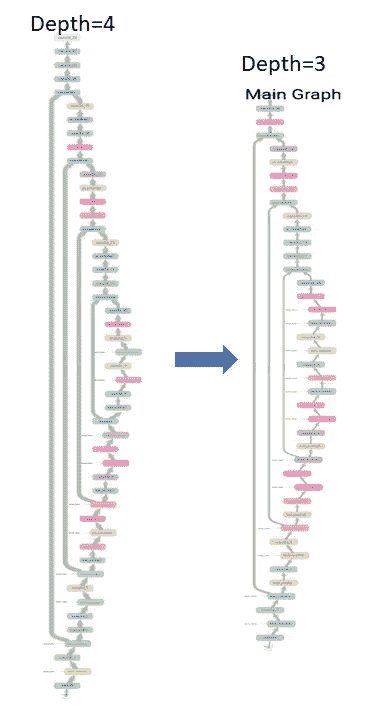
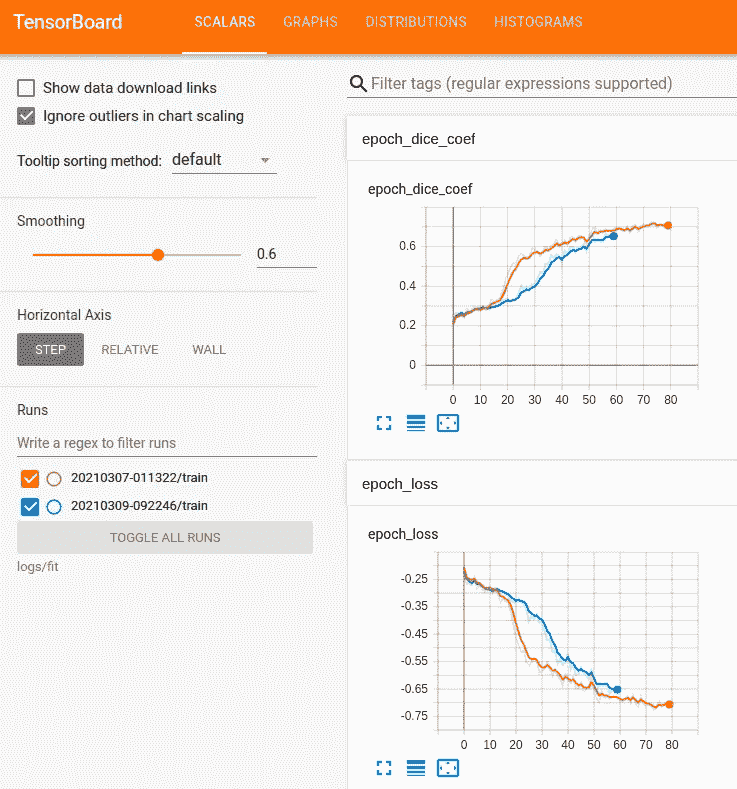
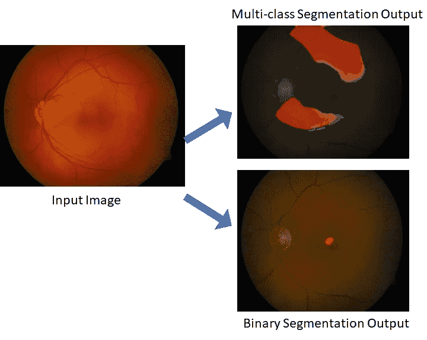
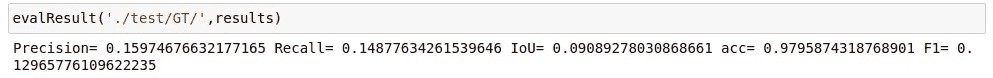
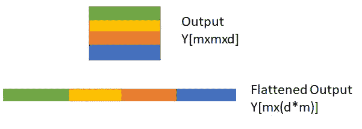

# 使用 U-net 进行多类图像分割的迁移学习的机器学习工程师教程

> 原文：<https://towardsdatascience.com/a-machine-learning-engineers-tutorial-to-transfer-learning-for-multi-class-image-segmentation-b34818caec6b?source=collection_archive---------3----------------------->

## **图像分割模型调试指南**

从二元到多类分割任务的 U-net 模型(图片由作者提供)

图像语义分割是计算机视觉领域中最重要的研究和工程领域之一。从自动驾驶的行人和汽车分割[1]到医学图像中病理的分割和定位[2]，有几个图像分割的用例。随着深度学习模型广泛用于[机器学习(ML)模型的端到端交付](https://www.fourthbrain.ai/curriculum?utm_campaign=Project%20Presentation%20Day&utm_so[…]blog&utm_medium=blog&utm_term=tds-blog&utm_content=tds-blog)，U-net 模型已经成为跨自动驾驶和医疗成像用例的可扩展解决方案【3–4】。然而，大多数现有的论文和方法执行二元分类任务来检测背景上的感兴趣的对象/区域[4]。在本实践教程中，我们将回顾如何从二进制语义分割任务开始，并转移学习以适应多类图像分割任务。

对于一个 ML 工程师来说，在他们的日常工作流程中最大的挫折之一就是花数小时训练一个 ML 模型，结果却毫无意义，比如输出的*不是数字* (NaN)或者全是 0 值的图像。在本教程中，我们将通过一个二进制 U-net 模型扩展到多类语义分割的示例，学习从现有作品(论文/代码库)开始 ML 模型构建过程的逐步过程，并对其进行重大修改，以适应您自己的数据需求。

如图 1 所示，U-net 模型表示编码层和解码层以及编码层和各个解码层之间的跳跃连接。跳过连接的主要优点是，它将每个深度层的编码和解码结果相结合，以实现前景(需要输出为白色的像素)与背景(需要输出为黑色的像素)之间的一致分离。

图 1:深度=4 的 U 网模型的例子。左边的层是导致提取密集特征的编码器层，后面是右边的解码器层。灰色箭头表示跳过连接。来源:[https://www . dlology . com/blog/automatic-defect-inspection-with-end-to-end-deep-learning/](https://www.dlology.com/blog/automatic-defect-inspection-with-end-to-end-deep-learning/)

最终目标是为新的代码库优化调整模型超参数，我们从[5]中现有的 U-net 代码库开始，该代码库使用视网膜图像数据集[6]上的二进制语义分割，以使用 DIARETDB1 数据集[7–8]修改用于视网膜图像病理学多类分类的代码库。病理学分类为亮病变(BL)，由“硬渗出物”和“软渗出物”表示，红色病变由“出血”和“红色小点”表示[8]。

数据模型转换的三个主要步骤如下:1)数据准备 2)数据模型和过程 3)结果和度量。

**第一步:数据准备:从二进制到多类**

构建端到端 ML 模型的第一步是基准测试，这包括尽可能复制现有的代码库/文件。如果这需要修改当前数据集，使其与现有工作的数据相似，那么就应该这样做。

从[5]中的 U-net 代码库开始，对于我们手头的多类病理学分类任务，我们首先复制 U-net 代码库[5]用于单一病理学，出血检测任务。使用下面的代码将带注释的图像遮罩( *Y* ，表示标签)二进制化。

产生的出血标记显示在下面的图 2 中。

图 2(左):显示灰度出血遮罩(Y)。2(右)显示了通过阈值处理(Y>0.1)获得的二值化出血掩模(图片由作者提供)

医学图像数据集通常会带来“小数据挑战”的问题，即训练样本有限。为了解决这个问题，经常使用使用 Keras 的图像数据增强。这种方法的目标是在运行时生成单个图像及其遮罩的多个放大/缩小、旋转、平移/缩小等价物。下面显示的数据生成器有助于实现这一点。

当在具有很少样本的数据集上训练时，一个重要的考虑是，被训练的模型有被样本像素中的类别不平衡严重偏向的趋势。例如,[8]中的数据集包含 89 幅图像，但是只有大约 30 幅图像包含对应于病理学的大的感兴趣区域。剩下的标记图像大多是 *Y=0。*因此，如果用所有图像训练一个模型，将倾向于预测大多数图像为 *Y=0* ，这意味着病理将大部分被遗漏。为了避免这个问题，并将图像数据分为训练集和测试集，我们使用图像 ID 1–27 进行训练，而图像 ID 28–89 仅用于测试。

当从二进制分段迁移到多类分段时，第一个要求是适当地格式化数据。给定原始图像 *X* 和标签 *Y* ，则 *X* 的维数为【m×m×r】，Y 为【m×m×d】，其中输入 U-net 模型的图像维数为 m=256，r=3 (RGB 图像)，d 表示多类分类的类数(此处 d=4)。U-net 模型的要求是输入和输出必须属于相同的域/维度，在本例中为[m x m]。唯一的区别是输入 X 可以是彩色或灰度图像，而输出 Y 表示对应于每个病理掩模的二进制图像平面。因此，每个输出图像平面代表像素级的一对一分类。使用下面的代码生成一个图像遮罩示例，用于红色平面中的红色损伤(组合了“出血”和“红色小点”)，绿色平面和背景蓝色平面中的明亮损伤(组合了“硬渗出物”和“软渗出物”)。

结果如下图 3 所示。

图 3:为视网膜病理学数据集生成的多类基础事实标签。红色平面代表“出血”和“红点”，绿色平面代表“硬渗出物”和“软渗出物”。(图片由作者提供)

**第二步:数据模型和流程**

训练最佳 ML 模型的关键任务涉及超参数优化，这涉及选择最佳参数集，以确保深度学习 U-net 模型的权重和偏差非常合适。我们为以下项目执行超参数选择:

*   *编译器(Adam)*
*   *学习率(0.0001)*
*   *精度指标:要最大化的骰子系数[9]*
*   *损失度量:负骰子系数(要最小化)*

准确性度量和损失度量的其他选项是“准确性”和“分类 _ 交叉熵”，以及“样本 _ 权重=时间”[10]以迎合数据不平衡。

另一个需要调整的模型参数是模型复杂度(即由 U-net 的大小强加的训练复杂度)。因此，需要在深 U 网(深度=4)和浅 U 网(深度=3)上进行训练，图表如下所示。参数较少的模型通常最适合“小数据挑战”。深度为 3 和 4 的模型的变化可以在[11]中看到。

图 4(左)深度=4 的 U 形网。从 Tensorboard 获得的深度=3 的 4(右)U 形网。(图片由作者提供)

在模型训练结束时，损失曲线证明了训练过程的有效性。我们实施的损耗曲线如下图 5 所示。

图 5:二元分割(橙色曲线)与多类分割(蓝色曲线)的张量板损失和准确性度量。多类计算复杂度明显高于二进制分割。(图片由作者提供)

**第三步:成果和指标**

一旦模型被训练，最后的任务是评估测试数据。定性地，结果如图 6 所示。

图 6:用 40 次运行后训练的模型演示二元和多类语义分割。(图片由作者提供)

对于定量评估，我们考虑以下指标:精确度、召回率、准确度、交集/并集(IoU)和 F1 分数[9] [12]，如下所示在二元分割之后。

输出可以在 Github [11]中找到。多类分割中的一个关键部分是使用下面给出的多维 Dice 系数损失。

由于输出 Y 有“d”平面，第一个任务是*展平*平面，如图[13]和图 7 所示。，随后计算组合骰子系数。因此，多类分割的 Dice 系数在所有输出平面上是相加的，因此它可以超过值 1。

图 7:来自[13]的图像展平的例子。对于 4 维输出 Y，输出被平坦化，随后对平坦化的输出进行 Dice 系数评估。因此，Dice 系数在这种情况下是相加的。(图片由作者提供)

最后，多类分割的定量评估涉及所报告的宏观和微观级别的度量。虽然宏观水平的精度、召回率、准确度、IOU 和 F1 分数对所有类别的权重相等，但微观水平的指标在类别不平衡的情况下更可取，以提供加权结果，如[14]所示。

**结论**

将学习从现有的 ML 模型转移到新的数据集和用例需要一个战略性的工作流来确保最佳的数据建模。关键在于将工作流程构建为:数据、流程和结果。使用本教程中介绍的分步指南，将有可能将 U-net 模型不仅扩展到其他二元分类任务，而且扩展到多类分类任务。其他处理多类分割的代码库在[15]中。

为了进一步提高本教程中显示的性能，可以针对所有红色和明亮的病变组合更大的图像尺寸和一对一对所有分割方法。此外，为了将教程扩展到更多的类，增加的结果“Y”可以保存为。npy 文件而不是图像，并且可以使用 load 命令来加载增强数据而不是 load_img(仅输入 3D 图像数据)。)使用所提出的方法，读者现在应该具备从现有代码库学习并根据自己的需要修改它们的手段和方法，同时扩展模型和方法的范围。

**参考文献**

[1] Piccoli，Francesco，等人，“FuSSI-Net:意图预测网络的时空骨架融合”arXiv 预印本 arXiv:2005.07796 (2020)。

[2]罗伊乔杜里，索希尼。"减少医学图像中观察者间可变性的少数镜头学习框架." *arXiv 预印本 arXiv:2008.02952* (2020)。

[3]张、、刘庆杰、王."用深度残差 u 网提取道路." *IEEE 地球科学与遥感快报*15.5(2018):749–753。

4 拉金先生。“查看我们毕业生的最终项目”。[Online][https://blog . fourth brain . ai/check-out-our-graduates-final-projects？UTM _ campaign = Project % 20 presentation % 20 day&UTM _ source = TDS-blog&UTM _ medium = blog&UTM _ term = ml 调试指南&UTM _ content = ml-调试指南](https://blog.fourthbrain.ai/check-out-our-graduates-final-projects?utm_campaign=Project%20Presentation%20Day&utm_source=tds-blog&utm_medium=blog&utm_term=mldebugging-guide&utm_content=ml-debugging-guide)

[5]罗伊乔杜里。“使用 TF 2.x 进行医学图像分割的 Unet”【在线】[https://github.com/sohiniroych/Unet-using-TF2](https://github.com/sohiniroych/Unet-using-TF2)

[6]胡佛。“凝视计划”。[https://cecas.clemson.edu/~ahoover/stare/probing/index.html](https://cecas.clemson.edu/~ahoover/stare/probing/index.html)

[7] Roychowdhury、Sohini、Dara D. Koozekanani 和 Keshab K. Parhi。"梦:使用机器学习的糖尿病视网膜病变分析." *IEEE 生物医学和健康信息学杂志*18.5(2013):1717–1728。

[8]Singh，Ramandeep 等，“糖尿病性视网膜病变:最新进展”印度眼科学杂志 56.3 (2008): 179。

[9]E Tiu。“评估您的语义细分模型的指标”。【在线】[https://towards data science . com/metrics-to-evaluate-your-semantic-segmentation-model](/metrics-to-evaluate-your-semantic-segmentation-model)。

[10]栈溢出[在线]U-net:如何提高多类分割的准确性？

[11]罗伊乔杜里。“用于多类语义分割的 U-net”。【在线】[https://github . com/sohiniroych/U-net-for-Multi-class-semantic-segmentation](https://github.com/sohiniroych/U-net-for-Multi-class-semantic-segmentation)

12h .库马尔。对象检测和分割的评估度量:mAP[Online][https://kharshit . github . io/blog/2019/09/20/evaluation-metrics-for-object-detection-and-segmentation](https://kharshit.github.io/blog/2019/09/20/evaluation-metrics-for-object-detection-and-segmentation)

[13][https://stack overflow . com/questions/43237124/what-of-the-role-of-flatten-in-keras](https://stackoverflow.com/questions/43237124/what-is-the-role-of-flatten-in-keras)

[14]数据科学堆栈交换。多类分类设置中的微观平均与宏观平均性能[在线]:[https://data science . stack exchange . com/questions/15989/微观平均与宏观平均性能多类分类设置](https://datascience.stackexchange.com/questions/15989/micro-average-vs-macro-average-performance-in-a-multiclass-classification-settin)

[15]托尼。Unet:使用 Keras 进行多重分类【在线】[https://github . com/hzc Tony/U-net-with multi-class ification](https://github.com/HZCTony/U-net-with-multiple-classification)