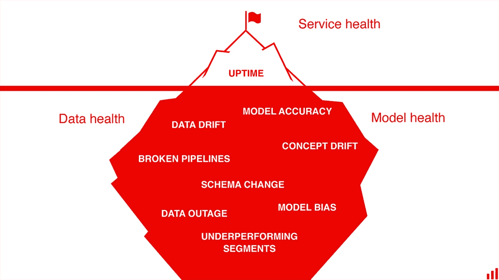
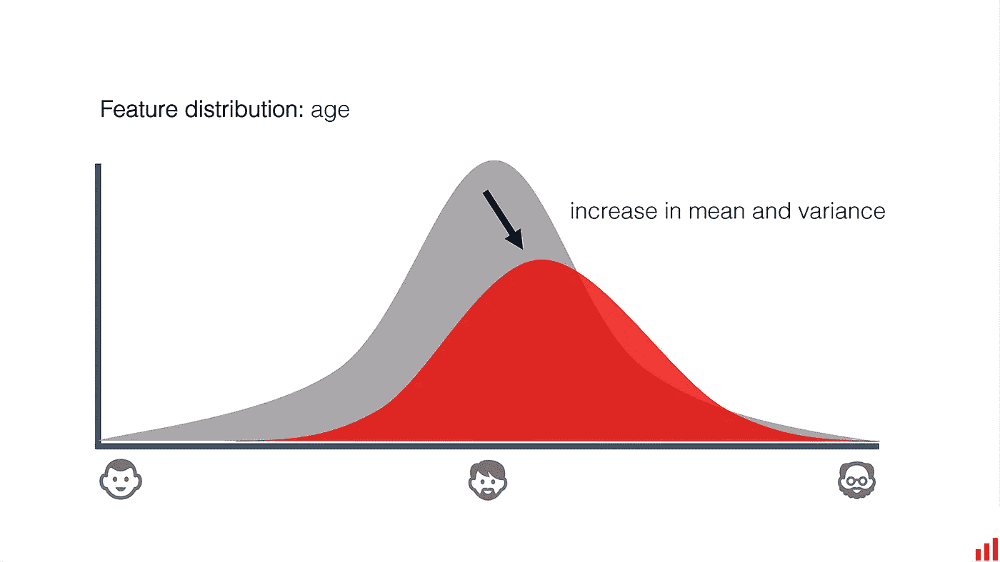
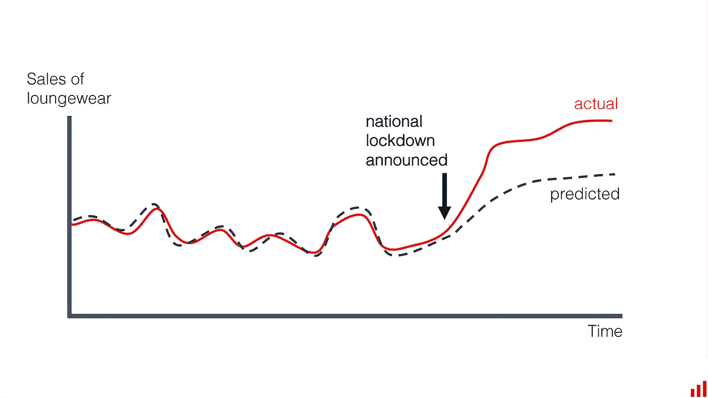
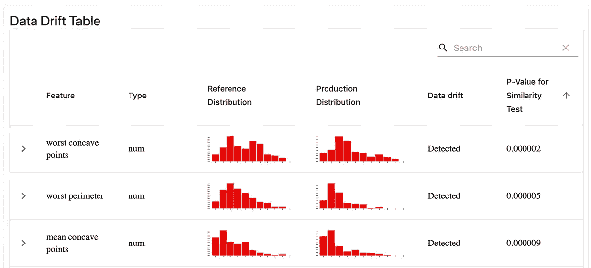
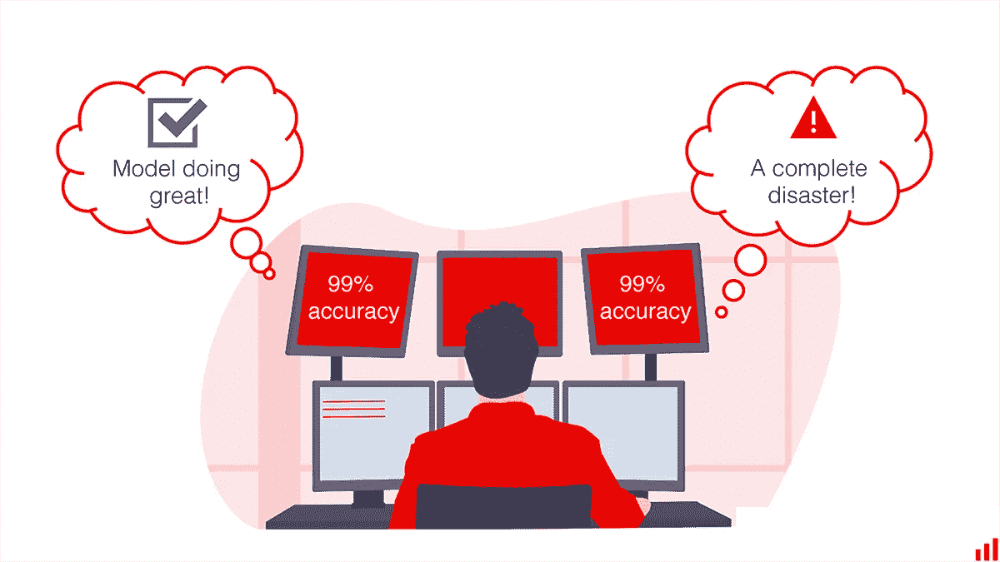
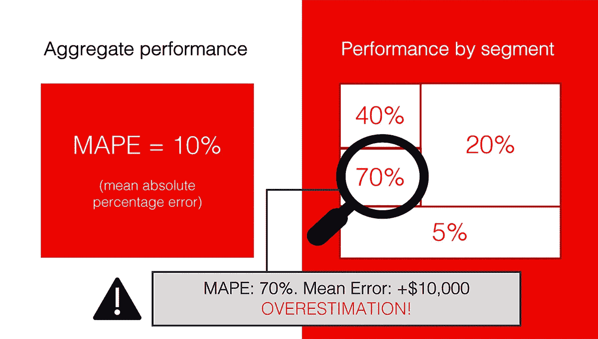
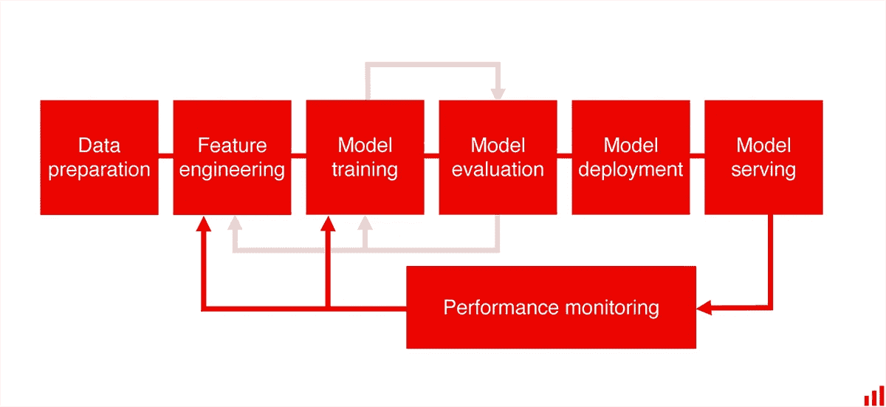

# 机器学习模型监控清单:要跟踪的 7 件事

> 原文：<https://towardsdatascience.com/a-machine-learning-model-monitoring-checklist-7-things-to-track-2042be98a7b5?source=collection_archive---------28----------------------->

## *如何监控您的模型以及使用哪些开源工具*

图片作者。

**建立一个机器学习模型并不容易。**在生产中部署服务更加困难。但是，即使你设法把所有的管道粘在一起，事情也不会就此停止。

一旦模型投入使用，我们必须立即考虑如何平稳地操作它。毕竟，它现在正在提供商业价值！模型性能的任何中断都会直接转化为实际的业务损失。

**我们需要确保模型交付。**不只是作为一个返回 API 响应的软件，而是作为一个我们可以信任来做出决策的机器学习系统。

这意味着我们需要监控我们的模型。而且还有更多的东西要找！

如果生产中的 ML 让你措手不及，这里有一个需要注意的清单。

# 1.服务健康

机器学习服务还是服务。您的公司可能已经建立了一些您可以重用的软件监控流程。如果模型实时运行，它需要适当的警报和负责任的人员随叫随到。

即使您只处理批量模型，也不要例外！我们仍然需要跟踪标准的健康指标，比如内存利用率、CPU 负载等等。

*我们的目标是确保服务正常运行，并遵守必要的约束条件，例如响应速度。*

一个开源工具来检查: [*Grafana*](https://github.com/grafana/grafana) *。*

# **2。数据质量&完整性**

图片作者。

机器学习模型有问题吗？在绝大多数情况下，[数据是罪魁祸首](https://evidentlyai.com/blog/machine-learning-monitoring-what-can-go-wrong-with-your-data)。

**上游管线和模型断裂。**用户突然改变了模式。数据可能在源头消失，物理传感器失效。这样的例子不胜枚举。

因此，验证输入数据是否符合我们的期望是至关重要的。检查可能包括范围符合性、数据分布、要素统计、相关性或我们认为对数据集“正常”的任何行为。

我们的目标是确认我们正在输入模型可以处理的数据。在它返回不可靠的响应之前。

一个开源工具查: [*远大前程*](https://github.com/great-expectations/great_expectations) 。

# **3。数据&目标漂移**

事情变了。即使我们处理非常稳定的过程。几乎每个机器学习模型都有这个不方便的特质:会随着时间退化。

**当模型接收到训练中未见过的数据时，我们可能会经历** [**数据漂移**](https://evidentlyai.com/blog/machine-learning-monitoring-data-and-concept-drift) **。**假设用户来自不同的年龄组、营销渠道或地理区域。

数据漂移的一个例子。图片作者。

**如果现实世界的模式发生变化，漂移的概念就会出现。想象一下像全球疫情这样影响所有顾客行为的偶然事件。或者市场上提供大量免费层的新竞争产品。它改变了用户对你营销活动的反应。**

概念漂移的一个例子。图片作者。

这两种漂移的最终衡量标准是模型质量的下降。但是有时候，实际值还不知道，我们无法直接计算出来。在这种情况下，有先行指标可以跟踪。我们可以监视输入数据或目标函数的属性是否发生了变化。

**例如，您可以跟踪关键模型特征和模型预测的分布。**然后，如果它们明显不同于过去的时间范围，则触发警报。

截图来自[显然是](https://github.com/evidentlyai/evidently)的报道。

*我们的目标是获得世界或数据发生变化的早期信号，是时候更新我们的模型了。*

一个开源工具检查: [*显然是*](https://github.com/evidentlyai/evidently) 。

# 4.模型性能

要知道你的模型是否运行良好，最直接的方法就是将你的预测与实际值进行对比。您可以使用模型训练阶段的相同指标，无论是分类的精度/召回率，还是回归的 RMSE，等等。如果数据质量或现实世界的模式发生了问题，我们将会看到指标下降。

截图来自[显然是](https://github.com/evidentlyai/evidently)的报道。

这里有一些警告。

首先，事实真相或实际标签通常会有延迟。例如，如果你做一个长期的预测，或者数据传递有滞后。有时你需要额外的努力来标记新的数据，以检查你的预测是否正确。在这种情况下，首先跟踪数据和目标漂移作为早期警告是有意义的。

第二，人们不仅需要跟踪模型质量，还需要跟踪相关的业务 KPI。ROC AUC 的下降并不能直接说明它对营销转化有多大影响。将模型质量与业务度量联系起来或者找到一些可解释的代理是至关重要的。

**第三，你的质量度量应该适合用例。**例如，如果您有不平衡的类，准确性度量就很不理想。对于回归问题，您可能会关心错误符号。因此，您不仅应该跟踪绝对值，还应该跟踪误差分布。区分偶然的异常值和真正的衰退也很关键。

所以明智地选择你的衡量标准吧！

*我们的目标是跟踪模型服务于其目的的程度，以及当出现问题时如何调试它。*

一个开源工具来查: [*显然是*](https://github.com/evidentlyai/evidently) 。

# **5。按部门划分的业绩**

对于许多型号，上述监控设置就足够了。但是如果您处理更关键的用例，就有更多的项目需要检查。

比如模型哪里出错多，哪里做的最好？

**你可能已经知道一些要跟踪的特定细分市场:**比如你的高端客户相对于总体客户的模型准确性。它需要一个自定义的质量指标，只为您定义的段内的对象进行计算。

**在其他情况下，主动搜索低性能的部分是有意义的。**假设您的房地产定价模型在某个特定的地理区域一贯显示高于实际的报价。这是你想要注意的事情！

根据用例，我们可以通过在模型输出之上添加后处理或业务逻辑来解决这个问题。或者通过重建模型来说明表现不佳的部分。

*我们的目标是超越总体性能，了解特定数据切片的模型质量。*

# 6.偏见/公平

当涉及到金融、医疗保健、教育和其他模型决策可能有严重影响的领域时，我们需要更加仔细地检查我们的模型。

例如，基于不同人口统计组在训练数据中的表示，不同人口统计组的模型性能可能不同。模型创建者需要意识到这种影响，并拥有与监管者和利益相关者一起减轻不公平的工具。

为此，我们需要跟踪合适的指标，比如准确率的奇偶校验。它适用于模型验证和持续生产监控。因此，仪表板上还有一些指标！

*我们的目标是确保公平对待所有子群体，并跟踪合规情况。*

一个开源工具来检查: [*Fairlearn*](https://github.com/fairlearn/fairlearn) 。

# 7.极端值

我们知道模型会出错。在一些用例中，比如广告定位，我们可能并不关心单个输入是奇怪的还是正常的。只要它们不构成模型失败的有意义的部分！

在其他应用程序中，我们可能希望了解每个这样的情况。为了最小化错误，我们可以设计一套规则来处理异常值。例如，让他们进行人工审核，而不是自动做出决定。在这种情况下，我们需要一种方法来检测并相应地标记它们。

*我们的目标是标记模型预测不可信的异常数据输入。*

一个开源工具检查: [*谢顿不在场证明-检测*](https://github.com/SeldonIO/alibi-detect)

监控听起来可能很无聊。但是，让机器学习在现实世界中发挥作用是至关重要的。不要等到模型失败才创建你的第一个仪表板！

*最初发表于*[*https://www.kdnuggets.com*](https://www.kdnuggets.com/2021/03/machine-learning-model-monitoring-checklist.html)*并与*[*Emeli Dral*](https://www.linkedin.com/in/emelidral/)*合著。*

*更多关于生产机器学习的内容，请查看* [*我们的博客*](https://evidentlyai.com/blog) *和关于 ML 监控和验证的动手* [*教程*](https://evidentlyai.com/blog#!/tfeeds/393523502011/c/tutorial) *。*