# 一个主要的 Seaborn 策划技巧，我希望我能早点学会

> 原文：<https://towardsdatascience.com/a-major-seaborn-plotting-tip-i-wish-i-had-learned-earlier-d8209ad0a20e?source=collection_archive---------11----------------------->

## [实践教程](https://towardsdatascience.com/tagged/hands-on-tutorials)

## 了解 Seaborn 中的轴级、图形级和对象级绘图


来自 Unsplash 上的[詹姆斯·哈里森(@jstrippa)](https://unsplash.com/@jstrippa)

Seaborn 是一个非常棒的绘图库，我希望我能在我的 Python 载体中早点开始使用它。我一直是 Matplotlib 的用户，我会花几个小时在一些项目上微调我的绘图美学，以便它们在演示过程中真正吸引同事的注意。我的第一个私家侦探总是说，如果你不出席一个有阴谋的会议，你就没有准备好，所以我总是做好准备。我一点也不知道 Seaborn 在 Python 中绘图是多么简单，尽管它比 Matplotlib 产生了更具视觉吸引力的固定绘图。

# 数据

我们将使用一个关于企鹅的基本的 Seaborn 数据集，其中有关于几个物种种群的各种记录信息。我们可以查看下面的数据框架:

```
pen = sns.load_dataset('penguins')pen.head()
```

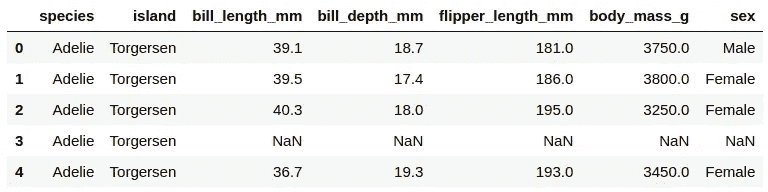

企鹅数据集

# 图形级和轴级功能

Seaborn 的代码基础有一个平面名称空间。Seaborn 中的所有功能都是从顶层访问的，但是代码仍然有层次结构。有几个模块的功能可能通过不同的方式实现相同的目标。

当我第一次开始使用 Seaborn 时，我很困惑为什么有时包装 Matplotlib 样式会改变我的 Seaborn 图，但其他时候 Matplotlib 样式不会像预期的那样工作。这是因为一些函数将数据绘制到一个`matplotlib.pyplot.Axes`对象上，而其他函数通过一个 Seaborn 对象与 Matplotlib 接口。这些分别被称为轴级和图形级功能。

在层次结构中，轴级功能位于图形级功能之下。例如，`sns.displot()`是一个图形级功能，包含了`histplot`、`kdeplot`、`ecdfplot`和`rugplot`轴级功能。Seaborn 中的每个模块都有一个图形级函数，可以创建底层轴级函数的任何类型的绘图。然而，正因为`displot()` 可以创建所有四种类型的图，使用图形级功能或更具体的轴级功能有其优点和缺点。

看看如何创建一个简单的 KDE 图，显示按物种划分的喙深度的核心密度:

**图级**

```
fig_lvl = sns.displot(data=pen, x='bill_depth_mm', hue='species', kind='kde', fill=True)
```

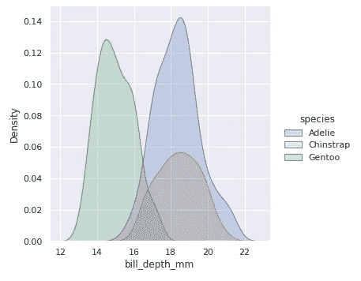

数字级 KDE 图

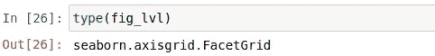

数字级别类型

## 轴水平

```
fig_ax = sns.kdeplot(data=pen, x='bill_depth_mm', hue='species', shade=True)
```

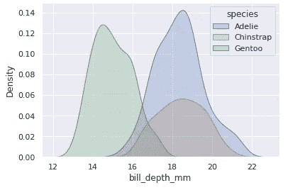

轴级 KDE 图

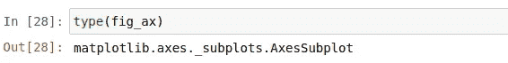

坐标轴图形类型

这两幅图看起来非常相似。我们可以看到图级函数以 plot 的`kind`作为自变量。他们也生产两种不同的物品。

另外，请注意为了给它们加阴影，我使用了不同的关键字参数。有了`sns.displot()`，我需要`fill=True`，而`sns.kdeplot()`需要`shade=True`；使用`sns.kdeplot()`时，关键字`fill`用纯色填充曲线，而不是更不透明的阴影曲线。寻找`sns.displot()`的关键字参数可能很困难，因为它适应多种类型的图*。*

# 考虑

## **造型**

当我们使用轴级绘图时，我们实际上是在使用一个看起来很漂亮的 Matplotlib 对象。这给我们留下了大量的 Matplotlib 功能的进一步定制工作，许多人已经习惯于使用这些功能。

另一方面，Seaborn 样式可能更复杂，因为每种体形类型下都存在多种类型的绘图。由于这种内部层次结构，像`sns.displot()`这样的函数的文档字符串不会包含所有可用的参数，因为有些参数只适用于某些类型的绘图。然而，一旦你习惯了为 Seaborn figures 寻找关键词的困难，它们就能很好地工作，并提供一些非常有用的工具。

## **兼容性**

当我们创建一个 Seaborn 图形级别的绘图时，它是在自己的轴上绘制的，该轴是在创建时启动的。这意味着我们不能在现有的轴上使用 Seaborn 图形级别的绘图。然而，Seaborn 有一些锦囊妙计来轻松创建网格图，我们将在下面讨论。

轴级绘图是 Matplotlib 对象，可以像任何其他 Matplotlib 图形一样对待。它们可以被捆绑成一个用 Matplotlib 制作的支线剧情网格，当你制作大量不同的剧情时，这真的很有用。除了更容易遵循文档，Matplotlib 兼容性是轴级绘图的最大优势之一。

让我们看看在使用 Matplotlib 子图时，如何使用 Seaborn 轴级函数:

```
fig, ax = plt.subplots(1,2,figsize=(8,4), gridspec_kw=dict(width_ratios=[4,3]))sns.scatterplot(data=pen, x='bill_depth_mm',y='body_mass_g', hue='species', ax=ax[0])sns.kdeplot(data=pen, x='bill_depth_mm', hue='species', shade=True, ax=ax[1])fig.tight_layout()
```

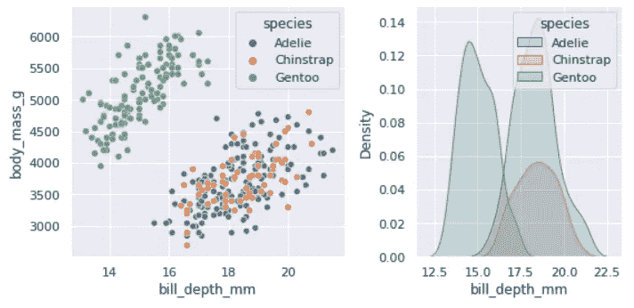

Matplotlib 子图中的 Seaborn 轴级图形

# 更改图形大小和标记轴

我经常对一个新的地块做的头两件事是使它和我的其他地块大小一致，并标记轴。使用 Matplotlib，调整图的大小和标记轴是许多人熟悉的任务，虽然 Seaborn 不同，但它仍然非常简单。

## **轴级**

轴级绘图使用标准的 Matplotlib 图形实例化来确定大小，并使用 Matplotlib 命令来设置每个轴标签。

```
plt.figure(**figsize**=(12,6))fig_ax = sns.histplot(data=pen, x='bill_depth_mm', hue='species', multiple='stack')plt.**xlabel**('Bill Depth (mm)')
```

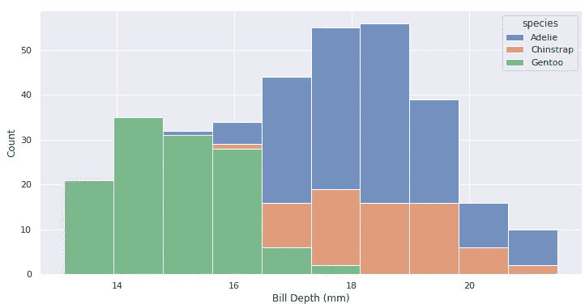

用轴设置标签和大小-标签图

## **图级**

当创建图形和 Seaborn 自己的轴标签函数时，图形级绘图使用`height`和`aspect`参数。

```
fig_lvl = sns.displot(data=pen, x='bill_depth_mm', hue='species', multiple='stack', kind='hist', **height**=5, **aspect**=2)fig_lvl.**set_axis_labels**("Bill Depth (mm)")
```

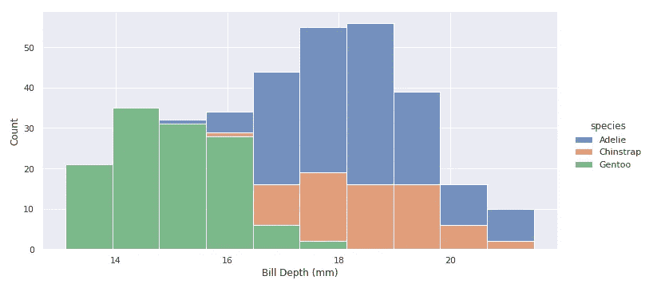

使用图形级别的绘图设置标签和大小

# 带有 Seaborn 数字级情节的支线情节

我们可以使用 Seaborn 创建一些非常有用的绘图网格，通过分类变量自动分隔日期。用 Matplolib 做这件事可能要做更多的工作，包括设置数据子集和为每个轴创建单独的图。

```
fig_lvl = sns.relplot(data=pen, x='bill_depth_mm', y='body_mass_g', **col**='species', kind='scatter')fig_lvl.set_axis_labels("Bill Depth (mm)", "Body Mass (g)")
```

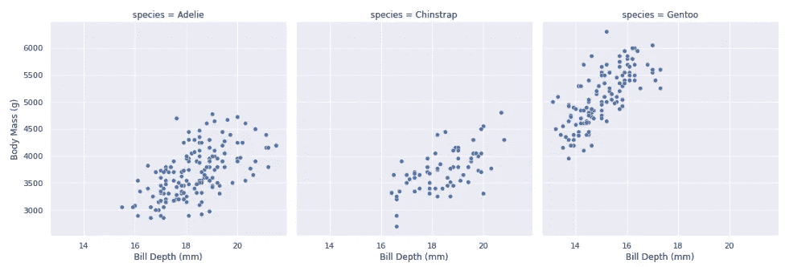

图级散点图很容易被分类变量划分

## 将 Matplotlib 与子情节一起使用

这种绘图也可以用 Matplotlib 完成，但是需要更多的思考。我是这样做的:

```
species = pen['species'].unique()
fig, ax = plt.subplots(1,3,figsize=(16,6))for a, spec_name in zip(ax,species): 
    df = pen[pen['species'].str.match(spec_name)]
    a.scatter(x=df['bill_depth_mm'], y=df['body_mass_g'],s=15)
    a.set_xlim([10,23])
    a.set_ylim([2000,6500])
    a.set_title(spec_name)
```

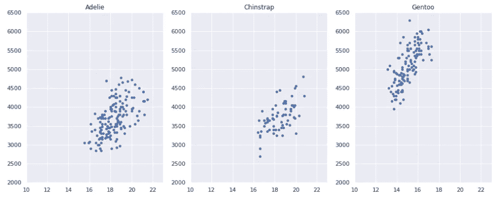

带有 Matplotlib 的支线剧情

我选择使用一个 *for* 循环来遍历每个轴和每个物种名称。通过这种方式，您可以设置 x 和 y 边界，而不必为每个轴重复相同的代码。这比 Seaborn 需要更多的工作和考虑。我必须手动按物种划分子集，制作正确数量的支线剧情，并对所有数据设置合理的 x/y 限制；Seaborn 自动完成所有这些工作！相当不错。

# 对象级绘图

当您使用图形级函数`sns.displot()`来创建直方图时，对象类型是`seaborn.axisgrid.FacetGrid`，这意味着它是一个与要显示的 Matplotlib API 接口的 Seaborn `FacetGrid`对象。我们还可以直接使用对象来创建一个图，这将打开进一步的定制。

```
fig_obj = sns.FacetGrid(pen, col='species', margin_titles=True, height=6)fig_obj.map(plt.scatter, "bill_depth_mm", "body_mass_g", s=30)fig_obj.set(xlim=(10,23),ylim=(2000,6500))fig_obj.set_axis_labels("Bill Depth (mm)", "Body Mass (g)", fontsize=14)
```

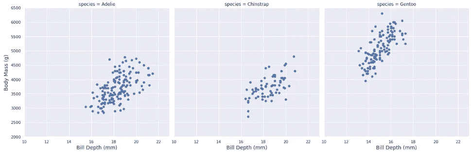

对象级绘图

这个散点图看起来和我们的图形级`sns.relplot()`图一样，但是通过 Seaborn `FacetGrid`对象利用了`plt.scatter`。这是使用 Matplotlib 实现这种绘图的更简单的方法。要使用 Matplotlib 语法进一步调整您的绘图，您可以向`map()`调用添加更多的关键字参数，或者使用`fig_obj.set()`函数。您也可以使用类似`fig.et_axis_labels()`的 Seaborn 图形级绘图函数。

## 对象提供了灵活性

对于 Seaborn 对象，我们可以做更多的事情。它们更难使用；通常，您可能需要打开两页(或更多页)的文档才能获得您正在寻找的所有参数。但是这些额外的工作得到了一些很好的回报，比如通过数据变量实现简单的分面。

```
fig = sns.FacetGrid(pen, col="island", hue="species", aspect=.75, height=3.5)fig.map_dataframe(sns.scatterplot, x="bill_depth_mm", y="body_mass_g")fig.set_axis_labels("Bill Depths (mm)", "Body Mass (g)")fig.add_legend()
```

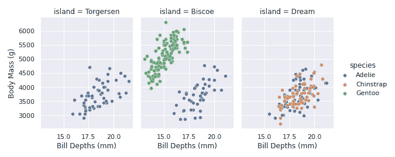

使用 sns.scatterplot 的 Seaborn FacetGrid 图

# 包扎

这将节省您理解 Seaborn 中存在的功能层次的时间。大多数情况下，轴级函数是最直接的选择。文档更容易查找和遵循，如果您决定将它们包含在其他 Matplotlib 图中，它们也是兼容的。

正如我们通过使用`relplot()`按照上面的分类变量分割一个图所看到的，Seaborn figures 使得一些可视化的创建比 Matplotlib 简单得多。因此，虽然大多数基本绘图可以创建为 Matplolib axes 对象，但也有使用 Seaborn Figure 对象的良好用例。Seaborn 可能旨在为用户提供简单性，但它具有高级功能，有助于完善您在 Python 中的绘图目标。

# 证明文件

*   [海博恩](https://seaborn.pydata.org/)
*   Matplotlib

> 声明:本文所有情节均由我为此而作。