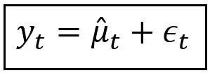
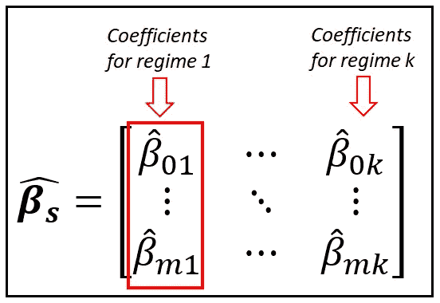

# 数学爱好者的隐马尔可夫模型指南

> 原文：<https://towardsdatascience.com/a-math-lovers-guide-to-hidden-markov-models-ad718df9fde8?source=collection_archive---------3----------------------->

## 它们是如何工作的，以及它们为什么被“隐藏”起来。

隐马尔可夫模型可以用于研究这样的现象，其中只有一部分现象可以被直接观察到，而其余部分不能被直接观察到，尽管它的影响可以在所观察到的事物上感觉到。未观察到的部分的影响只能估计。

我们使用两个随机过程的**混合来表示这种现象。**

这两个过程之一是一个“**可见过程**”。它用于表示现象的可观察部分。使用合适的回归模型，如 [ARIMA](/regression-with-arima-errors-3fc06f383d73) 、[整数泊松模型](/an-introduction-to-the-poisson-integer-arima-regression-model-b66d3ff2e6e5)或曾经流行的[线性模型](/assumptions-of-linear-regression-5d87c347140)，对可见过程进行建模。无法观察到的部分由一个“**隐藏过程**表示，其中*使用马尔可夫过程模型建模。*

如果你是马尔可夫过程的新手，请阅读下面的文章，然后回到这里继续阅读:

</a-beginners-guide-to-discrete-time-markov-chains-d5be17cf0e12>  

# 一个隐马尔可夫模型的真实例子

让我们来说明如何使用隐马尔可夫模型来表示真实世界的数据集。

下图显示了美国的月失业率:


美国月度失业率(数据来源:[美国弗雷德](https://fred.stlouisfed.org/series/UNRATE)在[公共领域](https://fred.stlouisfed.org/tags/series?t=public%20domain%3A%20citation%20requested)许可下)(图片由作者提供)

上图显示了大范围的正增长和负增长区域。我们假设有一些观察者不知道的隐藏过程在起作用，在两种“制度”之间摇摆不定，当前的制度实际上正在影响观察到的通货膨胀率趋势。

在对上述数据集建模时，我们将考虑一个回归模型，它是以下两个随机变量的混合**:**

*   **可观察的随机变量 *y_t，*** 用于表示失业率的可观察模式。在每个时间步 *t* ， *y_t* 就是在 *t* 的失业率的观察值。
*   **一个隐藏的随机变量*s _ t*它被假定改变它的状态或制度，而每次制度改变，它都会影响观察到的就业模式。换句话说，**值 *s_t* 的变化会影响 *y_t*** 的均值和方差。这是隐马尔可夫模型背后的主要思想。**

我们来看看如何精确表达 *y_t* 和 *s_t* 之间的这种关系。现在，让我们假设 *s_t* 在两种状态 *1* 和 *2* 之间切换。

重要的问题是:为什么我们称 *s_t* 为‘隐藏’随机变量？

我们称之为隐藏的，因为我们不知道它何时改变其状态。如果我们知道在每一个时间点上哪个机制是有效的，我们将简单地使 *s_t* 成为一个回归变量，我们将在 *s_t* 上回归 *y_t* ！

## 隐藏随机变量 s_t 的公式

对于失业数据集，我们将假设 *s_t* 服从具有以下状态转移图的两状态马尔可夫过程:


一个 2 态马尔可夫过程(图片由作者提供)

上面所示的马尔可夫链有两种状态，或者说是编号为 *1* 和 *2* 的*状态*。在这两种状态之间有四种可能的状态转换:

*   状态 *1* 到状态 *1:* 这个转换以概率*p11 发生。
    从而 p_11= P(s_t=1|s_(t-1)=1)。*这被解读为系统在时间 *t* 处于状态 *1* 的概率，假定其在前一时间步 *(t-1)处于状态 *1* 。*
*   状态 *1* 到状态 *2* 带转移概率:
    *P _ 12 = P(s _ t = 2 | s _(t-1)= 1)。*
*   状态 *2* 到状态 *1* 带转移概率:
    *P _ 21 = P(s _ t = 1 | s _(t-1)= 2)。*
*   状态 *2* 到状态 *2* 带转移概率:
    *P _ 22 = P(s _ t = 2 | s _(t-1)= 2)。*

由于马尔可夫过程需要在每个时间步都处于某种状态，因此:

*p11 + p12 = 1，*和*，
p21 + p22 = 1*

**状态转移矩阵 *P*** 让我们以如下紧凑矩阵形式表达所有转移概率:


2 态马尔可夫过程的状态转移矩阵(图片由作者提供)

***P*** 包含根据当前状态转移到下一个状态的概率。

状态概率向量 ***π_*** *t* 包含在时间 *t* 处于某一状态的无条件概率。对于我们的 2 步马尔可夫随机变量 *s_t，* **状态概率分布 *π*** *_t* ，(又称为***δ****_ t****)***由以下二元向量给出:


马尔可夫变量的状态概率分布 *s_t(图片由作者提供)*

可以看出，如果我们以 *s_t* 的某个先验(初始)概率分布为***0*开始，那么***【π_****t*可以通过简单地将 ***P*** 与自身 *t* 的次数相乘 ***的矩阵来计算*****

****

**给定 t=0 时的概率分布和转移矩阵 **P** (图片由作者提供)，马尔可夫过程在 t 时的状态概率分布公式**

**这样我们就完成了马尔可夫分布随机变量 *s_t 的公式化。*记得我们假设 *s_t* 是隐藏变量。**

**让我们暂停一下，提醒自己两件我们不知道的重要事情:**

*   **我们不知道从一种状态转换到另一种状态的确切时间步骤。**
*   **我们也不知道跃迁概率 ***P*** 或状态概率分布***π_****t*。**

> **因此，我们到目前为止所做的是假设存在一个以随机变量 s_t 为特征的两态马尔可夫过程，并且 s_t 正在影响以随机变量 y_t 为特征的观察到的失业率*。***

## **可观测时间序列变量 y_t 的公式**

**让我们假设没有影响失业率的隐马尔可夫过程。基于这一假设，让我们为失业率构建以下回归模型:**

****

**y_t 表示为平均值和误差项之和(图片由作者提供)**

**我们说的是在任意时刻 *t* ，观察到的失业率 *y_t* 是**建模均值**μ_ cap _ t 和**残差** *ε_t* 之和。**建模均值** *μ_cap_t* 是回归模型对 *t* 时刻失业率的预测。**残差** *ε_t* 就是从观测速率中减去预测速率。我们将互换使用术语**建模含义**和**预测含义**。**

**我们将进一步假设我们已经使用了一个非常好的回归模型来计算模型化的均值 *μ_cap_t.* ，因此，残差 *ε_t* 可以被假设为</heteroscedasticity-is-nothing-to-be-afraid-of-730dd3f7ca1f>**，即其方差不随均值变化，此外， *ε_t* 正态分布在一个零均值和一些方差σ周围。在符号形式上， *ε_t* **是一个 *N(0，σ )* 分布随机变量**。****

****现在让我们回到 *μ_cap_t* 。由于 *μ_cap_t* 是回归模型的预测值，所以 *μ_cap_t* 实际上是某个回归函数 *η(。)*这样说:****

*****μ_cap_t = η(。)*****

*****η的不同选择(。)*会产生不同族的回归模型。****

****例如，如果 *η(。)= 0* ，我们得到 [**白噪声模型**](/the-white-noise-model-1388dbd0a7d) : *y_t = ε_t.*****

****如果 *η(。)*是所有观测值的常数均值*y _ bar*I .*e .:
y _ bar =(y _ 1+y2+…+y _ n)/n，* 我们得到一个 [**均值模型**](/the-complete-guide-to-r-squared-adjusted-r-squared-and-pseudo-r-squared-4136650fc06c):***y _ t = y _ bar。*******

******一个更有趣的模型可能依赖于一组“ *m+1* ”数量的回归系数***β_ cap****=【β_ cap _ 0，β_cap_1，β_cap_2，…，β_ cap _ m】*，这些回归系数将因变量***y***链接到回归变量的**矩阵********

********

****回归变量矩阵 **X** 和系数向量 ***β*** *(图片由作者提供)*****

****在上图中， ***X*** 中第一列 1 作为回归 *β_cap_0* 拟合截距的占位符。“cap”符号表示它是训练模型后系数的拟合值。而***X****_ t*是在时间 *t* 的一排 ***X*** 。****

****如果链接函数*η(****)x****_ t，****【β_ cap】****)*是线性的，就得到</assumptions-of-linear-regression-5d87c347140>****线性模型。如果链接函数是指数函数，则得到 [**泊松**](/poisson-regression-models-for-time-series-data-sets-54114e68c46d) ， [**NLS**](/a-guide-to-building-nonlinear-least-squares-nls-regression-models-310b97a7baeb) 等。回归模型等等。********

****让我们仔细看看**线性模型**，其特征在于以下一组等式:****

********

****由建模平均值组成的线性模型，表示为回归变量的线性组合(图片由作者提供)****

****冒着使残差 *ε_ t* 相关的风险，也允许在***x****_ t、*中引入 *y_t 的滞后值，如下所示:*****

********

****模型平均值表示为回归变量的线性组合，包括因变量 y_t 的滞后副本。(图片由作者提供)****

****如果你想知道，不，上述模型是*不是*一个自回归模型在 ARMA 的意义上。稍后，我们将看看“真实的”AR(1)模型是什么样子的。****

****我们的模型说明是不完整的，除非我们在上述模型中还指定了 *y_t.* 的概率(密度)函数，我们将假设 *y_t* 是具有平均值 *μ_cap_t* 的**正态分布**，并且恒定方差σ:****

********

******y** 的概率密度函数(图片作者提供)****

****上述等式应理解为:在回归变量*向量**_ t*和拟合系数向量 ***β_cap*** 的条件下，失业率在时间 *t* 为 *y_t* 的概率(密度)正态分布，具有恒定方差σ和条件均值*μ_ cap _ t*******

************

******预测平均值表示为回归向量 **x** _t 和拟合系数向量 ***β_cap*** 的点积(图片由作者提供)******

******这就完成了 *y_t* 的可视化流程的制定。******

******现在让我们将隐马尔可夫过程和可见过程“混合”成一个隐马尔可夫模型。******

## ******混合隐马尔可夫变量 ST 和可见随机变量 y t******

******理解隐马尔可夫模型的关键在于理解可见过程的建模均值和方差是如何受隐马尔可夫过程影响的。******

******下面我们将介绍马尔可夫变量 *s_t* 影响 *μ_cap_t* 和σ的两种方式。******

# ******马尔可夫转换动态回归(MSDR)模型******

******假设我们将回归模型定义如下:******

************

******均值模型，其中均值根据基础马尔可夫过程的状态在不同值之间切换(图片由作者提供)******

******在上面的等式中，我们说模型的预测均值根据潜在马尔可夫过程变量 *s_t* 在时间 *t* 处的状态而变化。******

******和前面一样，预测均值 *μ_cap_t_s_t* 可以表示为某个链接函数 *η(.)，即μ_cap_t_s_t = η(。).*******

******对于这个模型，我们定义 *η(。)*如下:******

************

******预测平均值表示为大小为[n x 1]的 1 向量和大小为[1 x 1]的系数向量的点积(图片由作者提供)******

******上面的等式是点积***x _ t******β_ cap***的一个特殊的简单情况，这里不涉及回归变量。因此***X****_ t*是一个大小为*【1 X 1】*的矩阵，包含数字 *1* ，正如我们前面看到的，它是回归的截距 *β_0 的占位符。****β_ cap****也是一个*【1×1】*矩阵，只包含回归的截距 *β_0_s_t.* 两者的点积就是标量值 *β_0_s_t，它是截距在时间 t 处于马尔可夫状态 s_t 下的值********

******如果我们假设马尔可夫过程在一组 *k* 状态*【1，2，3，…j，…，k】*上运行，则更容易将上述等式表达如下:******

************

******可视过程的预测均值根据隐马尔可夫过程所处的状态在不同的值之间切换(图片由作者提供)******

******回归模型的方程式如下:******

************

******均值模型，其中均值根据隐马尔可夫过程所处的状态在不同值之间切换(图片由作者提供)******

******上式中， *y_t* 为观测值， *μ_cap_t_j* 为马尔可夫过程处于状态 *j* 时的预测均值， *ε_t* 为回归的残差。******

******在我们的失业率数据集中，我们假设 *s_t* 在两种状态 *1* 和 *2* 之间切换，这为 *μ_cap_t_j* 提供了以下规格:******

************

******可视过程的预测均值在两个值之间切换，这取决于隐藏的 2 状态马尔可夫过程处于哪个状态(图片由作者提供)******

******这又产生了用于 *y_t* 的**混合过程**，该混合过程在两种方式 *μ_s_1* 和 *μ_s_2* 之间切换，如下所示:******

************

******受两状态隐马尔可夫过程影响的均值模型(图片由作者提供)******

*******y_t* 对应的两个条件概率密度如下:******

************

******y_t 的两个概率密度函数对应于隐马尔可夫过程的两个 2 态(图片由作者提供)******

******但是每个观察到的 *y_t* 应该只有一个概率密度与之相关联。******

******我们将使用 [**全概率**](https://en.wikipedia.org/wiki/Law_of_total_probability) 定律来计算这个单一密度，该定律规定，如果事件 A 可以与事件 A1、事件 A2 或事件 A3 等成对地联合发生，那么 A 的无条件概率可以表示如下:******

************

******全概率定律(图片由作者提供)******

******这是一种图形化的看待方式。有“n”种不同的方式到达节点 A:******

************

******事件 A 发生的 n 种不同方式(图片由作者提供)******

******使用该定律，我们得到在时间 *t* 观察到特定失业率 *y_t* 的无条件概率密度如下:******

************

******一个 2 态马尔可夫模型影响下的 ***y*** 的无条件概率密度(图片作者提供)******

******敏锐的读者可能已经注意到，在上面的等式中，我们混合了概率和概率密度，但是在这里也可以这样做。以求和形式书写的上述等式如下:******

************

******一个 2 态马尔可夫模型影响下的 ***y*** 的无条件概率密度(图片由作者提供)******

******上式中，概率 *P(s_t=1)* 和 *P(s_t=2)* 是两态马尔可夫过程的**状态概率*****π****_ t1*和***π****_ T2*:******

************

******2 状态马尔可夫过程的状态概率向量(图片由作者提供)******

******我们已经知道，为了计算状态概率，我们需要假设一些初始条件，然后使用下面的等式:******

************

******给定 t=0 时的概率分布和转移矩阵 **P** (图片由作者提供)，马尔可夫过程在 t 时的状态概率分布公式******

******其中***π****_ 0*为初始值 *t=0* ， ***P*** 为状态转移矩阵:******

************

******2 态马尔可夫过程的状态转移矩阵(图片由作者提供)******

******上面的模型是所谓的**马尔可夫转换动态回归(MSDR)** 模型家族的一个简单例子。******

## ******评估和培训******

******训练该模型包括估计以下变量的最佳值:******

*   ******状态转移矩阵 ***P*** ，即本质上的转移概率*p11*和*p22、*******
*   ******我们样本数据集中与两个预测失业率水平*、*和相对应的状态特定回归系数 *β_cap_0_1 和β_cap_0_2，*******
*   ******恒定方差σ。******

******可以使用**最大似然**来进行估计，其找到**、β_cap_0_1* 、 *β_cap_0_2* (使用 ***β_cap* _s** 矩阵和σ的值，这些值将*最大化观察整个训练数据集* **的联合概率密度换句话说，我们希望最大化以下产品:*********

************

******观察数据集的可能性(图片由作者提供)******

******在上面的乘积中，概率密度*f(****y****= y _ t)*由我们前面看到的等式(1)给出。******

******最大化该乘积的自然对数通常更容易，这有利于将乘积转换成总和。因此，我们最大化以下*对数*-可能性:******

************

******观察数据集的对数似然性(图片由作者提供)******

******对数似然性的最大化是通过对对数似然性 w.r.t .的每个参数 *p_11* 、 *p_22* 、 *β_cap_0_1* 、 *β_cap_0_2* 和σ取偏导数来完成的，将每个偏导数设置为零，并使用诸如 [Newton-Raphson](https://en.wikipedia.org/wiki/Newton%27s_method) 、 [Nelder-Mead](https://en.wikipedia.org/wiki/Nelder%E2%80%93Mead_method) 、等一些优化算法来求解五个方程的结果系统******

## ******马尔可夫转换动态回归模型(一般情况)******

******MSDR 的一般方程可以表述如下:******

************

******用预测均值 *μ_cap_tj 和残差* ε_t 之和表示的观测值 y_t(图片由作者提供)******

******其中， *μ_cap_t_j* 是回归变量矩阵***x****_ t*和特定体制拟合系数向量***β_ cap****_ j***的函数。**即**、********

*******μ_ cap _ t _ j =η(****x****_ t，****β_ cap****_ j)*******

******但是这一次，注意回归系数向量被称为***β_ cap****_ j*对应于*第 j 个*马尔可夫状态。******

******如果马尔可夫模型对' *k'* 状态*【1，2，…，j，…，k】*， ***β_cap_s*** 进行运算，则大小为 *[(m+1) X k]* 的矩阵如下:******

************

******大小为[(m+1) x k]的系数矩阵(图片由作者提供)******

******中心思想是，根据[1，2，…，k 中的哪个马尔可夫状态或“状态” *j* *当前有效，回归模型系数将**从 ***β_cap_s 切换***到适当的状态特定的*向量****β_ cap****_ j*因此得名‘马尔可夫**切换**动态回归模型’。*********

****k*-状态马尔可夫过程本身由以下状态转移矩阵 ***P*** 控制:***

******

***马尔可夫过程的状态转移矩阵 **P** (图片作者提供)***

***并且在时间步长 *t* 具有以下状态概率分布 ***π_*** *t* :***

******

***k 状态马尔可夫过程的状态概率分布向量(图片由作者提供)***

***到目前为止，我们假设 *y_t* 的线性指定条件均值函数如下:***

******

***正态分布 y_t 的条件均值，表示为回归变量 **x** _t、y_t 的滞后版本和马尔可夫状态相关拟合系数 ***β_cap_* j** 的线性组合(图片由作者提供)***

***上式中， *μ_cap_t_j* 是马尔可夫状态 *j* 下 *t* 时刻的预测均值。***x****_ t*是回归变量*【x _ 1t，x_2t，…，x _ mt】*在时间 t 的向量，***β_ cap****_ j*是状态特定系数的向量*【β_ cap _ 0j，β_cap_1j，β_cap_2j，…，β_cap_mj****

***正如我们在 2 态马尔可夫情况下所看到的(参考等式)。1)，这为 *y_t* 产生正态分布的概率密度如下:***

******

***以 k 态马尔可夫分布随机变量 *s_t* 影响下的 y_t 的 ***β_cap_s 和 P*** *为条件的概率密度函数(图片由作者提供)****

***等式(2)只是等式(1)在 *k* 马尔可夫状态上的扩展。***

****y_t* 不用正态分布。实际上，假设 *y_t* 代表**一个整数随机过程**即 *y_t* 取值 *0，1，2，…等*。这种过程的例子是纽约市每天的机动车事故数量，或者网站每小时的点击数。这种过程可以使用 [**泊松**](/poisson-regression-models-for-time-series-data-sets-54114e68c46d) 过程模型来建模。在这种情况下，*泊松分布 y_t* 的概率质量函数采用以下形式:***

******

***k 状态马尔可夫过程模型影响下的泊松分布 y_t(图片由作者提供)***

***其中，特定于制度的均值函数表示如下:***

******

***上式中，***x****_ t*和***β_ cap****_ j*与线性均值函数含义相同。***

## ***训练和评估***

***马尔可夫转换动态回归模型的训练包括下列变量的最优值的估计:***

***模型的系数:***

******

***大小为[(m+1) x k]的系数矩阵(图片由作者提供)***

***状态转移概率:***

******

***马尔可夫过程的状态转移矩阵 **P** (图片由作者提供)***

***和方差σ。***

***如前所述，估计过程可以是**最大似然估计** ( **MLE** )，其中我们求解一个 *(k +(m+1)*k +1)* 方程系统(实际上，比那个数少得多)，对应于 *k* 马尔可夫转移概率、 *(m+1)*k* 系数 ***β_cap_s*** 和方差σ。***

```
*In an upcoming article, we’ll look at how to build and train both **Linear and Poisson MSDR models** using **Python** and the **statsmodels** library.*
```

***现在让我们看看另一种类型的隐马尔可夫模型，称为**马尔可夫切换自回归(MSAR)** 模型。***

# ***马尔可夫转换自回归(MSAR)模型***

***考虑以下月失业率的模型方程:***

******

***在隐马尔可夫过程影响下运行的 AR(1)模型(图片由作者提供)***

***这里，我们说的是在时间 *t* 的失业率围绕特定制度的平均值 *μ_t_s_t* 波动。波动是由两个分量的总和引起的:***

*   ***第一个分量代表在*前一时间步*的观测值与在*前一时间步*的拟合状态特定平均值的偏差分数，***
*   ***第二个分量来自残差 *ε_t* 。***

***与 MSDR 模型一样，隐马尔可夫过程的状态会影响模型的拟合均值。***

*****注意，该模型不仅依赖于时间 *t* 的状态值，还依赖于前一时间步 *(t-1)* 的有效状态。*****

***上述规范可以很容易地扩展到包括过去的 *p* 时间步长，从而得到遵循 *AR(p)* 设计模式的 MSAR 模型。***

## ***模型说明和评估***

***MSAR 模型的模型规范的一般框架，包括 *y_t* 的概率密度函数的规范和估计程序(MLE 或[期望最大化](https://en.wikipedia.org/wiki/Expectation%E2%80%93maximization_algorithm))与 MSDR 模型保持一致。***

***不幸的是，在前面的步骤中，模型对马尔可夫状态的依赖使规范过程和估计变得相当复杂。***

***我们不会在这里深入讨论这些细节，但是与 MSDR 模型一样，我们将在下一篇文章中研究如何用 Python 和 statsmodels 构建和训练 MSAR 模型。***

# ***参考文献和版权***

## ***数据集***

***美国劳工统计局，失业率[UNRATE]，从圣路易斯美联储银行检索；https://fred.stlouisfed.org/series/UNRATE, 2021 年 10 月 29 日。在[公共许可证](https://fred.stlouisfed.org/tags/series?t=public%20domain%3A%20citation%20requested)下可用。***

## ***书***

***Cameron A. Colin，Trivedi Pravin K .， [*对计数数据的回归分析*](http://cameron.econ.ucdavis.edu/racd/count.html) ，计量经济学学会专论№30，剑桥大学出版社，1998 年。国际标准书号:0521635675***

***詹姆斯·d·汉密尔顿， [*时间序列分析*](https://press.princeton.edu/books/hardcover/9780691042893/time-series-analysis) ，普林斯顿大学出版社，2020 年。ISBN: 0691218633***

## ***形象***

***所有图片的版权均为 [Sachin Date](https://www.linkedin.com/in/sachindate/) 下的 [CC-BY-NC-SA](https://creativecommons.org/licenses/by-nc-sa/4.0/) 所有，除非图片下方提到了不同的来源和版权。***

# ***相关阅读***

***</a-beginners-guide-to-discrete-time-markov-chains-d5be17cf0e12>  </an-introduction-to-the-poisson-integer-arima-regression-model-b66d3ff2e6e5>  </poisson-regression-models-for-time-series-data-sets-54114e68c46d>  </an-illustrated-guide-to-the-poisson-regression-model-50cccba15958>  

*感谢阅读！如果你喜欢这篇文章，请* [***关注我***](https://timeseriesreasoning.medium.com/) *获取关于回归和时间序列分析的技巧、操作和编程建议。****