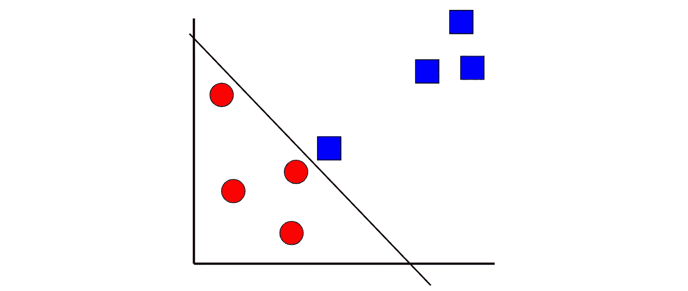

# 支持向量机的数学解释

> 原文：<https://towardsdatascience.com/a-mathematical-explanation-of-support-vector-machines-e433ffe04362?source=collection_archive---------10----------------------->

## 加深对最流行的机器学习模型之一的理解


图片由来自 Pixabay 的 Gerd Altmann 提供

支持向量机(SVM)是数据科学领域最流行的机器学习模型之一。直觉上，这是一个相当简单的概念。然而，从数学上来说，支持向量机看起来就像一个黑盒。

在这篇文章中，我有两个目标:

1.  我想揭开支持向量机背后的机制，让你更好地理解它的整体逻辑。
2.  我想教你如何用 Python 实现一个简单的 SVM，并使用<https://www.gradio.app/>**部署它。最后，您将能够构建这样的东西:**

**作者创建的 GIF**

**说到这里，让我们开始吧！**

# **复习:什么是支持向量机？**

****

**作者创建的图像**

**支持向量机(SVM)是一种监督分类技术。支持向量机的本质只是找到一个区分不同类别的界限。**

*   **在二维空间中，边界称为直线。**
*   **在三维空间中，边界称为平面。**
*   **在任何大于 3 的维度中，该边界称为超平面。**

**让我们假设有两类数据。支持向量机会找到一个边界，使两个类之间的间隔最大化(见上图)。有许多平面可以分隔这两个类别，但只有一个平面可以最大化类别之间的边距或距离。**

# **注释**

***n =数据点数
m =属性数
x_ij =第 j 个数据点的第 I 个属性
如果数据点是蓝色，y _ j = 1；如果数据点是红色，y _ j = 1***

# ****数学****

****

**读完这篇文章后，你会明白上面的等式想要达到什么目的。如果看起来很混乱也不用担心！我会尽我所能一步一步地分解它。**

*****请记住，这涵盖了基本支持向量机的数学，不考虑内核或非线性边界之类的东西。*****

**分解一下，我们可以把它分成两个独立的部分:**

****

**作者创建的图像**

**红色部分:红色部分专注于最小化错误，即 SVM 产生的错误分类点的数量。**

**蓝色部分:蓝色部分着重于最大化利润，这在本文前面已经讨论过了。**

**先说蓝色部分，或者说方程的第二项。**

## **第二项:利润最大化**

****

**正如我前面所说的，您可以在两类数据点之间放置许多边界，**但是只有一个边界**可以最大化两类之间的边距(如上面的虚线所示)。**

**我们希望决策边界尽可能远离支持向量，以便当我们有新数据时，它会以更大的确定性落在这个或那个类别中。**

****

**让我们假设上面的两个等式分别代表边距的两边。*不要太担心 m/-m，只要注意它们如何表示一条线的方程。***

**两条虚线之间的距离由下面的公式得出，你可以在这里阅读更多关于[的内容:](https://socratic.org/questions/what-is-the-distance-between-the-parallel-planes-3x-y-4z-2-and-3x-y-4z-24)**

****

**不用那么担心这个方程是怎么推导出来的。相反，请注意，随着 1 和 m (a1，a2，… am)之间的所有 a 变小，分母变小，距离或边距变大！**

****

**现在你明白了第二个术语(蓝色部分)的意思，让我们来谈谈第一个术语(红色部分)。**

## **第一项:最小化误差**

**实际上，你不可能找到一个超平面，完美地将不同的类彼此分开。即使它存在，也不总是你想要使用那个超平面。**

**考虑下图:**

****

**从技术上讲，我们可以设置边界，使红色和蓝色类位于边界的右侧。然而，假设左边的蓝色方块是一个异常值，那么拥有一个具有较大裕度的不完美超平面可能更理想，这被称为**软裕度**:**

****

**既然我们已经介绍了“误差”的概念，你应该明白**支持向量机的完整等式是试图最小化误差，同时最大化余量**。**

**既然我们已经理解了第一个术语背后的目标，让我们重新审视这个等式:**

****

**用英语来说，这个等式说的是“取各点误差之和”。**

****

**那么^这部分方程是如何表示每个点的误差的呢？让我们深入探讨一下:**

****

**我们把 m 和-m 分别设为 1 和-1。实际上，它们可以是任何数字，因为 m 是裕度的比例因子。**

**因为如果数据点是蓝色的，y_j = 1，如果数据点是红色的，y _ j = 1，所以我们可以组合上边界的方程和下边界的方程来表示所有点:**

****

**这可以重写为以下内容:**

****

**这个等式假设所有的点都被分类在等式的右边。对于边界错误一侧的任何一点，它都不满足方程。**

****

**对你们中的一些人来说，我敢打赌，你脑袋里的灯泡已经亮了。如果没有，不用担心！我们快结束了。**

****

**记得我说过这个方程“取每个点的误差之和。”具体来说，就是取零的最大值，第二部分。规则如下:**

****

**让这个代表 Z**

**让上面的等式代表 z。**

*   **如果给定点在线的右侧，那么 Z 将大于 1。这意味着第一项的第二部分将是一个负数，所以给定点将返回 0(没有错误)**
*   **如果给定点在线的错误一侧，那么 Z 将小于 1。这意味着第一项的第二部分将是一个正数，因此给定点将返回一个大于 0 的值(错误)。**

# **结论**

****

**作者创建的图像**

**就是这样！总之，支持向量机的目标是通过最小化 a_i 来最小化总误差和最大化裕度。**

# **下一步是什么？建造 SVM。**

**既然您已经理解了支持向量机背后的数学，下一步就是用 Python 实际构建一个支持向量机模型并部署它！**

**我将使用经典的 iris 数据集来展示如何用 Python 构建支持向量机(完整代码见 [*此处*](https://colab.research.google.com/drive/14ZoSLkZnSsPIZs_NJJtrfyoxWZLSd6zg?usp=sharing#scrollTo=hFKLc1RM5Ld-) )。**

## **设置**

**开始之前，您需要安装以下库:**

*   **Numpy**
*   **熊猫**
*   **海生的**
*   **Sklearn**
*   **格拉迪欧**

```
**# Importing libraries**
import numpy as np
import pandas as pd
import seaborn as sns**# Importing data**
iris=sns.load_dataset("iris")
```

## **数据准备**

```
from sklearn.model_selection import train_test_split**# Splitting features and target variables**
X=iris.drop("species",axis=1)
y=iris["species"]**# Splitting data into train and test sets**
X_train, X_test, y_train, y_test = train_test_split(X, y, test_size=0.25)
```

## **数据建模**

```
from sklearn.svm import SVC**# Creating model**
model = SVC(probability=True)
model.fit(X_train,y_train)
```

## **使用 Gradio 创建 Web 应用程序**

```
**# Writing a prediction function**
def predict_flower(sepal_length, sepal_width, petal_length, petal_width):
    df = pd.DataFrame.from_dict({'Sepal Length':[sepal_length],     
                                  'Sepal Width': [sepal_width],
                                 'Petal Length': [petal_length],
                                  'Petal Width': [petal_width]
})predict = model.predict_proba(df)[0]
return {model.classes_[i]: predict[i] for i in range(3)}**# Importing gradio** import gradio as gr**# Creating Web App** sepal_length = gr.inputs.Slider(minimum=0, maximum=10, default=5, label="sepal_length")sepal_width = gr.inputs.Slider(minimum=0, maximum=10, default=5, label="sepal_width")petal_length = gr.inputs.Slider(minimum=0, maximum=10, default=5, label="petal_length")petal_width = gr.inputs.Slider(minimum=0, maximum=10, default=5, label="petal_width")gr.Interface(predict_flower, [sepal_length, sepal_width, petal_length, petal_width], "label", live=True).launch(debug=True)
```

**现在你知道了！你应该有一个全功能的 web 应用程序，在那里你可以摆弄模型的输入，并立即看到输出概率。**

**作者创建的 GIF**

# **感谢阅读！**

**如果你坚持到了最后，恭喜你！现在，您应该对基本支持向量机的工作原理有了很好的理解，而且您现在知道如何构建自己的全功能 SVM web 应用程序。**

**如果你喜欢这个，请给这个一些掌声，并在媒体上跟随我！**

**我一如既往地祝你学习顺利。:D**

****不确定接下来要读什么？我为你挑选了另一篇文章:****

**</a-complete-52-week-curriculum-to-become-a-data-scientist-in-2021-2b5fc77bd160>  

**又一个！**

</4-machine-learning-concepts-i-wish-i-knew-when-i-built-my-first-model-3b8ca9506451>  

## 特伦斯·申

*   ***如果你喜欢这个，*** [***跟我上媒***](https://medium.com/@terenceshin) ***了解更多***
*   ***有兴趣合作吗？让我们连线上***[***LinkedIn***](https://www.linkedin.com/in/terenceshin/)
*   ***报名我的邮箱列表*** [***这里***](https://forms.gle/tprRyQxDC5UjhXpN6) ***！*****