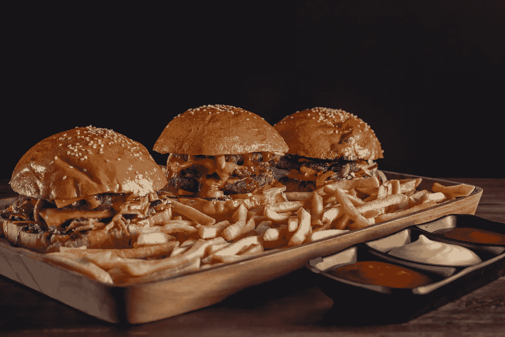
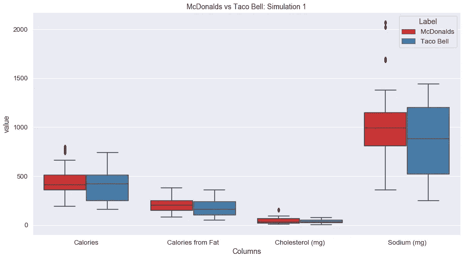
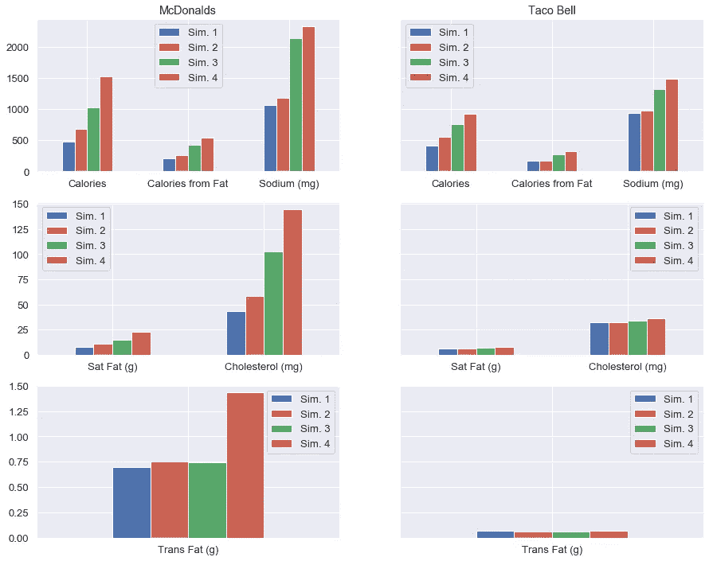
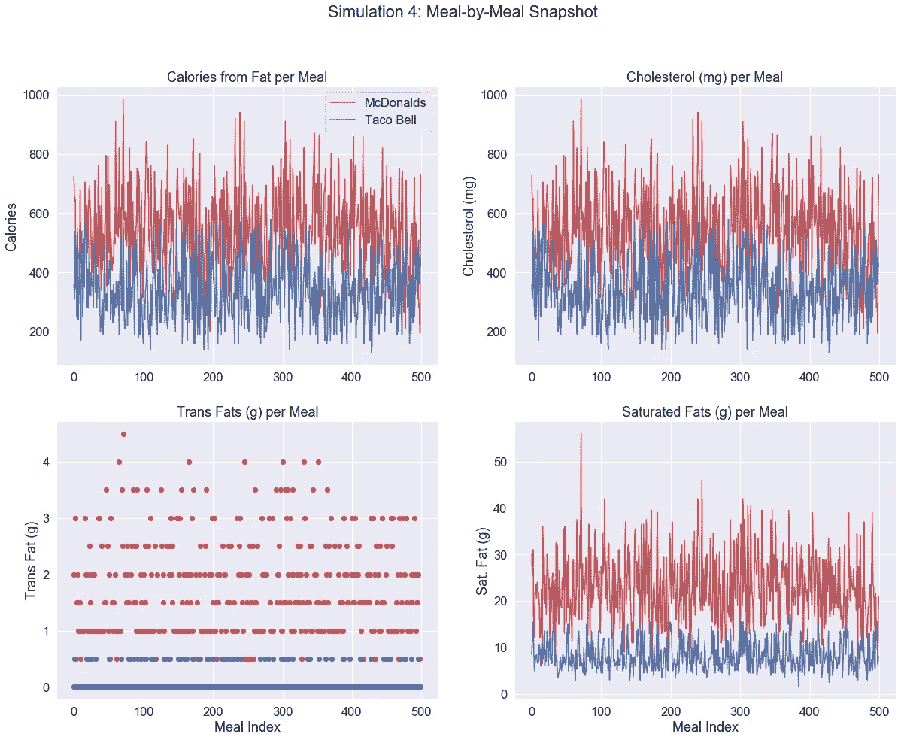
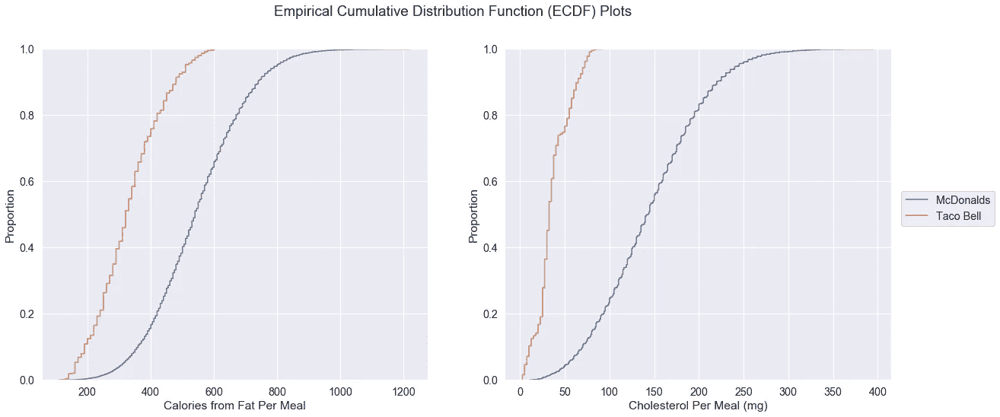

# 麦当劳与塔可钟的模拟:寻找更健康的选择

> 原文：<https://towardsdatascience.com/a-mcdonalds-vs-taco-bell-simulation-finding-the-healthier-choice-7de797772df5?source=collection_archive---------7----------------------->

在 [Unsplash](https://unsplash.com/) 上由 [Shaafi Ali](https://unsplash.com/@shaafi) 拍摄的照片

想象一下。你结束了一整天的工作，决定在回家的路上买些杂货。办完一些事情后，你看看手表:晚上 9 点。为了让自己休息一下，你决定去快餐店吃晚餐。听起来熟悉吗？我敢打赌。

我们都过着极其忙碌的生活。虽然我们都知道快餐不一定是最健康的选择，但许多人仍然利用这些设施，因为它们非常方便。我们倾向于把所有这些连锁餐馆捆绑在一起，认为它们和下一家一样不健康。然而，研究具体的营养事实是区分它们并做出更健康饮食的正确选择的关键。在这个案例研究中，我关注了两家非常受欢迎的快餐店，麦当劳和塔可钟，并回答了这个古老的问题:

> 从长远来看，在哪个餐馆吃饭会是更健康的选择？

# 模拟系统

我首先从两家餐馆拿了菜单，给每一项标上主菜、饮料、配菜、甜点、酱汁或调料。对于麦当劳的信息，我从 Kaggle 上的[数据集](https://www.kaggle.com/mcdonalds/nutrition-facts)中提取，对于塔可钟，我基于我找到的[营养事实网站](https://www.nutrition-charts.com/taco-bell-nutrition-facts-calorie-information/)自己创建了数据集。我保留了每家餐厅特有的饮料，并在分析中丢弃了其余的。也就是说，可乐、雪碧等饮料。从两个数据集中删除，因为我只考虑餐厅的商标食品。该分析的范围仅包括午餐和晚餐菜单项目。

**然后，我创建了四个不同的模拟场景，在这些场景中，顾客将从每家餐厅购买餐食，关键的区别在于单词*“餐食”*的定义。**

*模拟 1:* 顾客单独购买一道主菜

*模拟 2:* 顾客购买一道主菜和一杯饮料

*模拟 3:* 顾客购买一份主菜、一份饮料和一份配菜

*模拟 4:* 顾客购买一道主菜、一杯饮料、一道配菜和一道甜点

为了使分析更加现实，我在两家餐馆的某些菜单项中创建了规定。如果随机选择沙拉作为配菜，脚本会随机选择一种沙拉酱来搭配正餐。如果鸡块或鸡条被选作主菜，那么脚本也会随机选择一种酱与之搭配。对于塔可钟主菜，我确保每个模拟随机选择两种酱来搭配每个主菜。

**对于每个模拟，这些组合的膳食被取样 10，000 次。**由此可以清楚地区分不同的工厂。让我们首先考虑一个最简单的情况，顾客单独点一道主菜。根据模拟 1，我创建了以下图:

模拟 1 结果表明单独主菜的营养分布相似。图片作者。

请注意，两个机构的平均卡路里、脂肪卡路里、胆固醇和钠含量非常相似。我很好奇这种趋势是否适用于所有模拟，这让我比较了所有模拟运行的这些特征的平均值。简而言之，答案是否定的。我创造了这个向我们展示结果的图。

所有模拟的平均值(n=10，000)。图片作者。

我们看到，在不同的试验中，营养特性会有明显的差异。模拟 1 实际上是唯一一个对两家餐馆产生看似相似结果的试验。这意味着餐馆里的饮料、配菜和甜点在营养质量上表现出更大的差异。前面提到的特点，麦当劳比塔可钟高很多。为了评估这些差异在数学上是否显著，我对所有模拟进行了非参数测试(Mann-Whitney U 测试)。可以预见的是，我在所有试验中获得了非常低的 p 值，表明了上述两家餐厅的营养特征之间的显著差异。然而，我并不认为模拟 1 会有显著的不同。

让我们更仔细地看一下模拟 4，它包括一顿全餐。在我看来，这应该是我们最重视的审判。如果我们对前 500 个样品的营养特性进行快照比较，我们会看到以下结果:

总的来说，麦当劳比塔可钟拥有更多的热量和脂肪。图片作者。

正如你所看到的，来自脂肪、胆固醇、反式脂肪和饱和脂肪的热量通常比麦当劳高。为了获得一些关于这些特征中的一些对于麦当劳有多高的定量测量，让我们在模拟 4 中观察 ECDF 对于每一餐的脂肪和胆固醇的卡路里的不同。

更大比例的麦当劳食品含有来自脂肪和胆固醇的更高热量。

正如我们所看到的，大约 37%的麦当劳食物含有超过 600 卡路里的脂肪，这是塔可钟一餐的最大值。此外，大约 60%的塔可钟餐从脂肪中摄取 220 到 410 卡路里的热量，而 60%的麦当劳餐从脂肪中摄取 420 到 650 卡路里的热量。此外，大约 77%的塔可钟餐含有低于 400 卡路里的脂肪，而只有大约 18%的麦当劳餐具有相同的质量。

从右边的图中，我们可以看到所有的塔可钟餐都没有达到大约 90 毫克的胆固醇。另一方面，只有 18%的麦当劳食品低于同样的胆固醇水平。事实上，30%的麦当劳餐含有超过 180 毫克的胆固醇——是塔可钟餐最大胆固醇值的两倍。

# 那么这一切意味着什么呢？

在我们做出一个轻快的结论之前，让我们考虑一下在这个分析中探索的特征的意义和获得的总体结果。每一个有 10，000 个样本的模拟都产生了两家餐馆之间实质性的和显著的营养差异。具体来说，我们观察到麦当劳在所有进行的模拟中所有特性的值都明显较高。这一定是坏事吗？

根据哈佛大学 T . H Chan 公共卫生学院的研究，由于反式脂肪对我们的血管和心脏有负面影响，所以它是最不适合食用的脂肪。这种脂肪的大量摄入会导致胰岛素抵抗、糖尿病和许多其他并发症。根据 MayoClinic [的一篇文章](https://www.mayoclinic.org/healthy-lifestyle/nutrition-and-healthy-eating/expert-answers/fat-grams/faq-20058496)，从饱和脂肪中获得的最大建议热量是你每日总热量的 10%。一般来说，一个人每天要摄入大约 2000 卡路里的热量，这意味着要保持*【健康】*，脂肪中的热量上限为 200 卡路里。假设你在快餐店吃饭，你很可能会超过这个门槛。然而，在麦当劳吃一顿全餐，你会把它变成原来的三倍或四倍的可能性远远大于在塔可钟。

根据美国美国食品药品监督管理局的一篇文章，高钠饮食会导致心脏病和增加中风的风险。他们指出，推荐的每日钠摄入量少于 2300 毫克。根据模拟 4，麦当劳一餐超过这个数值，而塔可钟平均保持在 1500 毫克左右。最后，较高水平的胆固醇会因脂肪沉积而导致血管堵塞。从模拟快照和 ECDF 图中，我们看到麦当劳的平均胆固醇含量明显高于塔可钟的。

当然，在这项研究中，除了有条件地添加调料/酱料之外，我赋予单词*、【餐】*的定义将在我的模拟中引起算法偏差。在不同的条件下运行更多的模拟来增加分析的真实性是一个好主意。尽管如此，我相信我目前的结果是很有见地的！

总而言之，我的分析结果指向一个清晰的结论:**从长远来看，塔可钟是更健康的选择。**

如果你喜欢这篇文章，并且对更多类似的内容感兴趣，你可以关注我的 Medium。这个项目的代码可以在我的 Github [这里](https://github.com/vnnair/Fast-Food-Analysis)找到。感谢阅读！