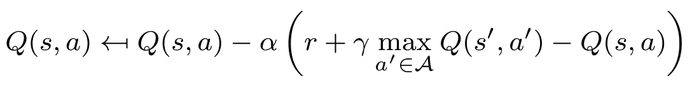
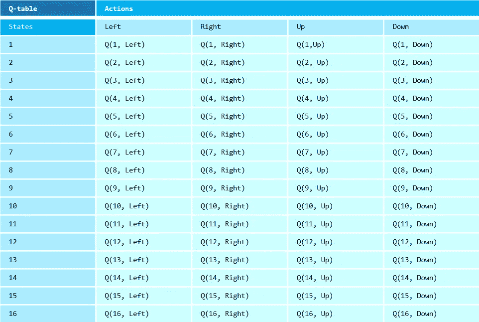
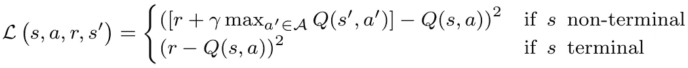

# TensorFlow 2.0 中深度 Q 学习的最小工作示例

> 原文：<https://towardsdatascience.com/a-minimal-working-example-for-deep-q-learning-in-tensorflow-2-0-e0ca8a944d5e?source=collection_archive---------10----------------------->

## 一个多臂土匪的例子来训练一个 Q 网络。使用 TensorFlow，更新过程只需要几行代码


深度，就像深度 Q-learning 一样。克里斯·米凯尔·克里斯特在 [Unsplash](https://unsplash.com?utm_source=medium&utm_medium=referral) 上的照片

深度 Q 学习是任何强化学习(RL)实践者的武器库中的一个主要部分。它巧妙地规避了传统 Q-learning 的一些缺点，并利用神经网络的能力进行复杂值函数的逼近。

本文展示了如何在 TensorFlow 2.0 中实现和训练深度 Q 网络，并以多臂土匪问题(一个终止的一次性游戏)为例进行了说明。还提供了对时间差异学习的一些扩展。不过，我认为极小工作示例中的*【极小】*相当字面上的意思，所以重点是有史以来第一次实现深度 Q 学习。

## 一些背景

在深入学习之前，我假设你已经熟悉了[普通 Q 学习](/walking-off-the-cliff-with-off-policy-reinforcement-learning-7fdbcdfe31ff)和人工神经网络。没有这些基础知识，尝试深度 Q 学习可能会是一次令人沮丧的经历。以下更新机制对您来说应该没有秘密:



Q-learning 的更新函数[1]

传统的 Q-learning 在一个查找表中为每个**状态-动作对**显式存储一个 Q 值——本质上是对累积折扣奖励的估计。当在特定状态下采取行动时，观察到的奖励会提高价值评估。查找表的大小为 *|S|×|A|* ，其中 *S* 为状态空间， *A* 为动作空间。Q-learning 对于玩具大小的问题往往很有效，但是对于更大的问题就不行了。通常，不可能在任何地方观察到所有的状态-行为对。



在 16 格网格上移动的 Q 学习表示例。在这种情况下，有 16*4=64 个状态-动作对，应该学习它们的值 Q(s，a)。[图片由作者提供]

与普通 Q-学习相比，*深度*Q-学习将状态作为输入，通过多个神经网络层，并输出每个动作的 Q 值。深度 q 网络可以被视为一个函数 *f:s→[Q(s,a)]_∀ a ∈ A* 。通过对所有状态采用单一表示，深度 Q 学习能够处理大的状态空间。不过，它预先假定了合理数量的动作，因为每个动作都由输出层中的一个节点表示(大小 *|A|* )。


深度 Q 网络的例子。在本例中，输入是网格(16 个图块)的一键编码，而输出表示四个动作中每个动作的 Q 值。[图片由作者提供]

在通过网络并获得所有动作的 Q 值之后，我们照常继续。为了平衡勘探和开发，我们利用了一个基本的*ϵ*-贪婪政策。通过概率 *1-ϵ* 我们选择最佳动作(输出层上的`argmax`操作)，通过概率 *ϵ* 我们对随机动作进行采样。

## TensorFlow 2.0 实施

在 TensorFlow 中定义 Q 网络并不难。输入维度等于向量状态的长度，输出维度等于动作的数量(如果可行动作的集合是状态相关的，则可以应用掩码)。Q 网络是一种相当简单的神经网络:

在 TensorFlow 2.0 中创建 3 层 Q 网络的示例代码。输入是状态向量，输出是每个动作的 Q 值。

权重更新在很大程度上也是为您处理的，但是您必须向优化器提供一个**损失值**。损失代表*观察值*和*期望值*之间的误差；需要一个可微分的损失函数来正确地执行更新。对于深度 Q 学习，损失函数通常是简单的均方误差。这实际上是 TensorFlow 中的内置损失函数(`loss=‘mse’`)，但我们将在这里使用`GradientTape`功能，跟踪您的所有操作来计算和应用梯度[2]。它提供了更多的灵活性，并且贴近底层数学，这在转向更复杂的 RL 应用时通常是有益的。

均方损失函数(观察与前面提到的更新机制的相似性)表示如下:



深度 Q 学习的均方误差损失函数

深度 Q 学习方法的一般 TensorFlow 实现如下(GradientTape 在水下施展魔法):

深度 Q 学习训练程序概述。

## 多臂土匪

多臂土匪问题是 RL[3]中的经典。它定义了若干吃角子老虎机:每台机器 *i* 都有一个平均收益 *μ_i* 和一个标准差 *σ_i.* 每个决策时刻，你玩一台机器，观察由此产生的奖励。当玩得足够频繁时，你可以估计每台机器的平均回报。不言而喻，最佳策略是玩平均收益最高的老虎机。

让我们把 Q-learning 网络的例子付诸行动(完整的 Github 代码[这里](https://github.com/woutervanheeswijk/example_deep_q_learning))。我们定义了一个具有三个完全连接的 10 节点隐藏层的简单神经网络。作为输入，我们使用值为 1(表示固定状态)的张量作为输入，四个节点(表示每个机器的 Q 值)作为输出。网络权重被初始化，使得所有 Q 值最初都是 0。对于权重更新，我们使用学习率为 0.001 的 Adam 优化器。

下图显示了一些说明性的结果(10，000 次迭代后)。勘探和开发之间的权衡是显而易见的，尤其是在根本不勘探的时候。注意，结果并不过分准确；普通 Q-learning 实际上对这类问题表现得更好。


多臂土匪问题的 q 值和真值。ϵ=0.0(左上)、ϵ=0.01(右上)、ϵ=0.1(左下)和ϵ=1.0(右下)经过 10，000 次迭代后的结果。探索越少，感知的最佳行为越接近。[图片由作者提供]

## 时间差异学习

多臂强盗绝对是一个最小的工作例子，但是只处理了我们没有看到直接回报以外的最终情况。让我们看看如何处理非终结的情况。在这种情况下，我们部署时间差异学习—我们使用 *Q(s '，a')* 来更新 *Q(s，a)* 。

获得对应于下一个状态*s’*的 Q 值本身并不难。你只需将*s’*插入到 Q 网络中，并输出一组 Q 值。总是选择最大值，因为这是 Q 学习而不是 SARSA，并使用它来计算损失函数:

```
next_q_values = tf.stop_gradient(q_network(next_state))    
next_q_value = np.max(next_q_values[0])
```

注意，Q-网络是在一个`**stop_gradient**` 运算符内调用的【4】。提醒一下，`GradientTape`跟踪所有的操作，并且同样会使用`next_state`输入执行(无意义的)更新。使用`stop_gradient`操作符，我们可以安全地利用对应于下一个状态*s’*的 Q 值，而不用担心错误的更新！

## 一些实施说明

虽然上面概述的方法原则上可以直接应用于任何 RL 问题，但您会经常发现性能相当令人失望。即使对于基本问题，如果你的普通 Q 学习实现胜过你的花哨的深度 Q 网络，也不要感到惊讶。一般来说，神经网络需要许多观察来学习一些东西，并且通过为所有可能遇到的状态训练单个网络来固有地丢失一些细节水平。

除了良好的神经网络实践(例如，标准化、一键编码、正确的权重初始化)，以下调整可能会大大提高算法的质量[5]:

*   **小批量**:不是在每次观察后更新网络，而是使用批量观察来更新 Q 网络。稳定性通常通过多次观察的训练来提高。每次观察的损失被简单地平均。`tf.one_hot`掩码可用于多个动作的更新。
*   **经验重放**:建立一个先前观察值的缓冲区(存储为 *s，a，r，s’*元组)，从缓冲区中抽取一个(或多个，当使用迷你批处理时)，并插入 Q 网络。这种方法的主要好处是消除了数据中的相关性。
*   **目标网络**:创建一个只定期更新(比如每 100 次更新)的神经网络副本。目标网络用于计算*Q(s’，a’)*，而原始网络用于确定 *Q(s，a)* 。此过程通常会产生更稳定的更新。

## **外卖**

*   一个**深度 Q 网络**是一个简单的神经网络，以状态向量作为输入，输出对应于每个动作的 Q 值。通过对所有状态使用单一表示，它可以处理比普通 Q-learning(使用查找表)大得多的状态空间。
*   TensorFlow 的`GradientTape`可以用来更新 Q 网络。对应的损失函数是接近原始 Q 学习更新机制的**均方误差**。
*   在**时间差学习**中，基于*Q(s’，a’)*更新 *Q(s，a)* 的估计值。`stop_gradient`算子确保对应于*Q(s’，a’)*的梯度被忽略。
*   深度 Q 学习伴随着一些**实现挑战**。如果香草 Q-learning 实际上表现更好，不要惊慌，特别是对于玩具大小的问题。

*使用多臂盗匪的最小工作示例的 GitHub 代码可以在* [*这里*](https://github.com/woutervanheeswijk/example_deep_q_learning) *找到。*

*想要稳定你的深度 Q 学习算法？下面这篇文章可能会让你感兴趣:*

[](/how-to-model-experience-replay-batch-learning-and-target-networks-c1350db93172) [## 如何对经验重放、批量学习和目标网络进行建模

### 使用 TensorFlow 2.0，快速学习稳定和成功的深度 Q 学习的三个基本技巧

towardsdatascience.com](/how-to-model-experience-replay-batch-learning-and-target-networks-c1350db93172) 

*转而寻求实施政策梯度方法？请检查我的文章与连续和离散情况下的最小工作示例:*

[](/a-minimal-working-example-for-continuous-policy-gradients-in-tensorflow-2-0-d3413ec38c6b) [## TensorFlow 2.0 中连续策略梯度的最小工作示例

### 一个简单的训练高斯演员网络的例子。定义自定义损失函数并应用梯度胶带…

towardsdatascience.com](/a-minimal-working-example-for-continuous-policy-gradients-in-tensorflow-2-0-d3413ec38c6b) [](/a-minimal-working-example-for-discrete-policy-gradients-in-tensorflow-2-0-d6a0d6b1a6d7) [## TensorFlow 2.0 中离散策略梯度的最小工作示例

### 一个训练离散演员网络的多兵种土匪例子。在梯度胶带功能的帮助下…

towardsdatascience.com](/a-minimal-working-example-for-discrete-policy-gradients-in-tensorflow-2-0-d6a0d6b1a6d7) 

## 参考

[1]萨顿，理查德和安德鲁巴尔托。*强化学习:简介*。麻省理工学院出版社，2018。

[2] Rosebrock，A. (2020)使用 TensorFlow 和 GradientTape 来训练 Keras 模型。【https://www.tensorflow.org/api_docs/python/tf/GradientTape 

[3] Ryzhov，I. O .，Frazier，P. I .和 Powell，W. B. (2010 年)。多臂土匪问题中一期前瞻策略的鲁棒性。Procedia 计算机科学，1(1):1635{1644。

[4]TensorFlow (2021)。于 2021 年 7 月 26 日从[https://www.tensorflow.org/api_docs/python/tf/stop_gradient](https://www.tensorflow.org/api_docs/python/tf/stop_gradient)获得

[5]维基百科贡献者(2021)深度 Q-learning。于 2021 年 7 月 26 日从[https://en.wikipedia.org/wiki/Q-learning#Deep_Q-learning](https://en.wikipedia.org/wiki/Q-learning#Deep_Q-learning)获得