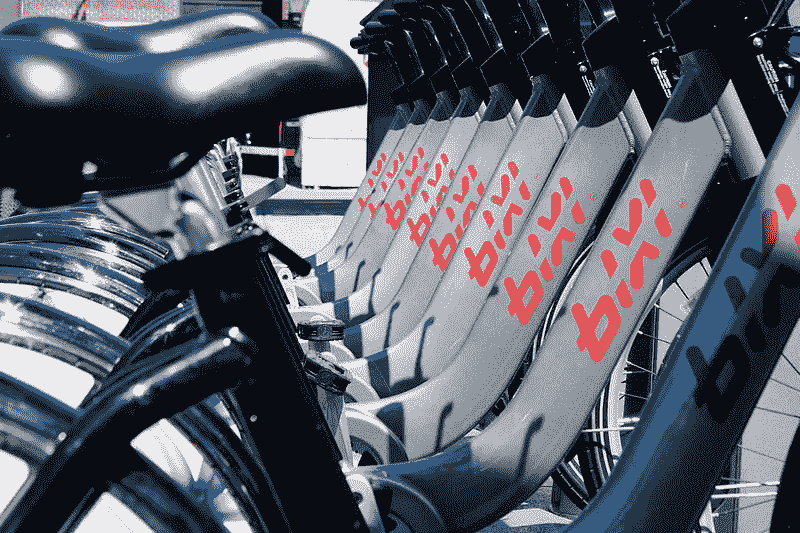
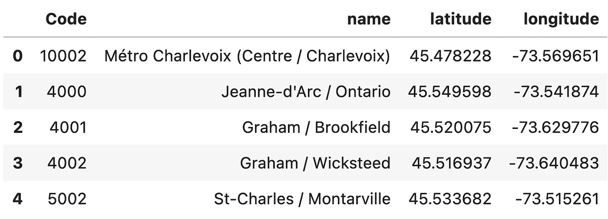
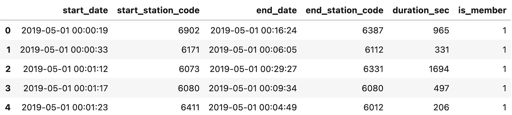
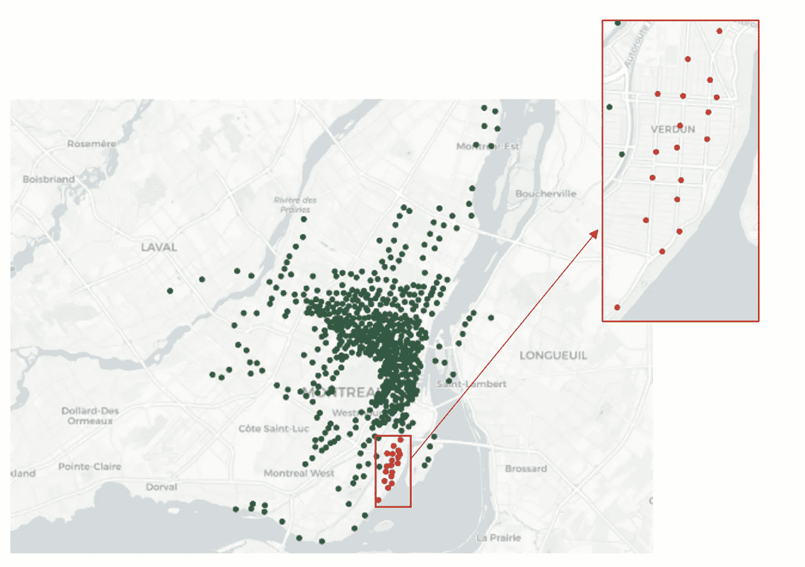
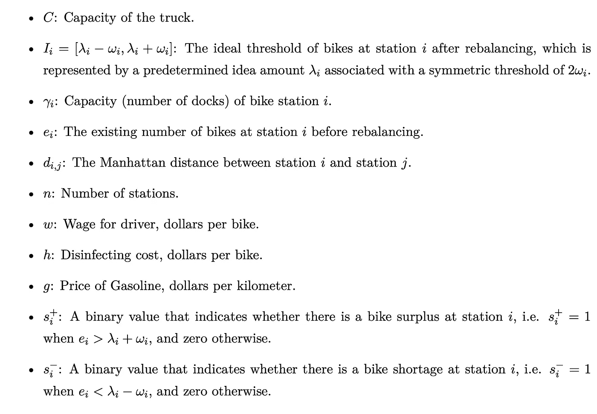
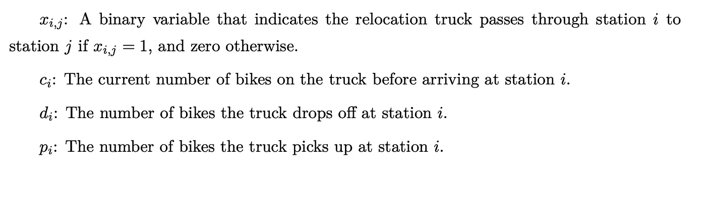
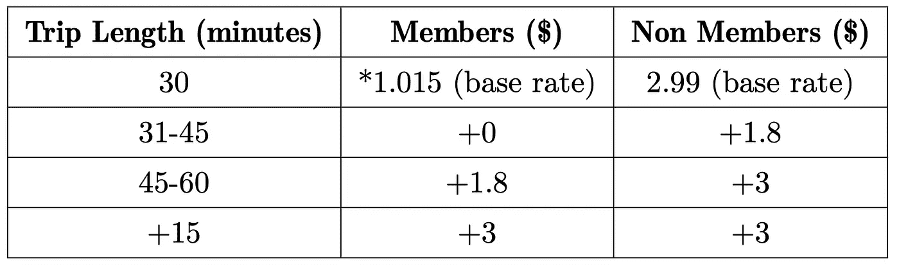
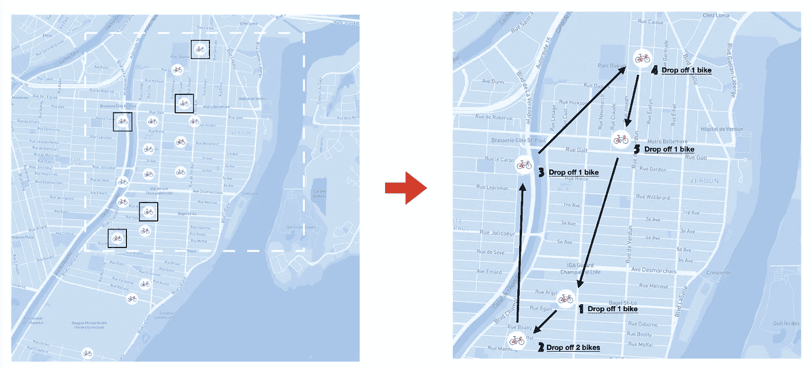
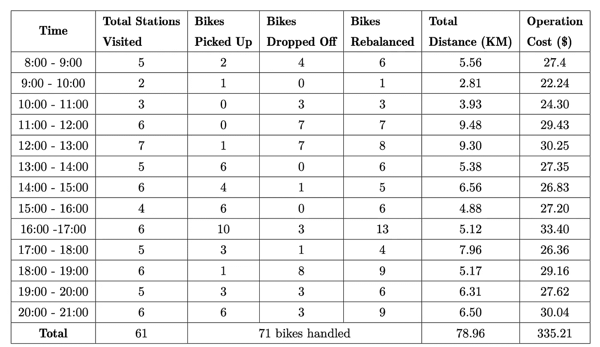
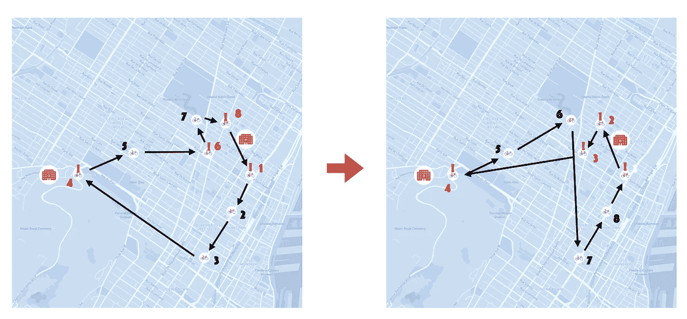

# 自行车共享系统再平衡的混合整数优化方法

> 原文：<https://towardsdatascience.com/a-mixed-integer-optimization-approach-to-rebalancing-a-bike-sharing-system-48d5ad0898bd?source=collection_archive---------16----------------------->

## [实践教程](https://towardsdatascience.com/tagged/hands-on-tutorials)

## 旅行商问题在蒙特利尔碧溪的应用

JsTremblay 在[维基共享资源](https://commons.wikimedia.org/wiki/File:Station_de_v%C3%A9los_Bixi_-_Ville_de_Qu%C3%A9bec.jpg)上的照片

> 时间是 2022 年。加拿大的人口已经完全接种了疫苗，在一个炎热的七月下午，蒙特利尔的公园充满了生机，比西骑手挤满了街道，在老港口的咖啡店之间穿梭，沿着拉钦运河转圈。生活又变得美好了。

[BIXI](https://bixi.com/) 来源于单词“bicycle”和“taXI”，是一个非营利的蒙特利尔公共自行车共享系统，拥有 8000 多辆自行车，分布在岛上的 600 多个车站。BIXI 从每年的 4 月到 11 月开放，它填补了蒙特利尔公共交通系统的一个重要空白，既连接了公共汽车和地铁系统之间的用户，又为短途旅行提供了一种健康、有趣、环保的替代交通工具。客户只需从一个站点取走一辆自行车，以一定的时间和费用租用一段时间，然后返回网络中的另一个站点。然而，由于 BIXI 的成本方案是为短期出行设计的，系统的动态性质可能会造成自行车短缺发生在需求高的位置，而自行车过剩积累在需求低的位置。

战略性地重新分配自行车的能力是 BIXI 客户服务的一个关键决定因素。为了减少自行车共享系统内的潜在失衡，BIXI 的运营商(被称为“司机”)被要求使用卡车将自行车从一个站点重新分配到另一个站点，以便在必要时重新平衡系统。因此，研究 BIXI 如何通过重新平衡自行车来缓解短缺和过剩，从而满足客户不断波动的需求，具有重要的价值。这样做可以确保 BIXI 能够继续吸引更多的骑手，同时最大限度地减少由于系统失衡导致的低效率。

# **设计自行车再平衡策略**

**在这个项目中，我们旨在使用混合整数优化来生成自行车再平衡策略，以满足 BIXI 客户不断变化的需求，同时最大限度地降低运营分销系统所产生的估计成本。**

简而言之，优化问题包括从一系列可用选项中选择最优选项，称为*决策变量*，其中最佳选项是最大化或最小化*目标函数*，同时满足一系列标准，称为*约束*。优化是运营建模的一个基本分支，具有广泛的实际应用，从安排医院人员到帮助亚马逊设计包裹递送的最佳路线。为了创建最佳的 BIXI 再平衡策略，我们的*决策*是找到最佳的时间表和自行车数量来进行再平衡，这将最小化*目标函数*，即 BIXI 的运营成本。为此，我们还需要满足系统*、*施加的各种*约束*，比如一辆卡车一次可以运载的自行车数量。

为了建立模型，我们使用了 [Gurobi 优化求解器](https://www.gurobi.com/)，这是一个用于求解线性、二次和混合整数优化问题的编程工具。Gurobi 支持多种编程语言，我们的模型是用 Python 编写的。请随意查看 Github 的代码。

# **数据和范围**

BIXI 为 2014 年至 2019 年拍摄的所有车站和游乐设施提供[公开可用的记录](https://bixi.com/en/page-27)。这包括每个站点的地理坐标位置，以及用户所有行程的记录，例如行程日期、持续时间以及自行车在哪个站点上车和下车。我们发现，由于自成立以来碧溪的业务大幅扩张，每年的客流量和车站配置都有很大差异。因此，我们采用了 2019 年的最新可用数据作为我们模型的基础。

带有坐标位置的碧溪站名称示例-每个站都有一个唯一的代码。

2019 年 5 月碧溪乘客历史样本

BIXI 系统包括大蒙特利尔地区的 611 个站点；然而，这些车站中的大多数都位于市中心及其周围。为了节省计算时间以及实现现实可行的路线，选择了凡尔登区内覆盖 13.65 km 的 18 个站点作为感兴趣区域。每个车站都有不同数量的自行车停靠站。由于我们无法获得此信息，我们随机生成了每个码头 10-25 辆自行车的估计范围内的码头容量。为了完成凡尔登区的再平衡活动，我们假设一辆载重量为 40 辆自行车的卡车将被分配到有剩余自行车的站点，并将它们运送到有短缺的站点。

蒙特利尔凡尔登区的 18 个碧溪站用作感兴趣区域。

# 模型公式:

基本优化模型是通过量化再平衡系统的运营成本并从乘客的估计收入中减去这些成本来构建的，以最小化组织成本，服从路线和再平衡约束。我们基于经典的**旅行推销员问题(TSP)** 背后的直觉建立了我们的模型，这是一个优化问题，其中“推销员”必须恰好访问一次指定位置的列表，同时选择最短的可能路线并返回到起始位置。

## **参数**

我们首先定义了以下参数以纳入我们的模型:

## **决策变量**

接下来，我们定义了我们的决策变量。这些变量定义了卡车司机必须做出的选择，特别是司机是否会访问一个车站，以及他们将取放多少辆自行车。

## **目标函数**

我们的首要目标是最小化总运营成本，包括每辆自行车的预计自行车消毒成本( *h* )、每公里的汽油成本( *g* )以及卡车司机的固定小时工资( *w* )。这里， *B* 代表被重新定位的自行车数量，而 *D* 代表卡车行驶的总距离。

## **约束条件**

最后，我们构建了两组约束——一组关于所选路线，另一组关于自行车重新平衡——来复制必须满足的各种现实需求。从路线的角度来看，我们调整了旅行推销员问题的约束，以确保在不需要重新平衡时，卡车不需要访问每个车站，因为对于 BIXI，卡车只需要在自行车数量低于或高于我们定义的预定阈值时访问车站。

对于重新平衡的限制，我们需要确保卡车将每个站点重新平衡到其理想水平，并且它不会承载超过其容量的自行车。

要深入了解我们如何解决这个问题，请访问我们的 [Github。](https://github.com/duncan-wang/BIXI-optimization/blob/main/MGSC662_Team_Project_Report.pdf)

## 估计再平衡的成本

为了确保 BIXI 能够保持足够的资金来执行这一重新平衡过程，我们还估算了其运营产生的成本和收入。我们估计重新平衡的成本如下:

*   [卡车司机工资](https://ca.indeed.com/Truck-Driver-jobs-in-Quebec-Province):20.52 美元/小时
*   [新冠肺炎自行车消毒费用](https://bixi.com/en/info-covid-19):0.875 美元/辆
*   [燃料成本](https://www150.statcan.gc.ca/t1/tbl1/en/tv.action?pid=1810000101):1.256 美元/升
*   预计燃油效率:4.25 公里/升
*   旅行价格(燃料成本*效率):0.294 美元/公里

## 估计乘客的收入

通过将每次出行的成本乘以会员与非会员出行的次数，可以估算出感兴趣区域每天和每周的乘客总收入。虽然 BIXI 提供额外的折扣和套餐，但数据并未区分这些旅行，因此所有旅行最终都归入以下费用方案:

会员与非会员旅行的费用方案。请注意，在一定时间后，每增加 15 分钟，将收取 3 美元的费用。

## 把所有的东西放在一起！

模型公式是使用 Gurobi 9.1 和 Python 3.7 完成的。总之，我们定义了四个主要的决策变量，涉及(1)卡车是否会在站点之间行驶，(2)在到达站点之前它载有多少辆自行车，(3)它卸下的自行车数量，以及(4)它装载的自行车数量。该模型随后选择最佳决策，使得与再平衡相关联的成本最小化，同时确保路线选择和再平衡约束保持满足。

# 结果

一旦模型建立起来，我们就可以通过将乘客数据(每个站点的自行车接送)输入到模型中来模拟和评估它在任何给定时间的性能。该模型以每小时为基础进行重复评估，由此在每小时开始时更新自行车流，并随后为该小时生成重新平衡路线和决策。

2019 年 7 月 8 日上午 8:00-9:00 凡尔登碧溪站模拟自行车再平衡操作结果。

为了让我们一窥每小时的再平衡系统会是什么样子，我们创建了一个地图，展示了 7 月 8 日 8:00-9:00 卡车的移动。我们看到，在这一小时内，总共有 5 个站点需要重新平衡。当卡车到达车站(1)时，我们假设它装载了 20 辆自行车(总容量的一半)。然后，在站点 2，卡车装载了两辆自行车，这意味着在此点之前站点一定已经超过了理想容量上限。到达站点 3 时，卡车现在装载了 22 辆自行车，随后卸下了一辆自行车，这意味着站点 3 低于其理想容量下限。在第 4 站，卡车现在载有 21 辆自行车，并卸下两辆，在第 5 站，它载有 19 辆自行车，并卸下一辆。然后，卡车返回 1 号站，该小时的再平衡任务完成。从下面的图表中我们可以看到，在这一小时内，总共行驶了 **5.56 公里**， **6 辆自行车**重新平衡，费用为**27.40 美元**。

2019 年 7 月 8 日卡车再平衡计划的逐小时结果

为了跟踪再平衡进度，我们计算了从 8:00 到 20:00 每小时开始时的净差异，因为这些时间被视为 BIXI 接送最活跃的时间。如果我们全天运行该模型，我们会发现成本最高的时间是从 16:00 到 17:00，在这一时间需要重新分配 10 辆自行车。中午 12:00-13:00 是第二昂贵的时间；然而，这似乎与行驶的距离更大有关，而不是重新分配的自行车数量。从逻辑上讲，这些繁忙时间对于所选的时间段是有意义的，因为从 16:00 到 17:00，客户将使用该服务下班回家，而从 12:00 到 13:00，客户可能在午餐休息时间使用该服务。

# **新冠肺炎扩展:优先考虑重要员工的自行车出行**

随着最近的新冠肺炎疫情，企业不得不彻底发展其业务模式，以适应不断变化的条件和新出现的客户需求。自行车共享系统也不例外。在疫情开始时，BIXI 经历了基本卫生保健工作者的乘车人数的增加，为了满足这些需求，BIXI 开始向基本工作者提供 30 天的免费会员资格。

基于这一信息，我们通过优先考虑医院附近的自行车可用性来探索原始模型的扩展，以确保医护人员能够获得自行车。为了做到这一点，我们修改了原始的优化问题，在系统的一个新的子区域内为医院增加了一个必需的子行程。基本上，卡车将被要求依次访问医院附近的所有站点，以确保首先满足医院工作人员的需求，然后再前往该地区的其他站点。对于扩建，我们选择了蒙特利尔市中心的一个子区域，该区域包括 57 个车站和 6.07 km 的面积，包括西端的蒙特利尔神经医院(Neuro)和东端的蒙特利尔大学医院中心(CHUM)。CHUM 周围的三个站和 Neuro 周围的七个站被选择作为预定义的子旅程，并且起始站也被设置为 CHUM 医院附近的优先站之一。

[虽然最近的一项研究](https://www.mdpi.com/2076-3417/10/10/3502)在更复杂的环境中提出了类似的想法，但我们通过添加以下两个约束条件实现了具有优先级的路线选择解决方案，其中，ℙ表示一组优先站点，ℝ表示一组常规站点。

约束(3.1)确保卡车在离开起始优先站之后首先访问优先站，约束(3.2)保证从优先站到常规站的访问不超过一次。只有当所有优先站都已被服务并且随后有后续常规站要被服务时，才发生该动作。注意，当需要重新平衡的所有站都是优先站时，约束(3.2)是非绑定的。

以下两张地图显示了添加优先级约束后路线的变化情况:

不添加(左)和添加(右)医院附近车站优先访问限制的路线。

通过添加这组约束，我们观察到卡车仍然能够满足每小时的重新平衡需求，但是正如预期的那样，访问的顺序发生了变化，因此首先访问每个选定的医院站。例如，通过在 2019 年 7 月 8 日 12:00- 13:00 运行一次再平衡迭代，观察到距离从 **6.97 km** 增加到 **7.62 km** ，表示相关成本从**33.94 美元**增加到**40.14 美元**。有趣的是，计算复杂度也显著增加；基本模型的求解时间不到 1 秒，而具有优先级约束的 1 小时相等时间段的求解时间为 36.84 秒。考虑到蒙特利尔有超过 10 个主要的健康网络，并且许多网络有几个分支，当考虑是否进行这样的操作时，每小时再平衡成本和计算强度的这种潜在增加不是微不足道的。

# 最后的想法

这个项目的目标是利用 BIXI 的开放访问历史乘客数据集来模拟自行车的持续再平衡对于保持系统平稳运行和满足自行车需求是多么必要，同时满足 BIXI 的底线。

实际上，BIXI 的自行车再平衡系统可能要复杂得多，例如，自行车再平衡要求的阈值可能是通过考虑天气、人口密度、一天中的时间和交通等因素的算法生成的。我们为再平衡选择固定阈值的假设显然没有捕捉到可能影响再平衡决策的全部潜在变量。此外，虽然我们创建了固定的边界区域，卡车只能在这些区域内运行，但 BIXI 通常会部署多辆卡车，在整个岛屿上灵活行驶，从而更容易处理波动的需求。我们还大大简化了成本和费用的估算，因为 BIXI 还会产生营销、管理和数据收集费用。因此，我们的模型不能从企业整体的成功来解释，而只能从模拟的再平衡过程的有效性来解释。

总的来说，我们的分析旨在通过使用混合整数规划技术来优化自行车的再平衡，以满足预期需求，缓解系统中的过剩和短缺，并保持成本效益，从而深入了解蒙特利尔的 BIXI 自行车共享运营。虽然我们只关注了几个选定的地区和时间段，但所创建的模型是可扩展的，可以扩展到其他行政区或时间段。通过提供对维持这样一个动态系统的要求的关键见解，我们最终试图证明蒙特利尔岛上存在进一步提高友好和高效的交通共享运输系统的价值的机会。

如果您想分享任何想法，请随时在 Linkedin 上联系我们。

## **其他资源:**

*   [碧溪开源数据](https://bixi.com/en/page-27)
*   [Github 库](https://github.com/duncan-wang/BIXI-optimization)

## 关于我们的更多信息:

<https://www.linkedin.com/in/duncan-w/>  <https://www.linkedin.com/in/hannaswail/>  <https://www.linkedin.com/in/beiqizhou/>  <https://www.linkedin.com/in/tzhang96/> 