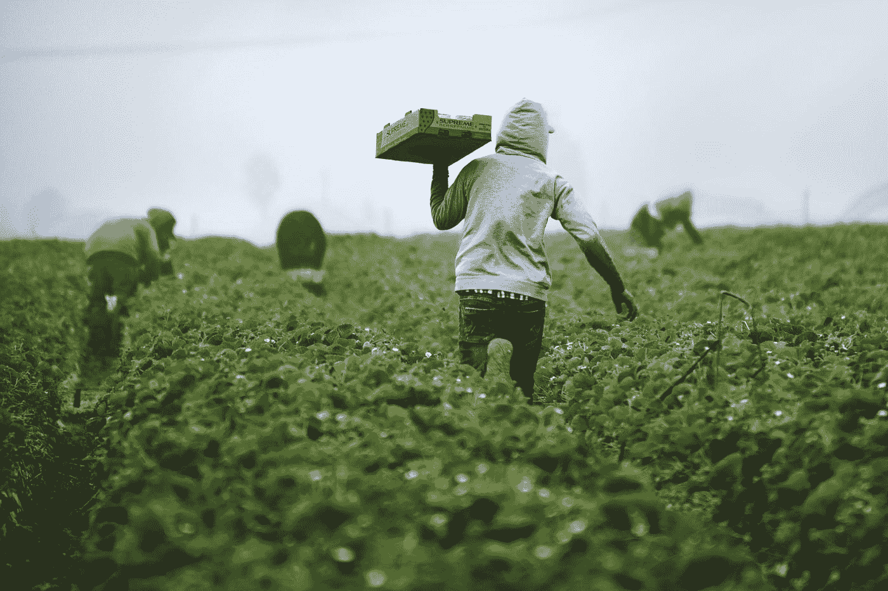
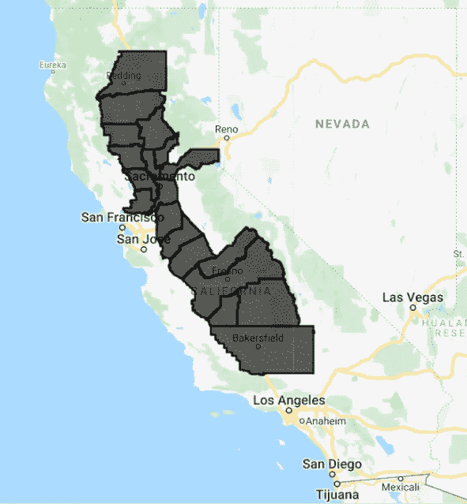
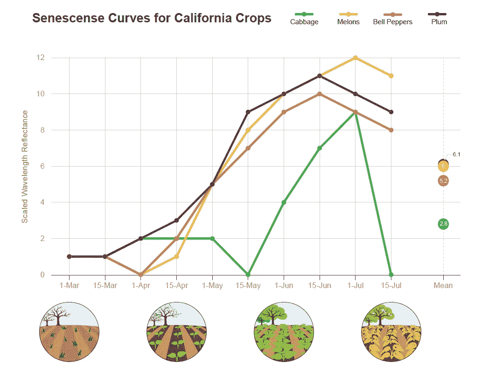
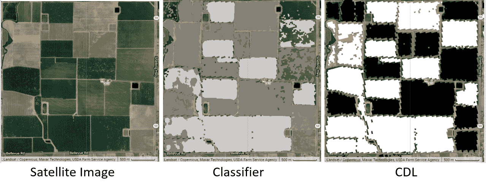
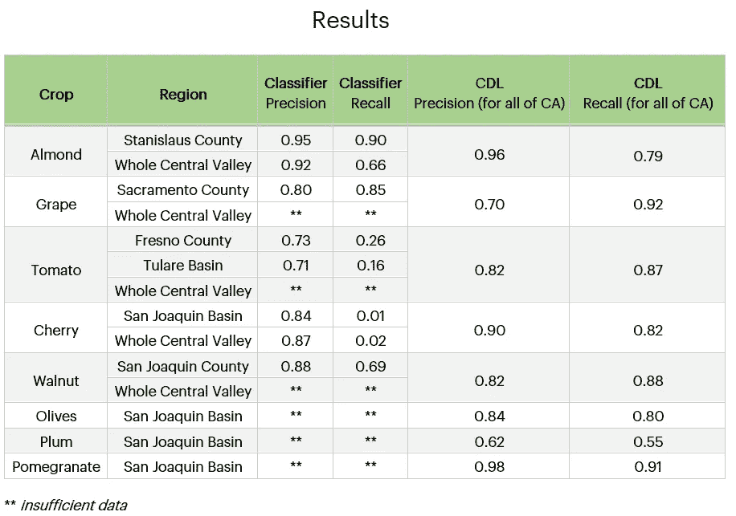

# 一种更容易获得和复制的方法，用于加利福尼亚人工收割作物的卫星制图

> 原文：<https://towardsdatascience.com/a-more-accessible-and-replicable-method-for-satellite-based-mapping-of-hand-harvested-crops-in-6243b8fb82dc?source=collection_archive---------23----------------------->

## [变更数据](https://towardsdatascience.com/tagged/data-for-change)

在整体粮食安全、可负担得起的农产品的可用性和美国农业劳动力短缺之间的密切联系的推动下，洛克菲勒基金会的统计和机器学习团队看到了一个为手收作物开发一种可访问和可复制的早期绘图工具的机会。仍在开发中的手工收割作物制图项目旨在创造一种工具，仅使用卫星图像来了解手工收割作物的产量变化。最佳替代方案是美国农业部农田数据层(CDL ),它使用包括私人来源在内的许多数据层输入，主要关注主要作物，直到第二年早春才发布。迄今为止，我们的模型相对于 CDL 有所改进:它完全基于公开可用的数据，它适用于一次一种作物和一个地区，并且它从同年 8 月开始在加利福尼亚州运行，同时提供与 CDL 相比略有下降的准确性。本博客重点关注动机、方法和迄今为止的发现，但深度学习模型和该模型的扩展方面的工作仍在继续。

**我们的方法:预见生产挑战**

绘制手工收割作物地图的最初动机来自疫情之初，当时有关边境关闭、国内旅行限制、学校关闭等消息表明农业工人短缺进一步加剧。在疫情开始之前，劳动力已经存在基线缺口——2019 年，加州农场局联合会和加州大学戴维斯分校的一项研究发现，在过去的五年里，加州 56%的受访农民无法获得所需的全部劳动力。当新冠肺炎封锁在美国开始时，各地的劳动者都面临着一个艰难的决定，即是否要冒着暴露于病毒的风险去上班和工作，通常是与他人密切接触。根据 [2018 年全国农业工人调查](https://www.dol.gov/sites/dolgov/files/ETA/naws/pdfs/NAWS_Research_Report_13.pdf)，在出生于墨西哥的美国农场工人中，69%的人季节性迁移，这些人受到封闭的陆地边界和关闭的美国领事馆的进一步挑战。对于生活在美国、有孩子但没有强大支持网络的员工来说，要么呆在家里，要么努力为失学的孩子找到一个不太可能负担得起的托儿服务，这两者之间的选择增加了额外的复杂性。这些和其他因素都导致不工作的决定，加剧了现有的劳动力短缺，给依赖工人收获作物的生产者带来了巨大的不确定性。

受这种短缺影响的手工收获的作物是洛克菲勒基金会食品倡议组织称之为[“保护性食品”](https://www.rockefellerfoundation.org/blog/focusing-protective-foods-reduce-global-burden-disease/)的更广泛食品的一部分——这些食品有助于预防和保护与饮食有关的疾病，根据[健康指标和评估研究所的全球疾病负担研究](http://www.healthdata.org/gbd/2019)，这是美国最大的死亡原因。虽然许多食物可以起到保护作用，但即使对于最脆弱的家庭来说，水果和蔬菜也是最容易获得和负担得起的。在 2018 年美国最常购买的二十种水果和二十种最常购买的蔬菜中， [14 和 10 分别是手工收获的](https://www.pma.com/content/articles/top-20-fruits-and-vegetables-sold-in-the-us)，包括苹果、核果、柑橘、浆果、西红柿和蔬菜等农产品。手工收割作物产量减少意味着价格上涨和供应减少，限制了最弱势群体获得这些食物。因此，理解手工收获的食品生产系统——并跟踪生产的变化——感觉与我们在洛克菲勒基金会推广保护性饮食的工作密切相关。

蒂姆·莫斯霍尔德在 [Unsplash](https://unsplash.com?utm_source=medium&utm_medium=referral) 上拍摄的加州草莓采摘者的照片

作为食品和遥感领域的首席数据科学家，我假设加剧的劳动力短缺以及其他压力因素(不可预测的市场、重大野火等)。)可能会导致生产者在 2020 年或 2021 年不冒险种植。这些大规模决策可能会导致产量大幅下降，从而影响美国最弱势群体获得高营养食品的能力。基于遥感的制图非常适合这种假设检验，因为数据存在于大规模数据中，可追溯到多年前，分辨率允许在整个区域范围内以 10 米乘 10 米的比例进行分类。我把重点放在加州中央谷，因为根据加州农业部的数据，这里生产蔬菜的⅓，水果和坚果的⅔，以及美国 90%以上的葡萄、李子、橄榄、杏仁、开心果和其他作物。该山谷以西部的海岸山脉和东部的内华达山脉为界，总长度为 450 英里(720 公里)，宽 50 英里(80 公里)，相当于约 18，000 平方英里(47，000 平方公里)和约 4.7 亿个要分类的“地块”或像素。前面的文档描述了我迄今为止的方法和结果。

加州县与中央山谷重叠，在谷歌地球引擎中可视化。

**方法:准备随机森林分类器**

为了完成这项任务，我首先选择了一种作物分类方法。随机森林长期以来一直是遥感工作的主要内容，因为它相对简单，并且具有高数据维度和多重共线性[——光学遥感数据的两个基本特征](https://www.sciencedirect.com/science/article/abs/pii/S0924271616000265)。虽然深度学习模型因其突破性见解和提高准确性的潜力而受到极大关注，但随机森林始终是测试的基线，因此是一个合理的起点。其次，我决定首先专注于创建一个二元随机森林分类器，原因很简单，只要分类器能够识别感兴趣的作物，其余的土地覆盖是什么就无关紧要了。从整体系统的角度来看，周围区域的土地覆盖总是很重要的，但是由于多类分类器在任何一种作物的确定性较低时通常倾向于像主粮这样的高覆盖作物，因此本项目中感兴趣的目标作物可能会被低估-因此，二元分类是一个合理的起点。

鉴于 Rockefeller Foundation 没有手收作物位置的现有样本集，并且由于疫情期间不可能进行野外工作，我选择从美国农业部的历史农田数据图层分类中进行采样作为替代。如前所述，CDL 每年都会为整个美国创建一张最有可能种植作物的地图，并报告分类以及每个像素的分类概率。虽然这种分类对主要作物表现更好，但它是更可靠数据或定制数据收集的良好替代品。对于每个训练集，我首先从聚焦区域内的 CDL 中采样 10，000 个像素，并过滤掉 80%或更高置信度的像素。我将这些样本分类重新映射为目标作物或非目标作物的二元分类，然后使用这些像素位置对卫星图像进行采样。

对于不熟悉卫星图像的读者来说，术语“卫星图像”可能有点误导——特定时间和位置的每个“图像”都是一组光栅“波段”，用于捕捉特定波长的反射阳光强度和反射率。因此，使用卫星影像需要转换和操作多个栅格堆栈，这将在本文稍后简要介绍。下面是卫星图像波段堆栈和单个像素样本的几何图形的可视化:

仙黛尔·诺顿编写

对于这项工作，我选择 Sentinel-2 作为光学数据，Sentinel-1 作为雷达数据，因为它们重复次数多，分辨率高，有历史数据，可以自由访问。我有意只选择两个来源来创建最精简、最可复制的模型；作为参考，CDL 农田数据层使用来自戴莫斯-1 和英国-DMC-2(两者都是欧洲星座中的有限接入卫星)、哨兵-2、陆地资源卫星 8 和资源卫星 2 的产品，以及美国地质调查局土地覆盖层和美国农业部 CDL 层基于[2019 年文档。](https://www.nass.usda.gov/Research_and_Science/Cropland/metadata/metadata_ca19.htm)

许多土地分类可以简单地用来自精选卫星源的单一精选图像来完成——例如，对城市公园进行分类，并挑选植物生长的图像。然而，由于许多植物在一年中的某些时间在光谱带上具有非常相似的值，物种和作物分类问题通常需要与衰老曲线相关的时间序列信息，衰老曲线涉及植物的逐渐变绿，然后随着叶绿素的产生而变褐，然后死亡。在不同的光谱带，尤其是近红外光谱，这条曲线通常会显示为读数变亮，然后变暗，因为叶绿素在高强度下反射某些波长。因为不是所有的植物都在完全相同的时间长出叶子或产生相同面积的叶子和相同体积的叶绿素，衰老曲线的特征可以是非常有用的，甚至是唯一的标识符。对整个季节的值取平均值是一个强大的转换，可以大大减少数据量，同时捕捉曲线的本质。应用这个来准备 Sentinel-2 的图像，我用 QA60 cloudmask 波段遮蔽了云层，然后对 3 月初至 7 月底的所有图像进行平均。这一时间框架抓住了中央山谷的夏季生长季节，许多作物在 3 月种植或转移到外面，7 月收获。在每个像素处取平均值显著地将数据集的大小从大约十个 Sentinel-2 图像(每两周捕获一次)减少到仅仅一个，减少了噪声并有助于捕获独特的衰老曲线特征。尽管 Sentinel-1 图像数据作为合成孔径雷达(SAR)卫星产品有着根本的不同，但出于类似的原因，它也被平均化。下面是一个例子，说明在加利福尼亚的整个生长季节，单个像素上的单个虚构光学波段如何变化，以及在遥感工作中，作物的生物物理变化如何转化为衰老平均值。

仙黛尔·诺顿编写

在上面想象的场景中，这些田地自上一季以来就没有被开垦过，可能有少量的杂草生长；李树还没有叶子。在室外种植甜椒、甜瓜和卷心菜之前，将对土地进行翻耕——这将吸收光线的潮湿土壤带到表面，因此降低了卫星观测到的反射率。在主要作物入土并且树木作物开始开花并长出叶子后，植物将显著增加它们的叶面积和叶绿素含量，增加反射率，直到接近收获时达到峰值。之后，植物会枯死，松散的叶子和卷心菜、甜瓜和甜椒地会被翻耕，反射率会下降。在这个模拟示例中，您可以看到，虽然大多数作物在六月底左右有一个相似的高峰期，但它们各自的曲线是独特的。当我们平均整个季节的反射率值时，每种作物都有一个独特的值，这是曲线本身的一个相当独特的 ID-李子 6.1 最高，卷心菜 2.8 最低。这项工作中使用的所有波段的唯一 id 组合产生了每种作物的唯一 id 向量。

接下来，我从采样波段中准备了一些指数，用于对 Sentinel-1 和 Sentinel-2 准备的影像进行实验，并使用随机森林模型来确定重要变量，这极大地有助于模型开发过程，尤其是减少准备的数据集的大小。为了了解处理的数据量，在中央山谷所有像素使用的所有波段和所有日期的图像派生指数之间，大约有 3000 亿个数据点。最终使用的波段和指数为蓝色、Sentinel-2 观测的角度、作物残留覆盖指数(CRC)、归一化燃烧指数(NBR)、使用红色代替近红外的绿色叶绿素植被指数(GCVI)以及使用 Sentinel-1 的精细 Lee 滤波器的 VH 多极化波长斑点测量。样本按县、流域(代表覆盖流域流域的 3-4 个县)或 2019 年整个中央流域准备。这些样本被送入随机森林，该森林使用了 160 棵树，并将 2018 年图像的内核减少到 5 个像素正方形，即 50 米乘 50 米的瓦片。Kern、Glenn、Butte 和 Tehama 县被排除在外，因为它们在 EE 中返回了错误，而 Shasta 被排除在外，因为它在中央山谷中包含如此少量的农业像素。随机森林的可视化如下所示，其中样本向量输入向量包括单波长观测值和如上所述的整个生长季节的平均指数:

仙黛尔·诺顿编写

然后使用 2019 年相应测试年的 CDL 评估按县分类的结果影像，仅包括置信度为 80%或更高的像素。下图显示的是加利福尼亚州同一区域的田地，仅包含卫星影像、分类器输出和用于参考的杏树 CDL 分类(其中杏树在分类器影像中为浅灰色，在 CDL 影像中为白色)-请注意，分类很接近，但并不完全相同。精度和召回被用来评估分类器的性能对 CDL，它只报告精度和召回在国家一级。并非所有作物都有足够的数据用于分类器——许多不太常见的手工收割的作物，或者在*特定区域*不太常见的作物，不能用于建模。例如，圣华金县的樱桃代表 1，063，300 个像素中的 62，617 个像素，约占高可信度农业像素景观的 5.9%，但返回的结果较差，这与杏仁的 186，400 个像素相比相形见绌，杏仁约占圣华金高可信度农业景观的 17.5%，建模效果非常好。

由 Madeline Lisaius 使用谷歌地球引擎编写

**结果、观察和结论**

从上表中可以看出，数据丰富的坚果作物，尤其是杏仁，在所观察的县和日期表现非常好。相比之下，数据越少的作物——葡萄、西红柿和樱桃——表现越差，部分原因是它们用于训练的数据越少，部分原因是用于分类的像素数量(与覆盖率更高的杏树相比)非常少，有时超过 1000 万个像素中只有 10，000 个像素。这些结果是初步的，但是它们给出了与 CDL 相比该模型的功效的感觉。

总的来说，我们所描述的模型在许多情况下在 CDL 的范围内执行，其优点是仅使用公共数据，能够在同年 8 月开始运行，并且公开可用。然而，有许多可能的扩展和改进途径，可以使这种模式高效地扩展到更多的作物。最有效但劳动密集型的方法之一是通过亲自实地考察或从种植者处获得参考坐标来收集感兴趣作物的样本。这将通过在 CDL 采样框架之外增加高置信度数据来增加可以成功建模的作物数量。虽然自举数据是一种选择，但在特定生长条件下的物种生理——转化为跨波长的独特遥感光谱特征集——不容易模拟，因此应谨慎使用这种方法。改进模型的下一步将是增加一层再处理，以去除分类图像中的斑点像素，这将提高召回率和精确度。

该模型本身还没有实现更高层次的目标，即能够以必要的精度在田间水平上精确地测量手工收获作物的种植和生长面积的变化。尽管如此，我们对这一模型的潜力感到非常兴奋，与 CDL 相比，这是一种更轻便、更容易理解作物，尤其是非主粮作物的方法。随着更多的工作，该模型可以更精确地用于目标地区，在这些地区，比例过高或过低的农民正在改变行为以应对冲击，作为一种工具来确定投资目标和确定学习机会。该模型还可以用来预测大规模和特定的粮食生产的变化。由于气候变化和长期劳动力趋势，加州和其他生产手工收割作物的地区面临越来越多的困难，了解景观水平的变化对于了解美国营养食品的供应比以往任何时候都更加重要。该工具的未来版本和其他版本可能有助于提供见解，这些见解可以补充农场工人、农民和其他利益相关者的生活经验，从而就如何保护性地养活美国提供整体和微妙的观点。