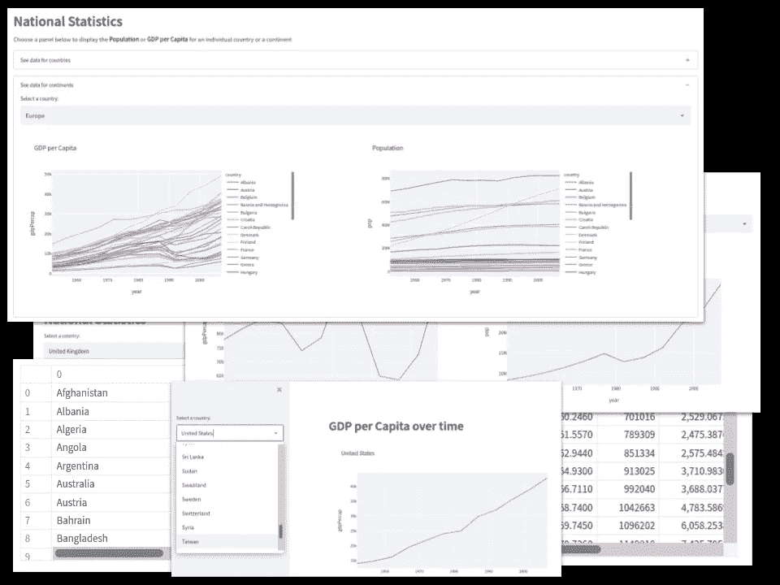
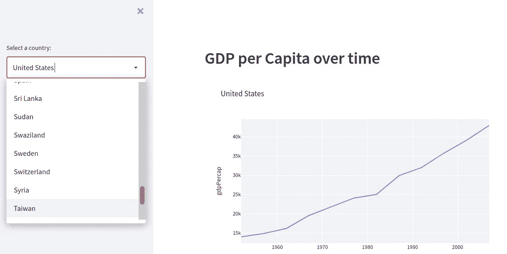
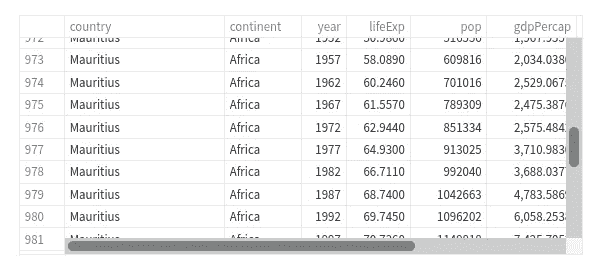
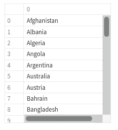
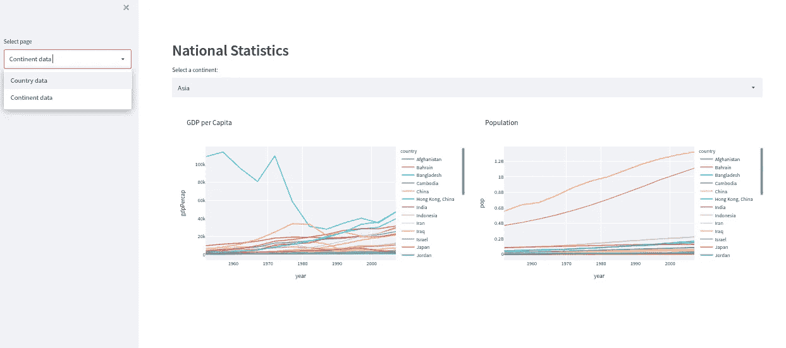
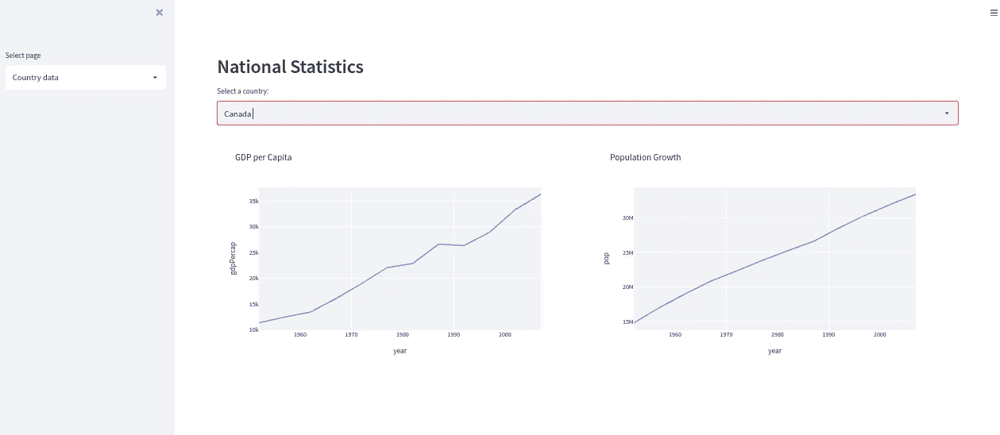

# 具有 Streamlit 和 Plotly 的多页交互式仪表板

> 原文：<https://towardsdatascience.com/a-multi-page-interactive-dashboard-with-streamlit-and-plotly-c3182443871a?source=collection_archive---------4----------------------->

## 数据可视化

## Streamlit 使漂亮的交互式多页仪表板变得简单



Streamlit 应用非常简洁——图片由作者提供

Streamlit 的伟大之处在于，它不仅漂亮，而且简单。

几个月前，我写了一篇关于如何使用 Plotly 和 Flask 编写仪表板的文章——这是使用 Dash 的替代方法，我对此非常满意。这个应用程序由两个文件组成，一个 20 多行的 Python/Flask 应用程序和一个近 30 行的 HTML/Javascript 文件。你可以在这里看到这篇文章:

[](/an-interactive-web-dashboard-with-plotly-and-flask-c365cdec5e3f) [## 使用 Plotly 和 Flask 的交互式 Web 仪表板

towardsdatascience.com](/an-interactive-web-dashboard-with-plotly-and-flask-c365cdec5e3f) 

然后我决定尝试使用 Streamlit 实现同样的东西:结果是一个大约十几行的 Python 文件。四分之一大小！不仅写起来简单快捷，而且看起来也更好看。

因此，我想分享我的经验，首先，创建一个简单的交互式 Streamlit 应用程序和 Plotly 图表，然后将它开发成一个更复杂(但仍然简单)的多页应用程序。在这个过程中，我研究了如何绘制 Plotly 图表、在 Streamlit 中控制布局以及使用下拉菜单导航。

第一个应用程序将是我的 Flask 应用程序的克隆，看起来像这样:



作者简单的 Streamlit 应用程序图片

用户从左边的下拉菜单中选择一个国家，并在右边绘制相应的图表。

Streamlit 应用程序只是一个 Python 程序，它使用 Streamlit 库，并在终端窗口中使用 Streamlit 命令运行。例如

```
streamlit run myapp.py
```

然后它会启动你的浏览器并运行应用程序。

不过，首先要做的是。要使用 Streamlit，您显然必须安装它:

```
pip3 install streamlit
```

或者其他任何你用来安装 Python 包的神秘方法。

## 简单的 Streamlit 应用程序

你用类似这样的东西开始你的 Python 程序:

```
import streamlit as st
import pandas as pd
import plotly.express as px
```

我将使用 Pandas 来存储和操作数据，并绘制图表。

出于演示的目的，我使用 Plotly 包中包含的 Gapminder 数据。所以，下一段代码是:

```
df = pd.DataFrame(px.data.gapminder())
```

这将创建一个数据帧，其中包含一个关于世界上所有国家的信息表，如下所示:



国家数据-按作者分类的图像

表中列出了每个国家，以及几十年来的预期寿命、人口和人均 GDP 数据。也给出了每个国家的大陆(也有其他数据，但这里不感兴趣)。

我们最初要做的是创建一个选定国家的人口和人均 GDP 的图表。因此，我们需要一个国家名称列表，用户可以从中进行选择。这可以通过从数据框中选择 country 列并创建一个唯一名称列表来轻松实现。

```
clist = df['country'].unique()
```

运行之后，我们在变量`clist`中有一个唯一名称的列表。



国家列表-作者图片

下拉菜单是在`clist`的侧边栏中创建的，如下所示:

```
country = st.sidebar.selectbox("Select a country:",clist)
```

所有的 Streamlit 函数都以`st`开始。`st.sidebar`在屏幕左侧创建一个侧边栏，`.selectbox`使用第一个参数中提供的提示从列表中创建一个下拉列表。

接下来我们画图表。

```
fig = px.line(df[df['country'] == country], 
    x = "year", y = "gdpPercap", title = country)
```

在这里，您可以看到我们在变量`fig`中创建了一个折线图，只选择数据框中与所选国家对应的行。

整个程序如下所示，正如我前面提到的，它只有十几行代码。

```
import streamlit as st
import pandas as pd
import plotly.express as pxdf = pd.DataFrame(px.data.gapminder())
clist = df['country'].unique()country = st.sidebar.selectbox("Select a country:",clist)st.header("GDP per Capita over time")fig = px.line(df[df['country'] == country], 
    x = "year", y = "gdpPercap", title = country)
st.plotly_chart(fig)
```

有几行我还没讲过。`st.header("GDP per Capita over time")`创建标题，`st.plotly_chart(fig)`绘制图表。

当我们运行这个程序时，我们得到了这个:


作者简单的 Streamlit 应用程序图片

我认为，对于这样一个小程序来说，这已经很不错了。

但事情会变得更好。

## 多页应用程序

我努力说服自己，我可以像使用 Dash 一样轻松地使用 Flask 和 HTML 制作应用程序，作为努力的一部分，我创建了一个简单的多页面应用程序，每个页面使用相同的 HTML 模板，但从 Flask 加载不同的数据。你可以在这里看到这篇文章:

[](/web-visualization-with-plotly-and-flask-3660abf9c946) [## 用 Plotly 和 Flask 实现 Web 可视化。

towardsdatascience.com](/web-visualization-with-plotly-and-flask-3660abf9c946) 

Streamlit 的情况就不同了。没有对多页面特定支持，我猜这不是一个遗漏。Streamlit 并不意味着创建完整的网站。

但有时一点分页是有用的，所以我写了一个新的应用程序，它在第一个基础上扩展，提供更多信息，并在两个页面上运行。看起来也更好看！

我们的目标是拥有两个页面，一个针对国家，另一个针对大洲。在每一页上，你可以选择一个国家或洲，你会得到两个图表，一个是 GDP，另一个是人口。你可以在下面看到大陆页面的样子。



作者提供的多页 Streamlit 应用程序图片

实际上，也许你看不太清楚，所以这是页面左侧的放大图。


来自多页 Streamlit 应用程序的详细信息-作者图片

左侧是带有下拉菜单的侧栏，您可以在其中选择*国家*或*洲*。页面的主要部分包含图表，并有自己的下拉菜单来选择哪个洲(欧洲、亚洲等)。)或者哪个国家。

国家页面看起来像这样。



作者提供的多页 Streamlit 应用程序图片

这个方法很简单。只需在`if… else…`语句中使用侧边栏下拉菜单返回的值，并在`if`块或`else`块中显示适当的数据。代码如下所示:

```
page = st.sidebar.selectbox('Select page',
  ['Country data','Continent data'])if page == 'Country data':
  # Display the country content here
else:
  # Display the continent content here
```

我使用分栏来并排显示图表，我将布局设置为 wide 以给自己多一点空间。

除此之外，替换这些注释的代码与我们在第一个例子中看到的非常相似。

以下是完整列表:

```
import streamlit as st
import pandas as pd
import plotly.express as pxst.set_page_config(layout = "wide")df = pd.DataFrame(px.data.gapminder())st.header("National Statistics")page = st.sidebar.selectbox('Select page',
  ['Country data','Continent data'])if page == 'Country data':
  ## Countries
  clist = df['country'].unique() country = st.selectbox("Select a country:",clist) col1, col2 = st.columns(2) fig = px.line(df[df['country'] == country], 
    x = "year", y = "gdpPercap",title = "GDP per Capita")

  col1.plotly_chart(fig,use_container_width = True) fig = px.line(df[df['country'] == country], 
    x = "year", y = "pop",title = "Population Growth")

  col2.plotly_chart(fig,use_container_width = True)else:
  ## Continents
  contlist = df['continent'].unique()

  continent = st.selectbox("Select a continent:",contlist) col1,col2 = st.columns(2) fig = px.line(df[df['continent'] == continent], 
    x = "year", y = "gdpPercap",
    title = "GDP per Capita",color = 'country')

  col1.plotly_chart(fig) fig = px.line(df[df['continent'] == continent], 
    x = "year", y = "pop",
    title = "Population",color = 'country')

  col2.plotly_chart(fig, use_container_width = True)
```

现在，如果我聪明的话，我会意识到我在这个应用程序中有大量非常相似的代码，所以会写一些函数来减少这种情况。但是现在我会让它保持原样。

## 利弊

Streamlit 易于使用并产生非常好的结果，但它只为相当简单的应用程序设计。布局复杂的多页面应用程序并不是它真正想要的，这很公平。

Streamlit 确实有一些很好的布局组件(改天会有更多)，多页面应用可以通过 Python 3.10 模式匹配更好地实现(见[这里](/pattern-matching-in-python-3-10-6124ff2079f0)和[这里](/more-advanced-pattern-matching-in-python-3-10-2dbd8598302a))——改天也会有更多。

一如既往地感谢阅读。你可以在我的 [Github 页面](https://github.com/alanjones2/Alan-Jones-article-code/tree/master/stmultipage)下载代码，并在这里看到最终应用[的演示，在我的](http://ajstreamlit.herokuapp.com/)[网页](http://alanjones2.github.io)上有一大堆关于 Streamlit、数据可视化和 Python 的文章。

*更新:我最近设计了一个更复杂的方法，在 Streamlit 的一个网站上创建多个应用程序。在这里阅读:* [如何将 Streamlit 应用程序库构建为一个单独的 Web 应用程序](/how-to-build-a-gallery-of-streamlit-apps-as-a-single-web-app-466682190629)

如果你不是一个媒体订阅者，那就注册吧，这样你就可以每月花 5 美元阅读尽可能多的文章。在这里注册我会赚一小笔佣金。

[](https://alanjones2.github.io) [## AlanJones:编码、科学和技术

### 我为数据可视化和类似的主题撰写文章、实践教程和应用程序——大部分是用 Python 写的(参见一些……

alanjones2.github.io](https://alanjones2.github.io)