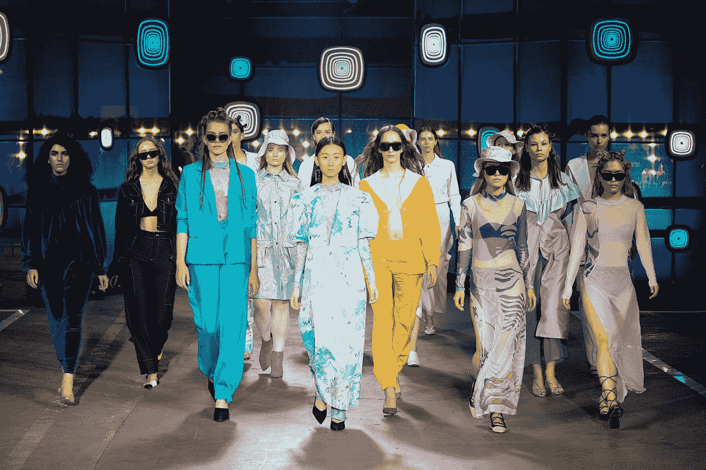
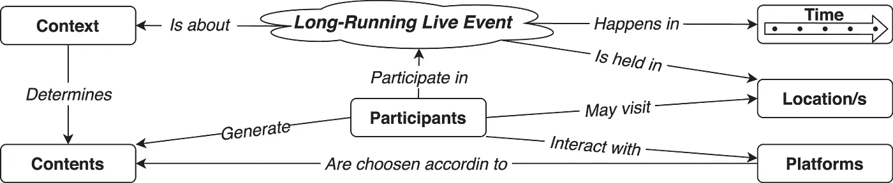
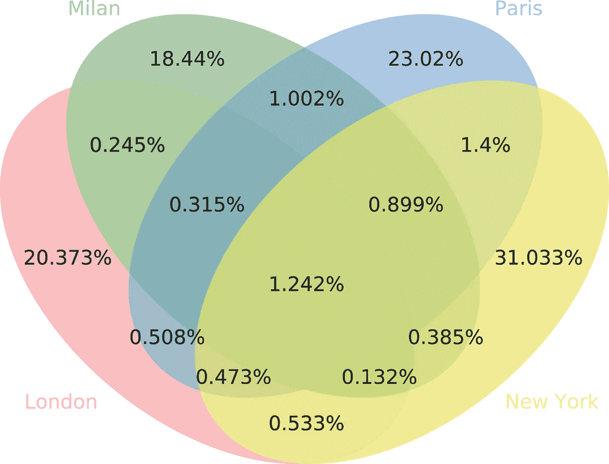
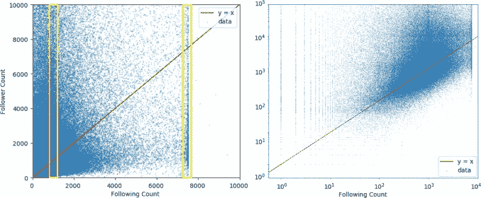
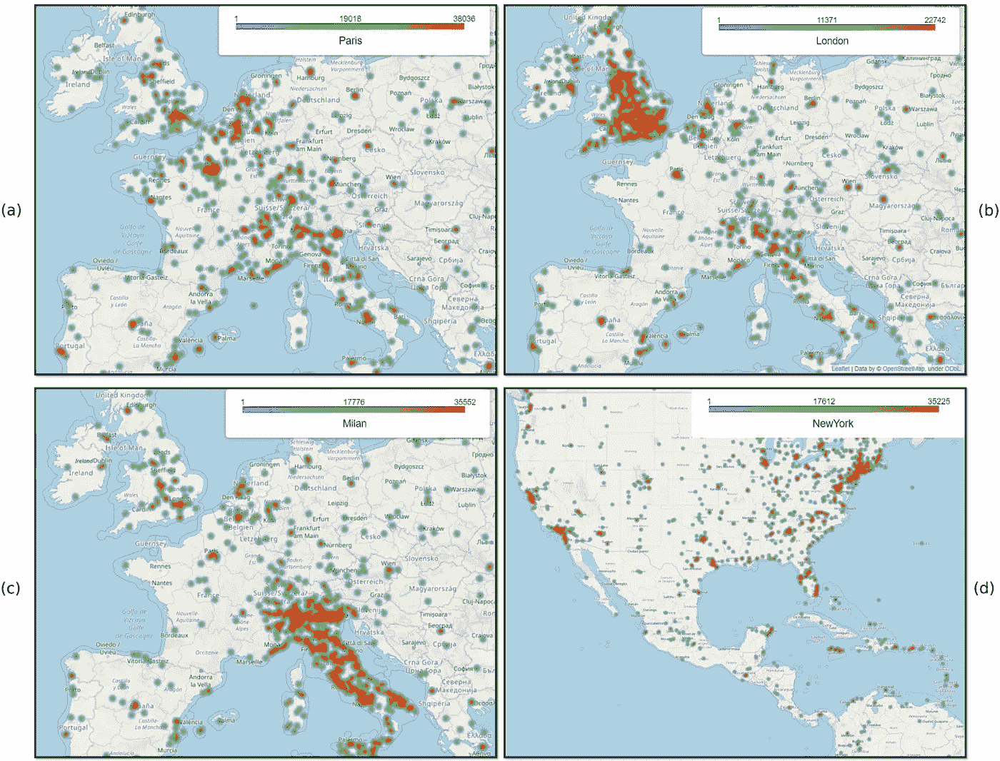
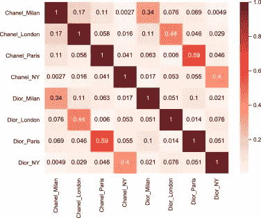
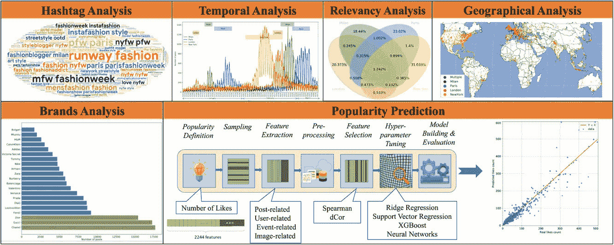

# 通过社交媒体分析长期直播事件的多视角方法

> 原文：<https://towardsdatascience.com/a-multi-perspective-approach-for-analyzing-long-running-live-events-through-social-media-9162079bfbc8?source=collection_archive---------36----------------------->

## [思想和理论](https://towardsdatascience.com/tagged/thoughts-and-theory)，纽约，巴黎，米兰，伦敦

## 四大时装周的案例

[Armen Aydinyan](https://unsplash.com/@mumble57?utm_source=medium&utm_medium=referral) 在 [Unsplash](https://unsplash.com?utm_source=medium&utm_medium=referral) 上的照片

社交媒体正在主宰人们的日常生活。在我们的生活中，它既是信息的来源，也是分享个人经历和观点的地方。

特别是，它在大型活动(如阿拉伯之春、美国总统选举和许多其他场景)中展示了巨大的沟通、互动和社区建设潜力。

我们提出了一种实用的方法来研究所谓的**长期现场活动(LRLEs)** 的影响和作用，即*活动持续时间长，由某个主办实体组织，在某些地点实际举行，并在很长一段时间内周期性重复。*

我们旨在通过探索和分析与 LRLEs 相关的社交媒体平台上产生的用户生成内容(UGC)来研究此类事件。事实上，UGC 主要反映了参与者在实际活动中的亲身体验，因此是关于事件发生的信息。

这吸引了许多社区。对于公共部门来说，这是一扇新的大门，可以探索一些无法解释的主题，如社会的行为模式和改善沟通。对于品牌和企业来说，这是一种了解客户和投放广告的有利可图的方式，因为与其他形式的广告相比，它们可以以更低的成本吸引更多的公众注意力。

我们设计了一种实用的数据科学方法，其目标如下:

*   理解事件期间用户行为的时间动态。
*   了解用户的[地理分布](https://www.sciencedirect.com/topics/engineering/geographical-distribution)及其发布活动。
*   研究活动期间的品牌知名度。
*   检测事件位置和以品牌为目标的参与者的发布动态之间的相关性。
*   确定影响用户生成内容的受欢迎程度的主要因素，并设计模型来预测此类内容的受欢迎程度。

以下是一个概念模型，代表了在此环境中发挥作用的主要实体:

长期运行的实时事件的概念模型(图片由作者提供)

应用多模态方法需要考虑帖子相关的信息、帖子的内容和用户特征。特别是，我们需要提取和分析:

*   **与用户相关的**特征，也称为*社交环境*属性，收集发帖用户的相关信息，如其关注者和关注人数、个人资料类型、*等*。
*   **与内容相关的**信息，取决于短信的类型(*例如*，YouTube 上的视频和 Twitter 上的文本)，可能包括视觉特征。
*   **帖子相关的**特征，即通过 API 收集的帖子的元数据，如时间和地理属性、标签、标记、评论数、*等*。
*   **事件相关**特征，包括目标事件的统计信息，如平均点赞数，或事件本身的具体信息。

为了展示我们的工作方法，我们选择了四大时装周，分别在纽约、巴黎、米兰和伦敦举办。我们在 Instagram 上收集关于这些事件的 UGC 内容，通过 Instagram API，通过基于*标签的*数据收集方法来最大化覆盖范围。产生的数据集由 905，726 条 Instagram 帖子、171，078 条与之相关的用户资料和 723，831 张图片组成。

帖子中城市间相关性的重叠。[图片由作者提供]

该研究从理解帖子与事件的相关性开始。结果显示，大多数帖子(92.866%)只与四个城市之一相关。尽管如此，还是存在一些重叠，如此处所示。动机是一些用户发布内容将他们与许多时装周联系起来，只是为了增加他们的知名度。这显然与事件的研究无关，因此可能是至关重要的。

采用的分析维度包括以下报告的维度:

*   标签分析
*   时间分析
*   地理影响
*   网络分析(关注者)
*   流行预测
*   品牌分析

(左)用户的追随者数量( *y 轴*)与对数形式的追随者数量( *x 轴*)和(右)。[图片由作者提供]

仔细观察左图，我们可以注意到三个更密集的区域，分别位于位置 0、999 和 7500。第一个峰值是 840 个用户的结果，正好有 0 个追随者，但不同的追随者计数。他们可能是决定不关注任何人或未使用或伪造账户的名人。还有一种可能是 Instagram 禁止了一些用户关注其他人。另一方面，第三个高峰，收集了非常正确部分的所有点，可能是机器人，他们关注许多帐户，以吸引追随者或增加他们的帖子或帐户的可见性。他们的追随者数量平均少于他们的追随者数量。这个峰值对应于 234 个用户，他们准确地关注 7500 个帐户，但是具有不同的关注者计数。这个具体数字可能是 Instagram 的一项政策造成的，该政策禁止用户关注超过 7500 个个人资料。

对于地理分析，我们可以利用地理标记。在收集的 905，726 个帖子中，42.59%带有地理标签。这是每个事件最相关区域的热图。

每个事件的帖子热图。[图片由作者提供]

活动-品牌关系也是一个相关的维度，尤其是对于理解不同品牌的作用和影响。因此，它们中的每一个都被映射到该位置。例如，您可以在这里看到 Spearman 相关性分析的热图矩阵，显示了从四大城市中每个城市对两个品牌(迪奥和香奈儿)的回复中获得的值之间的相关系数。

迪奥和香奈儿影响着不同的时装周。[图片由作者提供]

使用 SVR、XGboost 和 RNN 方法，还开发了一个事件相关帖子受欢迎程度的预测器。

其他分析结果的快速总结显示在本文结尾的图片中，而该方法的完整描述则发表在科学论文(开放获取)中:

*Javadian Sabet A .、Brambilla M .、Hosseini M.* ***一种用于分析社交媒体上长期直播事件的多视角方法。“四大”国际时装周案例研究。***在线社交网络与媒体，第 24 卷，2021，100140，刊号 2468–6964，[*【https://doi.org/10.1016/j.osnem.2021.100140】*](https://doi.org/10.1016/j.osnem.2021.100140)*。
(*[*https://www . science direct . com/science/article/pii/s 2468696421000239*](https://www.sciencedirect.com/science/article/pii/S2468696421000239)*)*

**数据集也可以在网上**获得，在这篇数据集文章中有所描述:

*Brambilla M .、Javadian Sabet A .、Hosseini M.* ***社交媒体在长期直播事件中的作用:四大时装周数据集的案例。*** *数据简介，35 条【2021】，106840 条*[*10.1016/j . DIB . 2021.106840*](https://doi.org/10.1016/j.dib.2021.106840)

多重分析视角。[图片由作者提供]