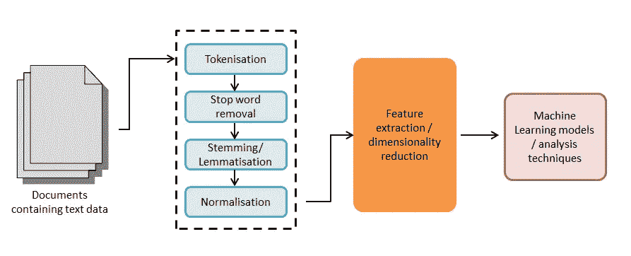
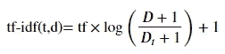
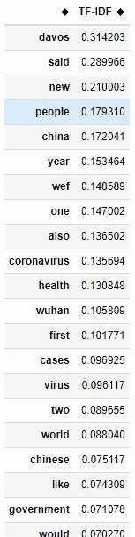
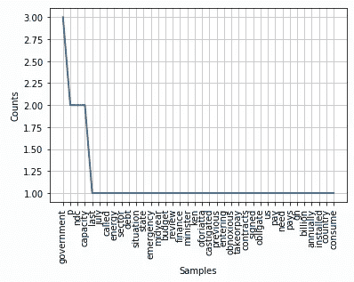
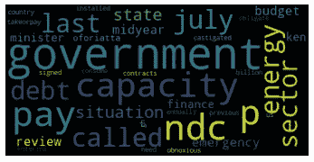
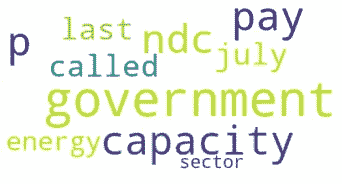
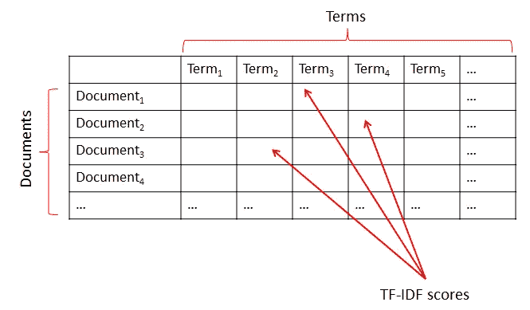

# 自然语言处理初级读本

> 原文：<https://towardsdatascience.com/a-natural-language-processing-nlp-primer-6a82667e9aa5?source=collection_archive---------10----------------------->

## 使用 Python 的常见 NLP 任务概述


照片由 [Skylar Kang](https://www.pexels.com/@skylar-kang?utm_content=attributionCopyText&utm_medium=referral&utm_source=pexels) 从 [Pexels](https://www.pexels.com/photo/german-text-on-pieces-of-paper-6045366/?utm_content=attributionCopyText&utm_medium=referral&utm_source=pexels) 拍摄

自然语言处理 **NLP** 用于分析文本数据。这可能是来自网站、扫描文档、书籍、期刊、推特、YouTube 评论等来源的数据。

这本初级读本介绍了一些可以使用 Python 执行的常见 NLP 任务。示例大多使用自然语言工具包(NLTK)和 scikit 学习包。假设您具备 Python 和数据科学原理的基本工作知识。

自然语言指的是像英语、法语、阿拉伯语和汉语这样的语言，而不是像 Python、R 和 C++这样的计算机语言。NLP 使文本数据的部分分析自动化，这在以前只有定性方法才有可能。这些定性方法，如框架/主题分析，不能扩展到大量的文本数据。这就是 NLP 的用武之地。它还被用于创建聊天机器人、数字助理(如 Siri 和 Alexa)等其他用途。

本笔记本中使用的数据来自[https://www.english-corpora.org/corona/](https://www.english-corpora.org/corona/)【1】的数据子样本。这些数据是关于冠状病毒疫情的，代表了来自各种媒体来源(例如报纸、网站)的子集，并且是 2020 年 1 月至 5 月期间的数据。该数据包含大约 320 万个英语单词。

## 使用 Python 加载文本数据

让我们从查看文本数据开始，看看它是什么样子的。我们可以使用操作系统( **os** )库来列出我们的文本文件夹中的所有文件。在这种情况下，文件位于名为 **text** 的文件夹中，该文件夹位于名为 **NLP** 的文件夹中，该文件夹与 Python 源代码文件相关(例如 Jupyter notebook 或。py 文件)并用“.”表示。/".

```
import os
os.listdir("./NLP/text")
```

这将生成一个包含 5 个文本文件的列表:

```
>>> ['20–01.txt', '20–02.txt', '20–03.txt', '20–04.txt', '20–05.txt']
```

如您所见，有 5 个文本文件(*。txt)。我们可以使用标准的 Python 文件处理函数来打开文件。在这种情况下，我们将把它限制在前 10 行，以了解文件的结构和它包含的信息。在下面的输出中，为了简洁起见，这被缩短了。 **next** 函数用于遍历文件中的行。

```
with open("./NLP/text/20–01.txt") as txt_file:
    head = [next(txt_file) for i in range(10)]
print(head)>>> ['\n', '@@31553641 <p> The government last July called the energy sector debt situation a " state of emergency . " <p> This was during the mid-year budget review during which the Finance Minister Ken Ofori-Atta castigated the previous NDC government for entering into " obnoxious take-or-pay contracts signed by the NDC , which obligate us to pay for capacity we do not need . " <p> The government pays over GH ? 2.5 billion annually for some 2,300MW in installed capacity which the country does not consume . <p> He sounded alarmed that " from 2020 if nothing is done , we will be facing annual excess gas capacity charges of between $550 and $850 million every year . <p> JoyNews \' Business editor George Wiafe said the latest IMF Staff report expressing fears over a possible classification is " more of a warning " to government . <p> He said the latest assessment raises concerns about the purpose of government borrowings , whether it goes into consumption or into projects capable of generating revenue to pay back the loan . <p> The move could increase the country \'s risk profile and ability to borrow on the international market . <p> @ @ @ @ @ @ @ @ @ @ issue another Eurobond in 2020 . <p> The Finance Minister Ken Ofori-Atta wants to return to the Eurobond market to raise $3bn to pay for expenditure items the country can not fund from domestic sources . <p> The government wants to spend GH ? 86m in 2020 but is projecting to raise only GH ? 67bn . It leaves a deficit of GH ? 19bn , monies that the Eurobond could make available . <p> The planned return to the Eurobond market is the seventh time in the past eight years . <p> Ghana is already among 10 low-income countries ( LICs ) in Africa that were at high risk of debt distress . <p> The country in April 2019 , successfully completion an Extended Credit Facility ( ECF ) programme , or bailout , of the International Monetary fund ( IMF ) . \n']
```

## 文本表示

为了以数字方式存储和使用字符，通常用编码系统来表示它们。有 **ASCII** (美国信息交换标准码)等不同的字符编码标准。例如，字母“a”由 ASCII 码 097 表示，在二进制中也是 01100001。还有其他编码集，如 **UTF-8** (Unicode(或通用编码字符集)转换格式，8 位)支持可变宽度的字符。这个系统中的字母“a”是 U+0061。在 Python 中，我们可以像这样直接使用 UTF-8:

```
u"\u0061">>> 'a'
```

您可能需要转换导入的文本数据的字符编码，以执行进一步的处理并更好地表示某些符号(例如表情符号🌝).您可以使用 **sys** 模块中的 **getdefaultencoding** 函数检查您正在使用的编码类型。要更改编码，您可以使用 **setdefaultencoding** 函数，例如**sys . setdefaultencoding(" utf-8 ")**。

```
import sys
sys.getdefaultencoding()>>> 'utf-8'
```

## 数据预处理

应用 NLP 时，数据处理有几个阶段。这些根据确切的上下文而有所不同，但通常遵循类似于下图所示的路径。这通常包括访问文本数据，无论是网页、推文、评论、PDF 文档还是原始文本格式。然后将其分解为算法可以轻松处理的表示形式(例如，表示单个单词或字母的标记)，移除常用单词(停用词)(例如，“and”、“or”、“the”)。进一步的标准化之后是诸如特征提取和/或去除噪声的任务。最后，各种模型和方法(例如，主题建模、情感分析、神经网络等。)都适用。



文本数据的通用预处理方法(图片由作者提供)

因为我们已经有了一些要处理的文本，所以我们可以看看预处理数据的后续步骤。我们可以从标记化开始。很多 Python 库都可以完成标记化，包括机器学习库 scikit learn。自然语言处理任务的一个流行库是自然语言工具包(NLTK):

```
import nltk
```

**注意:**Python 中另一个强大的 NLP 替代库是 **spaCy** 。

## 符号化

即使在库中，也经常有不同的标记器可供选择。例如，NLTK 也有一个 RegexpTokenizer(使用正则表达式)。这里我们将使用 TreebankWordTokenizer 来过滤掉一些标点符号和空格。

```
from nltk.tokenize import TreebankWordTokenizer
```

我们将从文本数据中提取一小段文本来说明这是如何工作的。在这里，我们将它作为一个字符串(Python 中用来存储文本数据的一种数据类型)存储在一个名为 **txt** 的变量中。

```
txt = "The government last July called the energy sector debt situation a state of emergency. <p> This was during the mid-year budget review during which the Finance Minister Ken Ofori-Atta castigated the previous NDC government for entering into obnoxious take-or-pay contracts signed by the NDC , which obligate us to pay for capacity we do not need . <p> The government pays over GH ? 2.5 billion annually for some 2,300MW in installed capacity which the country does not consume ."
```

简单的第一步可能是将所有文本转换成小写字母。我们可以通过**下**功能来实现。

```
txt = txt.lower()
txt>>> 'the government last july called the energy sector debt situation a state of emergency. <p> this was during the mid-year budget review during which the finance minister ken ofori-atta castigated the previous ndc government for entering into obnoxious take-or-pay contracts signed by the ndc , which obligate us to pay for capacity we do not need .  <p> the government pays over gh ? 2.5 billion annually for some 2,300mw in installed capacity which the country does not consume .'
```

接下来我们可以创建一个**treebankwodtokenizer**类的实例，并使用 **tokenize** 函数，传入我们的 **txt** 变量。输出如下所示(显示前 20 个)。

```
tk = TreebankWordTokenizer()
tk_words = tk.tokenize(txt)
tk_words[:20]>>> ['the',
     'government',
     'last',
     'july',
     'called',
     'the',
     'energy',
     'sector',
     'debt',
     'situation',
     'a',
     'state',
     'of',
     'emergency.',
     '<',
     'p',
     '>',
     'this',
     'was',
     'during']
```

这个 **casual_tokenize** 对于社交媒体符号化很有用，因为它可以很好地处理用户名和表情符号之类的事情。 **TweetTokenizer** 也为 Twitter 分析保持了完整的散列标签。

## 处理停用词和标点符号

下一件常见的事情是删除停用词。这些是在句子结构中使用的常见高频词，但对分析来说没有太多意义。这些词包括“the”、“and”、“to”、“a”等。我们可以从 NLTK 库中下载这些单词的列表，并将它们存储在一个变量( **sw** )中，如下所示:

```
nltk.download("stopwords", quiet=True)
sw = nltk.corpus.stopwords.words("english")
```

我们可以看看这些单词的前 20 个。

```
sw[:20]>>> ['i',
     'me',
     'my',
     'myself',
     'we',
     'our',
     'ours',
     'ourselves',
     'you',
     "you're",
     "you've",
     "you'll",
     "you'd",
     'your',
     'yours',
     'yourself',
     'yourselves',
     'he',
     'him',
     'his']
```

在写这篇文章的时候，列表中有超过 100 个停用词。如果你感兴趣，可以使用 **len** 函数查看列表中有多少单词(例如 **len(sw)** )。

现在让我们把这些停用词从标记词中去掉。我们可以使用 Python list comprehension 来过滤 **tk_words** 列表中不在停用字词( **sw** )列表中的字词。

```
tk_words_filtered_sw = [word for word in tk_words if word not in sw]
```

如果您不熟悉列表理解，它们本质上是一种创建列表和遍历列表数据结构的简洁方法。这通常避免了需要多几行单独的“for 循环”代码。假设我想求 0 到 5 的平方。我们可以像这样使用 for 循环:

```
squared_nums = []
for n in range(5):
    squared_nums.append(n**2)
```

虽然这有预期的效果，但我们可以创建列表，并使用列表理解来遍历它，而不是将它组合成一行代码:

```
squared_nums = [n**2 for n in range(5)]
```

如果我们输出变量 **tk_words_filtered_sw** 的内容，我们可以看到很多停用词现在都被删除了(为简洁起见，缩写为):

```
tk_words_filtered_sw>>> ['government',
     'last',
     'july',
     'called',
     'energy',
     'sector',
     'debt',
     'situation',
     'state',
     'emergency.',
     '<',
     'p',
     '>',
     'mid-year',
     'budget',
     'review',
     'finance',
     'minister',
     'ken',
     'ofori-atta',
     'castigated',
     'previous',
     'ndc',
     'government',
     'entering',
     'obnoxious',
     'take-or-pay',
     'contracts',
     'signed',
     'ndc',
     ','
...
```

可以看到文本中仍然有句号(句号)、问号、逗号之类的标点符号。同样，我们通常会从列表中删除这些内容。这可以通过多种不同的方式来实现。这里，我们使用字符串库来删除存储结果的标点符号，这个结果存储在一个名为 **no_punc** 的变量中。

```
import string
no_punc = ["".join( j for j in i if j not in string.punctuation) for i in  tk_words_filtered_sw]
no_punc>>> ['government',
     'last',
     'july',
     'called',
     'energy',
     'sector',
     'debt',
     'situation',
     'state',
     'emergency',
     '',
     'p',
     '',
     'midyear',
     'budget'
...
```

然后我们可以从列表中过滤掉这些空字符串(“”)。我们可以将结果存储在一个名为 **filtered_punc** 的变量中。

```
filtered_punc = list(filter(None, no_punc))
filtered_punc>>> ['government',
     'last',
     'july',
     'called',
     'energy',
     'sector',
     'debt',
     'situation',
     'state',
     'emergency',
     'p',
     'midyear',
     'budget'
...
```

最后，我们可能还想从列表中删除数字。为此，我们可以使用 **isdigit** 函数检查字符串是否包含任何数字。

```
str_list = [i for i in filtered_punc if not any(j.isdigit() for j in i)]
```

如您所见，文本数据可能非常混乱，需要在开始运行各种分析之前进行大量清理。另一种去除不必要单词的常用方法是使用词干法或词干法。

## 词干化和词汇化

词干化指的是将单词缩减到它们的词根(词干)形式。例如，单词“waited”、“waities”、“waiting”可以简化为“wait”。我们可以看一个叫做**波特词干分析器**的普通词干分析器的例子。首先，我们可以创建一个简短的单词列表来演示这是如何工作的。这一阶段通常跟随单词的标记化。

```
word_list = ["flying", "flies", "waiting", "waits", "waited", "ball", "balls", "flyer"]
```

接下来，我们将从 NLTK 导入 Porter 词干分析器。

```
from nltk.stem.porter import PorterStemmer
```

制作一个名为 **ps** 的 **PorterStemmer** 类的实例。

```
ps = PorterStemmer()
```

最后用一个列表理解列表中的每个单词。其结果可以在下面看到。

```
stem_words = [ps.stem(word) for word in word_list]
stem_words>>> ['fli', 'fli', 'wait', 'wait', 'wait', 'ball', 'ball', 'flyer']
```

在本应具有不同词干的单词被词干化为同一个词根的情况下，可能会发生词干过度。也有可能得到下面的词干。这在本质上是相反的(应该词根相同的单词却不是)。有各种不同的词干分析器可以使用，如波特，英语斯特梅尔，派斯和洛文斯仅举几例。波特梗是最广泛使用的一种。

有些词干分析器比其他词干分析器更“苛刻”或更“温和”，因此您可能需要尝试不同的词干分析器来获得想要的结果。您也可以根据输出决定在停用词移除之前或之后应用词干。

另一方面，词条释义是通过识别一个单词相对于它出现的句子的意义来工作的。本质上，上下文对于引理满足很重要。这种情况下的词根叫做引理。例如，单词“better”可以用单词“good”来表示，因为这个单词就是它的来源。这个过程在计算上比词干提取更昂贵。

我们需要首先从 NLTK(一个包含英语名词、形容词、副词和动词的大型单词数据库)下载 wordnet 资源。

```
nltk.download('wordnet', quiet=True)
```

我们将导入并创建一个 **WordNetLemmatizer** 的实例，并将其应用于我们之前使用的单词列表。

```
word_list>>> ['flying', 'flies', 'waiting', 'waits', 'waited', 'ball', 'balls', 'flyer']from nltk.stem import WordNetLemmatizer
lm = WordNetLemmatizer()lem_words = [lm.lemmatize(word) for word in word_list]
lem_words>>> ['flying', 'fly', 'waiting', 'wait', 'waited', 'ball', 'ball', 'flyer']
```

如果我们将 **lem_words** 与 **stem_words** (如下)进行比较，您可以看到，尽管在某些情况下相似/相同，但对于一些单词，如“flying”和“flies ”,使用引理化保留了其含义，否则词干化将会丢失该含义。

```
stem_words>>> ['fli', 'fli', 'wait', 'wait', 'wait', 'ball', 'ball', 'flyer']
```

## 标准化/缩放

移除特征(单词/术语)的另一种方法是使用代表术语频率的 **tf-idf** 重新调整数据，逆文档频率。



tf-idf 方程(图片由作者提供)

这用于查看一个术语(单词)对文档集合(语料库)中的单个文档有多重要。我们本质上是用这个作为权重。术语频率是该单词/术语在文档中出现的频率。例如，如果我们有两个文件𝑑1 和𝑑2 看起来像这样。

𝑑1 =“那个小男孩在房子里。”𝑑2 =“那个小男孩不在房子里。”

如果在文档 1 ( 𝑑1)中感兴趣的术语是“男孩”，这在七个单词中出现一次 1/7=0.1428。我们可以对每个文档中的每个术语做同样的事情。一旦我们计算出术语频率，我们就可以用语料库中文档总数的对数乘以包含该术语的文档数。这告诉我们一个特定的术语与一个文档是更相关、更不相关还是同等相关。在上面的示例中，文档二中的单词“not”对于区分这两个文档非常重要。高权重是由于文档中的高术语频率和语料库(文档集合)中的低术语频率。TF-IDF 也可以用于文本摘要任务。

为了在实践中使用 TF-IDF，我们将需要使用我们前面看到的文本文件。为了做得更好，我保存了一个没有停用词和 HTML 段落标签的版本。这也被转换成小写。本质上，这是使用一个循环一个接一个地打开文件，一行一行地读取它们，分割成单词。如果这个词不是停用词，它将被写入一个新文件。最后， **BeautifulSoup** 库用于从文本数据中去除所有的 HTML 标签。

```
**from** bs4 **import** BeautifulSoup

file_path **=** "./NLP/text/"
file_list **=** ['20-01', '20-02', '20-03', '20-04']

**for** file **in** file_list:
    current_file **=** open(file_path **+** file **+** ".txt")
    line **=** current_file.read().lower()
    soup **=** BeautifulSoup(line)
    words **=** soup.get_text().split()
    **for** word **in** words:
        **if** word **not** **in** sw:
            formated_list **=** open((file_path **+** file **+** '-f.txt'),'a')
            formated_list.write(" "**+**word)
            formated_list.close()

    current_file.close()
```

我们现在可以加载这些文件并将它们的内容存储在变量中。

```
path = "./NLP/text/processed/"txt_file_1 = open(path + "20–01-f.txt") 
file_1 = txt_file_1.read()txt_file_2 = open(path + "20–02-f.txt") 
file_2 = txt_file_2.read()txt_file_3 = open(path + "20–03-f.txt")
file_3 = txt_file_3.read()txt_file_4 = open(path + "20–04-f.txt") 
file_4 = txt_file_4.read()
```

我们可以将从文件中提取的文本数据放在一个列表中，以便于使用。

```
data_files = [file_1, file_2, file_3, file_4]
```

接下来，我们将导入 **pandas** 库，它在数据科学中经常使用，并提供以表格结构(数据框)表示数据的功能。接下来，我们将从 **sklearn** 机器学习库中导入**tfidf 矢量器**，它将标记文档并应用 IDF 权重。

```
import pandas as pd
from sklearn.feature_extraction.text import TfidfVectorizer
```

最后，我们可以创建该类的一个实例，并使其适合数据。我们可以在数据框中显示结果，其中每个要素和相关的 TF-IDF 权重按降序排列。最后，为了简洁起见，我们将只输出前 30 个术语。

```
tv = TfidfVectorizer(use_idf=True)
tfIdf = tv.fit_transform(data_files)
df = pd.DataFrame(tfIdf[0].T.todense(), index=tv.get_feature_names(), columns=["TF-IDF"])
df = df.sort_values('TF-IDF', ascending=False)
df.head(30)
```



熊猫数据框的输出-为简洁起见而缩短(图片由作者提供)

## 词频

我们可以对单词数据做的最简单的事情之一是查看一个独特的单词在文档中出现的频率(和/或它在语料库中的累积频率)。我们可以使用 **FreqDist** 函数来计算一个字典，它的键/值对包含每个术语(单词)，后跟它在文本中出现的次数。例如，单词“government”在我们之前使用的原始简短示例文本中出现了 3 次。

```
dist = nltk.FreqDist(str_list)
dist>>> FreqDist({'government': 3, 'p': 2, 'ndc': 2, 'capacity': 2, 'last': 1, 'july': 1, 'called': 1, 'energy': 1, 'sector': 1, 'debt': 1, ...})
```

为了使它更容易可视化，我们可以将它输出为一个图。正如您所看到的，单词 government 出现了 3 次，字母 p(来自 HTML 段落标记)出现了两次，其他单词只出现了一次。

```
dist.plot();
```



单词的情节和出现频率(图片由作者提供)

另一种显示单词频率的视觉方式是使用单词云，这里单词越大，出现的次数就越多。为此，我们可以使用 **WordCloud** 库。

```
from wordcloud import WordCloud
```

我们还需要来自用于各种可视化的 **matplotlib** 库中的绘图( **plt** )。 **%matplotlib inline** 设置绘图命令，以确保当与 Jupyter 笔记本等字体端一起使用时，绘图出现在代码单元格下方并存储在笔记本中。

```
import matplotlib.pyplot as plt
%matplotlib inline
```

接下来，我们需要将数据转换成 word cloud 函数的正确格式。它接受一个字符串，因此我们将把标记化的字符串列表折叠成一个单独的字符串，单词之间留有空格，使用内置的 **join** 函数进行字符串连接(将字符串连接在一起)。

```
flattend_text = " ".join(str_list)
```

接下来，我们可以使用传入文本字符串的 **generate** 函数创建单词云。

```
wc = WordCloud().generate(flattend_text)
```

最后，我们将使用**双线性**插值选项输出关闭轴文本的单词云，以平滑图像的外观。

```
plt.imshow(wc, interpolation='bilinear')
plt.axis("off")
plt.show()
```



词云输出(图片由作者提供)

您还可以使用其他可选参数。一些流行的方法包括设置最大字体大小(max_font_size)和包含的字数(如果你有很多字的话会很有帮助)以及改变背景颜色。例如，我们可以将显示的最大字数设置为 10，并将背景设置为白色。

```
wc_2 = WordCloud(max_words = 10, background_color = "white").generate(flattend_text)
plt.imshow(wc_2, interpolation='bilinear')
plt.axis("off")
plt.show()
```



词云输出(图片由作者提供)

## n 元语法分析

当我们把单词符号化，并把它们表示成一个单词包时，我们就失去了一些上下文和意义。单个单词本身并不能说明太多，但是它们与其他单词一起出现的频率可能会说明很多。例如,“信息”和“治理”这两个词可能经常一起出现，并具有特定的含义。我们可以用 n 元语法来解释这一点。这是指一起出现的多个令牌。这些标记可以是单词或字母。这里我们将使用单词。两个词(𝑛=2)被称为双字，三个词被称为三字，等等。使用 n 元语法有助于我们保留文本中的一些含义/上下文。

我们将使用前面相同的短文本:

```
txt>>> 'the government last july called the energy sector debt situation a state of emergency. <p> this was during the mid-year budget review during which the finance minister ken ofori-atta castigated the previous ndc government for entering into obnoxious take-or-pay contracts signed by the ndc , which obligate us to pay for capacity we do not need .  <p> the government pays over gh ? 2.5 billion annually for some 2,300mw in installed capacity which the country does not consume .'
```

接下来，我们可以从 NLTK 实用程序包中导入 ngrams 函数。

```
from nltk.util import ngrams
```

我们将使用与之前相同的标记器再次标记文本。

```
tk = TreebankWordTokenizer()
tk_words = tk.tokenize(txt)
```

最后，我们将这个标记化的列表传递到 **ngrams** 函数中，并指定𝑛(在本例中为二进制数的 2)(为简洁起见而缩写)。

```
bigrams = list(ngrams(tk_words, 2))
bigrams>>> [('the', 'government'),
     ('government', 'last'),
     ('last', 'july'),
     ('july', 'called'),
     ('called', 'the'),
     ('the', 'energy'),
     ('energy', 'sector'),
     ('sector', 'debt'),
     ('debt', 'situation'),
     ('situation', 'a'),
     ('a', 'state'),
     ('state', 'of'),
     ('of', 'emergency.'),
     ('emergency.', '<'),
     ('<', 'p'),
     ('p', '>'),
     ('>', 'this'),
     ('this', 'was'),
     ('was', 'during'),
     ('during', 'the'),
     ('the', 'mid-year'),
     ('mid-year', 'budget')
...
```

在这里，我们可以看到像“合同”和“签署”或“政府”和“支付”这样的术语，它们提供了比单个单词更多的上下文。作为预处理的一部分，您也可以从文本数据中过滤出 n 元语法。

我们还可以使用 **BigramCollocationFinder** 类来确定二元模型出现的次数。这里我们按降序对列表进行排序。

```
from nltk.collocations import BigramCollocationFinder
finder = BigramCollocationFinder.from_words(tk_words, window_size=2)
ngram = list(finder.ngram_fd.items())
ngram.sort(key=lambda item: item[-1], reverse=True)
ngram>>> [(('the', 'government'), 2),
     (('<', 'p'), 2),
     (('p', '>'), 2),
     (('which', 'the'), 2),
     (('government', 'last'), 1),
     (('last', 'july'), 1),
     (('july', 'called'), 1),
     (('called', 'the'), 1),
     (('the', 'energy'), 1),
     (('energy', 'sector'), 1),
     (('sector', 'debt'), 1),
     (('debt', 'situation'), 1),
     (('situation', 'a'), 1),
     (('a', 'state'), 1),
     (('state', 'of'), 1),
     (('of', 'emergency.'), 1),
     (('emergency.', '<'), 1),
     (('>', 'this'), 1),
     (('this', 'was'), 1),
     (('was', 'during'), 1),
     (('during', 'the'), 1),
     (('the', 'mid-year'), 1),
     (('mid-year', 'budget'), 1)
...
```

## 情感分析

这包括分析文本以确定文本的“正面”或“负面”程度。这可以给我们关于人们的观点/情绪的信息。这可以应用到一些事情上，比如浏览产品评论，以获得产品是否被看好的总体感觉。我们还可以将它用于研究目的——例如，人们在他们的推文中对戴口罩持肯定还是否定态度。为此，我们可以训练一个模型或使用现有的词典。VADER 是用 Python 实现的。这会产生一个介于-1 和+1 之间的正面、负面和中性情绪得分。它还产生一个复合分数，即**阳性+中性标准化** (-1 比 1)。首先，我们将下载词典。词典包含与单个单词或文本串相关的信息(例如，语义或语法)。

```
nltk.download("vader_lexicon", quiet=True)
```

我们导入了情感分析器类**SentimentIntensityAnalyzer**，并创建了一个名为 **snt** 的实例(用于情感)。

```
from nltk.sentiment.vader import SentimentIntensityAnalyzer
snt = SentimentIntensityAnalyzer()
```

然后，我们可以向函数 **polarity_scores** 传递一些文本数据(例如，我们的第二个文件)。您可以在下面的字典数据结构中看到作为键/值对返回的分数。

```
snt.polarity_scores(data_files[1])>>> {'neg': 0.101, 'neu': 0.782, 'pos': 0.117, 'compound': 1.0}
```

在这个例子中，查看第二个文本文件，我们可以看到一个占主导地位的中性情绪得分(0.782)，后面是一个正得分(0.117)和一个负得分(0.101)。你可以在不同的时间点比较情绪，看看它是如何变化的，或者在不同的小组之间。有时使用的另一个指标是净情绪得分(NSS)，它是通过从积极得分中减去消极得分来计算的。首先，我们需要将分数存储在一个变量中来访问它们。

```
sent_scores = snt.polarity_scores(data_files[1])
```

然后我们可以从正数中减去负数。

```
nss = sent_scores['pos'] — sent_scores['neg']
print("NSS =", nss)>>> NSS = 0.016
```

## 主题建模

主题建模通常用于文本挖掘，它允许我们创建一个统计模型来发现文本数据中的主题。有各种不同的方法/算法可以做到这一点。我们将在这里看一对夫妇。这是一种无人监管的方法。我们首先来看看潜在语义分析(LSA)，它与主成分分析(PCA)的工作原理相同。LSA 是一个线性模型，并假设文档中的术语呈正态分布。它还使用 SVD(奇异值分解),这在计算上是昂贵的。这种方法减少了数据中的噪声。

**注意:** SVD 的工作原理是将一个文档术语矩阵分成 3 个连续的方阵(其中一个是对角矩阵)，然后将它们转置并再次相乘。这个方法可以用来求矩阵的逆矩阵。

第一阶段涉及创建文档术语矩阵。这在行中表示文档，在列中表示术语，在单元格中表示 TF-IDF 分数。然后，我们将 SVD 应用于这个矩阵，以获得最终的主题列表。



文档-术语矩阵，行中有文档，列中有术语。单元格包含 TF-IDF 分数(图片由作者提供)

我们可以使用之前使用的相同的**tfidf 矢量器**来计算 TF-IDF 分数。我们将限制术语(特征)的数量，以将所需的计算资源减少到 800。

```
from sklearn.feature_extraction.text import TfidfVectorizer
v = TfidfVectorizer(stop_words='english', max_features=800, max_df=0.5)
X = v.fit_transform(data_files)
```

如果我们查看文档-术语矩阵的维度，我们可以看到行中有 4 个文档，列中有 800 个术语。

```
X.shape>>> (4, 800)
```

我们现在需要实现 SVD，我们可以使用**截断的 SVD** 类来实现它。这将为我们做繁重的工作。

```
from sklearn.decomposition import TruncatedSVD
```

我们可以用参数 **n_components** 指定主题的数量。在这种情况下，我们将它设置为 4，假设每个文档有一个不同的主主题(**注意:**我们还可以使用像主题一致性这样的方法来确定主题的最佳数量 *k* )。

```
svd = TruncatedSVD(n_components=4)
```

接下来，我们拟合模型并获得特征名称:

```
svd.fit(X)doc_terms = v.get_feature_names()
```

现在我们可以输出与每个主题相关的术语。在这种情况下，4 个主题中的每一个都有前 12 个。

```
for i, component in enumerate(svd.components_):
    terms_comp = zip(doc_terms, component)
    sorted_terms = sorted(terms_comp, key=lambda x:x[1], reverse=True)[:12]
    print("")
    print("Topic "+str(i+1)+": ", end="")
    for term in sorted_terms:
        print(term[0], " ", end="")>>> Topic 1: rsquo href ldquo rdquo ventilators easter keytruda quebec unincorporated ford books inmates 
Topic 2: davos wef sibley denly stamler comox nortje caf pd rsquo href ldquo 
Topic 3: hopland geely easyjet davos vanderbilt wef asbestos macy jamaat sibley denly stamler 
Topic 4: rsquo href ldquo rdquo quebec div eacute src noopener rel mdash rsv
```

然后，由您根据这些主题所包含的单词来确定它们可能代表什么(主题标签)。

主题建模的另一个流行选项是潜在狄利克雷分配(LDA ),不要与其他 LDA(线性判别分析)混淆。LDA 假设单词的狄利克雷分布，并创建语义向量空间模型。其实现的具体细节超出了本入门书的范围，但本质上，它将文档术语矩阵转换为两个矩阵。一个表示文档和主题，第二个表示主题和术语。然后，该算法尝试根据主题生成所讨论的单词的概率计算来调整每个文档中每个单词的主题。

我们使用与前面 LSA 相同的概念。首先，我们用**计数矢量器**将数据标记化。然后，我们再次创建 LDA 类的实例，将主题数量设置为 4，并输出前 12 个。

```
from sklearn.feature_extraction.text import CountVectorizer
cv = CountVectorizer()
fitted = cv.fit_transform(data_files)
from sklearn.decomposition import LatentDirichletAllocation
lda = LatentDirichletAllocation(n_components=4, random_state=42)
lda.fit(fitted)
```

然后，我们可以像以前一样输出结果:

```
doc_terms = cv.get_feature_names()for i, component in enumerate(lda.components_):
   terms_comp = zip(doc_terms, component)
   sorted_terms = sorted(terms_comp, key=lambda x:x[1], reverse=True)[:12]
   print("")
   print("Topic "+str(i+1)+": ", end="")
   for term in sorted_terms:
       print(term[0], " ", end="")>>> Topic 1: said  19  covid  people  coronavirus  new  health  also  would  one  pandemic  time  
Topic 2: 021  040  25000  421  4q  712  85th  885  accrues  accuser  acuity  afterthought  
Topic 3: said  coronavirus  people  health  19  new  covid  also  cases  virus  one  would  
Topic 4: 021  040  25000  421  4q  712  85th  885  accrues  accuser  acuity  afterthought
```

如果我们认为这些数字不相关，我们可能还想回去过滤掉它们。您可以看到，这与我们之前看到的 LSA 产生了非常不同的结果。首先，LSA 是主题建模的良好开端。如果需要，LDA 提供不同的选项。

## 摘要

这本初级读本概述了现代 NLP 任务中使用的一些常用方法，以及如何用 Python 实现这些方法。每种方法都有细微差别，需要根据手头的任务来考虑。还有像词性标注这样的方法，也称为语法标注，可以为算法提供额外的信息。例如，你可以在某些单词上标注该单词是名词、动词、形容词还是副词等信息。这通常被表示为具有**单词、标签**的元组列表，例如[('build '，' v ')，(' walk '，' v ')，(' mountain '，' n')]。还有许多方法可以表示单词和术语，用于后续处理，例如 word2vec 和单词包等。您选择的格式将再次取决于任务和算法要求。与所有机器学习和数据科学一样，数据预处理所花费的时间通常最长，并且对生成的输出有很大影响。读完这本初级读本后，你应该有希望开始从文本数据中获得一些有趣的见解，并对你可能用来分析这类数据的一些方法有所了解。

## 参考

[1]戴维斯，马克。(2019-)冠状病毒语料库。可在 https://www.english-corpora.org/corona/的[在线购买。](https://www.english-corpora.org/corona/)