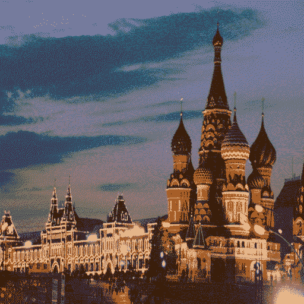

# 艺术风格的神经算法:总结与实现

> 原文：<https://towardsdatascience.com/a-neural-algorithm-of-artistic-style-summary-and-implementation-9dd8452df653?source=collection_archive---------42----------------------->

[瓦茨拉夫·pluhař](https://unsplash.com/@vaclavpluhar)通过 [Unsplash](https://unsplash.com/photos/uqMBLm8bAdA)

## 使用 Pytorch 进行风格转换

神经风格，或神经转移，允许用一种新的艺术风格再现一幅给定的图像。在这里，我介绍由 Leon A. Gatys、Alexander S. Ecker 和 Matthias Bethge 提出的神经式算法。该算法接收样式图像、内容图像和输入图像，输入图像可以是空白的白色图像或内容图像的副本。因此，它改变输入图像，使其类似于后一个图像的内容和前一个图像的风格。在开始之前，我想感谢[亚历克西斯·雅克](https://alexis-jacq.github.io/)的[文章](https://pytorch.org/tutorials/advanced/neural_style_tutorial.html)。

# 原则

虽然这个名字可能会让你认为它确实是将样式转移到另一个图像中，但是这个想法是生成一个内容和样式图像之间距离最小的图像。因此，甚至有可能从一个完全白色的图像开始，并实现期望的结果，这是本文[中提出的](https://arxiv.org/pdf/1508.06576.pdf)。关于技术细节，总体想法是使用预先训练的网络，并通过反向传播最小化这些距离。

# 细节

卷积神经网络(CNN)摘自[本文](https://arxiv.org/pdf/1508.06576.pdf)。

如上所述，该算法需要三幅图像，目标是生成一幅内容和样式图像之间距离最小的图像。为了实现这一点，作者使用预训练的 VGG-19 网络，并计算输入图像和目标图像(内容和风格图像)的特征图之间的距离。因此，他们计算了 CNN 特定层面的内容和风格损失。

# 内容损失

内容损失摘自[本文。](https://arxiv.org/pdf/1508.06576.pdf)

作者使用平方误差损失来测量内容图像和输入图像的特征表示之间的距离，分别表示为 P 和 F。

# 风格丧失

为了计算风格损失，作者使用了 Gram 矩阵。因此，我们通过展平以[N，C，W，H]的形式给出的输入来获取所有 C 个特征向量，导致它具有[N x C，W x H]的形状。最后，我们将这个矩阵与它自身的转置相乘，得到一个 Gram 矩阵，它给出了我们的特征相关性。最后，风格损失由风格和输入 gram 矩阵之间的平方误差损失给出。

# 全损

总损失摘自[本文。](https://arxiv.org/pdf/1508.06576.pdf)

总损失是两个损失的加权和。作者提到，默认比率α/β要么是 1×10^−3，要么是 1 × 10^−4.

# 模型和标准化

我们将导入 VGG-19 预训练网络，因此我们还需要通过减去平均值并除以标准偏差来归一化我们的图像。

最后，我们将计算 VGG-19 在特定深度层的损失。此外，作者提到用平均层替换最大池层会产生更平滑的图像。因此，我们需要一个新的顺序模块来包含所有这些。

# **训练详情**

与训练网络不同，我们希望优化输入图像。因此，我们使用 L-BFGS 算法来运行我们的梯度下降，并将我们的图像作为张量传递给它进行优化。比率α/β是 1×10^−6.

# 结果

上图显示了内容和样式图像以及生成的输入图像。此外，您可以看到我们的输入图像在整个梯度下降过程中是如何变化的。

哈萨克斯坦阿斯塔纳。

最后，我想再展示几张我喜欢的图片:)。

哈萨克斯坦阿拉木图。

俄罗斯莫斯科。

# 一些遗言

我提出了一个简单而有趣的基于 CNN 的算法。然而，已经有更多的方法以不同的方式完成这项任务，特别是在实时情况下。如果你有兴趣，鼓励你进一步研究这个领域。完整的代码可以在我的 [GitHub](https://github.com/chingisooinar/Neural-Style-algorithm.pytorch) 上找到。

# 纸

[艺术风格的神经算法](https://arxiv.org/pdf/1508.06576.pdf)

# 相关文章

 [## 神经风格转移:使用 tf.keras 和渴望执行的深度学习创建艺术

### 软件工程实习生 Raymond Yuan

medium.com](https://medium.com/tensorflow/neural-style-transfer-creating-art-with-deep-learning-using-tf-keras-and-eager-execution-7d541ac31398)  [## 神经艺术风格转移:综述

### 大一的春季学期，我参加了斯坦福大学关于卷积神经网络的 CS 231n 课程。我的最终项目…

medium.com](https://medium.com/artists-and-machine-intelligence/neural-artistic-style-transfer-a-comprehensive-look-f54d8649c199)