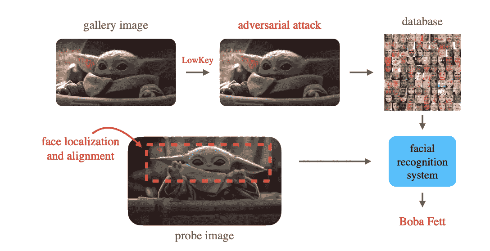
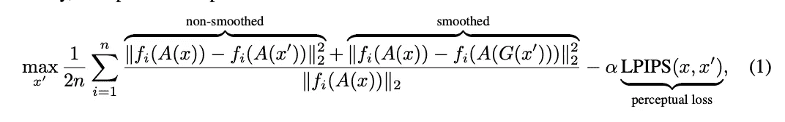
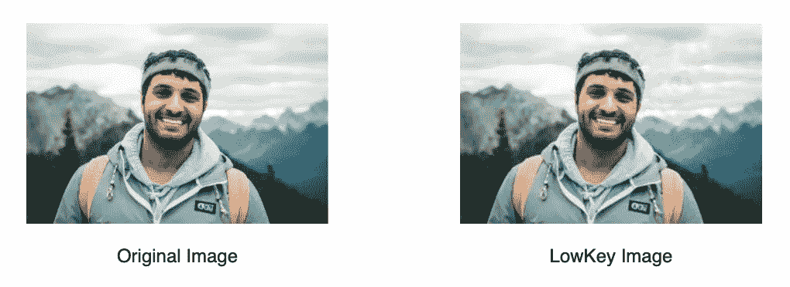

# 一种新的反人脸识别系统

> 原文：<https://towardsdatascience.com/a-new-anti-facial-recognition-system-401741015ef6?source=collection_archive---------24----------------------->

## LowKey 是由马里兰大学的研究人员开发的一种新的反面部识别系统。了解它是如何工作的。

托拜厄斯·图利乌斯在 [Unsplash](https://unsplash.com?utm_source=medium&utm_medium=referral) 上的照片

随着深度学习的改进，面部识别软件变得越来越强大。相应的，面部识别软件的隐私担忧也增加了。许多面部识别系统通过抓取互联网上公开的图片来建立数据库，这意味着你的脸可能在你不知道的情况下存在于某个数据库中。避免这个问题的一个方法是不要把你的脸贴到网上。然而，在社交媒体时代，这可能是不可行的。另一种解决方案是改变图像来欺骗面部识别软件，同时保持图像质量，以便您仍然可以使用该图像。这是马里兰大学的一些研究人员发明的“低调”方法。

LowKey 利用了这样一个事实，即大多数面部识别系统都是使用神经网络构建的，众所周知，神经网络对于对抗性攻击很脆弱。对抗性攻击是对神经网络输入的微小改变，导致网络对输入进行错误分类。理想情况下，用例如下。你对一张自拍进行低调的对抗性攻击，然后上传到互联网上。这张低调的照片是由面部识别数据库拍摄的。稍后，您走到外面，监控摄像头拍下您的照片(称为“探头图像”)。但是，它无法将您的探头图像与数据库中的低调图像进行匹配。你安全了。

来源:低调的[论文](https://arxiv.org/pdf/2101.07922.pdf)

# **详情:**

LowKey 的目标是在所有面部识别深度学习系统中表现良好。然而，我们不知道我们试图击败的一些深度学习系统的架构。如果我们训练我们的对抗性攻击来击败我们可以访问的一个特定的面部识别神经网络，我们不能保证这将在现场对抗其他网络。这个问题没有完美的解决方案。

低调的研究人员决定在当前最好的开源面部识别神经网络的集合上训练他们的对抗性攻击，希望模型的集合能够让他们的攻击具有更好的推广性。首先，对于集合中的每个模型，研究人员在输入图像上计算该模型的输出。然后，他们对输入图像应用低调对抗性攻击，并使用低调修改的图像作为输入来计算模型的输出。接下来，他们计算两个输出之间的差异。他们对集合中的每个模型都这样做，然后计算差异的总和。他们的目标是使这个总数最大化。这个和越大，面部识别神经网络就越不可能将真实图像和低调修改的图像分类为相同的。

其次，研究人员希望修改后的图像仍然能够被人类识别。为了实现这一目标，他们决定最小化原始图像和低调图像的 LPIPS 指标。 [LPIPS](https://arxiv.org/pdf/1801.03924.pdf) (学习感知图像块相似度)是两幅图像之间基于人类的相似性度量。较低的 LPIPS 意味着较高的相似性。

因此，LowKey 有两个目标:基于开源面部识别模型的集合最大化原始图像和 LowKey 图像之间的距离，以及最小化相同两幅图像之间的 LPIPS。在数学符号中，总目标可以写成:

来源:低调的[报纸](https://arxiv.org/pdf/2101.07922.pdf)

**澄清:**

*   x 是原始图像
*   “x”是低调的形象
*   n 是训练集合中模型的数量
*   f_i 是第 I 个系综模型
*   a 是图像预处理函数
*   g 是高斯平滑函数

请注意，第一个目标有两个版本，一个有高斯平滑函数，另一个没有。研究人员包括了高斯平滑函数版本，因为它改善了结果。利用梯度上升训练总目标，并且最终的 x’作为低调图像输出。

低调的研究人员发布了一个在线网络工具，如果你想自己试试的话。这里可以找到[这里](https://lowkey.umiacs.umd.edu/)。例如，这是它对样本图像所做的操作:

资料来源:Unsplash[的 Ali Kazal】](https://unsplash.com/@lureofadventure)

# **结果和限制:**

研究人员通过尝试破解两个商业可用的面部识别 API 来测试 LowKey，即亚马逊 Rekognition 和微软 Azure Face。在这两种 API 上，LowKey 都能够保护用户的面部，因此他们被识别的概率低于 3%。在没有低调保护的情况下，两个面部识别系统识别面部的准确率超过 90%。**这是一个巨大的差异。**

然而，当与其他可能是机密的面部识别系统进行测试时，LowKey 是否也能工作，还有待观察。此外，面部识别系统绕过低调保护的一种方法是用低调图像作为训练数据的一部分来训练系统。这可能会导致一场军备竞赛，其中像 LowKey 这样的反面部识别算法被发布，面部识别公司通过训练考虑到该算法的新模型来做出反应，导致新算法被发布，等等。换句话说，低调有一天可能不再有效。

然而，不管这些疑虑，LowKey 是在互联网和机器学习时代迈向隐私的重要一步。LowKey 证明了一个直观简单的对抗性攻击可以欺骗当前的图像识别系统，同时保持图像质量。更多详情，请参考原文[此处](https://arxiv.org/pdf/2101.07922.pdf)。