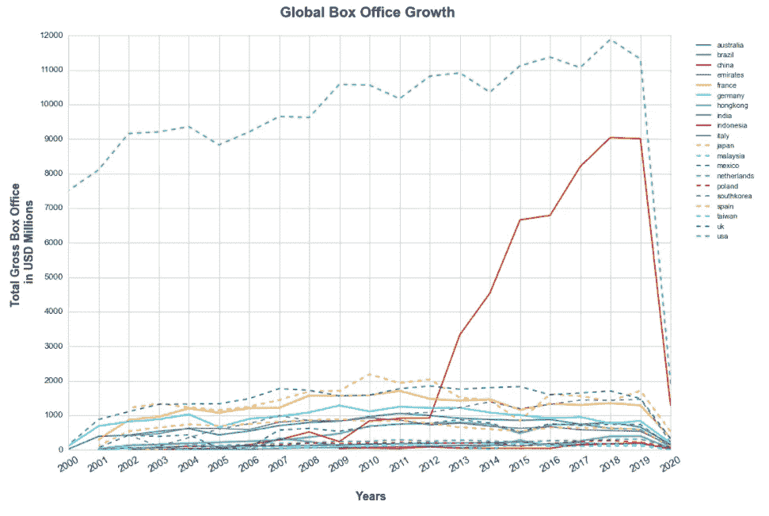
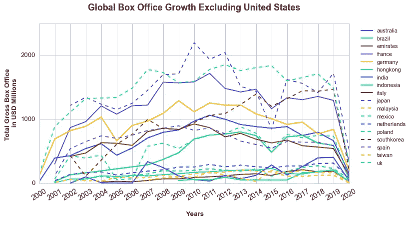
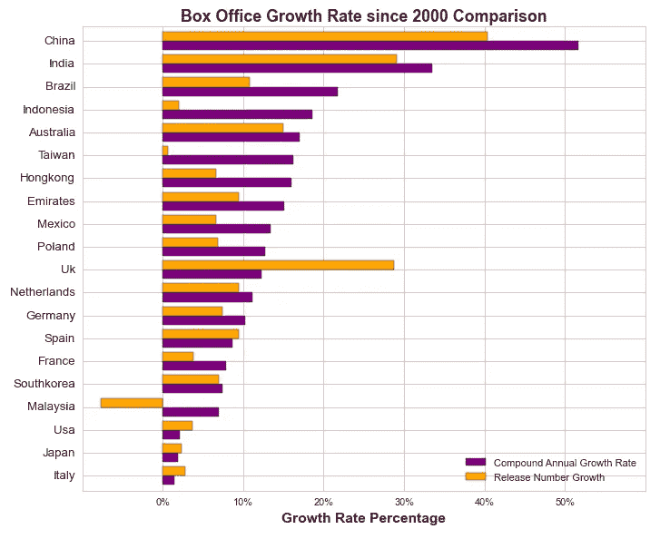
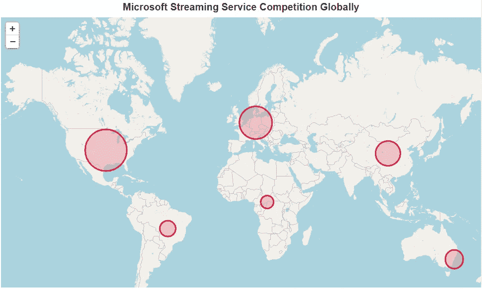
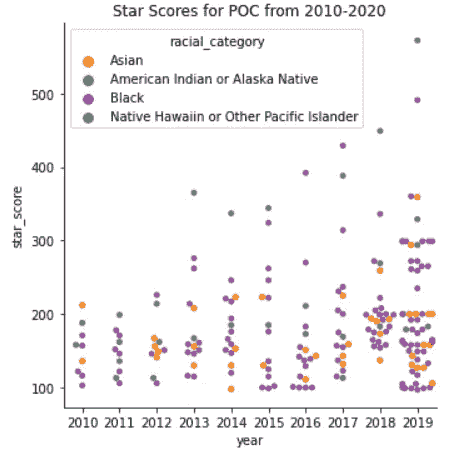
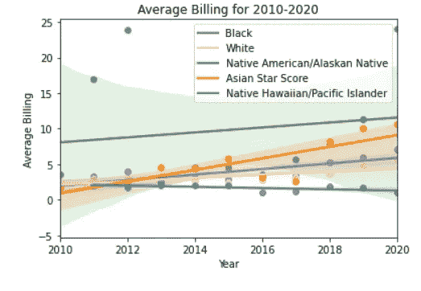

# 电影制作的新方法

> 原文：<https://towardsdatascience.com/a-new-approach-to-film-making-80cec94284f0?source=collection_archive---------17----------------------->

## 对电影统计数据的探索性数据分析显示，一种新的趋势已经掌控了这个行业，并已经为一些关键角色创造了巨额利润。

由[丹尼斯·简斯](https://unsplash.com/@dmjdenise?utm_source=unsplash&utm_medium=referral&utm_content=creditCopyText)在 [Unsplash](https://unsplash.com/s/photos/movie?utm_source=unsplash&utm_medium=referral&utm_content=creditCopyText) 上拍摄的照片

自 19 世纪诞生以来，电影业已经取得了长足的发展，不仅成为我们日常生活中的主要娱乐来源，也成为我们现代社会的核心文化支柱。随着新技术的发展，这种增长已经达到了全球水平，电影制作人现在能够接触到世界各地的观众。

强调一些关键数字:2019 年全球票房价值 422 亿美元(其次是 2020 年因新冠肺炎疫情而受到重创)。仅在美国，自 2000 年以来每年制作的电影数量就增长了 4 倍，从 200 部增长到 2019 年的 800 部。

当然，衡量这个行业的标准不再仅仅包括票房数字，自 20 世纪 90 年代以来，电视连续剧在我们的日常娱乐中占据了更加突出的位置，特别是随着网飞或 Prime Video 等流媒体平台的出现。今天，随着大多数人拥有至少一个流媒体服务订阅，我们发现自己处于“流媒体战争”的新时代。目前，流媒体方式的主要传播者网飞(净资产:400 亿美元)以 2.0764 亿用户保持着领先地位，其中大部分用户位于美国和加拿大。紧随其后的是 Prime Video，亚马逊拥有 2 亿 Prime 服务用户。

显然，今天这种媒体的力量及其接触世界各地受众的能力怎么强调都不为过。然而，虽然电影的主要目的是娱乐，但重要的是要注意到它们的额外作用，既作为社会、社会规范和价值观的反映，有时也作为其影响者。

电影已经成为我们文化和历史的重要组成部分。因此，它们也可以被看作是我们过去的记录——它们清楚地反映了当时的社会状况。在他们各自的情节中，他们描绘了当时社会所持有的当代价值观、趋势、问题和信仰。

然而，社会是可塑的。它随着时间的推移而发展和变化。因此，在过去 100 年的每十年里，我们都会看到反映社会意识形态和规范变化的主流电影。关于这种变化的例子，只要看看《007:邦德:T1》系列电影就知道了。我们只需要考虑一下 *007* 的反派角色的演变，就可以把他们和当时的政治形势联系起来。

今天，电影业出现了一种新趋势，反映了当前的社会变化。这一趋势就是*多元化*，忽视这一趋势可能会让电影制作人损失数百万未开发的收入。

为了理解这一新趋势，我采用了数据驱动的方法来探索电影制作行业与多元化相关的关键方面。

## I .电影业的地理多样性

正如我们所知，作为电影业发展的发源地，好莱坞长期以来一直主导着全球舞台。因此，过去几十年主要见证了美国文化的各种状态主导了屏幕，明显反映了美国在二战后崛起为超级大国，在苏联解体后的 20 世纪 90 年代达到了影响力的顶峰。

然而，自 21 世纪以来，国际舞台上出现了一种新的范式，表明随着世界走向以更大的多边主义为特征的新世界秩序，美国在全球政治层面的影响力正在减弱。因此，本分析探讨的多样性的一个方面是电影制作中地理多样性的演变。电影业是否反映了这一政治趋势？

这就是我们在观察前 20 个国家的票房数字时所看到的情况，这些数字是根据其电影产业的利润规模来衡量的。

撇开 2020 年与大流行相关的崩溃不谈，有两点立即凸显出来:

(1)美国电影业与世界其他地区之间不可思议的差距(不出所料)。

(2)中国电影业利润的指数级增长，正在迅速赶上美国。

放大其余国家，我们看到以下内容:

总体上有积极的增长趋势。因此，在探索日益增加的地理多样性时，更恰当的比较是比较这些国家自 2000 年以来的增长率，如下所示:

有趣的是，美国在过去 20 年的年增长率中排名倒数第三，新电影增长率约为 4%，平均增长率约为 2.5%，相比之下，排名前十的国家虽然拥有明显较小的产业，但年票房利润都至少增长了 10%。

因此，电影业增长最快的市场都是国际性的，其中中国、印度和巴西占主导地位，年平均增长率超过 20%。因此，随着国际观众对更能反映其文化和社会的原创内容的需求迅速增长，这些市场可能为电影制作人提供一个在竞争对手中脱颖而出的有趣机会。

当然，随着疫情对已经占主导地位的流媒体行业的推动，地理多样性应该成为主要参与者中更重要的考虑因素，因为就提供这些服务的服务提供商数量而言，美国以外的市场竞争明显较弱，如下图所示。

网飞已经在利用地理多样性的机遇，开发当地产业，制作越来越多反映当地文化和语言的新内容，包括热门歌曲和一些我最喜欢的:*鲁邦*(法)、 *Dix Pour Cent/Call My Agent！*(法兰西) *Casa de Papel/Money Heist* (西班牙) *Fauda* (以色列)。

## 二。电影业中的选角多样性

回顾美国电影，过去几年发表了许多文章，批评好莱坞在选角选择上的最后一个多样性，一些运动开始出现，如 2015 年的#OscarsSoWhite 和 2016 年的# whitewashedOUT，以及非洲裔美国人、拉丁裔、亚裔、LGBTQ 和其他社区的多个多样性代表协会为他们缺乏代表性而大声疾呼。

人们已经在采取措施打造更平衡、更具代表性的演员阵容，像《黑豹》和《疯狂富裕的亚洲人》这样的电影经常被认为是朝着正确方向迈出的指示性步骤。

因此，这项分析探讨了自 2010 年以来在这方面发生的变化，通过检查过去十年中 100 位票房收入最高的演员的“明星得分”，这是一项根据他们出演的票房收入最高的电影数量分配给每个演员的统计数据。

到 2020 年，非洲裔美国演员的平均明星分数上升了 72%，美国土著/阿拉斯加土著演员上升了 36.7%，亚洲演员上升了 21.5%，夏威夷土著/太平洋岛民演员从不存在上升到 377.5。

此外，当比较 2010 年和 2020 年票房前三的演员时，我们看到 2010 年的阵容是:小罗伯特·唐尼、泰勒·洛特纳和希亚·拉博夫，2020 年的是:塞缪尔·L·杰克逊、道恩·强森和丹娜·古瑞拉。

然而，虽然已经取得了重要进展，但仍需要取得更多进展，以建立一个更具包容性和代表性的电影业，不因肤色或其他因素而有所歧视。事实上，仍然有迹象表明，虽然电影业已经开始挑选更多不同肤色的演员，但这些演员仍然倾向于出演次要和不太重要的角色。

在表演艺术中，衡量一部电影中一个角色重要性的标准是计费数。根据维基百科的定义，计费是一个术语，指的是戏剧、电影、电视等演职员表的顺序和其他方面。相应地，角色越重要，计费号越低。然而，这一分析表明，在过去的 10 年里，有色人种演员，特别是非裔美国人、亚裔和美洲土著/阿拉斯加土著演员的平均收入，详见下表。

虽然这清楚地表明，在社会层面上还有更大的改进空间，但发生的巨大变化清楚地表明了新的多元化趋势的本质，这种趋势既抓住了社会，也反映了整个电影业。

电影制作人应该欣然接受这一趋势，尤其是考虑到这样做不仅有利于社会进步，而且从这类电影产生的收入来看，不仅有利可图，还可能使他们的电影获得重要的文化地位。

## 三。接受和好评

当然，当讨论电影业的新趋势时，必须探讨的一个方面是接受和好评。因此，除了不可避免地提到奥斯卡奖(被广泛认为是业内最重要和最负盛名的奖项)之外，必须给予电影评论家应有的重视，这些独立的声音对电影和整个行业的艺术形式有着深刻的了解。

去年，奉俊昊的《T2 寄生虫》成为奥斯卡 92 年历史上第一部赢得奥斯卡最佳影片奖的外语片，成为头条新闻。除此之外，奉还获得了最佳导演奖，虽然与历史性的爆冷相比没有那么轰动，但仍然意义重大，特别是在奖项变得更具包容性方面，因为他成为继李安之后第二位获得该奖的亚洲人，李安于 2005 年凭借《T4》中的《卧虎藏龙》获得该奖，并于 2012 年凭借《少年派的奇幻漂流》获得该奖。

奥斯卡奖是由美国委员会投票决定的，有一个专门的最佳国际电影类别，现实是，在过去 20 年里，越来越多的非美国电影被提名为最佳影片的主要类别。随着寄生虫终于打破了历史记录，我们肯定会在下一个十年看到更多的选择。

由于它与电影评论家有关，这项分析仅限于比较 IMBd 的数据集[有史以来 1000 部最伟大的电影](https://www.imdb.com/list/ls006266261/)中的美国与非美国电影，结果显示，虽然美国拥有来自单个国家的最多电影(考虑到其在该行业的主导地位，这并不令人惊讶)，但总体而言，来自非美国国家的电影数量更多，排名靠前的国家是法国、英国、日本和意大利。

## 结论

电影制作行业在 2010 年代经历了一个变革的十年，尤其是对更大多样性的呼吁。随着电影成为社会意识状态的代表，人们对努力创造一个更具包容性和多元化的行业所达到的里程碑的印象深刻的接受，突显了更广泛的社会对更大多样性的偏好。通过利用这种趋势和响应这种胃口，电影制作人一定会增加他们的利润和他们作品的文化意义。

正如这一分析所表明的，通过采取更大的行动来实现更多的包容性，并在电影中捕捉这一趋势，电影制作人可以在地理上与竞争对手区分开来，增加他们的电影在全球的文化意义，并通过挖掘未被充分代表的观众对更大代表性和包容性的渴望来创造更多利润。

当然，电影作为一种艺术形式，并不是简单的代表。通过这个行业不可思议的力量和影响，特别是由于新技术的发展，他们也成为有影响力的人，因此，可以用来改变看法和挑战他们的观众对任何问题的看法。因此，通过捕捉这一趋势，并利用清晰和明显的努力将多样性问题融入电影制作，电影可以发挥温和影响社会规范的作用，减少仇恨和歧视，增加接受和包容。

*在* [*Github*](https://github.com/christianmoya/FilmAnalysis) 上查看完整的分析和数据来源！