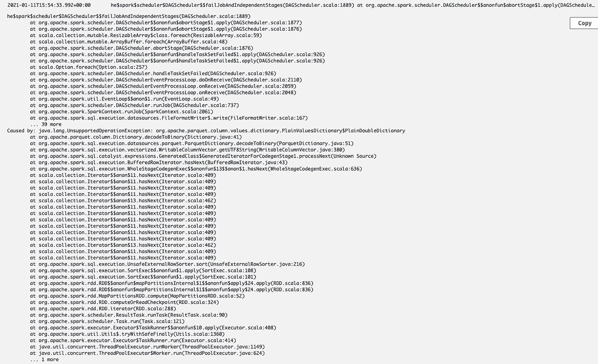
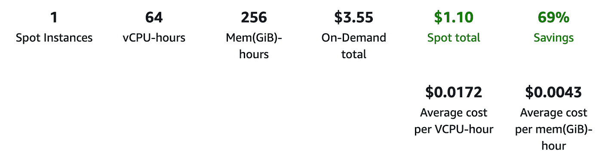

# AWS 中 ETL 的新竞争者？

> 原文：<https://towardsdatascience.com/a-new-contender-for-etl-in-aws-ec6a3297034d?source=collection_archive---------38----------------------->

## 运行大规模的 ETL 工作，而没有一大群开发人员在背后支持你


由 [Unsplash](https://unsplash.com?utm_source=medium&utm_medium=referral) 上的 [Pietro Jeng](https://unsplash.com/@pietrozj?utm_source=medium&utm_medium=referral) 拍摄

ETL——或提取、转换、加载——是处理传入数据的常见模式。通过将“转换”集中到一个单独的批量操作中，它允许有效地使用资源，这通常比它的流处理对应物更容易开发和维护。它还非常适合对数据集进行一次性调查，用户可以编写一些自定义代码来对数据集执行一些分析，导出一些结果供以后使用。这种常见的模式是许多数据科学探索的基础，但根据我的经验，我经常发现实现它既笨拙又低效。在本文中，我将概述一项新技术，我认为它可能是数据科学家(和开发人员)武库中的一个有价值的工具。

首先介绍一下我的背景。我是一名软件开发人员，专攻 AWS 数据科学基础设施，拥有软件工程硕士学位。我愿意认为这使我在编写和部署远程运行的代码时不会无精打采，但我发现运行大规模的 ML/数据作业充其量也是具有挑战性的。这一领域的大多数大型技术，例如 Spark，都非常复杂，需要开发团队来维护基础设施，这使得即使是中型公司也完全无法实现。

让我们探索一些不需要开发人员维护的单用户解决方案，重点关注以下评估点:

*   迭代开发的部署速度
*   费用
*   基础设施要求
*   易于与软件开发实践集成(代码林挺、版本控制、构建系统)

其中一项技术是 **AWS Glue ETL Jobs** ，该技术旨在通过隐藏底层基础设施来简化转换功能的运行，用户只需提供代码库。虽然 Glue 一旦配置好就能很好地工作，但即使是最有经验的开发人员也会感到害怕和沮丧。它不直观的用户界面和糟糕的文档使它很难学习，甚至更难调试，我发现 Spark(Glue ETL 的底层技术)的重要知识是有效使用的必要条件。



图 AWS Glue 的一个错误示例，几乎没有给出任何线索！

这并不全是坏事，一旦你掌握了胶水，它会变得非常强大。DynamicFrame 库(它包装了 spark 数据帧)非常适合读写数据到胶合表，只需一行代码(如果您坚持符合 PEP-8，还需要几行代码……)就可以将几乎无限量的数据写到分区表中——这仍然让我感到困惑！如果您有可以使用 DynamicFrame 导入的大规模数据集，这使得 Glue 成为一个很好的工具，但对于其他任何东西来说效率都很低。

举个简单的例子，作为一种常见的模式，我花了大量的时间来创建 ETL 作业，以便从存储在 S3 的原始数据生成新的数据集——然后将转换后的数据存储回 S3，然后执行分析。听起来很简单，对吗？

假设我在本地机器上有我的代码，我想创建一个粘合作业来运行这个代码，我必须:

1.  通过 AWS CLI 将我的脚本上传到 S3(希望第一次能成功……)
2.  转到 AWS 控制台
3.  转到粘附页面
4.  创建新工作
5.  为作业配置 IAM 角色，以使用相关权限运行
6.  输入你的剧本在 S3 的位置
7.  如果需要，设置 ENI 以确保跨 VPC 的数据访问
8.  包括任何所需库的 zip 依赖项—(尽管没有 C 扩展，所以祝您使用 pandas 好运！)
9.  添加计划
10.  运行作业

这甚至不涉及如何开发脚本，我的意思是只需看看将开发端点附加到 Pycharm 的说明！([https://docs . AWS . Amazon . com/glue/latest/DG/dev-endpoint-tutorial-py charm . html](https://docs.aws.amazon.com/glue/latest/dg/dev-endpoint-tutorial-pycharm.html))

这并没有将 Glue 设置为日常数据科学/机器学习探索的好工具。简而言之，当根据上面定义的规范进行评估时，Glue ETL 是:

*   由于缺乏良好的本地测试，很难快速迭代新的脚本版本
*   由于火花记录，很难有效地调试
*   由于远程代码编辑和笨拙的部署，与软件工程过程集成具有挑战性
*   易于集成到 S3 和胶水表

那么还有什么其他选择呢？让我们介绍一下我们的竞争者。**元流**！

[Metaflow](https://metaflow.org/) 是一个相当新的工具，将于 2019 年底推出。它由网飞设计和制造，是一个开源工具，将权力还给数据科学家，降低复杂性，提高迭代速度。它包含一个 Python/R 客户端库，用于编排用户的构建和一组需要用户部署的 AWS 资源(以 Cloudformation 堆栈的形式)。所以，玩笑开够了——让我们探索一下为什么我现在在 Python ETL 工作中使用 Metaflow。

**在 Metaflow 上开发新代码轻而易举**

Metaflow 添加了一些新的注释来提供其功能，但编排的基础使用了 python、类和方法的既定特性(作为一名“受过经典训练”的软件工程师，这让我感到非常高兴)。流程是一个类，流程中的步骤是函数，每个步骤都链接到下一个要执行的步骤。然后，可以对流程或步骤应用注释，以添加进一步的配置。

```
# An example of a Metaflow Flow running locally
class TestFlow(FlowSpec): @step
  def start(self):
    print(“This is the start step!”)
    self.next(self.process) # Runs the process step next @step
  def process(self, inputs):
    print(“This is the process step!”)
    self.next(self.end) # Then the end step @step
    def end(self):
    print(“This is the end step!”)if __name__ == ‘__main__’:
  TestFlow() # This initialises the Flow then runs the start step
```

我想我还没有找到像 Metaflow 这样无缝的工具来切换代码的远程部署。只要对我的步骤做一个注释，我就可以从在笔记本电脑上运行我的流变成在 EC2 上运行 64 核的庞然大物，就这么简单。

```
# Same Flow as before, but will run on the Cloud!
class TestFlow(FlowSpec): @batch(cpu=64, memory=2000) # Each step get's these resources
  @step
  def start(self):
    print(“This is the start step!”)
    self.next(self.process) @batch(cpu=64, memory=2000)
  @step
  def process(self, inputs):
    print(“This is the process step!”)
    self.next(self.end) @batch(cpu=64, memory=2000)
  @step
  def end(self):
    print(“This is the end step!”)if __name__ == ‘__main__’:
  TestFlow()
```

**元流易于管理**

因此，如果你不熟悉 AWS，请耐心听我说，这可能有点难以接受。Metaflow 提供了一个 cloudformation 堆栈来部署其基础设施。这是最精简的基础设施，提供了使用平台所需的所有部件。这种单一的堆栈易于部署和使用，每月维护成本仅为 40 美元左右。然而，这是 Metaflow 最大的缺点，它需要*一些关于 AWS 的*知识来大规模维护，但是打开和拆除单个堆栈是微不足道的，也是我最希望能够做到的事情。

**数据可以直接存入元流**

Metaflow 的另一个重要特性是它的元数据存储，允许流中的不同步骤共享数据，并在执行完成后将数据保存到 S3 中。在我之前创建 ETL 管道的例子中，我不需要自己将数据存储到 S3 中，因为 Metaflow 会为我做这件事。因此，当我回来执行我的分析时，我可以获得我的流的最新版本并提取数据集。这使得 Metaflow 对于临时和计划的数据“汇总”都非常强大，而不必管理复杂的数据库。

```
# A portion of a Flow showing the metadata storage and retrieval
@step
def start(self):
  print(“This is the start step!”)
  self.message = “Metaflow metadata is cool!” # Saved to S3
  self.next(self.process)@step
def process(self, inputs): # Loads message from S3 and into self.
  print(f”Let’s print the previous steps message {self.message}”)
  self.next(self.end)
```

**除去基础设施成本，在 Metaflow 上运行作业是很便宜的**

由于 Metaflow 在幕后使用 Batch，您可以将其配置为使用现货定价。这使得实例成本实际上可以忽略不计，并且由于 Metaflow 可以自动处理重试，因此 SPOT 实例离线的风险很小。在这种情况下，我运行一个 64 核流不到一小时，计算成本为 1.10 美元，这与 Glue 的 16DPU 工作成本形成了鲜明的对比，后者大约为一小时 7 美元。



图 2:运行一个 64 核任务的现货价格快照。

**元流流可以轻松调度**

虽然 Metaflow 非常适合开发工作流，但是它如何管理生产版本呢？不出所料，太好了。将 *@schedule* 注释添加到您的流类将允许它的一个表示被推送到 Step 函数，在那里它可以被任何 AWS 事件桥调度/规则触发。这允许许多可能性。想在文件写入 S3 时触发它吗？很简单，只需将步骤函数启动事件附加到规则上，就可以了。

```
# Will run every hour
@schedule(hourly=True)
class TestFlow(FlowSpec): @step
  def start(self):
    print(“This is the start step!”)
    self.next(self.process) @step
  def process(self, inputs):
    print(“This is the process step!”)
    self.next(self.end) @step
  def end(self):
    print(“This is the end step!”)if __name__ == ‘__main__’:
  TestFlow()
```

总之，对于我和我的工作流来说，Metaflow 已经被证明是一个强大的工具。它有一些缺点，例如必须管理基础设施，但它丰富的功能(其中许多我还没有谈到)使它成为那些负担不起大规模数据平台的人的优秀工具。在以后的博客文章中，我将探索减轻这些缺点的方法，并更深入地利用 Metaflow 的特性。