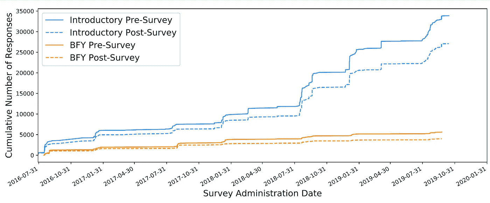

# 物理教育研究的新数据集

> 原文：<https://towardsdatascience.com/a-new-data-set-for-physics-education-research-25631745919?source=collection_archive---------21----------------------->

## 70，000 份学生对实验物理态度的调查数据集

这篇文章描述了来自 70，000 份科罗拉多实验物理科学学习态度调查(E-CLASS)的免费使用数据集。你可以在这里找到这个数据集:[https://github.com/Lewandowski-Labs-PER/eclass-public](https://github.com/Lewandowski-Labs-PER/eclass-public)


照片由 [Tra Nguyen](https://unsplash.com/@thutra0803?utm_source=medium&utm_medium=referral) 在 [Unsplash](https://unsplash.com?utm_source=medium&utm_medium=referral) 上拍摄

整个社会科学领域都存在复制危机。许多研究在重新评估时不能产生相同的结果(例如，在 PER 中，所学课程的证明，而不是之前在中所证明的分数，最能预测学生是否继续攻读物理学位课程)。在某些情况下，如果数据可以免费获得，不同机构的研究可以进行比较，看看结果是否可以重复。数据共享还鼓励数据的长期保存，这保持了数据的完整性，并可以作为未来科学家的培训工具。自由开放的数据也鼓励围绕特定研究问题的对话。可以用不同的方法重新分析结果，以进一步确定结果。在物理教育研究领域，基本上没有可供研究的大型、免费和公开的数据集。

我们使用科罗拉多实验物理科学学习态度调查(E-CLASS)创建了一个大型(70，000 人响应)数据集。这些数据涵盖了 133 所大学，599 门独特的课程和 204 名教师，是在 2016 年至 2019 年期间收集的。该调查评估了一名物理课学生对用实验室技能解决物理问题的态度。在本帖中，我们将介绍数据集和与数据集交互的 python 库。我们鼓励您下载数据集并自己使用它！

# **E 级数据集**

E-CLASS 旨在帮助教师和 PER 研究人员衡量不同实验室课程实施和干预的影响。它是为了解决各种各样的学习目标而开发的，这些学习目标可以粗略地归类为探索学生的认识论和对实验物理的期望。为了能够处理如此大范围的目标，该调查不是为了衡量一个或几个潜在因素而设计的。此外，该调查旨在衡量学生从入门课程到更高级课程的思路进展。为了达到这一点，许多问题是针对入门或高级水平。因此，我们强调，虽然可以考虑“总体”E 级分数，但评估的真正力量来自于检查对个别问题的回答，特别是那些与特定课程的学习目标相一致的问题。

E-CLASS 数据集包含 39505 个调查前响应和 31093 个调查后响应。在某些情况下，学生可以不止一次地回答调查。因此，共有 35380 个对预调查的独特回应和 28282 个对后调查的独特回应。在这种情况下，“独特”被定义为调查前或调查后的第一个回答。该数据集代表了 133 所独特的大学、204 名独特的教师和 599 门独特的课程。该数据集包含入门课程和“一年级以上”课程(BFY)学生的数据。如下图所示，在数据收集期间，每学期收集的数据总量有所增加。



自 2016 年开始自动在线管理以来，学生对 E-CLASS 的累计响应数量。与 BFY 实验室相比，从介绍性课程中收集的学生反馈更多，因为这些课程往往有更多的注册人数。此外，一般来说，更多的学生对前调查作出反应，而不是后调查，这说明了不同的两条线之间的每个实验水平。目前，数据集中总共有 70598 个响应。图片作者。

电子课堂本身由 30 个李克特式问题组成，用来评估学生的知识和对专家的期望。学生被要求从他们的观点和预测实验物理学家的观点对每一个陈述做出回应(从非常同意到非常不同意)。在某些情况下，专家式的回答是不同意。数据已经被预处理以转换 Likert 响应，使得所有数据都在非专家(在数据集中用 1 表示)到专家样(在数据集中用 5 表示)的五点标度上。到目前为止，所有的研究都是通过首先将五分尺度折叠为三分尺度来完成的，但全部范围都包含在公共数据集中。我们警告研究人员，该调查的设计不能可靠地区分量表两端的两个最外层点(即“同意”和“非常同意”或“不同意”和“非常不同意”)。此外，仅在课后调查中，学生被问及哪些项目(30 个项目中的 23 个)对于在课程中获得好成绩是重要的。最后，学生们还被问了一系列关于人口统计、兴趣和职业规划的问题。

# DataHelper Python 库

除了数据集本身，我们还编写了一个库来帮助研究人员访问数据。虽然原始数据在几个表中都是 CSV 格式的，但用户通常希望以某种方式缩减数据集，例如只缩减参加入门课程的学生，或者只缩减对前后调查都有反应的学生。下面我们展示一些如何做到这一点的代码示例。

DataHelper 库需要 pandas，并使用 pandas 范式来组织数据。

要导入数据集，我们只需使用以下 cod

```
**import** DataHelper

e **=** DataHelper**.**eclass_data()
```

这段代码导入库，然后在`e`对象中创建完整的数据集。这个`e`对象可以用来访问底层数据。例如，如果我们想打印回应的总数，我们可以使用函数`e.get_buffy_pre()`和`e.get_intro_pre()`。

```
print('total number of pre responses:',e**.**get_buffy_pre()**.**shape[0]**+** **+** e**.**get_intro_pre()**.**shape[0])>>> total number of pre responses: 39505
```

这些函数分别返回只包含 BFY 数据和介绍数据的`pandas`数据帧。因此，返回 dataframe 的`shape`会给出行数。

如果我们只想获得匹配的数据，我们可以执行类似的操作:

```
print('Number of matched responses intro:', e**.**get_intro_matched()**.**shape)
print('Number of matched responses bfy:', e**.**get_buffy_matched()**.**shape)>>> Number of matched responses intro: (19445, 175)
>>> Number of matched responses bfy: (3096, 175)
```

其中函数`e.get_intro_matched()`为我们执行匹配操作。

github 资源库中有许多示例笔记本。

*你可以在这里找到数据集和 DataHelper 库*[*https://github.com/Lewandowski-Labs-PER/eclass-public*](https://github.com/Lewandowski-Labs-PER/eclass-public)

*本帖汇总论文*[*https://journals . APS . org/prper/abstract/10.1103/physrevphyseducres . 17.020144*](https://journals.aps.org/prper/abstract/10.1103/PhysRevPhysEducRes.17.020144)